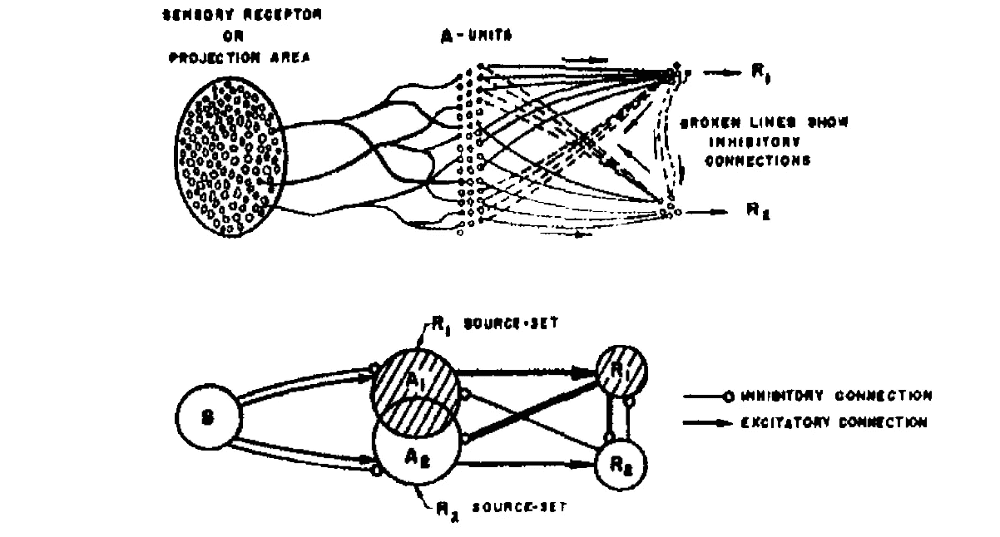
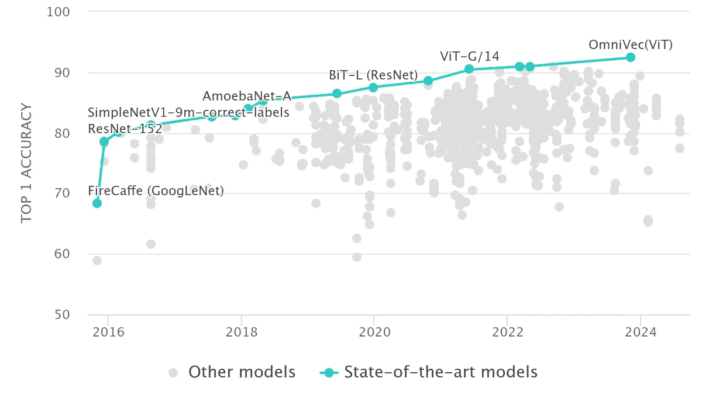
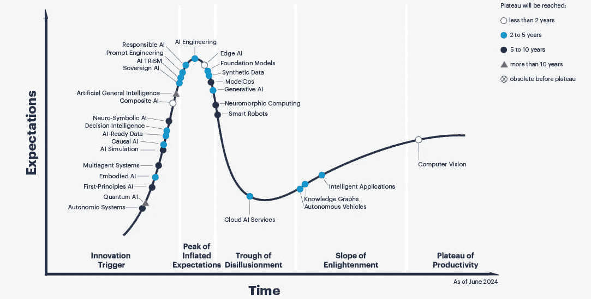
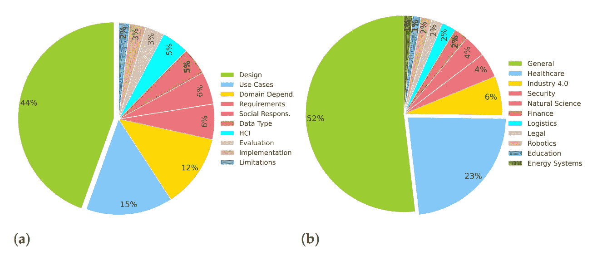
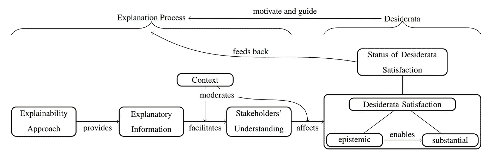
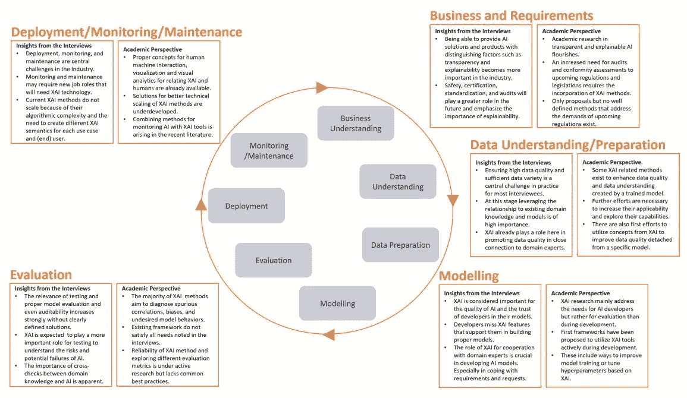
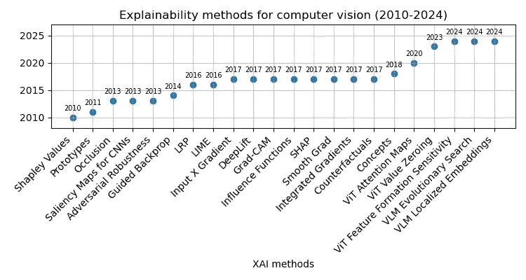
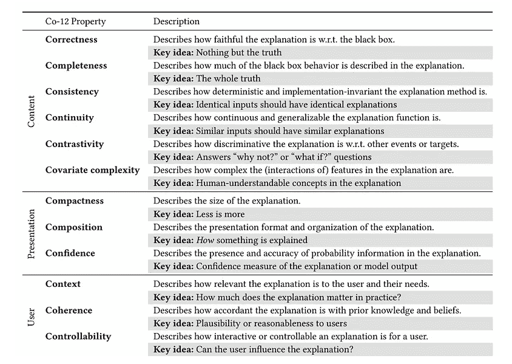
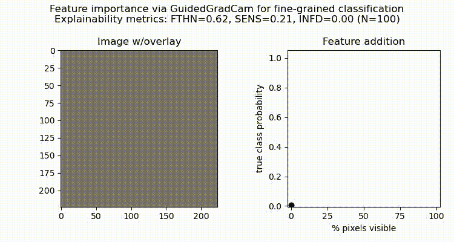

# 100 年的（可解释）人工智能

> 原文：[`towardsdatascience.com/100-years-of-explainable-ai-2c7ecee2e51a?source=collection_archive---------0-----------------------#2024-12-18`](https://towardsdatascience.com/100-years-of-explainable-ai-2c7ecee2e51a?source=collection_archive---------0-----------------------#2024-12-18)

## 反思在不断发展的 LLM 和人工智能治理时代中，深度学习与可解释性方面的进展与挑战

 [Sofya Lipnitskaya](https://slipnitskaya.medium.com/?source=post_page---byline--2c7ecee2e51a--------------------------------)

·发表于[Towards Data Science](https://towardsdatascience.com/?source=post_page---byline--2c7ecee2e51a--------------------------------) ·20 分钟阅读·2024 年 12 月 18 日

--

图片由作者提供

# 背景

想象一下你正在驾驶一辆自动驾驶汽车，完全依赖它的车载计算机做出瞬间的决策。它能够检测物体、识别行人，甚至能够预测其他车辆的行为。但是，有一个问题：你知道它有效，但你完全不知道**如何**实现的。如果发生了意外情况，你无法清楚地了解结果背后的推理过程。这就是可解释人工智能（XAI）发挥作用的地方。深度学习模型，常常被视为“黑盒”，如今在各个领域被广泛应用于自动化预测和决策。可解释性就是要打开那个黑盒。我们可以把它看作是一个工具包，它不仅帮助我们理解这些模型做了什么，还帮助我们理解**为什么**它们做出这些决策，从而确保这些系统按预期工作。

XAI 领域近年来取得了显著进展，提供了关于模型内部工作机制的深入见解。随着人工智能成为关键领域的核心，处理责任问题变得至关重要，这对于保持系统的可靠性和信任至关重要 [[Göllner & a Tropmann-Frick, 2023](https://ceur-ws.org/Vol-3580/paper2.pdf), [Baker&Xiang, 2023](https://arxiv.org/abs/2312.01555)]。这对于高风险应用尤为重要，如汽车、航空航天和医疗保健等领域，在这些领域中，理解模型决策能够确保系统的稳健性、可靠性以及安全的实时操作 [[Sutthithatip et al., 2022](https://ieeexplore.ieee.org/document/9843612), [Borys et al., 2023,](https://www.sciencedirect.com/science/article/pii/S0720048X23001006) [Bello et al., 2024](https://www.arxiv.org/abs/2409.08666)]。无论是解释为何一份医疗扫描在特定患者中被标记为值得关注，还是识别风力发电风险评估中鸟类检测模型误分类的因素，XAI 方法都能让我们窥见模型的推理过程。

我们经常听到关于与模型和透明度等级相关的“盒子”及其种类，但拥有一个可解释的 AI 系统到底意味着什么呢？这如何应用于深度学习？而且，这不仅仅是满足我们的好奇心。本文将讨论 XAI 以及为什么它在 2024 年及以后会成为一个热点话题。我们将探讨可解释性如何在过去几十年中发展，并如何重塑计算机视觉的格局，反之亦然（第一部分）。我们将讨论从早期研究开始，XAI 是如何发展成为一项涵盖整个行业的实用技术，以及在全球监管框架和负责任的 AI 实践背景下，它的未来可能会如何（第二部分）。在这里，我们还将关注以人为中心的可解释性方法，我们将回顾利益相关者群体、他们的需求以及可能的解决方案，以应对在促进信任和确保安全 AI 部署过程中持续存在的挑战（第 3.1 节）。此外，您将了解常用的 XAI 方法，并检查评估这些解释效果的指标（第 3.2 节）。最后一部分（第四部分）将展示如何将可解释性有效应用于图像分类，以增强对模型决策的理解并验证其正确性。

# **1\. 回归根本**

在过去的一个世纪里，深度学习和计算机视觉领域经历了重大的突破，这些突破不仅塑造了现代人工智能，还推动了解释性方法和框架的发展与完善。让我们花一点时间回顾深度学习历史中的关键里程碑，这些里程碑促成了我们今天的成就，并展示了它们对视觉领域 XAI（可解释人工智能）发展的影响（涵盖：1920 年代 — 现在）：

+   **1924 年：** 德国数学家弗朗茨·布赖西格（Franz Breisig）将电子学中四端子网络的明确使用视为“黑箱”——这个概念用于指代仅可见端口的系统，其内部机制被隐藏。

+   **1943 年：** 沃伦·麦卡洛克（Warren McCulloch）和沃尔特·皮茨（Walter Pitts）在其开创性工作《神经活动中固有思想的逻辑演算》中提出了麦卡洛克-皮茨（MCP）神经元，这是第一个人工神经元的数学模型，为神经网络的基础奠定了基础。

+   **1949 年：** 唐纳德·O·赫布（Donald O. Hebb）提出了赫布学习的神经心理学概念，解释了突触可塑性的基本机制，认为（大脑中的）神经连接在使用中会变得更强（同时激活的神经元会“联合”），因此能够通过学习重新塑造。

+   **1950 年：** 艾伦·图灵（Alan Turing）出版了《计算机与智能》，提出了他开创性的想法——图灵测试，用于判断机器是否能够“思考”。

+   **1958 年：** 美国心理学家弗兰克·罗森布拉特在其著作《感知机：大脑中信息存储和组织的概率模型》中提出了感知机，这是第一个人工神经网络。

*图 1\. 罗森布拉特感知机示意图（来源：* [*Rosenblatt, 1958*](https://www.ling.upenn.edu/courses/cogs501/Rosenblatt1958.pdf)*)*

+   **1962 年：** 弗兰克·罗森布拉特（Frank Rosenblatt）提出了反向传播误差修正，这一计算机学习的基本概念，启发了后续的深度学习研究。

+   **1963 年：** 阿根廷-加拿大哲学家兼物理学家马里奥·布恩格（Mario Bunge）出版了《一般黑箱理论》，为黑箱理论的发展做出了贡献，并将其定义为一种抽象，表示“一个具体系统的集合，其中刺激 S 作用于系统并产生反应 R 的输出”。

+   **1967 年：** 日本工程师兼神经科学家天野俊一（Shunichi Amari）率先提出了第一个使用随机梯度下降训练的多层感知机，用于分类非线性可分模式。

+   **1969 年：** 日本计算机科学家福岛邦彦（Kunihiko Fukushima）提出了修正线性单元（ReLU），它后来成为深度学习中最广泛采用的激活函数。

+   **1970 年：** 芬兰数学家兼计算机科学家塞坡·林内马（Seppo Linnainmaa）在他的硕士论文中提出了“反向自动微分模式”，这是反向传播的现代变体。

+   **1980 年：** 福岛邦彦提出了 Neocognitron，这是早期的深度学习架构之一，适用于卷积神经网络（CNN），但并不使用反向传播进行训练。

+   **1989 年：** 法美籍计算机科学家 Yann LeCun 提出了 LeNet，这是第一个成功应用反向传播进行手写 ZIP 代码识别的卷积神经网络（CNN）架构。

+   **1995 年：** Morch 等人提出了显著性图，这为揭示深度神经网络内部工作原理提供了最早的可解释性方法之一。

+   **2000 年代：** 进一步的进展包括 CUDA 的开发，使得 GPU 并行处理能够支持高性能科学计算，此外还有 ImageNet，这个大规模的手动策划的视觉数据集，推动了基础和应用人工智能研究的进展。

+   **2010 年代：** 计算机视觉领域持续突破，如 Krizhevsky、Sutskever 和 Hinton 提出的用于 ImageNet 分类的深度卷积网络，推动了人工智能在各行各业的广泛应用。可解释人工智能（XAI）领域蓬勃发展，出现了 CNN 显著性图、LIME、Grad-CAM 和 SHAP 等技术*。

*图 2：* ImageNet 分类的视觉模型 SOTA 基准，2014–2024 年（来源：PapersWithCode）

+   **2020 年代：** 人工智能热潮随着 2017 年论文《Attention Is All You Need》的发布而加速，该论文提出了一种名为 Transformer 的编码器-解码器架构，推动了更先进的基于 Transformer 的架构的发展。在 Allen AI 的 ELMo、谷歌的 BERT 和 OpenAI 的 GPT 等早期成功的基础上，Transformer 被应用于多个领域和模式，包括视觉，加速了多模态研究的进展。2021 年，OpenAI 推出了 CLIP，一个能够从自然语言监督中学习视觉概念的模型，为生成型人工智能创新铺平道路，包括 DALL-E、Vision Transformer（ViT）、Stable Diffusion 和 Sora，提升了图像和视频生成能力。

+   **2024 年：** 欧盟人工智能法案生效，建立了针对欧洲人工智能系统的法律要求，包括透明度、可靠性和公平性的规定。例如，[第 27 条](https://ai-act-law.eu/recital/)将人工智能系统的透明度定义为：“以一种允许适当追溯性和可解释性的方式开发和使用 […] 有助于设计一致、可信和以人为本的人工智能”。

正如我们所见，早期的工作主要集中在基础方法和算法上，随着后期的进展，逐渐聚焦于特定领域，包括计算机视觉。到 20 世纪末，关键概念开始出现，为未来的突破奠定了基础，例如 1980 年代的反向传播训练卷积神经网络（CNNs）。随着时间的推移，可解释人工智能（XAI）领域迅速发展，增强了我们对预测背后推理的理解，并通过增加的研究和行业应用促进了更为明智的决策。随着（X）AI 的兴起，焦点转向了平衡系统效率与可解释性，在大规模模型理解中起到辅助作用，并在整个机器学习生命周期中整合 XAI 解决方案[[Bhatt et al., 2019](https://arxiv.org/abs/1909.06342)，[Decker et al., 2023](https://link.springer.com/chapter/10.1007/978-3-031-35891-3_13)]。实际上，直到过去二十年，这些技术才足够成熟，得以广泛应用。最近，立法措施和监管框架，如欧盟人工智能法案（2024 年 8 月）和中国 TC260 的人工智能安全治理框架（2024 年 9 月），相继出台， [标志着](https://artificialintelligenceact.eu/implementation-timeline/)人工智能开发和部署的更严格监管的开始，包括强制执行“从部署者那里获得对 AI 系统在决策过程中角色的清晰且有意义的解释，以及所作决策的主要要素”（[2026 年第 86 条](https://artificialintelligenceact.eu/article/86/)）。在这一点上，XAI 可以发挥其最佳作用。然而，尽管经过多年的严格研究和对可解释性的日益重视，这一话题似乎已经逐渐淡出人们的视野。真的是这样吗？现在，让我们从全局角度重新审视这一切。

# 2\. 人工智能的兴奋与现在

今天是处于科技世界的一个激动人心的时刻。在 1990 年代，Gartner 提出了一个叫做炒作周期的方法论，用来描述新兴技术如何随时间演变——从最初的兴趣激发到社会应用。根据这一方法论，技术通常从创新突破（即“技术触发”）开始，随后迎来激动人心的快速上升，最终达到“过高期望的顶峰”。然而，当技术未能按预期交付时，它会跌入“失望的谷底”，此时热情消退，人们感到沮丧。这个过程可以描述为一条陡峭的上升曲线，最终会下行至低点，然后平稳上升，进入所谓的“生产力平台”。后者意味着，随着时间的推移，某项技术可以变得真正具有生产力，尽管围绕它的炒作已不再那么强烈。

*图 3\. 2024 年人工智能的炒作周期（来源：Gartner）*

看看以前那些被认为能够解决一切的技术——智能代理、云计算、区块链、大脑-计算机接口、大数据，甚至深度学习。它们都在科技界取得了辉煌的地位，但当然，它们都没有成为万能的解决方案。现在，关于可解释性的话题也有类似的情况。我们可以一次又一次地看到历史的重复。如 2024 年 Gartner 人工智能热潮周期所强调的（图 3），**负责任的人工智能**（RAI）正逐渐获得更多关注（左上角），预计将在未来五年内达到成熟。可解释性为 RAI 实践提供了基础，促进了人工智能系统中的透明度、问责制和公平性。

下图概述了 XAI（可解释人工智能）研究的趋势和应用，来源于 2018 年至 2022 年间发表的科学文献，涵盖了 XAI 领域的各个概念，包括“可解释人工智能”、“可解释性人工智能”和“负责任的人工智能”[[Clement et al., 2023](https://www.mdpi.com/2504-4990/5/1/6)]。图 4a 根据元综述结果概述了 XAI 的关键研究领域。最大的一部分（44%）集中在设计可解释性方法，其次是 15%专注于 XAI 在特定应用场景中的应用。依赖领域的研究（如金融）占 12%，而其他小领域——需求分析、数据类型和人机交互——各自占约 5-6%。

*图 4．XAI 研究视角（a）和应用领域（b）（来源：* [*Clement et al., 2023*](https://www.mdpi.com/2504-4990/5/1/6)*)*

旁边是常见的应用领域（图 4b），其中医疗保健居领先地位（23%），由建立信任和支持决策的需求推动。工业 4.0（6%）和安全（4%）紧随其后，可解释性被应用于工业优化和欺诈检测。其他领域包括自然科学、法学、机器人技术、自动驾驶、教育和社会科学 [[Atakishiyev et al., 2024](https://ieeexplore.ieee.org/document/10604830), [Chen et al., 2023](https://www.nature.com/articles/s41551-023-01056-8), [Loh et al., 2022](https://www.sciencedirect.com/science/article/abs/pii/S0169260722005429)]。随着 XAI 向可持续状态发展，研究和开发越来越集中于解决公平性、透明性和问责制问题 [[Arrieta et al., 2020](https://dl.acm.org/doi/10.1016/j.inffus.2019.12.012), [Responsible AI Institute Standards](https://www.responsible.ai/ai-standards-deep-dive-decoding-different-ai-standards-and-the-eus-approach/), [Stanford AI Index Report](https://aiindex.stanford.edu/wp-content/uploads/2024/04/HAI_AI-Index-Report-2024_Chapter3.pdf)]。这些维度对于确保公平结果、澄清决策过程并为这些决策建立责任至关重要，从而促进用户信任，并与监管框架和行业标准保持一致。反映过去技术进步的轨迹，XAI 的崛起突显了在构建 AI 驱动解决方案方面的挑战和机遇，确立了它作为负责任 AI 实践中一个重要元素的地位，增强了 AI 在现实应用中的长期相关性。

# 3. 将**焦点重新放回到 XAI**（可解释的人工智能）

## 3.1. 为什么以及何时需要模型理解——可解释性基础

这是对人工智能系统的一个普遍看法：你输入数据，然后系统就像一个黑箱一样处理它，产生输出，但我们无法检查系统的内部工作原理。但真的是这样吗？随着人工智能的不断发展，开发可靠、可扩展且透明的系统变得越来越重要。简而言之：可解释人工智能的理念可以描述为采取某些方法来提供更清晰的**理解**，说明输入和输出之间发生了什么。从广义上讲，可以将其视为一组方法，允许我们构建能够提供理想结果的系统。在实践中，模型理解可以定义为生成用户能够理解的模型行为解释的能力。这种理解在各行各业的各种应用场景中都至关重要，包括：

+   模型调试和质量保证（例如，制造业、机器人技术）；

+   确保系统对终端用户的可信度（医学、金融）；

+   通过识别模型可能失败的场景来提高系统性能（银行欺诈检测、电子商务）；

+   增强系统对抗敌对行为的鲁棒性（网络安全、自动驾驶汽车）；

+   解释决策过程（如信用评分中的金融、司法决策中的法律）；

+   检测数据标注错误及其他问题（零售中的客户行为分析、医疗健康中的医学影像）。

人工智能的广泛采用使其在各个领域和风险应用中得到了广泛使用。归根结底，人类理解与模型理解并不相同。虽然人工智能模型处理信息的方式对人类来说并不直观，但可解释人工智能的主要目标之一是创建能够有效传达推理过程的系统——换句话说，能够以对最终用户可理解且有意义的方式“发声”。因此，问题就变成了：我们如何弥合模型“知道”的内容与人类如何理解其输出之间的差距？

## 3.2. 它是为谁服务的——可解释人工智能的利益相关者期望

可解释人工智能不仅仅是对模型的解释，还涉及到通过知识转移让机器有效地支持人类。为了应对这些方面，可以思考如何将可解释性与涉及人工智能生态系统的各种角色和利益相关者的期望联系起来。这些群体通常包括用户、开发者、部署者、受影响方和监管者[[Leluschko&Tholen,2023](https://www.dfki.de/fileadmin/user_upload/import/14563_Goals_and_Stakeholder_Involvement_in_XAI_for_Remote_Sensing_A_Structured_Literature_Review_-_978-3-031-47994-6_47.pdf), [Sadek 等人，2024](https://link.springer.com/article/10.1007/s00146-024-01880-9)]。因此，他们的期望——即他们对人工智能的功能和结果的预期——也会有所不同，这表明可解释性需要满足广泛的需求和挑战。在这项研究中，[Langer 等人，2021](https://arxiv.org/pdf/2102.07817)强调了理解在解决认识论方面的关键作用，指的是利益相关者评估系统是否满足他们期望的能力，比如公平性或透明度。例如，在医学诊断等高风险场景中，可能需要更深层次的解释以建立信任[[Saraswat 等人，2022](https://ieeexplore.ieee.org/abstract/document/9852458)]。图 5 展示了一个概念模型，概述了从可解释性方法到满足利益相关者需求的路径，而这些需求又反过来影响它们是否得到满足。那么，什么构成一个“好的”解释呢？该研究认为，它不仅应该准确、具有代表性，并且与系统及其功能的上下文相关，还应该符合社会伦理和法律考虑，这些因素可能在为某些期望提供正当理由时起决定性作用。

*图 5：可解释性与利益相关者期望的关系（来源：* [*Langer 等人，2021*](https://arxiv.org/pdf/2102.07817))

在这里，我们可以说，XAI（可解释人工智能）作为技术的成功，依赖于它如何通过解释性信息有效地促进人类理解，强调了在利益相关者之间仔细平衡权衡的重要性。例如，对于**领域专家和用户**（如医生、法官），他们需要解读和审核 AI 系统输出结果以进行决策，因此确保可解释性结果简洁且具有领域针对性非常重要，以便与专家直觉对接，同时避免信息过载，尤其在涉及人类干预的应用中更为重要。在这种情况下，挑战可能出现在输入和输出之间的不确定性和缺乏清晰因果关系上，这可以通过针对特定用例的局部事后解释来解决[[Metta 等人，2024](https://www.ncbi.nlm.nih.gov/pmc/articles/PMC11048122/)]。**受影响方**（例如，求职者、患者）是受 AI 决策影响的个体，公平性和伦理性是关键问题，特别是在招聘或医疗等领域。在这种情况下，可解释性方法可以帮助识别在决策过程中导致偏见的因素，从而进行缓解或至少承认并消除偏见[[Dimanov 等人，2020](https://mlg.eng.cam.ac.uk/adrian/ECAI20-You_Shouldn%E2%80%99t_Trust_Me.pdf)]。同样，**监管机构**可能希望确定一个系统是否对某一群体存在偏见，以确保其符合伦理和监管标准，特别关注透明度、可追溯性和高风险应用中的非歧视性[[Gasser & Almeida, 2017](https://dash.harvard.edu/handle/1/34390353)，[Floridi 等人，2018](https://link.springer.com/article/10.1007/s11023-018-9482-5)，[欧盟 AI 法案 2024](https://www.europarl.europa.eu/topics/en/article/20230601STO93804/eu-ai-act-first-regulation-on-artificial-intelligence)]。

*图 6\. 机器学习生命周期中的可解释性 (来源：* [*Decker 等人，2023*](https://link.springer.com/chapter/10.1007/978-3-031-35891-3_13)*)*

对于采用**人工智能**的**企业和组织**来说，挑战可能在于确保在符合监管和行业标准的前提下负责任地实施 AI，同时保持用户的信任[[Ali et al., 2023](https://www.sciencedirect.com/science/article/pii/S1566253523001148),  [Saeed & Omlin, 2021](https://arxiv.org/pdf/2111.06420)]。在这种情况下，使用全球性解释并将 XAI 融入机器学习生命周期（图 6）中，可能特别有效[[Saeed & Omlin, 2021](https://arxiv.org/pdf/2111.06420), [Microsoft Responsible AI Standard v2 General Requirements](https://cdn-dynmedia-1.microsoft.com/is/content/microsoftcorp/microsoft/final/en-us/microsoft-brand/documents/Microsoft-Responsible-AI-Standard-General-Requirements.pdf), [Google Responsible AI Principles](https://ai.google/responsibility/principles/)]。总体而言，监管机构和部署者都旨在了解整个系统，以尽量减少不合理的极端情况。在**从业者**（如开发者和研究人员）方面，他们可能对利用 XAI 工具诊断和改善模型性能感兴趣，同时推进现有解决方案，通过可解释性界面提供关于模型推理的详细信息[[Bhatt et al., 2020](https://dl.acm.org/doi/abs/10.1145/3351095.3375624)]。然而，这些工具可能伴随高昂的计算成本，使大规模部署变得具有挑战性。在这种情况下，XAI 开发堆栈可以包括开源和专有工具包、框架和库，例如[PyTorch Captum](https://github.com/pytorch/captum)、[Google Model Card Toolkit](https://github.com/tensorflow/model-card-toolkit)、[Microsoft Responsible AI Toolbox](https://github.com/microsoft/responsible-ai-toolbox#responsible-ai-toolbox)、[IBM AI Fairness 360](https://github.com/Trusted-AI/AIF360)，以确保从开发到部署以及后续阶段，构建的系统是安全、可靠和值得信赖的。

正如我们所看到的——“一刀切”并不适用。持续的挑战之一是提供既准确又有意义的解释，满足不同利益相关者的需求，同时在实际应用中平衡透明度和可用性[[Islam et al., 2022](https://link.springer.com/chapter/10.1007/978-3-030-96630-0_1), [Tate et al., 2023](https://www.frontiersin.org/journals/computer-science/articles/10.3389/fcomp.2023.1117848/full), [Hutsen, 2023](https://www.mdpi.com/2673-2688/4/3/34)]。现在，让我们以更实际的角度来讨论 XAI。

# 4\. 视觉模型的可解释性

## 4.1\. 特征归因方法

随着人工智能系统的进步，现代方法在复杂任务中的表现有了显著改善，例如图像分类（图 2），超越了早期依赖手工算法进行视觉特征提取和检测的图像处理技术[[Sobel and Feldman, 1973](https://www.researchgate.net/publication/281104656_An_Isotropic_3x3_Image_Gradient_Operator), [Canny, 1987](https://www.sciencedirect.com/science/article/abs/pii/B9780080515816500246)]。虽然现代深度学习架构本身并不具备可解释性，但已经提出了多种解决方案，用于为给定输入提供模型行为的解释，从而弥合人类（理解）与机器（过程）之间的差距。继深度学习突破之后，各种 XAI（可解释人工智能）方法应运而生，旨在增强计算机视觉领域的可解释性方面。下面的图 7 描述了过去几十年中开发的几种常用的 XAI 方法，专注于图像分类和目标检测应用：

*图 7\. 计算机视觉的可解释性方法（作者提供的图像）*

XAI 方法可以根据其方法论大致分为基于反向传播的方法和基于扰动的方法，而解释范围则可以是局部的或全局的。在计算机视觉中，这些方法或它们的组合用于揭示模型预测背后的决策标准。**基于反向传播**的方法将信号从输出传播到输入，为在前向传播过程中计算的每个中间值分配权重。然后，梯度函数更新模型中的每个参数，以使输出与真实值对齐，这些技术也被称为基于梯度的方法。示例包括显著性图[[Simonyan et al., 2013](https://arxiv.org/abs/1312.6034)]、集成梯度[[Sundararajan et al., 2017](https://arxiv.org/pdf/1703.01365)]、Grad-CAM[[Selvaraju et al., 2017](https://ieeexplore.ieee.org/document/8237336)]。相比之下，**基于扰动**的方法通过遮挡[[Zeiler & Fergus, 2014](https://link.springer.com/chapter/10.1007/978-3-319-10590-1_53)]、LIME[[Ribeiro et al., 2016](https://dl.acm.org/doi/10.1145/2939672.2939778)]、RISE[[Petsiuk et al., 2018](https://arxiv.org/abs/1806.07421)]等技术修改输入，评估这些轻微变化如何影响网络输出。与基于反向传播的方法不同，扰动技术不需要梯度，因为单次前向传播就足以评估输入变化如何影响输出。

对于“黑箱”架构，通常通过模型训练后采用外部事后方法实现可解释性（例如，CNN 的梯度）。相对而言，“白箱”架构本身具有可解释性，在这种架构中，可解释性可以作为模型训练的副产品来实现。例如，在线性回归中，通过求解线性方程组得到的系数可以直接用于为输入特征分配权重。然而，尽管在处理线性回归时，特征重要性较为直观，但更复杂的任务和高级架构会考虑输入与输出之间高度非线性的关系，因此需要外部的可解释性方法来理解和验证哪些特征对预测有最大的影响。也就是说，使用线性回归来进行计算机视觉任务并不是一个可行的方案。

## 4.2\. XAI 的评估指标

评估解释对于确保从模型中提取的见解及其通过可解释性界面展示给最终用户的方式是有意义的、有用的且值得信赖的至关重要 [[Ali et al., 2023](https://www.sciencedirect.com/science/article/pii/S1566253523001148)]。XAI 方法日益多样化，迫使我们进行系统化的评估和比较，摆脱主观的“眼见为实”的方法[.](https://arxiv.org/pdf/1702.08608) 为了解决这一挑战，研究人员设计了多种算法和基于用户的评估技术，并提出了框架和分类法，用以捕捉解释的主观与客观、定量与定性属性 [[Doshi-Velez & Kim, 2017,](https://arxiv.org/pdf/1702.08608) [Sokol & Flach, 2020](https://dl.acm.org/doi/10.1145/3351095.3372870)]。可解释性是一个谱系，而非二元特征，其有效性可以通过评估某些属性的实现程度来量化。对 XAI 评估方法进行分类的一种方式是基于所谓的 Co-12 属性 [[Nauta et al., 2023](https://dl.acm.org/doi/10.1145/3583558)]，这些属性按内容、展示和用户维度分组，概括如表 1 所示。

*表 1\. 用于评估的 Co-12 解释质量属性（来源：* [*Nauta et al., 2023*](https://dl.acm.org/doi/10.1145/3583558)*)*

在更细粒度的层面上，XAI（可解释人工智能）的定量评估方法可以纳入一些指标，如忠实度、稳定性、保真度和明确性[[Alvarez-Melis & Jaakkola, 2018](https://proceedings.neurips.cc/paper_files/paper/2018/file/3e9f0fc9b2f89e043bc6233994dfcf76-Paper.pdf)、[Agarwal et al., 2022](https://openreview.net/pdf?id=BfxZAuWOg9)、[Kadir et al., 2023](https://ieeexplore.ieee.org/document/10297629)]，从而能够衡量解释的内在质量。例如，**忠实度**衡量解释与模型行为的一致性，侧重于为目标类别预测选择的特征的重要性。[Qi et al., 2020](https://openaccess.thecvf.com/content_CVPRW_2019/papers/Explainable%20AI/Qi_Visualizing_Deep_Networks_by_Optimizing_with_Integrated_Gradients_CVPRW_2019_paper.pdf)展示了一种通过集成梯度进行特征重要性分析的方法，强调生成忠实的模型行为表示的重要性。**稳定性**指的是在类似输入之间解释的一致性。[Ribeiro et al., 2016](https://dl.acm.org/doi/10.1145/2939672.2939778)对 LIME 的研究强调了稳定性在生成可靠解释中的重要性，稳定的解释不会因为细微的输入变化而发生剧烈波动。**保真度**反映了解释与模型决策过程的准确匹配程度。[Doshi-Velez & Kim, 2017](https://arxiv.org/pdf/1702.08608)在其可解释机器学习框架中强调了保真度，认为高保真度对可信赖的 AI 系统至关重要。**明确性**涉及人类理解解释的难易程度。[Alvarez-Melis & Jaakkola, 2018](https://proceedings.neurips.cc/paper_files/paper/2018/file/3e9f0fc9b2f89e043bc6233994dfcf76-Paper.pdf)通过自解释神经网络（SENN）讨论了解释性中的鲁棒性，SENN 在追求明确性的同时，也注重稳定性和忠实度。

为了联系这些概念，如表 1 所述，正确性属性是指解释与被解释模型之间的忠实度，表示解释反映“真实”黑盒行为的真实性。这一属性不同于模型的预测准确性，而是对 XAI 方法在模型功能方面的描述性[[Naute et al., 2023](https://dl.acm.org/doi/10.1145/3583558), [Sokol & Vogt, 2024](https://dl.acm.org/doi/abs/10.1145/3613905.3651047)]。理想情况下，解释应该是“完全真实的”，因此需要较高的正确性。通过删除得出的忠实度得分可以通过计算曲线下的标准化面积来获得，该曲线表示两种特征重要性函数之间的差异：一种是通过逐渐移除特征（从最不相关的特征开始 — LeRF）并在每一步评估模型性能，另一种则是删除顺序随机（随机顺序 — RaO）[[Won et al., 2023](https://arxiv.org/pdf/2303.14608)]。计算两种曲线的点数是从将完整图像输入模型开始，接着逐渐移除像素，这些像素的特征重要性低于某个阈值，且由归因方法分配。得分越高，意味着模型在删除冗余特征时，仍能更好地保留重要信息（公式 1）。

*公式 1. 通过删除评估特征重要性的忠实度度量计算*

评估忠实度的另一种方法是通过插入计算特征重要性，类似于上述方法，但通过逐步展示模型由归因方法识别出的最相关的图像区域。这里的关键思想是：包含重要特征并观察结果。在演示中，我们将探讨评估模型解释的定性和定量方法。

# 5. 精细分类的特征重要性

在细粒度分类任务中，如区分不同类型的车辆或识别鸟类物种，视觉外观的微小变化可能会显著影响模型的预测结果。确定哪些特征对模型决策过程最为重要，有助于揭示误分类问题，从而能够优化模型的任务表现。为了展示如何有效地应用可解释性方法来加深对深度学习视觉模型的理解，我们将考虑鸟类分类的应用案例。鸟类种群是重要的生物多样性指标，因此收集物种及其在不同环境中的相互作用的可靠数据对生态学家来说至关重要[[Atanbori et al., 2016](https://dl.acm.org/doi/10.1016/j.patrec.2015.08.015)]。此外，自动化鸟类监测系统也能为风电场生产商带来好处，因为建设过程中需要在设计阶段进行初步的碰撞风险评估和缓解[[Croll et al., 2022](https://www.sciencedirect.com/science/article/pii/S0006320722003482)]。本部分将展示如何应用 XAI 方法和指标来增强鸟类物种分类模型的可解释性（更多相关内容可以参考文章和[教程](https://github.com/slipnitskaya/computer-vision-birds)）。

下图展示了使用在 ImageNet 上预训练并在 Caltech-UCSD Birds-200–2011 数据集上微调的 ResNet-50 进行细粒度图像分类的特征重要性分析结果。对 Guided Grad-CAM 方法进行了定性评估，以评估给定模型的选定特征的重要性。定量 XAI 指标包括通过删除（FTHN）评估的忠实度，值越高表示忠实度越好，同时还有反映非稳健性和不稳定性程度的指标，如最大敏感性（SENS）和不忠实度（INFD），其中较低的值为佳。后者指标基于扰动，依赖于假设解释应随着输入数据或模型本身的微小变化保持一致的前提[[Yeh et al., 2019](https://proceedings.neurips.cc/paper_files/paper/2019/file/a7471fdc77b3435276507cc8f2dc2569-Paper.pdf)]。

*图 8：评估细粒度图像分类的可解释性指标（图像由作者提供）*

当在[北方红雀](https://www.allaboutbirds.org/guide/Northern_Cardinal/photo-gallery/63667291)的独立测试图像上评估我们的模型时，我们注意到在初始迭代过程中模型得分的轻微变化之后，随着最关键特征的逐步加入，最终迭代的得分急剧增加（图 8）。这些结果表明，对于评估的 XAI 方法，模型的忠实性有两个关键解释。首先，使用引导型 Grad-CAM 的基于归因的可解释性忠实于模型，因为添加被识别为冗余的区域（90%的 LeRF，x 轴）对模型得分的影响很小（预测概率得分低于 0.1）。这意味着模型在做出预测时并没有依赖这些区域，而是依赖于剩余的前 10%最相关的特征。另一类——鲁棒性——指的是模型对小的输入变化的抗干扰能力。在这里，我们可以看到，原始图像约 90%的变化对模型整体性能几乎没有影响，尽管大部分像素发生变化，模型仍能保持目标概率得分，这表明模型在目标类别预测上的稳定性和泛化能力。

为了进一步评估我们模型的鲁棒性，我们计算了额外的指标，如敏感性和失真[[Yeh et al., 2019](https://proceedings.neurips.cc/paper_files/paper/2019/file/a7471fdc77b3435276507cc8f2dc2569-Paper.pdf)]。结果表明，尽管模型对输入中的轻微扰动不太敏感（SENS=0.21），但对最重要区域的改动可能会对模型决策产生影响，尤其是对于前 10%的区域（图 8）。为了更深入地评估模型解释的敏感性，我们可以进一步扩展可解释性方法列表，例如使用集成梯度和 SHAP[[Lundberg & Lee, 2017](https://papers.nips.cc/paper_files/paper/2017/hash/8a20a8621978632d76c43dfd28b67767-Abstract.html)]。此外，为了评估模型对对抗性攻击的抵抗力，下一步可能包括量化更多的鲁棒性指标[[Goodfellow et al., 2015](https://www.semanticscholar.org/reader/bee044c8e8903fb67523c1f8c105ab4718600cdb), [Dong et al., 2023](https://openaccess.thecvf.com/content_CVPR_2020/papers/Dong_Benchmarking_Adversarial_Robustness_on_Image_Classification_CVPR_2020_paper.pdf)]。

# 结论

本文提供了对过去几十年发表的科学文献的全面概述，涵盖了深度学习和计算机视觉领域的关键里程碑，这些里程碑为 XAI（可解释人工智能）领域的研究奠定了基础。回顾这一领域最近的技术进展和前景，我们讨论了在新兴的 AI 监管框架和负责任的 AI 实践背景下，XAI 可能带来的影响，并预见到可解释性在未来将变得更加重要。此外，我们还考察了 XAI 的应用领域，探索了各利益相关方的需求，并提出了如何应对当前挑战、满足需求的实践建议，以创造可靠和值得信赖的 AI 系统。我们还涵盖了与可解释性相关的基本概念和分类法，常用的视觉方法和技术，以及用于评估事后解释的定性和定量指标。最后，为了展示如何利用可解释性加深对深度学习模型的理解，最后一节呈现了一个案例，展示了 XAI 方法和指标如何有效应用于精细分类任务，以识别影响模型决策的相关特征，并对结果进行定性和定量评估，从而验证所得到的解释的质量，特别是相对于模型推理的合理性。

# **接下来是什么？**

在接下来的文章中，我们将进一步探讨可解释性的主题及其实际应用，重点讨论如何在设计中利用 XAI 优化模型性能并减少分类错误。想继续了解吗？请关注更多资料，访问——[`github.com/slipnitskaya/computer-vision-birds`](https://github.com/slipnitskaya/computer-vision-birds) 和 [`medium.com/@slipnitskaya`](https://medium.com/@slipnitskaya)。
