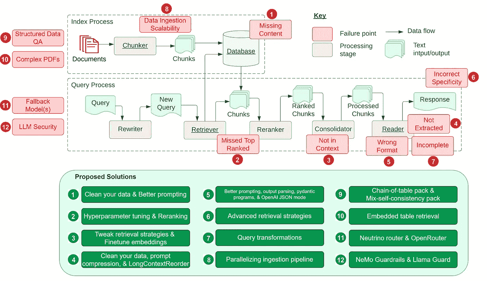

# 12 个 RAG 痛点及解决方案

> 原文：[`towardsdatascience.com/12-rag-pain-points-and-proposed-solutions-43709939a28c?source=collection_archive---------1-----------------------#2024-01-30`](https://towardsdatascience.com/12-rag-pain-points-and-proposed-solutions-43709939a28c?source=collection_archive---------1-----------------------#2024-01-30)

## 解决检索增强生成的核心挑战

 [Wenqi Glantz](https://medium.com/@wenqiglantz?source=post_page---byline--43709939a28c--------------------------------)

· 发表在 [Towards Data Science](https://towardsdatascience.com/?source=post_page---byline--43709939a28c--------------------------------) · 18 分钟阅读 · 2024 年 1 月 30 日

--

图片改编自 [《工程化检索增强生成系统的七个失败点》](https://arxiv.org/pdf/2401.05856.pdf)

· 痛点 1：缺失内容

· 痛点 2：错过了排名靠前的文档

· 痛点 3：缺乏上下文 — 整合策略的局限性

· 痛点 4：未提取

· 痛点 5：格式错误

· 痛点 6：不正确的特异性

· 痛点 7：不完整

· 痛点 8：数据摄取的可扩展性

· 痛点 9：结构化数据 QA

· 痛点 10：从复杂的 PDF 中提取数据

· 痛点 11：回退模型

· 痛点 12：LLM 安全性

受 Barnett 等人论文 [《工程化检索增强生成系统的七个失败点》](https://arxiv.org/pdf/2401.05856.pdf) 启发，本文将探讨该论文中提到的七个失败点以及在开发 RAG 管道过程中遇到的五个常见痛点。更重要的是，我们将深入分析这些 RAG 痛点的解决方案，以便在日常 RAG 开发中更好地应对这些问题。
