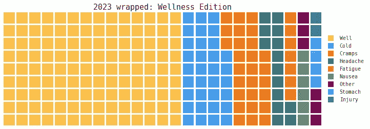

# 2023 年回顾：疾病与健康的一年

> 原文：[`towardsdatascience.com/2023-wrapped-a-year-of-sickness-and-health-d46c9e87d125?source=collection_archive---------13-----------------------#2024-01-23`](https://towardsdatascience.com/2023-wrapped-a-year-of-sickness-and-health-d46c9e87d125?source=collection_archive---------13-----------------------#2024-01-23)

## 分析我自己的数据，以更好地理解我的健康模式

 [Yennie Jun](https://medium.com/@artfish?source=post_page---byline--d46c9e87d125--------------------------------)

·发表于[《数据科学前沿》](https://towardsdatascience.com/?source=post_page---byline--d46c9e87d125--------------------------------) ·10 分钟阅读·2024 年 1 月 23 日

--

对我在 2023 年个人健康和疾病日子的概览，由作者创作。

*这篇文章最初发表于* [*Art Fish Intelligence*](https://www.artfish.ai/p/2023-wrapped-a-year-of-sickness-and)*.*

每年初，我都会对前一年的数据进行分析，以反思过去发生的一切。

去年，即 2022 年，我对自己的哭泣模式进行了深入调查。

 ## 我如何在 2022 年哭泣：365 天个人数据分析

### 使用我自己收集的数据调查我的哭泣模式

towardsdatascience.com

今年，即 2023 年，我分析了自己的疾病与健康模式。

在这篇文章中，我展示了我在 2023 年收集并分析的个人数据概览，并给出了一些关于如何在 2024 年过上更健康、更好生活的结论。

# 数据收集概述

我的数据来自以下几个来源：

+   Google Maps 位置历史

+   Apple Health

+   每天结束时我填写的关于日常习惯的调查问卷

在整合来自不同数据源的数据后，我得到了大量的…
