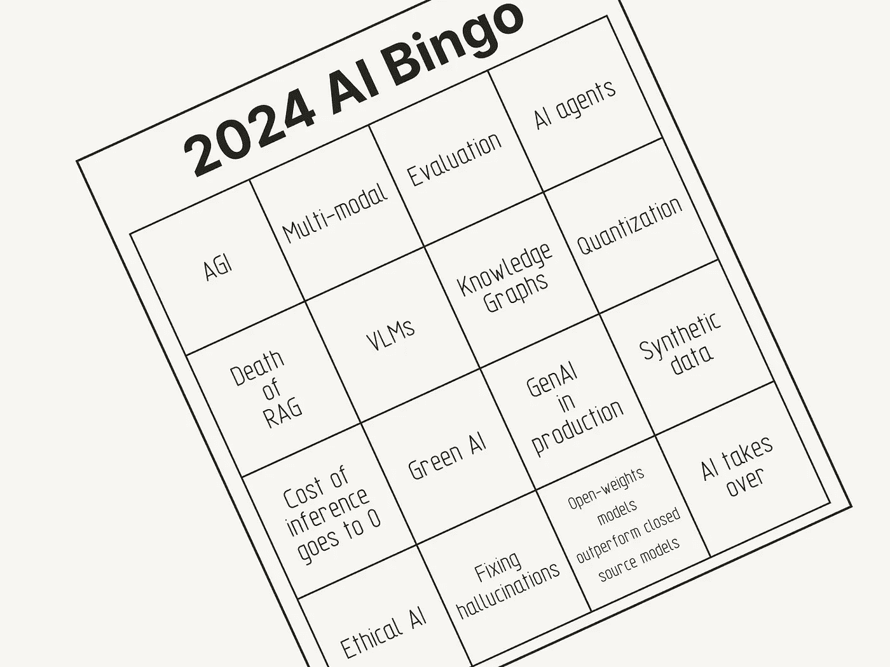
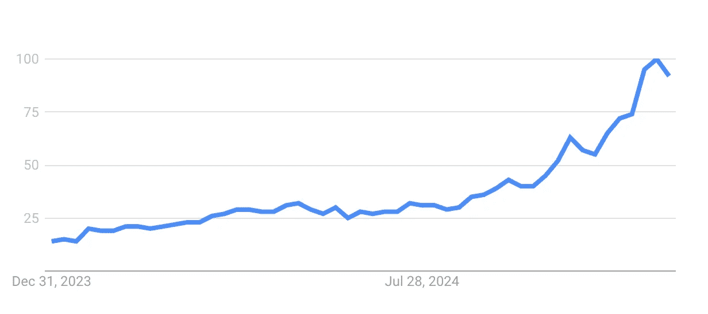

# 2024 年回顾：我对 2024 年的预测正确与错误，以及对 2025 年更大胆的预测

> 原文：[`towardsdatascience.com/2024-in-review-what-i-got-right-where-i-was-wrong-and-bolder-predictions-for-2025-4092c2d726cd?source=collection_archive---------7-----------------------#2024-12-17`](https://towardsdatascience.com/2024-in-review-what-i-got-right-where-i-was-wrong-and-bolder-predictions-for-2025-4092c2d726cd?source=collection_archive---------7-----------------------#2024-12-17)

## 我对 2024 年趋势的正确与错误的看法，以及对未来一年更大胆的预测

 [Leonie Monigatti](https://medium.com/@iamleonie?source=post_page---byline--4092c2d726cd--------------------------------)

·发布于[Towards Data Science](https://towardsdatascience.com/?source=post_page---byline--4092c2d726cd--------------------------------) ·8 分钟阅读·2024 年 12 月 17 日

--

AI 流行语和趋势宾果游戏（图片由作者提供）

在 2023 年，构建 AI 驱动的应用充满了希望，但挑战已经开始显现。到了 2024 年，我们开始尝试一些技术，来应对将这些应用投入生产中的艰难现实。

去年，我回顾了 2023 年 AI 领域的最大趋势并对 2024 年做出了预测。今年，我不打算列出时间线，而是专注于关键主题：出现了哪些趋势？我哪里预测错了？我们可以期待 2025 年会发生什么？

# 2024 年回顾

如果我必须总结 2024 年 AI 领域的情况，那就是“船长，今天是星期三”这个梗。今年的重大发布数量令人震惊。我不怪任何一个在这个领域感到疲惫的人，尤其是到了年底。这真是一次疯狂的旅程，而且很难跟得上。让我们回顾一下 AI 领域的关键主题，看看我去年是否正确预测了这些变化。

## 评估

让我们从一些已投入生产的生成型 AI 解决方案开始。数量并不多。正如 A16Z 的[调查报告](https://a16z.com/generative-ai-enterprise-2024/)所显示，2024 年，许多公司仍然对在面向客户的应用中部署生成型 AI 感到犹豫。相反，它们更愿意将其用于内部任务，如文档搜索或聊天机器人。

那么，为什么目前市面上并没有那么多面向客户的生成式 AI 应用呢？可能是因为我们仍在摸索如何正确评估它们。这是我对 2024 年的预测之一。

很多研究涉及使用另一个 LLM 来评估 LLM 的输出（[LLM-as-a-judge](https://arxiv.org/abs/2411.15594)）。虽然这种方法可能很巧妙，但由于增加了成本、引入了偏见以及不可靠性，它也并不完美。

回顾过去，我曾预计今年会解决这个问题。然而，今天来看，尽管这一话题是讨论的重点，但我们依然没有找到一种可靠的方式来有效评估生成式 AI 解决方案。虽然我认为 LLM 作为评判工具是我们唯一能够大规模评估生成式 AI 解决方案的方法，但这也表明我们在这个领域仍处于早期阶段。

## 多模态性

尽管这对许多人来说可能是显而易见的，但我并没有把它纳入我 2024 年的预测中。随着[GPT4](https://openai.com/index/gpt-4-research/)、[Llama 3.2](https://ai.meta.com/blog/llama-3-2-connect-2024-vision-edge-mobile-devices/)和[ColPali](https://arxiv.org/abs/2407.01449)的发布，多模态基础模型成为 2024 年的一个重要趋势。尽管我们开发者忙于弄清楚如何在现有管道中使 LLM 发挥作用，研究人员却已经走在了前面，他们已经在构建能够处理多种模态的基础模型。

> “***绝对不可能***在没有让机器从高带宽感官输入（如视觉）中学习的情况下，我们能达到人类水平的 AI。” — [Yann LeCun](https://www.linkedin.com/posts/yann-lecun_parm-prmshra-on-x-activity-7172266619103080448-iqvP/?utm_source=share&utm_medium=member_desktop)

以 PDF 解析作为多模态模型在文本到图像任务之外的有用示例。[ColPali](https://arxiv.org/abs/2407.01449)的研究人员通过使用视觉语言模型（VLMs）避免了 OCR 和布局提取的复杂步骤。像 ColPali 和[ColQwen2](https://huggingface.co/vidore/colqwen2-v0.1)这样的系统将 PDF 作为图像处理，直接提取信息，无需预处理或分块。这提醒我们，简单的解决方案往往来源于改变问题的框架方式。

多模态模型的变革比看起来更为深远。PDF 文档的搜索仅仅是开始。基础模型中的多模态性将为各行各业的应用解锁全新的可能性。随着模态的增多，AI 不再仅仅局限于语言——它关乎于理解世界。

## 微调开放权重模型与量化

开源模型正在缩小与封闭模型之间的性能差距。对它们进行微调可以提升性能，同时保持轻量化。量化技术使这些模型更小、更高效（另见[绿色 AI](https://medium.com/towards-data-science/towards-green-ai-how-to-make-deep-learning-models-more-efficient-in-production-3b1e7430a14)），能够在任何地方运行，甚至在小型设备上。量化与微调配合得很好，尤其是考虑到微调语言模型本身就具有挑战性（另见[QLoRA](https://arxiv.org/abs/2305.14314)）。

综合来看，这些趋势表明，未来不仅仅是更大的模型——而是更智能的模型。

由[Maxime Labonne](https://medium.com/u/dc89da634938?source=post_page---user_mention--4092c2d726cd--------------------------------)做出的精彩视觉总结。如果你对微调 LLM 感兴趣，也可以查看他的博客。

我觉得我并没有明确提到过这一点，而只是[在 2024 年第二季度写了一篇关于此的文章](https://medium.com/towards-data-science/shifting-tides-the-competitive-edge-of-open-source-llms-over-closed-source-llms-aee76018b5c7)。所以，我在这里不会给自己加分。

## AI 代理

今年，AI 代理和代理工作流受到了广泛关注，正如 Andrew Ng 年初所预测的那样。我们看到[Langchain](https://www.langchain.com/langgraph)和[LlamaIndex](https://docs.llamaindex.ai/en/stable/use_cases/agents/)开始整合代理，[CrewAI](https://www.crewai.com/)获得了很大动力，OpenAI 推出了[Swarm](https://github.com/openai/swarm)。这是另一个我没有预料到的主题，因为我之前没有深入研究过。

> “我认为 AI 代理工作流将在今年推动大规模的 AI 进展——可能甚至超过下一代基础模型。” — [Andrew Ng](https://x.com/AndrewYNg/status/1770897666702233815?lang=en)

[2024 年“AI 代理”这一术语在 Google Trends 上的截图。](https://trends.google.com/trends/explore?date=2024-01-01+2024-12-16&q=AI+agents&hl=en-US)

尽管 AI 代理引起了极大的关注，但它们也可能具有争议。首先，关于“AI 代理”及其能力仍然没有明确的定义。AI 代理只是具备工具访问能力的 LLM，还是具备其他特定能力？其次，它们带来了额外的延迟和成本。我读到很多评论说，代理系统由于这些问题不适合用于生产系统。

但我认为我们已经开始在生产环境中看到一些具有轻量化工作流的代理管道，比如将用户查询路由到特定的功能调用。我认为我们将在 2025 年继续看到 AI 代理。希望我们能得到更清晰的定义和图景。

## RAG 并未*死亡*，信息检索正在成为主流

[检索增强生成（RAG）](https://medium.com/@iamleonie/building-retrieval-augmented-generation-systems-be587f42aedb)在 2023 年获得了显著关注，并在 2024 年依然是一个关键话题，许多新的变体应运而生。然而，这仍然是一个备受争议的话题。一些人认为，随着长上下文模型的出现，RAG 正在变得过时，而另一些人则质疑这是否真的是一个新思想。虽然我认为关于术语的批评是有道理的，但我认为这个概念会持续存在（至少还会有一段时间）。

所有不同的 RAG 变体

每次发布一个新的长上下文模型时，有些人就预测这将是 RAG 管道的终结。我不认为这会发生。这个讨论本应成为一篇单独的博客文章，所以我在这里不会深入探讨，讨论会留到下一篇。让我只是说，我认为它们并不是互相排斥的，它们是互补的。相反，我们可能会将长上下文模型与 RAG 管道一起使用。

此外，在应用程序中拥有数据库并不是一个新概念。‘RAG’这一术语，指的是从知识源中检索信息以增强 LLM 的输出，面临着批评。有些人认为这不过是对其他领域（如软件工程）中长期使用的技术的重新命名。虽然我认为我们可能会在长远来看抛弃这个术语，但这一技术将继续存在。

尽管有预测认为 RAG（检索增强生成）的时代将结束，但检索依然是 AI 流程的基石。虽然我可能会因为自己在检索领域的工作而有所偏见，但我感觉这个话题在今年变得更加主流。最初，许多讨论集中在将关键词搜索（BM25）作为 RAG 流程的基准。随后，这一讨论扩展到了更广泛的密集检索模型，如[ColBERT](https://arxiv.org/abs/2004.12832)或 ColPali。

## 知识图谱

我完全错过了这个话题，因为我对此不太熟悉。RAG 系统中的知识图谱（例如，图 RAG）是另一个大话题。由于我目前能说的关于知识图谱的内容只是它们似乎是强大的外部知识源，因此我会简短地处理这一部分。

2024 年的关键话题表明，我们现在已经意识到仅仅构建基础模型应用程序的局限性。围绕 ChatGPT 的热潮可能已经平息，但将基础模型集成到应用中的推动力依然强劲。只不过这比我们预期的要困难得多。

> “在投资者失去热情之前，争夺让 AI 更加高效和有用的竞赛已经开始。” — [经济学人](https://www.economist.com/the-world-ahead/2024/11/18/will-the-bubble-burst-for-ai-in-2025-or-will-it-start-to-deliver)

2024 年告诉我们，仅仅扩大基础模型的规模是不够的。我们需要更好的评估、更智能的检索和更高效的工作流，以使 AI 变得有用。今年我们遇到的局限性并不是停滞的标志——它们是关于我们需要在 2025 年解决的问题的线索。

# 我的 2025 年预测

好的，现在进入有趣的部分，我的 2025 年预测是什么？今年，我想为来年做出一些更大胆的预测，让它更有趣：

+   **视频将成为一种重要的模态：** 在纯文本 LLM 发展为多模态基础模型（主要是文本和图像）之后，视频自然会成为下一个模态。我可以想象更多支持视频的基础模型将会追随[Sora](https://openai.com/sora/)的步伐。

+   **从单次到代理式，再到人机协作：** 我想象我们将开始将人类融入 AI 驱动的系统中。虽然我们从单次系统开始，但我们尚未达到由 AI 代理协调不同任务以提高结果的阶段。但 AI 代理不会取代人类，它们将赋能于人类。结合人类反馈的系统将在各个行业提供更好的成果。从长远来看，我想象我们将必须拥有在执行下一任务之前等待人类反馈的系统。

+   **AI 与加密货币的融合：** 坦率地说，我对整个加密货币领域了解不多，但我看到了[Brian Armstrong 的这条推文，讨论 AI 代理应配备加密钱包](https://x.com/brian_armstrong/status/1824547713012080806)。此外，像[DePin（去中心化物理基础设施）](https://tokenomicsexplained.com/depin/)这样的概念，在模型训练和推理方面可能值得探索。虽然这听起来像是流行语游戏，但我很想看看早期实验是否能证明这是真实的还是炒作。

+   **每个 token 的延迟和成本将下降：** 目前，AI 代理面临的一个大问题是延迟和成本的增加。然而，随着摩尔定律的推进和使 AI 模型更高效的研究，如量化和高效的训练技术（不仅是出于成本原因，也出于环保原因），我可以预见每个 token 的延迟和成本将逐渐降低。

**我很想听听你对 2025 年 AI 领域的预测！**

PS：有趣的是，几天前，我和 ChatGPT 一起研究圣诞饼干食谱，而不是使用 Google，这让我想起两年前 ChatGPT 发布时我曾想过的事情。

 [## 我们明年会用 ChatGPT 代替 Google 查找圣诞饼干食谱吗？

### ChatGPT 会取代搜索引擎吗？通过查找糖饼干食谱的使用案例来演示

medium.com](https://medium.com/geekculture/will-we-be-using-chatgpt-instead-of-google-to-get-a-christmas-cookie-recipe-next-year-45360d4a1178?source=post_page-----4092c2d726cd--------------------------------)

# 喜欢这个故事吗？

[*免费订阅*](https://medium.com/subscribe/@iamleonie) *以便在我发布新故事时收到通知。*

 [## 每当 Leonie Monigatti 发布时，获取电子邮件通知。

### 每当 Leonie Monigatti 发布新内容时，您将收到电子邮件通知。通过注册，您将创建一个 Medium 账户（如果您还没有的话）…

[medium.com](https://medium.com/@iamleonie/subscribe?source=post_page-----4092c2d726cd--------------------------------)

*在* [*LinkedIn*](https://www.linkedin.com/in/804250ab/),[*Twitter*](https://twitter.com/helloiamleonie)* 和* [*Kaggle*](https://www.kaggle.com/iamleonie)*上找到我！*
