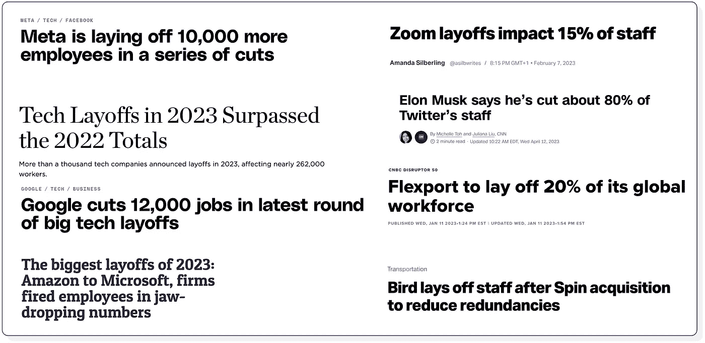
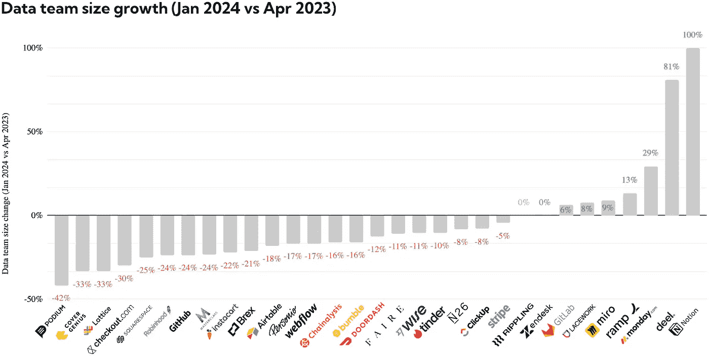
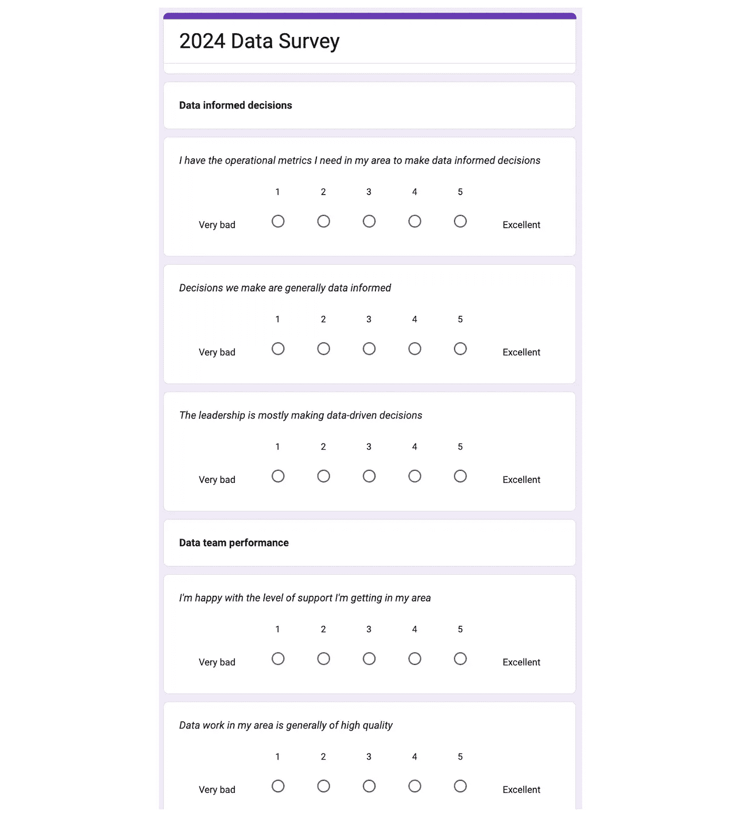
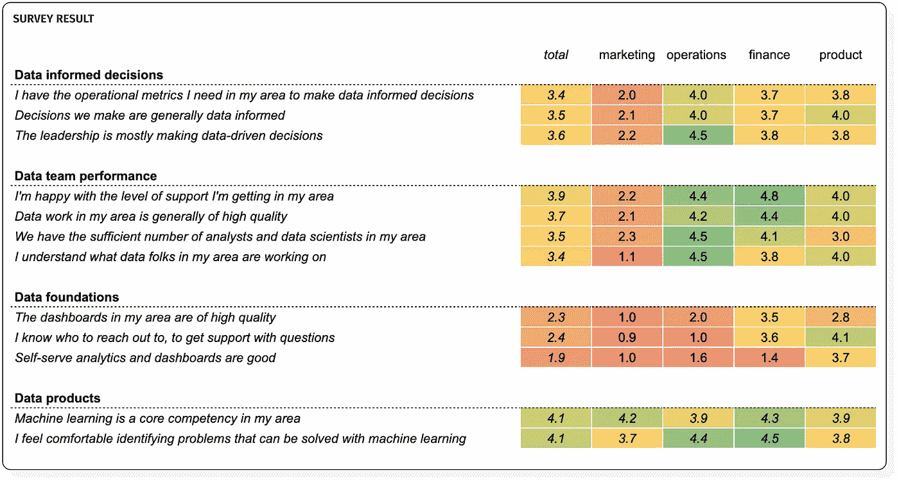
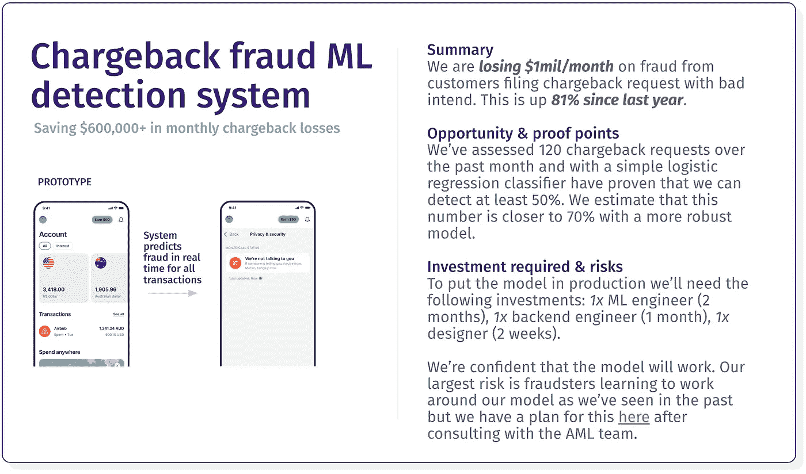
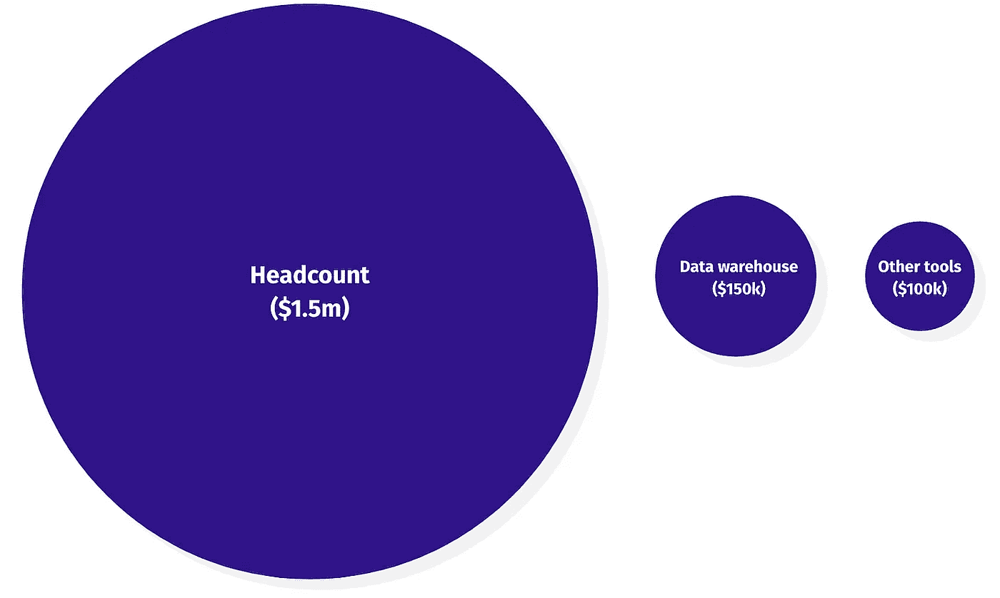

# 2024 年：价值驱动的数据人才之年

> 原文：[`towardsdatascience.com/2024-the-year-of-the-value-driven-data-person-f7f2b6344a5a?source=collection_archive---------8-----------------------#2024-01-04`](https://towardsdatascience.com/2024-the-year-of-the-value-driven-data-person-f7f2b6344a5a?source=collection_archive---------8-----------------------#2024-01-04)

## “以增长为唯一目标”的理念已经被“需要高效运作并以投资回报率为驱动”所取代——数据团队也不例外

 [Mikkel Dengsøe](https://medium.com/@mikldd?source=post_page---byline--f7f2b6344a5a--------------------------------)

·发表于 [Towards Data Science](https://towardsdatascience.com/?source=post_page---byline--f7f2b6344a5a--------------------------------) ·7 分钟阅读·2024 年 1 月 4 日

--

如果你在过去几年里从事技术工作，那真是经历了一场旋风。

> *从 2022 年到 2023 年，风险投资资金下降了 72%*
> 
> *新上市的公司从 2021 年到 2022 年下降了 82%*
> 
> *2023 年，美国超过 150,000 名技术工人被裁员*

*2023 年的现实检验。来源：作者，引用了《Techcrunch》，《The Verge》和 CNN 等出版物*

在 2021 年之前的繁荣时期，资金充裕，团队发展速度远远跟不上需求。2022 年，“以增长为唯一目标”的理念被盈利目标所取代。预算不再基于天马行空的目标分配，而是受到首席财务官的严格审查。

数据团队也未能幸免于此。根据[dbt 2023 年的调查](https://www.getdbt.com/state-of-analytics-engineering-2023)，28%的数据团队计划裁减人员。

根据对选定规模扩展公司中数据岗位数量的观察，与去年年初相比，减少员工数量的公司比扩展团队的公司要多。

*来源：作者根据 2023 年 4 月和 2024 年 1 月的 LinkedIn 数据创建。数据团队* [*通常占公司员工的 1-5%*](https://mikkeldengsoe.substack.com/p/data-as-share-of-workforce) *。*

# 数据团队的新现实

数据团队现在发现自己正处于一个深渊之中。

一方面，数据团队的投资回报率（ROI）历来[难以衡量](https://mikkeldengsoe.substack.com/p/roi-of-data-work)。另一方面，人工智能正处于风口浪尖（根据《麻省理工科技评论》的一项调查，81%的高管认为人工智能将成为他们业务的重要竞争优势）。AI 和 ML 项目通常有更明确的 ROI 案例，而数据团队正处于这一中心，越来越多的机器学习系统依赖数据仓库来驱动。

那么，2024 年数据人员该做什么呢？

在下文中，我探讨了如果你从事数据相关工作，确保自己处于有利位置并与业务价值对齐的五个步骤。

# 向你的利益相关者寻求反馈

当人们能够分享关于你的看法时，他们会觉得被倾听，这也给你提供了一个了解自己弱点的机会。你应该抓住这个机会，主动向重要的利益相关者寻求反馈。

虽然你可能不想对公司里的每个人进行调查，但你可以创建一个以数据为依赖的人员小组，例如所有高级职位的员工。让他们对诸如*对自助服务的满意度、仪表板的质量*以及*是否在他们的领域有足够的数据人员*等问题提供坦率且匿名的反馈（这也能在你要求增加人手时为你提供一些有力的支持）*。

来源：作者

最后问一个问题：“*如果你有一根魔法棒，你会改变什么？*”，让他们提出开放式的建议。

*调查结果——关于数据团队数据工作的数据。这没有变得更好……*

*营销数据团队需要一些审视。数据基础设施也没有做得很好。来源：作者*

对调查结果保持透明，并将其反馈给利益相关者，同时给出明确的行动计划来改进需要改进的地方。如果你每六个月进行一次调查，并且言行一致，你可以在后续展示出实际的改进。确保收集关于受访者所在业务领域的数据。这将为你提供一些宝贵的洞察，帮助你发现盲点，了解是否存在你未曾察觉的业务领域痛点。

# 构建一个商业案例，就像你在寻求风险资本投资一样

你可以坐等利益相关者的请求找到你。但如果你像大多数数据人员一样，你会希望对自己参与的项目有所发言权，甚至可能自己有一些想法。

在我担任 Google 数据分析师时，一位业务单元总监曾分享过一句智慧的建议：*“如果你希望我支持你的项目，就像你是一个创业者在为你的初创公司筹集资金一样向我展示。”* 这听起来可能像硅谷的言辞，但当我深入思考时，他确实有些合理的观点。

+   展示总的$机会是多少，以及你预期能够捕获的百分比

+   展示你已经做出了一个最小可行产品（MVP）以证明它是可行的

+   给我看看替代方案，以及为什么我应该选择你的想法

*示例–ML 模型商业案例提案总结*

来源：作者

像上面那样的商业案例提案通常会呈现给你所在领域的一些高级利益相关者，以争取他们的支持，让你把时间花在这项工作上，而不是你可以做的其他成百上千项事情上。它为他们提供了一个透明的论坛，让他们从一开始就参与项目，也为那些机会太小或风险太大的项目提供了一个早期否决的机会。

像新的 ML 模型或新项目创造运营效率这样的项目特别适合这种情况。但即使你被要求重建一组数据模型或构建一个全公司的 KPI 仪表盘，应用一些相同的原则也是有意义的。

# 采取整体的成本减少方法

当你考虑成本时，很容易陷入“只见树木不见森林”的境地。例如，数据分析师通过优化一些最耗时的 dbt 查询每月节省$5,000，听起来似乎很有成效。但尽管这些成就不应被忽视，采取一种更为整体的成本节约方法会更有帮助。

从问自己数据团队的所有成本组成部分及其含义开始。

如果你以一个中型数据团队为例，在规模扩展的公司中，三个最大的成本驱动因素往往是不成比例的分配为：

+   员工人数（15 个 FTE × $100,0000）：$1,500,000

+   数据仓库成本（例如，Snowflake，BigQuery）：$150,000

+   其他数据工具（例如，Looker，Fivetran）：$100,000

来源：作者

这并不是说你应该立即专注于裁减人员，但如果你的成本分布与上述类似，问问自己以下问题：

*我们是否应该让 2 倍 FTE 的员工构建这个内部工具，还是可以直接购买？*

*是否有低价值的项目，导致高成本人员被浪费在其中？*

*为了节省$5,000 的成本，花费两周的工作时间，这样的投资回报是否合适？*

*在开发工作流程中，是否有优化空间，比如 CI/CD 检查速度，可以改进以释放更多时间？*

# 平衡速度和质量

我曾见过团队因拥有成千上万个 dbt 测试而陷入困境，这些测试遍布数千个数据模型。很难知道哪些是重要的，而且开发新的数据模型比其他所有事情都需要花费两倍的时间，因为所有东西都必须经过相同的严格审查。

另一方面，那些几乎不对数据管道进行测试，构建不遵循良好数据建模原则的数据模型的团队，往往会发现自己进展缓慢，必须花费两倍的时间去清理和修复事后出现的问题。

值导向的数据人员仔细平衡速度和质量

+   对最重要的数据资产的共同理解

+   根据数据资产的重要性，定义期望的测试级别

+   根据问题的严重性，定义期望的解决时间和服务级别协议（SLA）

他们也知道，为了成功，他们的公司需要[更像一艘快艇，少像一艘油轮](https://mikkeldengsoe.substack.com/p/why-speedboats-win-and-tankers-sink)——通过实验快速学习什么有效，什么无效，快速调整方向，每两周回顾一次进展，给予每个团队自主权来设定他们的方向。

数据团队通常在不确定性中工作（例如，这个 ML 模型是否有效）。你发货越快，越能快速了解到什么有效，什么无效。最优秀的数据人员总是谨慎地记住这一点，并知道自己处于曲线的哪个位置。

例如，如果你是一个 ML 工程师，正在开发一个模型来决定哪些客户可以注册一个价值数十亿的全新银行，你就无法再做快速且草率的工作。但如果你在一个种子阶段的创业公司工作，整个后台系统可能在几个月内会重做，你就会知道有时候需要在速度和质量之间找到平衡。

# 主动分享你的工作影响

数据角色的人通常不是那些大声宣扬自己成就的人。虽然没有人愿意做无耻的自我宣传者，但还是可以寻找到一个平衡点。

如果你做的工作产生了影响，不要害怕让同事知道。如果你有一些数据来支持这一点，那就更好（谁比你更清楚数据工作的影响）。在做这件事时，很容易被构建过程中的实施细节困扰，比如有多难，使用了什么精妙的算法，或者写了多少行代码。但利益相关者对此并不关心。相反，考虑用以下的方式来表达。

1.  聚焦影响

1.  不要仅仅说“交付了 X”

1.  使用“交付了 X，并且产生了 Y 的影响”

当事情没有按预期进展时，不要害怕提前指出。例如，如果你正在做一个毫无进展或变得越来越复杂的项目，就要及时指出。你可能会担心这样做会让自己陷入困境，但你的利益相关者会认为这是表现出高度的责任感，而不是陷入沉没成本谬论。

如果你对文章有更多想法或问题，欢迎通过[LinkedIn 联系我](https://www.linkedin.com/in/mikkeldengsoe/)。
