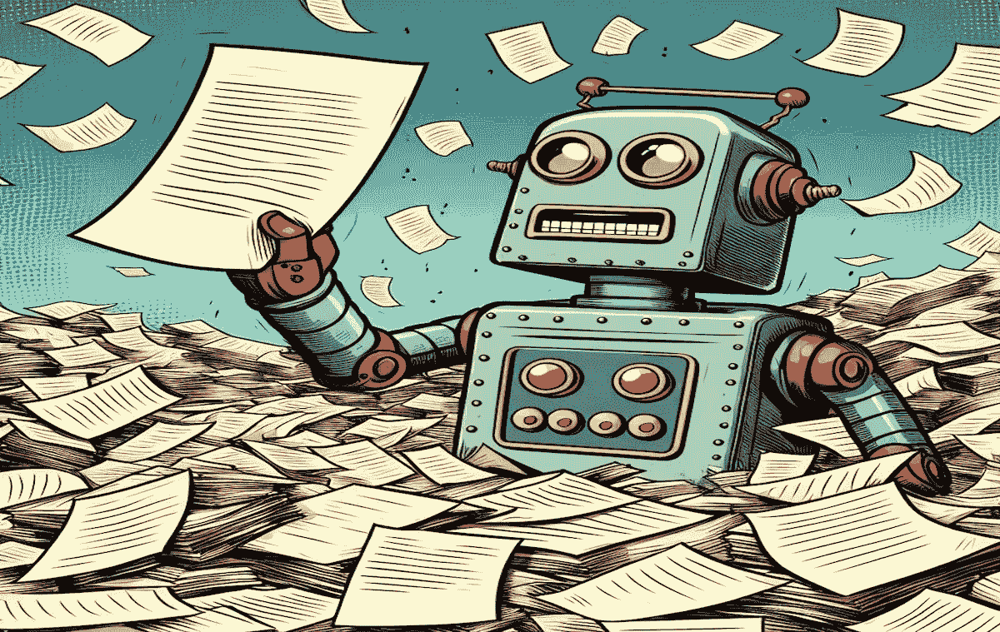

# 提升 RAG 系统的三种高级文档检索技术

> 原文：[`towardsdatascience.com/3-advanced-document-retrieval-techniques-to-improve-rag-systems-0703a2375e1c?source=collection_archive---------0-----------------------#2024-01-15`](https://towardsdatascience.com/3-advanced-document-retrieval-techniques-to-improve-rag-systems-0703a2375e1c?source=collection_archive---------0-----------------------#2024-01-15)

## 查询扩展、跨编码器重排序和嵌入适配器

 [Ahmed Besbes](https://ahmedbesbes.medium.com/?source=post_page---byline--0703a2375e1c--------------------------------)

·发表于[Towards Data Science](https://towardsdatascience.com/?source=post_page---byline--0703a2375e1c--------------------------------) ·10 分钟阅读·2024 年 1 月 15 日

--

图片由作者使用 DALL-E 3 创作

你是否曾观察到，RAG 系统检索到的文档并不总是与用户的查询完全匹配？

这是一个常见的现象，尤其是在现成的 RAG 实现中。检索到的文档可能无法完全回答查询，可能包含冗余信息，或者有不相关的细节。此外，这些文档呈现的顺序也可能无法始终与用户的意图相符。

在这篇文章中，我们将探讨三种有效的技术，以增强基于 RAG 的应用中的文档检索：

1.  查询扩展

1.  跨编码器重排序

1.  嵌入适配器

通过结合这些技术，你可以检索到更相关的文档，这些文档与用户的查询更加匹配，从而提高生成答案的影响力。

让我们来看一下👇。

> *如果你对机器学习内容感兴趣，想要获取来自行业的详细教程和实用技巧，欢迎关注我的* [*新闻通讯*](https://thetechbuffet.substack.com/)*。它的名字叫做《技术自助餐》*。
