# 3 种流行的空间插值方法

> 原文：[`towardsdatascience.com/3-best-methods-for-spatial-interpolation-912cab7aee47?source=collection_archive---------4-----------------------#2024-04-09`](https://towardsdatascience.com/3-best-methods-for-spatial-interpolation-912cab7aee47?source=collection_archive---------4-----------------------#2024-04-09)

## 从头开始，用 Python 实现

[](https://medium.com/@alexroz?source=post_page---byline--912cab7aee47--------------------------------)[](https://towardsdatascience.com/?source=post_page---byline--912cab7aee47--------------------------------) [Aleksei Rozanov](https://medium.com/@alexroz?source=post_page---byline--912cab7aee47--------------------------------)

·发布于 [Towards Data Science](https://towardsdatascience.com/?source=post_page---byline--912cab7aee47--------------------------------) ·10 分钟阅读·2024 年 4 月 9 日

--

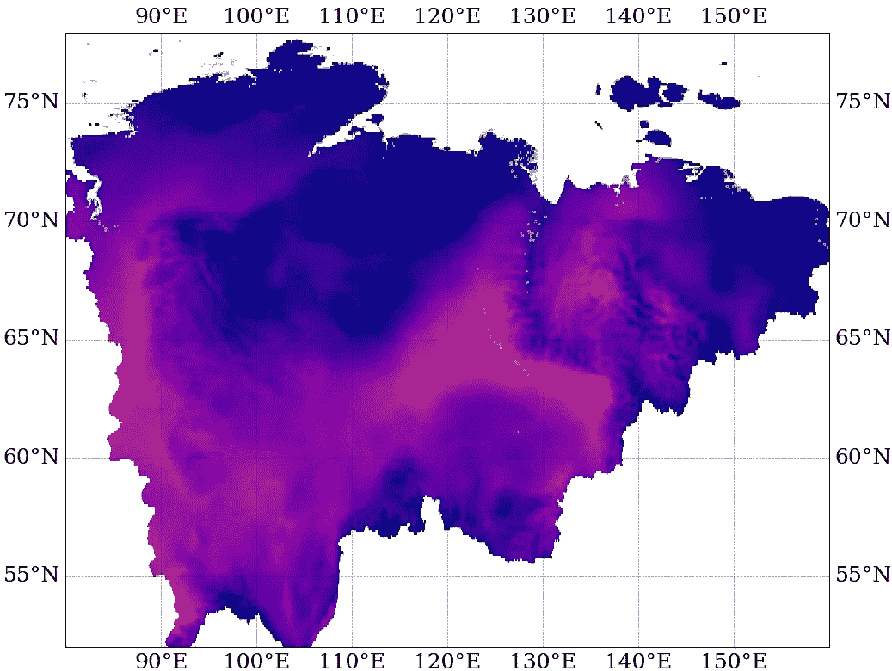

图片由[作者](https://medium.com/@alexroz)提供。

插值是一个相当常见的数学概念，不仅数据科学家使用，许多其他领域的人也会用到。然而，当处理地理空间数据时，插值变得更为复杂，因为你需要基于多个往往稀疏的观测数据创建一个具有代表性的网格。

在深入探讨地理空间部分之前，让我们简要回顾一下线性插值。

> 和往常一样，要跟上教程，你可以在[这里](https://github.com/alexxxroz/Medium/blob/main/SpatialInterpolation.ipynb)下载并运行笔记本。

为了演示，我将使用一个常规的多项式函数：

```py
def F(x):
  return -2*x**3+x**2+2.1

x = np.arange(-5,5, 0.1)
y = F(x)
```

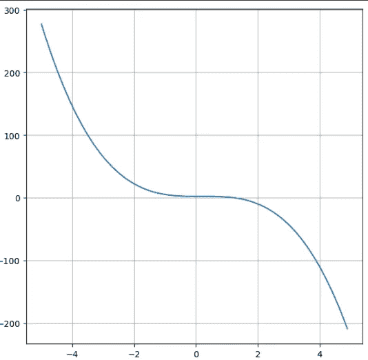

图片由[作者](https://medium.com/@alexroz)提供。

现在我们可以随机选择几个点 [-4.2, 0, 2.5] 并将它们连接起来：

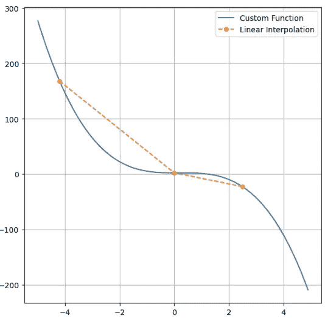

图片由[作者](https://medium.com/@alexroz)提供。

这就是线性插值，因为在每个区间内，函数由一条直线近似，而现在，只知道函数在 3 个点的值，我们就可以找到区间[-4.2;2.5]内的值。

还有许多其他方法，它们具有更高的精度，但它们的基本思路是相同的：在至少两个已知点之间找到函数值。

现在是时候进入地理空间部分了。在本教程中，我们的目标是对瑞士各地气象站测得的每日平均气温进行空间插值，这些数据由[NOAA](https://www.ncdc.noaa.gov/cdo-web/datatools/selectlocation)提供。预期结果是生成一个温度网格，单元格分辨率为 0.1°。

首先，我们需要获取瑞士的行政边界，并使用 geopandas 将其可视化：

```py
import geopandas as gdp

shape = gpd.read_file('gadm41_CHE_0.shp')
shape.plot()
```

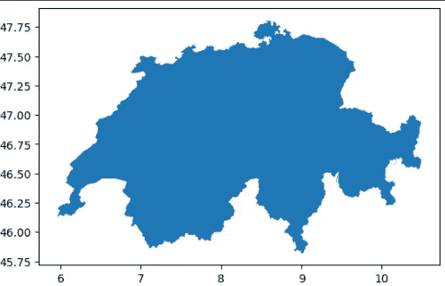

图片由[作者](https://medium.com/@alexroz)提供。

确实，看起来像是瑞士，哇 =)

现在让我们绘制我们的温度观测数据，并将其与国家边界形状叠加。为此，我们将气象数据加载到常规的 pandas 数据框中，然后将其转换为带有坐标的 geopandas 数据框，这些坐标转化为*shapely*点：

```py
import pandas as pd
from shapely.geometry import Point

df = pd.read_csv('3639866.csv')

points = list()
for i in range(len(df)):
  point = Point(df.loc[i, 'LONGITUDE'], df.loc[i, 'LATITUDE'])
  points.append(point)

gdf = gpd.GeoDataFrame(geometry=points).set_crs(shape.crs)
```

完成后，我们可以很容易地使用*matplotlib*将这两个数据框叠加在一起。

```py
fig, ax = plt.subplots(figsize=(16,9))
shape.plot(ax=ax, color='black')
gdf.plot(ax=ax, color='r', markersize=85)
plt.show()
```

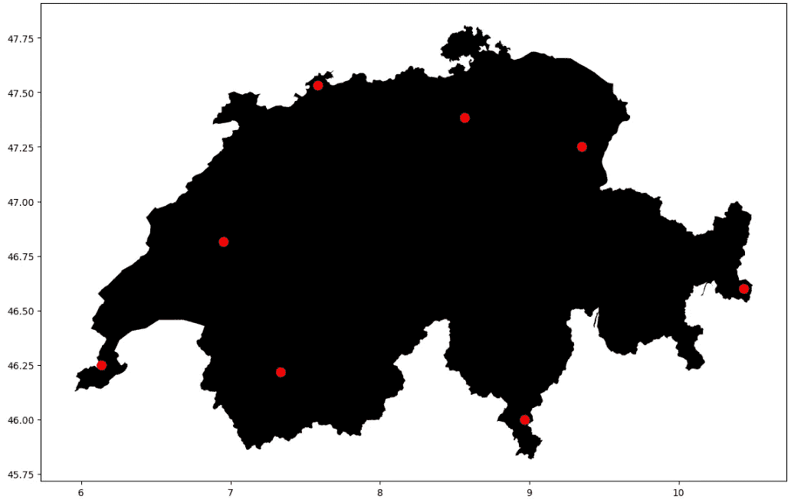

图片由[作者](https://medium.com/@alexroz)提供。

为了可视化我们的任务，让我们创建一个用于插值的网格，并将其与上面的地图叠加：

```py
import matplotlib.ticker as mticker
import cartopy.crs as ccrs
from cartopy.mpl.gridliner import LONGITUDE_FORMATTER, LATITUDE_FORMATTER

LAT, LON = np.arange(45.75, 48, 0.1), np.arange(6, 10.81, 0.1)

fig, ax = plt.subplots(subplot_kw=dict(projection=ccrs.PlateCarree()), figsize=(16, 9))
shape.plot(ax=ax, color='grey')
gdf.plot(ax=ax, color='r', markersize=85)

gl = ax.gridlines(draw_labels=True,linewidth=2, color='black', alpha=0.5, linestyle='--')
gl.xlocator = mticker.FixedLocator(LON)
gl.ylocator = mticker.FixedLocator(LAT)
gl.xformatter = LONGITUDE_FORMATTER
gl.yformatter = LATITUDE_FORMATTER
plt.show()
```

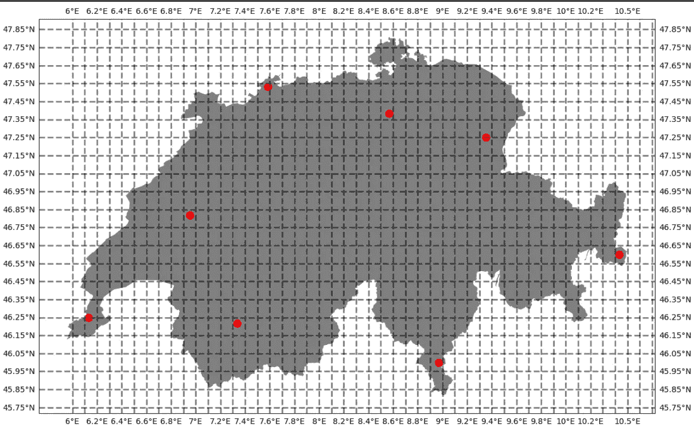

图片由[作者](https://medium.com/@alexroz)提供。

所以目标是对上面插值的常规网格进行插值，包含 8 个温度观测值。

# I. 最近邻（NN）

第一个直观且简单的方法叫做最近邻（NN）。正如你从名称中可以猜到的，这个算法将最近观测值的值分配给每个网格节点。

为了实现它，我们只需要两个函数。第一个函数叫做 Euclidean，它使用以下公式计算两点之间的距离：


图片由[作者](https://medium.com/@alexroz)提供。

第二个方法就是 NN 方法本身。在创建一个空数组来存储值之后，我们遍历所有纬度和经度，计算每个点到当前网格节点的距离，并将最近观测值的值分配给该网格节点：

```py
def Euclidean(x1,x2,y1,y2):
  return ((x1-x2)**2+(y1-y2)**2)**0.5

def NN(data, LAT, LON):
  array = np.empty((LAT.shape[0], LON.shape[0]))

  for i, lat in enumerate(LAT):
    for j, lon in enumerate(LON):
      idx = data.apply(lambda row: Euclidean(row.LONGITUDE, lon, row.LATITUDE, lat), axis = 1).argmin() 
      array[i,j] = data.loc[idx, 'TAVG']
  return array
```

整个思路在这一行中：

```py
idx = data.apply(lambda row: Euclidean(row.LONGITUDE, lon, row.LATITUDE, lat), axis = 1).argmin()
```

变量数据是我们包含气象站点的 pandas 数据框（每行表示一个站点）。因此，在*for*循环中，我们计算距离并找到距离最小的站点的索引。

现在让我们运行算法，并将结果封装到 xarray 数据集中：

```py
t2m = NN(df, LAT, LON)
ds = xr.Dataset(
    {'TAVG': (['lat', 'lon'], t2m)},
    coords={'lat': LAT, 'lon': LON})
```

现在我们可以绘制结果了：

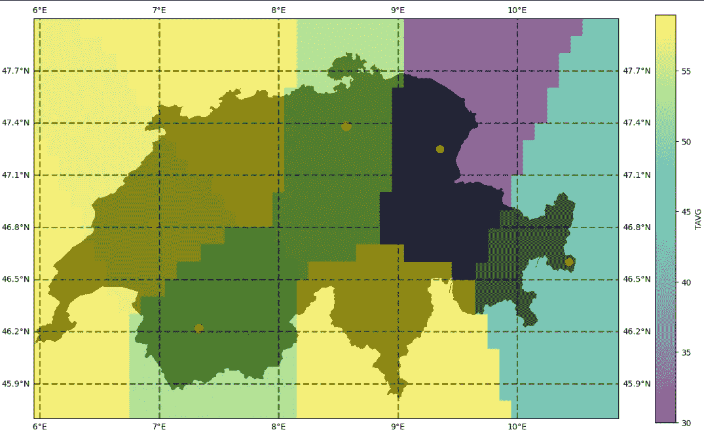

图片由[作者](https://medium.com/@alexroz)提供。

看起来不错，但让我们通过使用 regionmask 库创建瑞士的掩模来增强我们的绘图：

```py
shape['new_column'] = 0
sw = shape.dissolve(by='new_column')['geometry']
rg = regionmask.mask_3D_geopandas(sw, lon_or_obj=ds.lon, lat=ds.lat)

fig, ax = plt.subplots(subplot_kw=dict(projection=ccrs.PlateCarree()), figsize=(16, 9))
#shape.plot(ax=ax, color='black')
ds.where(rg).TAVG.plot(ax=ax, alpha=0.6)
gdf.plot(ax=ax, color='r', markersize=85)
ax.gridlines(draw_labels=True,linewidth=2, color='black', alpha=0.5, linestyle='--')
plt.show()
```

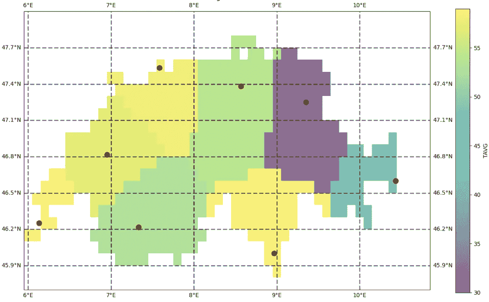

图片由[作者](https://medium.com/@alexroz)提供。

如你所见，这种方法只能应用于分类数据。由于我们处理的是温度数据，温度是连续变量，意味着它可以在某一范围内取任何值，因此这种插值是误导性的。现实生活中总是存在梯度和随机性。

那么，让我们来看看更先进的算法。

# II. 反距离加权（IDW）

基本上，反距离加权（IDW）是 NN 的增强版：

```py
def IDW(data, LAT, LON, betta=2):
  array = np.empty((LAT.shape[0], LON.shape[0]))

  for i, lat in enumerate(LAT):
    for j, lon in enumerate(LON):
      weights = data.apply(lambda row: Euclidean(row.LONGITUDE, lon, row.LATITUDE, lat)**(-betta), axis = 1)
      z = sum(weights*data.TAVG)/weights.sum()
      array[i,j] = z
  return array
```

如你所见，我们不是直接赋值给最近已知的点，而是计算权重。为此，前面提到的欧几里得距离也被使用，但这次我们将每个距离的**-**β次方（β是任意值）。这些权重基本上是每个地面点对某个网格节点的贡献。距离越远，这个点对节点值的影响就越小。

在得到权重后，我们计算加权平均值。

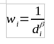

图片来自[作者](https://medium.com/@alexroz)。

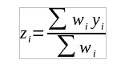

图片来自[作者](https://medium.com/@alexroz)。

让我们绘制它：

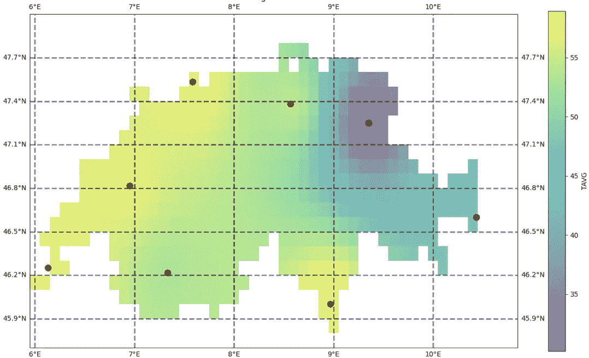

图片来自[作者](https://medium.com/@alexroz)。

如你所见，现在的结果更真实且平滑！

# 三、克里金（Kriging）

今天的最后一个方法是克里金（Kriging）。在这三者中，这是最复杂的，我们将仅仅触及它。如果你想有意识且有效地使用它，可以考虑查阅相关文献！

所以这个方法的主要思想是使用变异函数（或半变异函数）。本质上，变异函数量化了某个参数如何随着距离和方向的变化而变化。这正是我们在处理空气温度时所需要的。

为了实现克里金算法，我们将需要两种类型的变异函数：**实验变异函数**和**理论变异函数**。

第一个计算非常简单。它被定义为**gamma γ**：

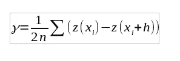

图片来自[作者](https://medium.com/@alexroz)。

其中 h — 两点之间的地理距离，z — 温度函数。所以简而言之，它是已知点温度差的平均值。

理论变异函数要复杂一些。首先，有很多种：

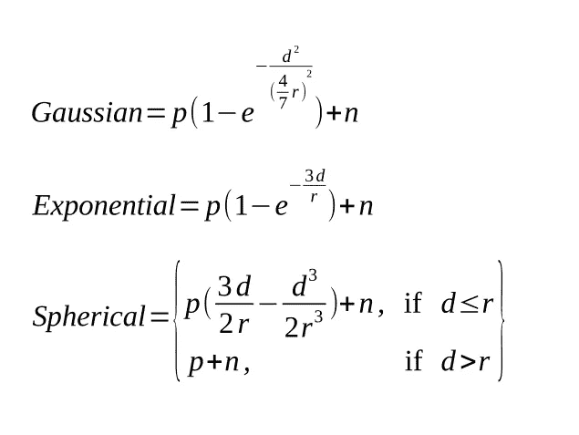

图片来自[作者](https://medium.com/@alexroz)。

其中 p — 是部分阈值，d — 距离（我们之前用了*h*），n — 暴露量，r — 范围。

我在[CDT Columbia](https://iri.columbia.edu/~rijaf/CDTUserGuide/html/interpolation_methods.html)找到了一个非常好的这些参数的可视化解释。我从他们的资料中采用了一张插图，展示了**γ**与距离之间的关系。如你所见，现在清楚地展示了阈值、部分阈值、暴露量和范围。

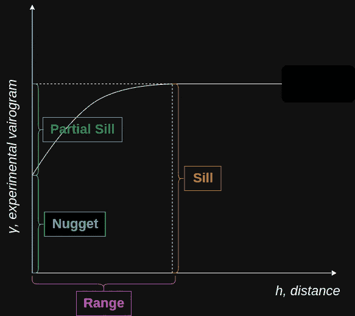

图片来自[作者](https://medium.com/@alexroz)。

所以这个算法的整个思路是调整理论变异函数的参数，使其与实验变异函数匹配，然后利用它预测节点的值。

为了实现该方法，我们将需要几个额外的库，并创建一个名为 OrdinaryKriging 的类。

```py
from scipy.linalg import solve
from itertools import product
from sklearn.metrics import mean_squared_error as MSE

class OrdinaryKriging:
    def __init__(self, lats, lons, values):
        self.lats = lats
        self.lons= lons
        self.values = values

        self.nugget_values = [0, 1, 2, 3, 4]
        self.sill_values = [1, 2, 3, 4, 5]
        self.range_values = [1, 2, 3, 4, 5]

        # Generate all combinations of parameter values to fit
        self.parameter_combinations = list(product(self.nugget_values, self.sill_values, self.range_values))
        self.optimal_pars = None

    def theoretical_variogram(self, h, nugget, sill, r):
        return nugget + (sill-nugget) * (1-np.exp(-3*h/r))

    def Euclidean(self, X, Y):
        all_dists, point_dists = [], []
        for x,y in zip(X, Y):
          k = 0
          for k in range(len(X)):
            h = np.linalg.norm(np.array([x, y]) - np.array([X[k], Y[k]]))
            point_dists.append(h)
          all_dists.append(point_dists)
          point_dists = []
        return all_dists

    def gamma(self):
        distances = self.Euclidean(self.lats, self.lons)
        differences = np.abs(self.values.reshape(-1,1) - self.values)
        variogram_values = []
        for h in np.unique(distances):
            values_at_h = differences[(distances == h)]
            variogram_values.append(np.mean(values_at_h**2))
        return variogram_values, np.unique(distances)

    def fit(self):
        experimental_variogram, distances = self.gamma()
        fit_metrics = []
        for nugget, sill, range_ in self.parameter_combinations:
            theoretical_variogram_values = self.theoretical_variogram(distances, nugget, sill, range_)
            fit_metric = MSE(experimental_variogram, theoretical_variogram_values)
            fit_metrics.append((nugget, sill, range_, fit_metric))

        self.optimal_pars = min(fit_metrics, key=lambda x: x[3])[:3]

    def predict(self, point):
        points = np.array([(x,y) for x,y in zip(self.lats, self.lons)])
        distances = np.linalg.norm(points - point, axis=1)
        pars = list(self.optimal_pars)
        pars.insert(0, distances)
        weights = self.theoretical_variogram(*pars)
        weights /= np.sum(weights)
        return np.dot(weights, self.values)

kriging = OrdinaryKriging(df.LATITUDE.values, df.LONGITUDE.values, df.TAVG.values)

kriging.fit()
```

现在让我们分别考虑每个函数。

**__init__** 函数除了初始化坐标和值外，还包括三个列表，分别包含 nugget、sill 和 range 的可能值。这三者被混合在一起，形成所有可能的组合，并存储在 parameter_combinations 变量中。稍后我们将用它来搜索最优值。

```py
def __init__(self, lats, lons, values):
        self.lats = lats
        self.lons= lons
        self.values = values

        self.nugget_values = [0, 1, 2, 3, 4]
        self.sill_values = [1, 2, 3, 4, 5]
        self.range_values = [1, 2, 3, 4, 5]

        # Generate all combinations of parameter values to fit
        self.parameter_combinations = list(product(self.nugget_values, self.sill_values, self.range_values))
        self.optimal_pars = None
```

第二个函数，**theoretical_variogram**，只是上述公式之一的 Python 实现。在我们的例子中，它是 *指数型*（但你可以为其他公式编写代码并进行比较）：

```py
def theoretical_variogram(self, h, nugget, sill, r):
 return nugget + (sill-nugget) * (1-np.exp(-3*h/r))
```

第三个类方法 **欧几里得**。这是我们为 NN 和 IDW 创建的函数的修改版。这次我们返回一个矩阵 (n,n)，其中每一行表示一个点与所有其他点之间的距离（每行中的一个值为 0，因为一个点与它自身的距离为 0）。

```py
def Euclidean(self, X, Y):
        all_dists, point_dists = [], []
        for x,y in zip(X, Y):
          k = 0
          for k in range(len(X)):
            h = np.linalg.norm(np.array([x, y]) - np.array([X[k], Y[k]]))
            point_dists.append(h)
          all_dists.append(point_dists)
          point_dists = []
        return all_dists
```

第四个函数执行 **拟合**。在这里，它获取实验变差值和欧几里得距离。然后，通过迭代我们关于 sill、range 和 nugget 的组合，计算理论变差值，并进行理论值与实验值之间的均方误差（MSE）估计（当然你也可以使用其他度量标准）。然后，我们将最优参数保存到类变量 optimal_pars 中。

```py
def fit(self):
        experimental_variogram, distances = self.gamma()
        fit_metrics = []
        for nugget, sill, range_ in self.parameter_combinations:
            theoretical_variogram_values = self.theoretical_variogram(distances, nugget, sill, range_)
            fit_metric = MSE(experimental_variogram, theoretical_variogram_values)
            fit_metrics.append((nugget, sill, range_, fit_metric))

        self.optimal_pars = min(fit_metrics, key=lambda x: x[3])[:3]
```

最后一个函数是 **预测**。它接收一个点（lat;lon）作为输入，估算该点与其他已知点之间的距离。接着，它调用 theoretical_variogram 函数，传入我们之前获得的最优参数，并输出权重。然后，计算加权均值并返回。

```py
def predict(self, point):
        points = np.array([(x,y) for x,y in zip(self.lats, self.lons)])
        distances = np.linalg.norm(points - point, axis=1)
        pars = list(self.optimal_pars)
        pars.insert(0, distances)
        weights = self.theoretical_variogram(*pars)
        weights /= np.sum(weights)
        return np.dot(weights, self.values)
```

现在我们可以收集所有预测并可视化地图：

```py
row, grid = [], []
for lat in LAT:
  for lon in LON:
    row.append(kriging.predict(np.array([lat, lon])))
  grid.append(row)
  row=[]

ds = xr.Dataset(
    {'TAVG': (['lat', 'lon'], grid)},
    coords={'lat': LAT, 'lon': LON})

fig, ax = plt.subplots(subplot_kw=dict(projection=ccrs.PlateCarree()), figsize=(16, 9))
ds.where(rg).TAVG.plot(ax=ax, alpha=0.6)
gdf.plot(ax=ax, color='r', markersize=85)
ax.gridlines(draw_labels=True,linewidth=2, color='black', alpha=0.5, linestyle='--')
plt.show()
```

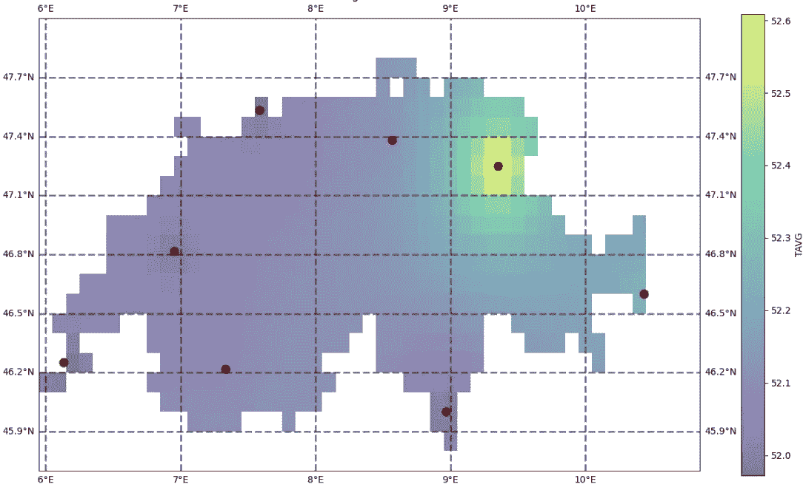

图片来源：[作者](https://medium.com/@alexroz)。

如你所见，结果与 IDW 得到的结果有很大不同。对于克里金插值法（Kriging），最重要的参数是你选择的理论变差模型，因为它基本上定义了预测值与距离之间的关系。如果你不想修改我提供的代码或你自己的代码，你可以探索 [PyKrige](https://geostat-framework.readthedocs.io/projects/pykrige/en/stable/#license) 库，它实现了许多变差模型。

希望这篇文章对你有帮助，提供了有价值的见解！

===========================================

***我在 Medium 上的所有出版物都是免费的，公开访问的，所以如果你在这里关注我，我将非常感激！***

P.s. 我对（地理）数据科学、机器学习/人工智能以及气候变化充满热情。所以如果你想一起合作某个项目，请通过 [LinkedIn](https://www.linkedin.com/in/alexxxroz/) 联系我。

🛰️关注我以获取更多更新🛰️
