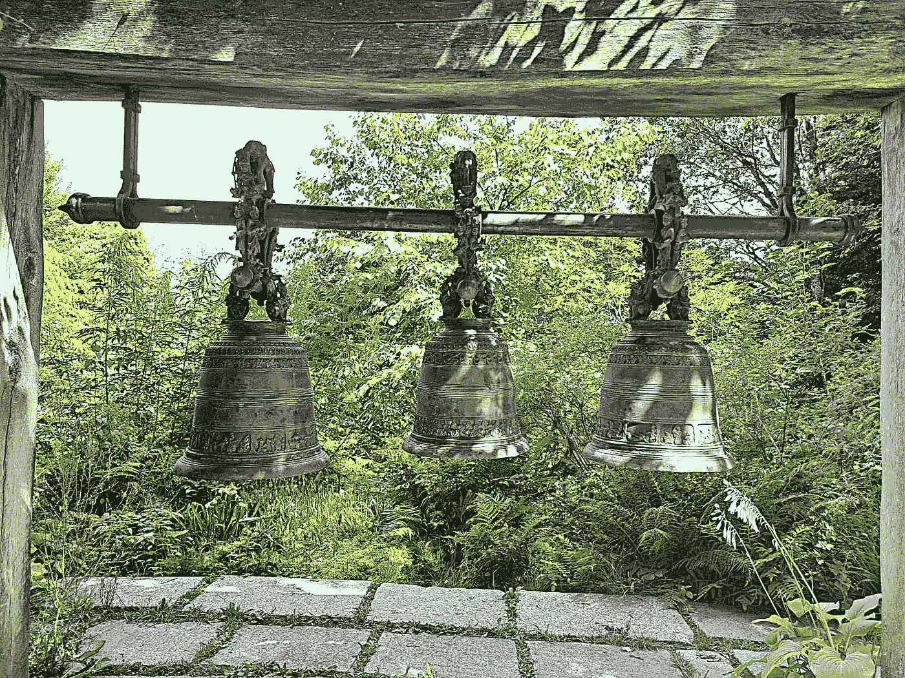

# 3 个强大的 SQL 查询，帮助你处理日期时间数据

> 原文：[`towardsdatascience.com/3-powerful-sql-queries-to-work-with-date-time-data-41681fea7c89?source=collection_archive---------3-----------------------#2024-07-12`](https://towardsdatascience.com/3-powerful-sql-queries-to-work-with-date-time-data-41681fea7c89?source=collection_archive---------3-----------------------#2024-07-12)

## 数据科学

## 使用这些技巧进行有效的趋势分析，并获得推动决策的洞察。

 [Suraj Gurav](https://medium.com/@17.rsuraj?source=post_page---byline--41681fea7c89--------------------------------)

·发布于 [Towards Data Science](https://towardsdatascience.com/?source=post_page---byline--41681fea7c89--------------------------------) ·阅读时长 9 分钟·2024 年 7 月 12 日

--

尼泊尔喜马拉雅山小屋，巴伐利亚，德国 | 作者拍摄的照片

**处理日期时间值** — 数据分析的一个重要部分。

每当你在数据中看到日期时间值时，把它看作是充满信息的宝藏。至少，我是这样看的。

嗯，要获得对你有用的那部分“宝藏”从来都不容易，这也是本文灵感的来源。

是的！我将给你 3 个 SQL 查询，你可以用它们从数据中的日期时间值中获得最大收益。你可以利用它们从数据中获取有价值的洞察，支持有效的决策制定。

如果你使用 Python 进行数据处理和分析，我在下面的两篇文章中已经解释了类似的实用技巧，快来看看吧 —

1.  3 个强大的技巧，帮助你处理 Python 中的日期时间数据

1.  3 个实用的 Pandas 技巧，帮助你处理日期时间数据

回到我们的主题，接下来让我告诉你如何使用 SQL 从日期时间数据中获得最大洞察。

这里是你将在本文中探索的内容的快速概述。
