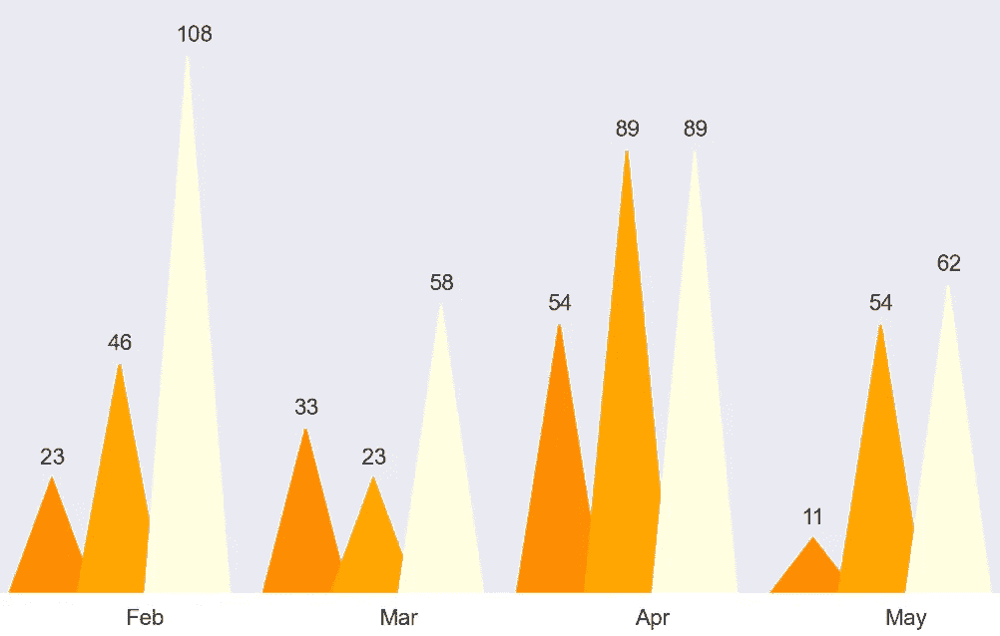

# 作为一些基础图表替代方案的三种三角形图表创意

> 原文：[`towardsdatascience.com/3-triangle-shaped-chart-ideas-as-alternatives-to-some-basic-charts-909684713a4d?source=collection_archive---------11-----------------------#2024-11-19`](https://towardsdatascience.com/3-triangle-shaped-chart-ideas-as-alternatives-to-some-basic-charts-909684713a4d?source=collection_archive---------11-----------------------#2024-11-19)

## 使用 Python 创建数据可视化，作为条形图、饼图和一些 3D 图形的替代方案。

 [Boriharn K](https://medium.com/@borih.k?source=post_page---byline--909684713a4d--------------------------------)

·发表于[Towards Data Science](https://towardsdatascience.com/?source=post_page---byline--909684713a4d--------------------------------) ·阅读时间 8 分钟·2024 年 11 月 19 日

--

图片由[Igor Karimov 🇺🇦](https://unsplash.com/@ingvar_erik?utm_source=medium&utm_medium=referral)提供，来源于[Unsplash](https://unsplash.com/?utm_source=medium&utm_medium=referral)

许多图表通常由矩形或圆形组成，例如条形图和饼图。这些图表既常见又实用，因为它们不仅容易制作，而且大多数人都知道如何阅读和理解它们。

虽然它们适用于许多场合，但也有一些场景可能觉得它们过于基础，比如制作信息图或吸引人们的注意力。可以应用不同的方法使图表更具吸引力。其中之一就是改变图表的形状。

本文中的三角形图表示例。图片由作者提供。

本文旨在提供关于如何将三角形图表作为替代方案的创意和指南。这并不意味着它们可以完全替代原始图表。每种图表都有其优缺点，取决于使用的目的。

# 三角形图表

本文将解释三种三角形图表：

+   **三角形条形图**
