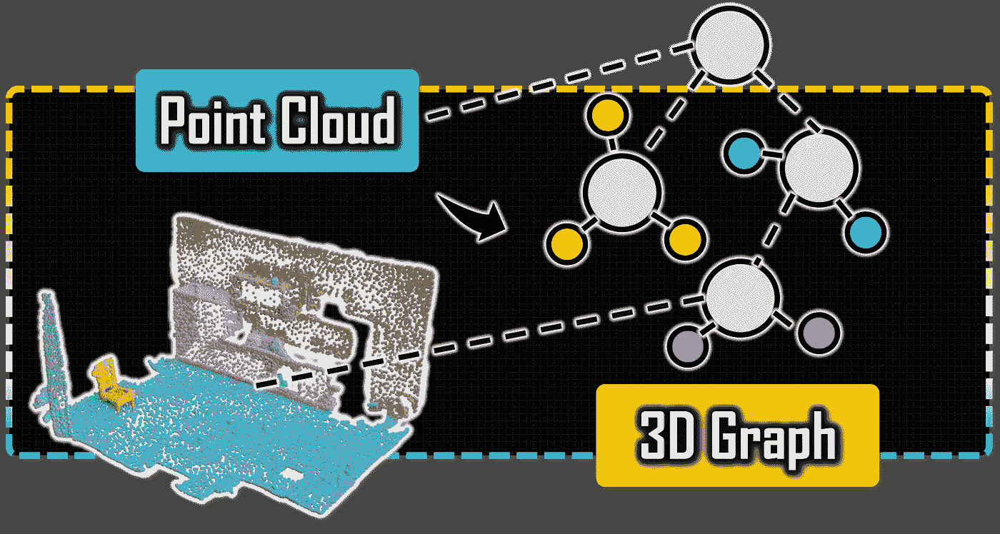
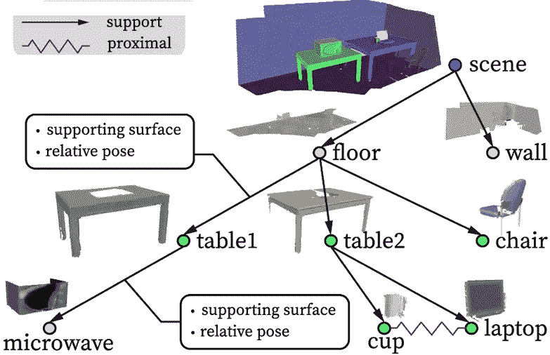

# 3D 图聚类与图论：完整指南

> 原文：[`towardsdatascience.com/3d-clustering-with-graph-theory-the-complete-guide-38b21b1c8748?source=collection_archive---------2-----------------------#2024-12-02`](https://towardsdatascience.com/3d-clustering-with-graph-theory-the-complete-guide-38b21b1c8748?source=collection_archive---------2-----------------------#2024-12-02)

## 3D Python

## 用图论进行 3D 点云的欧几里得聚类 Python 教程。无监督分割的基本概念和顺序工作流。

 [Florent Poux, Ph.D.](https://medium.com/@florentpoux?source=post_page---byline--38b21b1c8748--------------------------------)

·发表于[Towards Data Science](https://towardsdatascience.com/?source=post_page---byline--38b21b1c8748--------------------------------) ·阅读时间：22 分钟·2024 年 12 月 2 日

--

3D 图聚类与图论。© [F. Poux](https://learngeodata.eu/)

除了听起来很酷，为什么我要花三周时间编写关于 3D 数据图论的 Python 教程？

> 简短的答案是，它对于理解 3D 场景极为有用。它可以改变你在决策场景中处理 3D 数据集的效率。

但也有许多挑战需要注意。

如果我们退一步来看，我们的眼睛能够捕捉空间信息，然后通过我们的认知系统进行处理。这就是其中的魔力所在：我们的脑袋帮助我们理解场景及其关系分解。

作者在《[机器人自主性功能性物体场景重建](https://link.springer.com/article/10.1007/s11263-022-01670-0)》中描述的场景关系示例，2022 年。

通过内部知识表示，你可以立即知道你的场景由地板和墙壁组成，地板上有椅子和桌子，而桌子上又放着杯子、微波炉和笔记本电脑。
