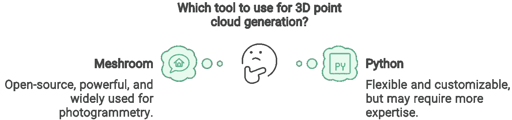

# 使用 Python 和 Meshroom 进行 3D 重建教程

> 原文：[`towardsdatascience.com/3d-reconstruction-tutorial-with-python-and-meshroom-2aa37805ab4a?source=collection_archive---------5-----------------------#2024-07-20`](https://towardsdatascience.com/3d-reconstruction-tutorial-with-python-and-meshroom-2aa37805ab4a?source=collection_archive---------5-----------------------#2024-07-20)

## 3D 重建

## 快速学习如何从照片创建 3D 模型，并掌握使用 Python + Meshroom（摄影测量法）生成点云。

 [Florent Poux, Ph.D.](https://medium.com/@florentpoux?source=post_page---byline--2aa37805ab4a--------------------------------)

·发表于 [Towards Data Science](https://towardsdatascience.com/?source=post_page---byline--2aa37805ab4a--------------------------------) ·5 分钟阅读·2024 年 7 月 20 日

--

你可能已经从我之前写的文章中听说过基于图像的 3D 重建。这是一个深度优先的示例（以备后用）：

 ## 使用摄影测量法进行 3D 重建的终极指南

### 使用 3D 摄影测量法、Reality Capture、Meshroom 和 Blender 的完整实操 3D 重建教程。

towardsdatascience.com

今天，我想重点介绍一个“直奔主题”的阅读，确保你可以拍摄一堆照片，并在你的 Python 脚本中创建 3D 点云或 3D 网格，进而开发出一个很酷的体验。

如果你觉得不错，让我快速回答下面的问题：

用于 3D 点云生成的工具应该选择哪一个？© [Florent Poux, Ph.D.](https://medium.com/u/8ba7bf4ad784?source=post_page---user_mention--2aa37805ab4a--------------------------------)

当你准备好时，让我们开始有趣的部分吧。

📦 **Florent 的资源**：请在这里找到本教程的资源——首先是[Meshroom 软件](https://alicevision.org/)及其文档。然后是[Anaconda 发行版](https://docs.anaconda.com/miniconda/)，包含 Python 3.9+，以便使用一些库。
