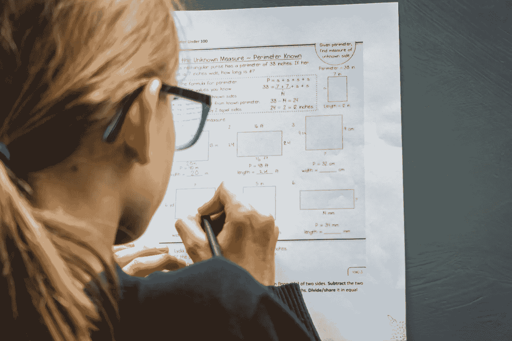

# 8 分钟看完 4 年的数据科学

> 原文：[`towardsdatascience.com/4-years-of-data-science-in-8-minutes-6ea5b10f0192?source=collection_archive---------0-----------------------#2024-10-24`](https://towardsdatascience.com/4-years-of-data-science-in-8-minutes-6ea5b10f0192?source=collection_archive---------0-----------------------#2024-10-24)

## 我在这四年多的学习数据科学的旅程中所学到的

 [Egor Howell](https://medium.com/@egorhowell?source=post_page---byline--6ea5b10f0192--------------------------------)

·发布于 [Towards Data Science](https://towardsdatascience.com/?source=post_page---byline--6ea5b10f0192--------------------------------) ·8 分钟阅读·2024 年 10 月 24 日

--

图片由 [Greg Rosenke](https://unsplash.com/@greg_rosenke?utm_source=medium&utm_medium=referral) 提供，来源于 [Unsplash](https://unsplash.com/?utm_source=medium&utm_medium=referral)

我过去四年一直在学习数据科学，在这期间，我作为一名专业数据科学家工作了超过三年。

我从物理学开始学习，当时并不确定大学毕业后想做什么。然而，现在我有了我热爱的职业，无法想象自己做其他任何事情！

在本文中，我想按年回顾我的成长历程，分享那些帮助我成为数据科学家的经验、学习和失败。

我希望你能从我的经历中找到有价值的内容，帮助你在自己的道路上前进！

# 第一年

正如你们中的一些人可能知道的，我最初的计划是攻读物理学博士，最终目标是成为一名职业研究员！

在我的硕士课程中，我需要从第三年的下半年到第四年的上半年进行一年的研究。这基本上就是 2020 年。
