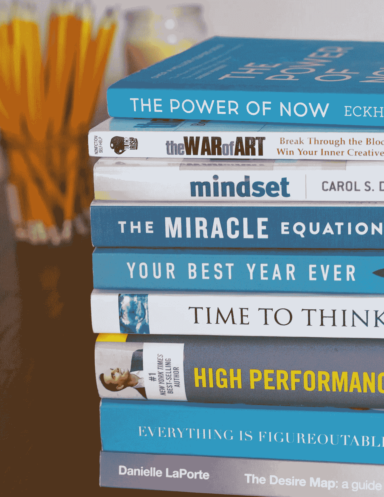
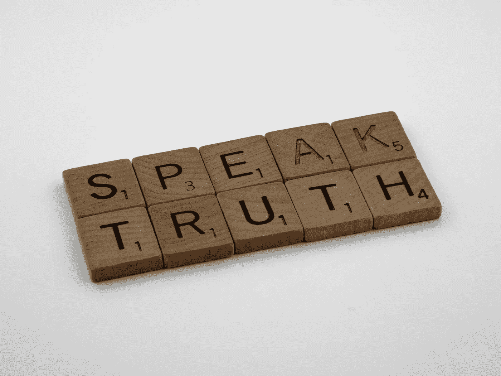

# 提升你数据科学水平的 5 项关键软技能

> 原文：[`towardsdatascience.com/5-key-soft-skills-to-elevate-your-data-science-game-1a4451f6884b?source=collection_archive---------5-----------------------#2024-04-05`](https://towardsdatascience.com/5-key-soft-skills-to-elevate-your-data-science-game-1a4451f6884b?source=collection_archive---------5-----------------------#2024-04-05)

## 数据科学家应高度重视的软技能，以便在人群中脱颖而出

 [Florent Pajot](https://medium.com/@florentpajot?source=post_page---byline--1a4451f6884b--------------------------------)

·发表于[Towards Data Science](https://towardsdatascience.com/?source=post_page---byline--1a4451f6884b--------------------------------) ·10 分钟阅读·2024 年 4 月 5 日

--

在这个故事中，我将与大家分享我认为数据科学家应高度重视的五项软技能，以帮助他们在人群中脱颖而出。这些观察基于我过去十年的经验，与数据科学家一起工作并管理他们的经历。

图片来自[Gary Butterfield](https://unsplash.com/@garybpt?utm_source=medium&utm_medium=referral)在[Unsplash](https://unsplash.com/?utm_source=medium&utm_medium=referral)上的分享

# 1\. 好奇心

我不会让你对这个（或下一个）感到措手不及，但好奇心仍然是数据科学家（以及许多其他职业）的一个关键特征。

## 保持学习

数据科学家应该非常重视好奇心，因为好奇心能够促进在快速发展的数据科学领域中的持续学习和适应。

由于研究论文和会议中不断涌现创新，拥有好奇心的思维方式鼓励数据科学家紧跟新兴趋势，拥抱新工具，并不断提升自己的技能。

在我的职业生涯中，我曾有过几次专注于一个话题数月的经历，低头工作，忘记了其他一切。在某个时刻，我的好奇心把我拉回现实，促使我睁开眼睛，去寻找这段时间领域里发生了什么。如果没有它，我可能会陷入困境，变得过时。

## 跳出框框思考

此外，好奇心也是解决问题时创意的来源。

数据科学常常面临复杂的挑战，需要创新的解决方法，同时也常常是寻找将旧有并已验证的方法应用到新领域的创新方式，这些方法之前并未尝试过。

因此，好奇的头脑更有可能跳出框框，拓宽视野，尝试新事物。这就是你解决问题所需要的一切！

创造力并不单单来自于好奇心。例如，我认为由具有不同背景的人组成的团队更有可能激发创造力。因此，如果你是经理，考虑招聘与自己或同事截然不同的人，对不寻常的职业道路保持好奇心，你可能会发现一些珍贵的人才。

## 如何增强你的好奇心？

1.  阅读

你应该多读博客和书籍（或任何你喜欢的其他阅读/收听形式）。你应该选择一些自己不熟悉的话题，超出你通常阅读的内容。如果你有科学背景，可以阅读有关商业、沟通、决策等方面的内容。

我喜欢阅读我感兴趣的话题，比如篮球、数据科学或数据工程。然而，我也尝试阅读更多关于软件工程、市场营销、创业、生物学、个人理财等方面的内容。

2\. 跳出你的舒适区

抓住任何离开舒适区的机会，学习新事物。如果你采取一种对所有事物都感兴趣、对每个人都值得倾听的态度，你将扩展自己的视野，并开始质疑自己在专业领域之外的事情。

照片由[Panos Sakalakis](https://unsplash.com/@meymigrou?utm_source=medium&utm_medium=referral)拍摄，来源于[Unsplash](https://unsplash.com/?utm_source=medium&utm_medium=referral)

# 2\. 沟通

在任何职业中，你可能都遇到过与一个在有效沟通方面存在困难的人合作的挑战。这个问题在数据科学领域尤为突出，因为精确地传达技术概念是一项艰巨的任务。

## 适应你的听众

数据科学家往往处于多个团队的交叉点，需与各种利益相关者及背景各异的人合作。因此，弥合知识差距，确保每个人对所说的内容有共同的理解非常重要。

没有清晰的沟通，合作变得迅速不可能，甚至可能危及到一个项目、一个团队，或者你的工作。

在我之前的经验中，我一直对那些能够在不使用任何技术术语的情况下表达自己当前工作的人的能力感到印象深刻。对我来说，这能很好地反映出一个人对主题的掌控程度，并且在讨论之前，已经对其有了全面的理解。

## 高效地传达成果

即使只有 1%的项目时间用于沟通成果，这看似微小的部分，往往包含了 99%的价值。

可惜的是，我注意到许多初级数据科学家会花费数周时间完善他们的技术方法或数据分析，但在传达有影响力的见解时却因为沟通不力而失败。

## 如何提高你的沟通能力？

1.  实践

你应该把每一个与人互动的机会都看作是练习和提升你沟通技巧的机会。

例如，如果你有日常会议，提前准备几分钟，确保能够清晰地传达信息给你的听众。

每当我有一个“重要”的会议时，我会花 5 分钟准备。我的准备方法如下：

+   花 1 分钟进行颧骨热身（这有助于改善发音）-> [`preply.com/en/blog/english-pronunciation-practice/`](https://preply.com/en/blog/english-pronunciation-practice/)

+   定义我的目标

+   确定我的听众对听我讲话的兴趣点

+   写下我发言的关键主题或结构化总结

永远假设他们对你所做的事情一无所知，并帮助他们填补知识空白，让他们对你所说的内容感到舒适。

同时，向他们寻求反馈：你记得我今天的主要目标是什么吗？是否足够清晰？

资源：

+   [`hbr.org/2023/06/how-to-give-and-receive-critical-feedback`](https://hbr.org/2023/06/how-to-give-and-receive-critical-feedback)

+   [`kimmalonescott.medium.com/asking-for-feedback-how-to-solicit-radical-candor-823dab2860c0`](https://kimmalonescott.medium.com/asking-for-feedback-how-to-solicit-radical-candor-823dab2860c0)

2\. 阅读

阅读关于沟通的书籍！我强烈推荐从 Chip 和 Dan Heath 的《Made To Stick》开始，这本书提供了一种使你的想法更具记忆性和影响力的方法。

图片由 [Seema Miah](https://unsplash.com/@seemamiah?utm_source=medium&utm_medium=referral) 提供，来源于 [Unsplash](https://unsplash.com/?utm_source=medium&utm_medium=referral)

你也可以在互联网上找到许多有趣的免费资源，比如 [`online.hbs.edu/blog/post/communication-techniques`](https://online.hbs.edu/blog/post/communication-techniques)

# 3\. 科学思维方式

很容易忘记“数据科学家”这一角色名称中的“科学家”部分，但非常重要的一点是，数据科学家必须运用科学的方法来利用数据解决问题。

科学严谨性构成了数据科学的基础，确保分析结果是稳健、可靠且可重复的。应用科学严谨性主要是指遵循严格的方法论，并对发现进行批判性评估。

你可以成为一名优秀的软件工程师，而不需要应用任何科学的方法论。但如果没有这些方法论，你就不可能成为一名优秀的数据科学家。

在我看来，这不是一个选择。即使你不是研究科学家，运用科学的严谨性对减少错误结论的风险也至关重要。这就是为什么，每当我与同事讨论实验和结果时，我倾向于在初期阶段更看重科学方法而非结果。

## 拥抱更高科学严谨性的技巧

1.  问题定义

说起来容易做起来难。但如果你解决的是错误的问题，那么你将一事无成，浪费时间。不幸的是，大多数人都会选择第一个可行的问题版本，因为他们更喜欢编写代码。因此，解决方案很简单，投入更多时间来定义问题，和相关利益方讨论期望结果，并设置合适的初步假设/约束。

2\. 统计学

统计学是数据科学家硬技能的三大支柱之一。而任何科学方法都需要合理使用统计工具。例如，统计检验可以帮助你检查特征相关性或数据分布。因此，如果你不熟悉这些工具，可以考虑提升你的统计武器库。

你可以立即在 Medium 上开始：`towardsdatascience.com/ultimate-guide-to-statistics-for-data-science-a3d8f1fd69a7`

我还推荐这本全面的书籍：[`www.oreilly.com/library/view/practical-statistics-for/9781492072935/`](https://www.oreilly.com/library/view/practical-statistics-for/9781492072935/)

3\. 工具

人们往往会尝试同时做多件事以节省时间。但逐步进行，每次评估一件事是必须的，这样才能确保你理解正在发生的事情，并得出正确的结论。

使用合适的工具可以显著简化过程。这正是“实验跟踪”工具的功能，随着数据科学领域的不断发展，这些工具的使用越来越广泛。

对于像 Kaggle 竞赛这样的个人项目，我喜欢使用[DVC](https://dvc.org/doc/api-reference)，它几年前引入了实验跟踪功能。然而，市场上也有许多更先进的工具，如[MLFlow](https://mlflow.org/docs/latest/introduction/index.html)和[Neptune.ai](https://neptune.ai/)。

你可以在这里找到一个关于实验跟踪工具的全面比较：`towardsdatascience.com/a-comprehensive-comparison-of-ml-experiment-tracking-tools-9f0192543feb`

但是，你不需要复杂的工具来记录你的想法、问题和实验。所以我建议至少从用记事本写下内容开始。

图片来源：[Brett Jordan](https://unsplash.com/@brett_jordan?utm_source=medium&utm_medium=referral)在[Unsplash](https://unsplash.com/?utm_source=medium&utm_medium=referral)

# 4\. 诚信

正如任何数据科学家都清楚的那样，数据分析的结果会根据呈现者希望传达给观众的叙事而大不相同。

## 他是在用数据撒谎吗？

不可否认的是，从数据集中得出的结论本质上会受到呈现者的观点和意图的影响。这个简单的事实凸显了诚信的重要性。

资源：

+   《如何用统计学撒谎》by Darrell Huff

+   `towardsdatascience.com/lessons-from-how-to-lie-with-statistics-57060c0d2f19`

拥有巨大权力的同时也意味着巨大的责任。但，这并不是我认为诚信对我重要的唯一原因。

## 挑战模型偏见

模型中的偏见也是每个数据科学从业者应该关心的一个如今广为人知的问题。

解决这个问题是一个艰难的任务，但每个人都应该关注，因为它可能带来的商业影响，更重要的是，一个有偏见的模型可能对社会造成的潜在影响。

相关的有趣资源：

+   [`developers.google.com/machine-learning/crash-course/fairness/video-lecture`](https://developers.google.com/machine-learning/crash-course/fairness/video-lecture)

+   [`pair-code.github.io/what-if-tool/`](https://pair-code.github.io/what-if-tool/)

如果你像我一样是 AWS 用户，[Sagemaker Clarify](https://aws.amazon.com/sagemaker/clarify/)提供了多种偏见检测分析工具。

如果你对深度学习的公平性感兴趣，可以仔细查看[DEEL 实验室的出版物](https://www.deel.ai/bias/)，以及他们的开源解决方案，如[Influencia](https://github.com/deel-ai/influenciae)。

## 环境影响

数据科学的另一个伦理方面是它的环境影响，这个问题由于测量和理解的复杂性，通常被忽视。

我猜这个领域的研究正在扩展，如果你有相关材料愿意与我分享，我会非常感激。

数据科学家必须积极评估和减少他们的环境影响。例如，他们必须质疑处理大量数据是否对于实现预期的商业目标至关重要。

此外，他们应该探索减少模型环境影响的方法。然后，与利益相关者分享结果和观点，将扩大对数据驱动决策中固有环境影响的认识。

这个问题还有更多的维度，我会在未来的故事中进一步思考。

有趣的资源：

+   [`www.oecd.org/publications/measuring-the-environmental-impacts-of-artificial-intelligence-compute-and-applications-7babf571-en.htm`](https://www.oecd.org/publications/measuring-the-environmental-impacts-of-artificial-intelligence-compute-and-applications-7babf571-en.htm)

+   [`www.nature.com/articles/s42256-020-0219-9`](https://www.nature.com/articles/s42256-020-0219-9)

+   像 AWS 这样的编辑可能会提供类似于[`aws.amazon.com/aws-cost-management/aws-customer-carbon-footprint-tool/`](https://aws.amazon.com/aws-cost-management/aws-customer-carbon-footprint-tool/)的工具。

如果你想开始思考你的代码碳足迹：

+   [`mlco2.github.io/codecarbon/`](https://mlco2.github.io/codecarbon/)

+   了解你的代码在哪些地方低效也是一个很好的起点：[`pyinstrument.readthedocs.io/en/latest/`](https://pyinstrument.readthedocs.io/en/latest/)

## 你如何保持你的诚信？

诚信就是对自己诚实，在价值观上保持一致，并根据自己的原则行事。因此，首先要问自己的是：你的核心价值观是什么，以及如何在日常工作中最好地体现它们。

然后，抵制外部压力，保持忠于自己。同时，不要忽视领域中的伦理挑战。这些问题对社会来说日益重要，我们有责任提供解决方案。

图片来源：[Afif Ramdhasuma](https://unsplash.com/@javaistan?utm_source=medium&utm_medium=referral) 在 [Unsplash](https://unsplash.com/?utm_source=medium&utm_medium=referral)

# 5. 以价值为中心

所有数据科学家都喜欢探索数据和构建模型。这也是 Kaggle 如此受欢迎的原因。作为专业人士，很容易被无尽的数据探索、无限的实验或模型优化所困住。

以价值为中心指的是一种方法或心态，它强调将提供价值作为决策、问题解决和整体战略中的主要目标。

因此，在数据科学的背景下，作为以价值为中心意味着你必须保持专注，并运用你的技能创造价值，而不是将时间浪费在那些你希望通过解决技术问题来达成最佳解决方案的事情上。

再次强调，我合作过的最优秀的数据科学家都是有目的地探索数据，提出并回答那些能帮助他们解决正确问题的问题。然后，他们进行最小限度的实验，以得出解决方案并构建 MVP。他们迅速投入生产，看看会发生什么，并进行迭代。

这条路径由在优化事物和为最终用户增加增量价值之间的无数权衡组成。

## 如何专注于价值？

作为以价值为中心的一部分，最难的一点是认识到，即使你不是自己构建一个全面的数据产品，你也在构建其中的一部分，因此你必须遵循产品思维，并专注于最终为终端用户创造的价值。

你的决策应该始终评估完成某事所需的时间与它在产品中所提供的价值之间的对比。有些事情很重要，但可以推迟到未来的迭代中做，另一些事情则不值得做。

在构建数据科学模型时，通常可以根据预期的性能以及模型如何影响业务，快速评估一个模型是否能提供足够的价值。

例如，如果你不熟悉如何构建基于非技术指标评估模型的自定义评分函数，可以查看这个：`towardsdatascience.com/calculating-the-business-value-of-a-data-science-project-3b282de9be3c`

在某些时刻，你也可能面临提高模型性能的机会。这个时候正是理解哪些改进会有价值的时候。相比你需要付出的努力，提高 0.01 的 F1 分数值得吗？这是否需要收集 10 万条新的标注数据？

由于产品负责人和其他软件工程师可能无法理解开发模型的所有技术细节，因此做出这些决策是你的责任。

其他有趣的资源：

+   工作伦理的概念包含了价值和责任的思想：[`hbr.org/2022/09/how-to-develop-a-strong-work-ethic`](https://hbr.org/2022/09/how-to-develop-a-strong-work-ethic)

# 结论

要成为一名更好的数据科学家，你应该专注于培养好奇心、沟通能力、诚信、科学思维和以价值为中心的理念。

大多数时候，我会推荐阅读书籍，但也有许多其他有价值的资料，比如在线课程和博客文章。这些技能中的一些只能通过面对现实来发展。因此，要对你将面临的机会保持警觉并做好准备。

如果你想收到关于数据科学等方面的最新文章通知，[请在这里订阅](https://medium.com/@florentpajot/subscribe)或关注我。

*你知道你可以拍手多次吗？*
