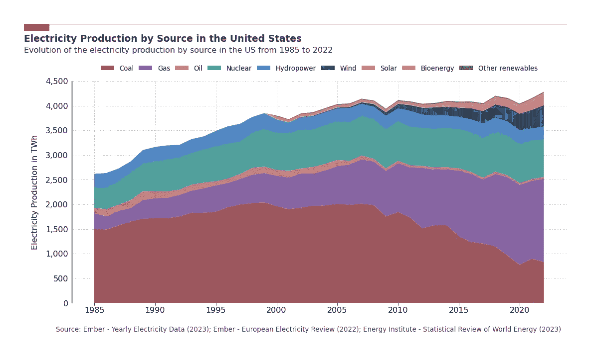

# 用 Python 构建美丽堆叠面积图的 5 个步骤

> 原文：[`towardsdatascience.com/5-steps-to-build-beautiful-stacked-area-charts-with-python-601041964328?source=collection_archive---------6-----------------------#2024-01-13`](https://towardsdatascience.com/5-steps-to-build-beautiful-stacked-area-charts-with-python-601041964328?source=collection_archive---------6-----------------------#2024-01-13)

## 如何充分利用 Matplotlib 的全部功能讲述一个更具吸引力的故事

 [Guillaume Weingertner](https://guillaume-weingertner.medium.com/?source=post_page---byline--601041964328--------------------------------)

·发表于 [Towards Data Science](https://towardsdatascience.com/?source=post_page---byline--601041964328--------------------------------) ·阅读时间 7 分钟·2024 年 1 月 13 日

--

美国按来源分类的电力生产 — 图片由作者提供

# 动机

当支撑故事的图表**清晰**、**自解释**且**视觉上令人愉悦**时，用数据讲述一个引人入胜的故事就变得容易得多。

在很多情况下，内容和形式同样重要。

数据呈现不佳的优秀数据无法引起应有的注意，而呈现精美的糟糕数据则容易被质疑。

希望这对许多数据分析师或任何曾经在众人面前展示过图表的人有所共鸣。

Matplotlib 提供了现成的函数来快速绘制数据，但精细调整却需要更多的努力。

我花费了相当多的时间研究使用 Matplotlib 构建吸引人的图表的最佳实践，目的是为你省去这些努力。

在这篇文章中，我聚焦于**堆叠面积图**，并解释了我如何将零散的知识拼接在一起，从而得出这个结果……
