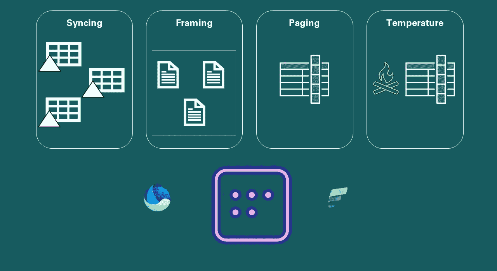

# 直接湖的 50 种面貌——关于新 Power BI 存储模式你需要知道的一切

> 原文：[`towardsdatascience.com/50-shades-of-direct-lake-everything-you-need-to-know-about-the-new-power-bi-storage-mode-00236c137733?source=collection_archive---------12-----------------------#2024-08-20`](https://towardsdatascience.com/50-shades-of-direct-lake-everything-you-need-to-know-about-the-new-power-bi-storage-mode-00236c137733?source=collection_archive---------12-----------------------#2024-08-20)

## 使用直接湖模式需要掌握许多新的概念！本文涵盖了你应该知道的所有基本内容

 [Nikola Ilic](https://datamozart.medium.com/?source=post_page---byline--00236c137733--------------------------------)

·发表于[Towards Data Science](https://towardsdatascience.com/?source=post_page---byline--00236c137733--------------------------------) ·15 分钟阅读·2024 年 8 月 20 日

--

图片由作者提供

**免责声明：** 本文的目的是 **NOT** 提供“哪种模式更好——导入模式还是直接湖模式”的答案，因为这个问题无法回答，因为没有一种“万能”的解决方案…虽然导入模式（Import）在大多数情况下仍然是默认选择，但在某些场景中，您可能会选择直接湖模式（Direct Lake）。本文的主要目标是提供关于直接湖模式如何在幕后工作，并进一步解释各种直接湖的概念。

如果你想了解更多关于导入（Import）模式与直接湖（Direct Lake）模式的比较，以及何时选择其中一个，我强烈建议你阅读[Marco Russo 在 SQLBI 上的文章](https://www.sqlbi.com/blog/marco/2024/04/06/direct-lake-vs-import-mode-in-power-bi/)。

现在，我们可以开始了 :)…

我不知道你是否有同样的感受，但当我看电影时，看到一些令人叹为观止的场景时，我总是在想——他们是怎么做到的？！他们用了什么样的技巧让它看起来如此神奇？
