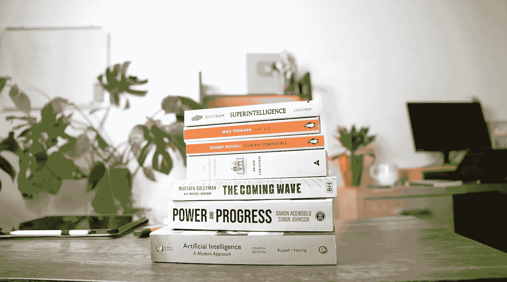
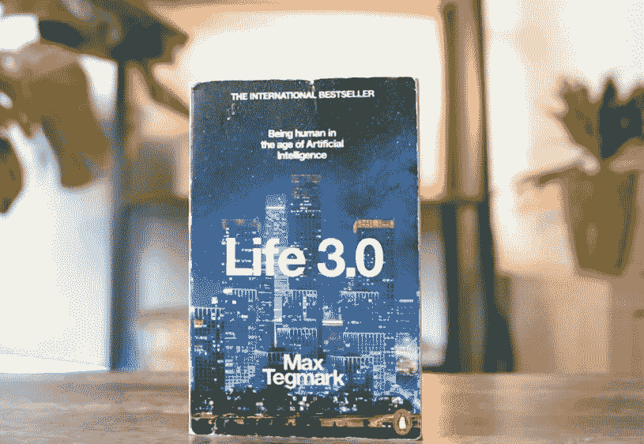

# 7 本关于人工智能的书籍

> 原文：[`towardsdatascience.com/7-books-to-read-on-artificial-intelligence-170dce433f70?source=collection_archive---------5-----------------------#2024-02-27`](https://towardsdatascience.com/7-books-to-read-on-artificial-intelligence-170dce433f70?source=collection_archive---------5-----------------------#2024-02-27)

## **2024 年被认为是“人工智能之年”，我们将看到比 2023 年更多的突破。**

 [Thu Vu](https://medium.com/@vuthihienthu.ueb?source=post_page---byline--170dce433f70--------------------------------)

·发布于 [Towards Data Science](https://towardsdatascience.com/?source=post_page---byline--170dce433f70--------------------------------) ·15 分钟阅读·2024 年 2 月 27 日

--

作者提供的图片。

在这篇文章中，我将分享一些我最近阅读的关于人工智能的最有趣的书籍，以及我的一些个人想法：

1.  [生命 3.0](https://amzn.to/3MVo8SH)

1.  [超级智能](https://amzn.to/3MRKSTs)

1.  [即将来临的浪潮](https://amzn.to/3MT8Ldv)

1.  [权力与进步](https://amzn.to/49tDiY7)

1.  [人类兼容](https://amzn.to/3sQpZBk)

1.  [对齐问题](https://amzn.to/3SO1uPO)

1.  [人工智能：现代方法](https://amzn.to/3G50wHs)

👉 ***注意：你也可以在我的 Youtube 频道上观看这篇博客文章的视频版本：***

不再赘述，让我们直接进入正题！

# 生命 3.0

作者提供的图片。
