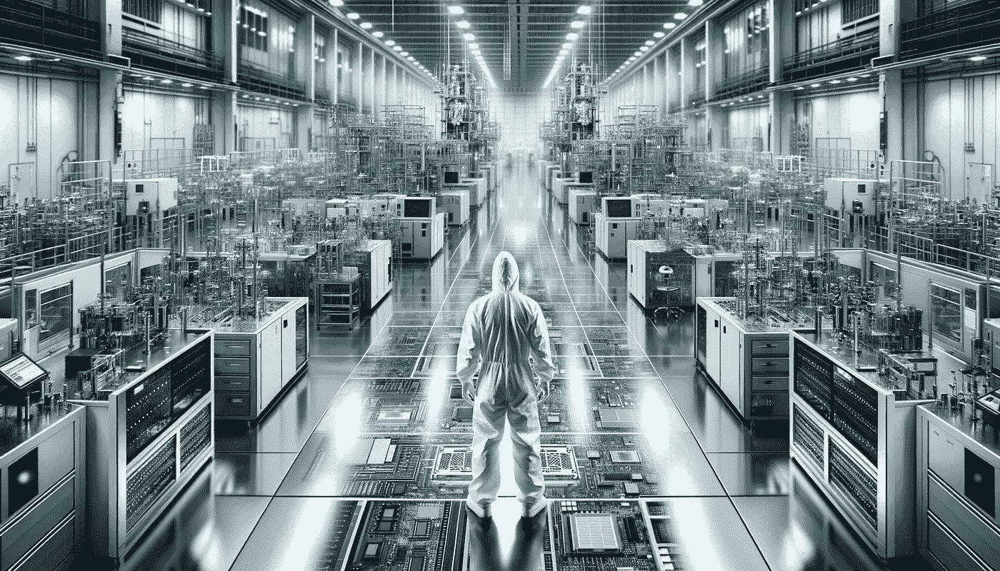

# 来自英特尔机器学习实习的 7 个经验

> 原文：[`towardsdatascience.com/7-lessons-from-an-ml-internship-at-intel-ccb3a116f6eb?source=collection_archive---------4-----------------------#2024-02-12`](https://towardsdatascience.com/7-lessons-from-an-ml-internship-at-intel-ccb3a116f6eb?source=collection_archive---------4-----------------------#2024-02-12)

## 自动化、机器学习和 LLMs 在芯片行业中的应用

 [Conor O'Sullivan](https://conorosullyds.medium.com/?source=post_page---byline--ccb3a116f6eb--------------------------------)

·发布于[Towards Data Science](https://towardsdatascience.com/?source=post_page---byline--ccb3a116f6eb--------------------------------) ·7 分钟阅读·2024 年 2 月 12 日

--

(来源：chatGPT)

我感觉自己就像是《怪兽公司》里的那些人。你知道的，穿着大黄色防化服的那些人。必要的预防措施！我进入了世界上最复杂的制造环境之一。这个环境需要极高的精确度，甚至你呼吸时微小的颗粒也能干扰它。

在英特尔的六个月实习期间，我学到了很多关于半导体行业的知识。它正经历着动荡的时期，英特尔是如何应对的，以及这为什么意味着机器学习将变得更加重要。我看到从传统的计算机视觉算法到大型语言模型（LLM）如何帮助生产世界上最有价值的商品——芯片。

我想和你分享这个经历。

## 1）“英特尔就像是一家面包店”

就是我的经理尝试总结的一个过程，我永远无法完全理解。他们：

+   创建配方 → 设计芯片

+   烤面包 → 制造芯片

但他们并不制造做这些事情的机器。

我近距离看到了一些这些。最让我印象深刻的是[ASML](https://www.youtube.com/watch?v=wI6nCmG-PpI)制造的光刻机。它们利用光波将几原子宽的图案刻入硅片中……
