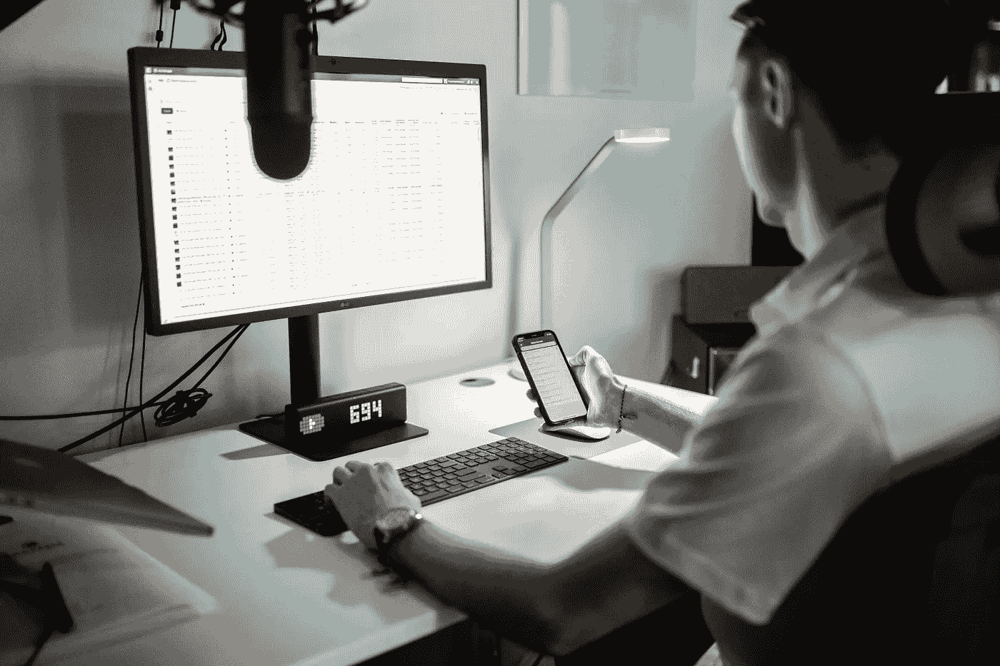

# 7 个帮助我作为数据科学家的订阅服务

> 原文：[`towardsdatascience.com/7-subscriptions-that-help-me-as-a-data-scientist-995bf36766c8?source=collection_archive---------1-----------------------#2024-04-19`](https://towardsdatascience.com/7-subscriptions-that-help-me-as-a-data-scientist-995bf36766c8?source=collection_archive---------1-----------------------#2024-04-19)

## 提升我作为一名在职数据科学家的生产力、知识和专注力的订阅服务

 [Egor Howell](https://medium.com/@egorhowell?source=post_page---byline--995bf36766c8--------------------------------)

·发表于[Towards Data Science](https://towardsdatascience.com/?source=post_page---byline--995bf36766c8--------------------------------) ·阅读时长 8 分钟·2024 年 4 月 19 日

--

由[Chase Chappell](https://unsplash.com/@chappelldigitalmarketing?utm_source=medium&utm_medium=referral)拍摄，图片来自[Unsplash](https://unsplash.com/?utm_source=medium&utm_medium=referral)

在本文中，我将探讨七个关键的订阅服务，这些服务帮助我在作为一名在职数据科学家的工作中提升生产力、专注力和学习效率。从能够回答我问题的人工智能，到帮助我集中注意力的简短音乐节奏，希望这些工具能对你有所帮助。

> 不用说，这篇文章中的内容不构成财务建议，而且我并没有得到任何列出产品或服务的赞助。

# ChatGPT

这不足为奇，但我推荐给数据科学家的头号订阅服务是 ChatGPT。

 [## ChatGPT

### 立即获取答案，寻找创意灵感，学习新知识。

[openai.com](https://openai.com/chatgpt?source=post_page-----995bf36766c8--------------------------------)

尽管有免费版本，但每月多花 20 美元完全值得。你将获得……
