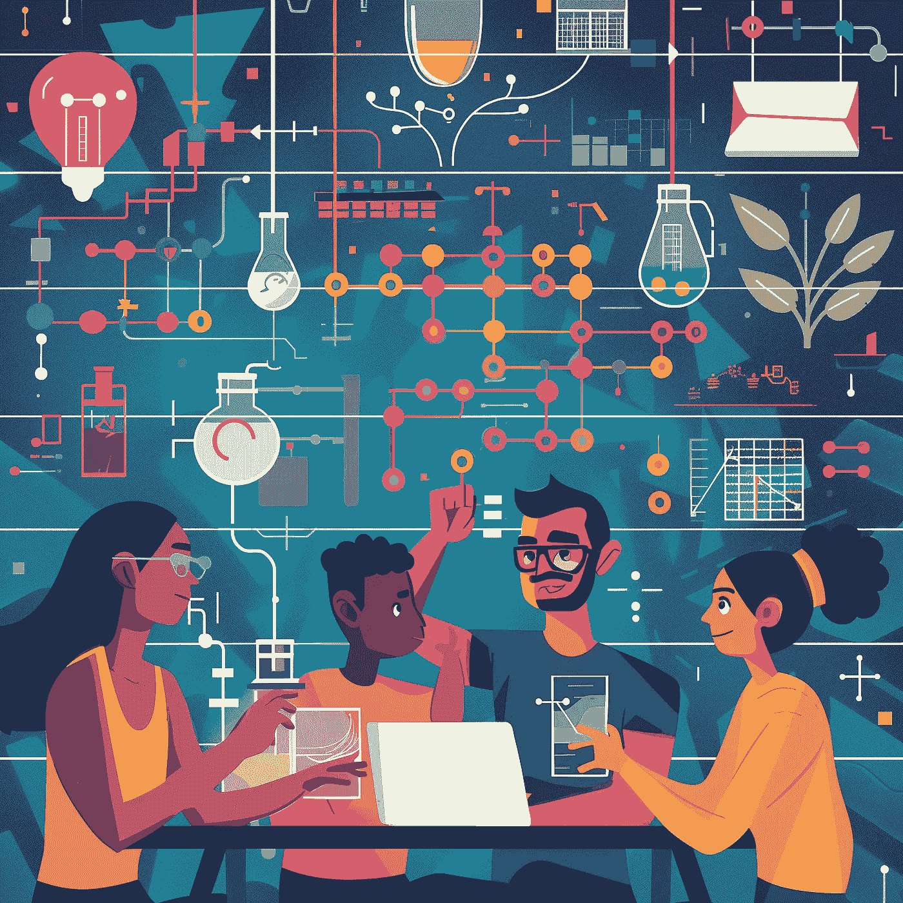

# 大多数数据科学课程未教的 8 件事（但你应该知道）——第二部分

> 原文：[`towardsdatascience.com/8-things-most-data-science-programs-dont-teach-but-you-should-know-part-2-e1f6f706caab?source=collection_archive---------1-----------------------#2024-03-28`](https://towardsdatascience.com/8-things-most-data-science-programs-dont-teach-but-you-should-know-part-2-e1f6f706caab?source=collection_archive---------1-----------------------#2024-03-28)

## [数据科学 101](https://towardsdatascience.com/tagged/ds101)

## 麻省理工学院称之为“计算机科学教育中缺失的学期”

 [Dasha Herrmannova, Ph.D.](https://robodasha.medium.com/?source=post_page---byline--e1f6f706caab--------------------------------)

·发布于 [Towards Data Science](https://towardsdatascience.com/?source=post_page---byline--e1f6f706caab--------------------------------) ·阅读时间：10 分钟·2024 年 3 月 28 日

--

使用 Midjourney 创建。

数据科学和软件工程的共同点是写代码。但虽然代码是软件工程的主要成果，数据科学项目通常以模型、结果和报告结束。因此，在数据科学中，代码的质量、结构和交付通常充其量是事后的考虑。

数据科学项目的隐性期望是最终报告的结果是值得信赖的。

这意味着如果有人要求你重新运行你或他人的分析，你能够获得相同的结果，*无论自你第一次执行分析以来已经过去了多少时间*。

类似地，如果你正在为一个产品开发组件，隐含的期望是你开发的组件代表了在产品要求范围内尽可能最好的性能。

这些说法看起来可能显而易见，但满足这两种期望其实是相当困难的。

如果你不信，想想你过去的项目吧。
