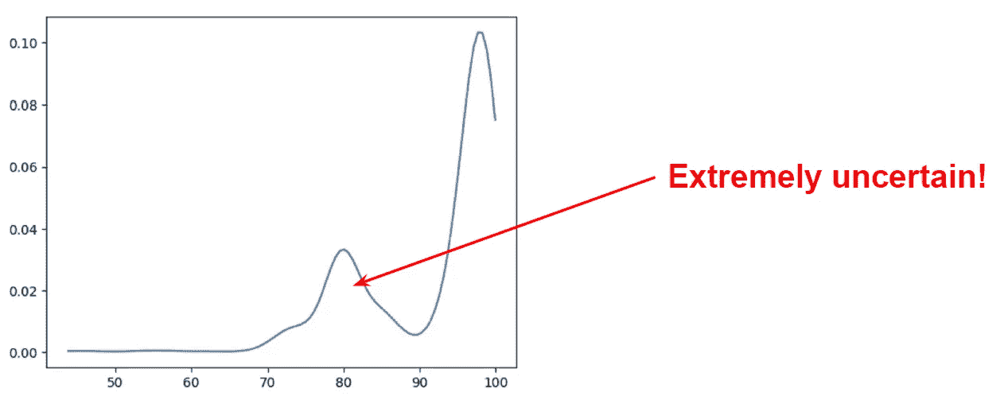
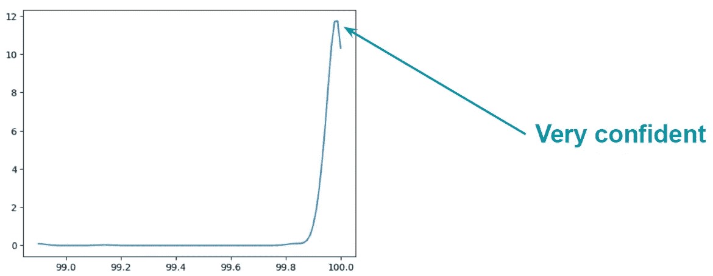
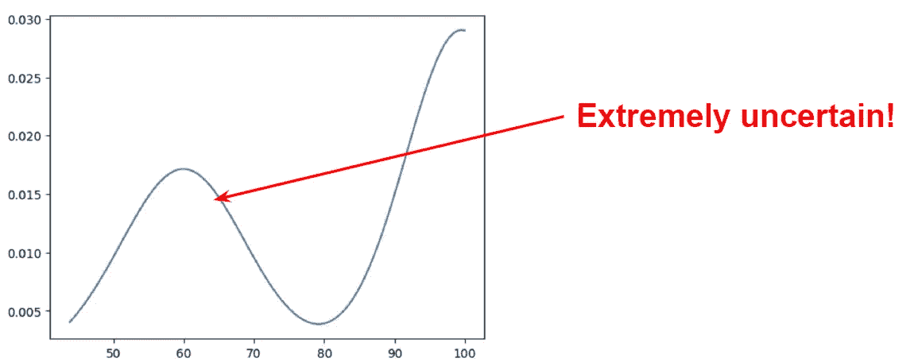
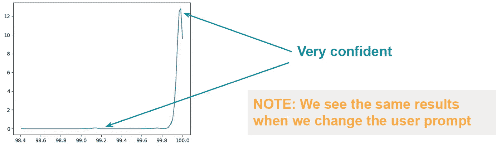

# 9.11 还是 9.9——哪个更大？

> 原文：[`towardsdatascience.com/9-11-or-9-9-which-one-is-higher-6efbdbd6a025?source=collection_archive---------7-----------------------#2024-07-25`](https://towardsdatascience.com/9-11-or-9-9-which-one-is-higher-6efbdbd6a025?source=collection_archive---------7-----------------------#2024-07-25)

## 评估 LLM 提示中的不确定性和脆弱性

 [Armin Catovic](https://medium.com/@armin.catovic?source=post_page---byline--6efbdbd6a025--------------------------------)

·发表于[Towards Data Science](https://towardsdatascience.com/?source=post_page---byline--6efbdbd6a025--------------------------------) ·阅读时间 5 分钟·2024 年 7 月 25 日

--

这个 ChatGPT 提示及其对应的（错误的）回答最近在 LinkedIn 上被分享和转发了无数次。它们被作为证明 AGI 还远未实现的有力证据。进一步的转发还指出，将提示改为：*“哪个更大：9.11 还是 9.9？”* 可以保证得到正确答案，并进一步强调了 LLM 的脆弱性。

在对一组随机的 ChatGPT 用户进行评估后，我们发现，在两种情况中，答案**大约 50%的时间是错误的**。正如一些用户正确指出的那样，这个问题存在微妙的歧义，即我们是指两个实数的数学不等式，还是指两个日期（例如 9 月 11 日与 9 月 9 日），或者是指文档中的两个子部分（例如第 9.11 章或第 9.9 章）？

我们决定通过使用 OpenAI API 进行更受控的实验。通过这种方式，我们可以完全控制系统提示和用户提示；我们还可以通过设置低温度等方式尽可能地去除采样不确定性。

**最终结果非常有趣！**

# 假设和实验设计

我们的假设可以如下表述：

+   在相同的提示下，如果没有额外的上下文，并且将温度保持接近零，我们应该几乎总是得到相同的输出，且日志概率稳定。虽然人们常将 LLM 称为“随机的”，但对于给定的输入，LLM 应该总是生成相同的输出；所谓的“幻觉”或变异来自 LLM 之外的采样机制，这一点我们可以通过设置非常低的温度值来显著减弱。

+   基于我们与 ChatGPT 进行的随机用户测试，我们预期原始提示和重新措辞后的版本在 50% 的情况下给出错误答案——换句话说，若没有进一步的澄清或上下文，我们不认为某一个提示会比另一个表现得更好。

对于我们的实验设计，我们执行以下步骤：

+   我们进行了一系列实验，从原始提示开始，随后进行一系列的“干预”

+   对于每次实验/干预，我们执行 1 000 次试验

+   我们使用 OpenAI 最先进的 GPT-4o 模型

+   我们将温度设置为 0.1，以基本消除由采样引起的随机性；我们实验了随机种子和固定种子两种情况

+   为了评估答案的“信心”，我们收集了日志概率并计算每次试验中答案的线性概率；我们绘制了每次实验中 1000 次试验的线性概率的核密度估计（KDE）图

我们的实验设计的完整代码可以在[这里](https://github.com/acatovic/llm-prompt-uncertainty-test)找到。

# 实验 (A) — 原始提示

用户提示设置为*“9.11 还是 9.9 — 哪个更大？”*。

与社交媒体用户的反馈一致，**GPT-4o 正确回答的概率为 55%** ☹️。该模型的“信心”也并不高——在大量试验中，**它对答案的“信心”约为 80%**。

图 1 — 在 1000 次试验中，当使用原始用户提示时，信心值（0-100%）的平滑直方图（KDE）；图片由作者提供

# 实验 (B) — 重新措辞的用户提示

在重新措辞的用户提示中，未提供额外的上下文/澄清，但措辞略作更改为：*“哪个更大，9.11 还是 9.9？”*

令人惊讶的是，与我们的 ChatGPT 用户测试相反，**在 1000 次试验中正确答案的达成率为 100%**。此外，模型对其答案表现出**非常高的信心**🤔。

图 2 — 在 1000 次试验中，当原始用户提示被稍微重新措辞时，信心值（0-100%）的平滑直方图（KDE）；图片由作者提供

# 实验 (C) — 带推理的原始用户提示

最近在努力提高大语言模型“推理”能力方面做了大量工作，其中链式推理（CoT）提示法是最受欢迎的。[黄等](https://arxiv.org/pdf/2212.10403)发布了关于 LLM 推理能力的非常全面的调查。

因此，我们修改了原始用户提示，要求大语言模型同时解释其推理。有趣的是，**正确答案的概率提高到了 62%**，然而答案伴随的是**更大的不确定性**。

图 3 — 在 1000 次试验中，当原始用户提示被修改为同时“解释其推理”时，信心值（0-100%）的平滑直方图（KDE）；图片由作者提供

# 实验（D）— 原始用户提示与系统提示中的推理

最后的实验与实验“C”相同，但我们改为通过告诉 LLM“解释其推理过程”来引导**系统提示**。令人难以置信的是，我们现在看到**100%正确的答案**，并且**信心极高**。如果我们使用重新表述的用户提示，结果也完全相同。

图 4 — 信心值（0-100%）在 1000 次试验中的平滑直方图（KDE），使用原始用户提示，并且系统提示已修改，增加了“解释其推理过程”的指示；图像由作者提供

# 结论与总结

最初是一个简单的实验，旨在验证社交媒体上看到的一些说法，结果却得出了一些非常有趣的发现。让我们总结一下关键结论：

+   **对于相同的提示，当温度设置非常低（基本消除采样不确定性）并且种子值固定时，我们看到对数概率的方差非常大**。轻微的方差可以通过硬件精度来解释，但如此大的方差很难解释。这表明，可能有两种情况：（1）采样机制复杂得多，或者（2）在我们控制范围之外，还有更多的层级/模型在上游。

+   与之前的文献一致，**仅仅指示 LLM“解释其推理过程”就能提高其表现**。

+   **系统提示与用户提示之间显然有明显的差异处理**。在系统提示中引导角色，而非在用户提示中引导，似乎会显著提高性能。

+   我们可以清楚地看到提示是多么脆弱。这里的关键结论是，我们应该始终努力在提示中提供消歧义和明确的上下文。

***免责声明：*** *由于社交媒体上的广泛讨论，OpenAI 的工作人员可能已经改进了上述行为，因此结果可能无法直接重现。但关键的结论仍然有效！*
