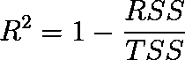
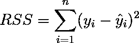
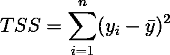
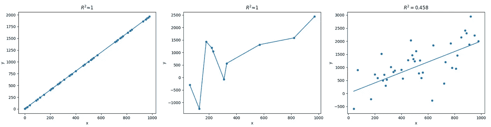
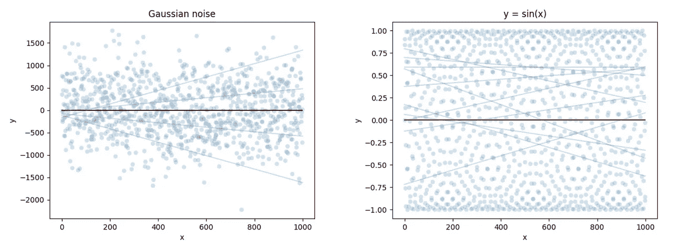
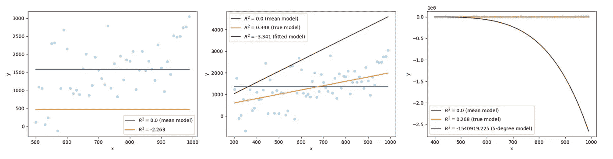
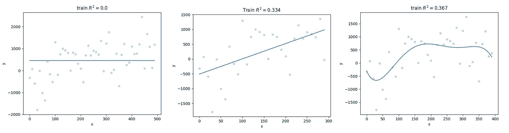

# 解读 R²：迷惑者的叙述指南

> 原文：[`towardsdatascience.com/interpreting-r%C2%B2-a-narrative-guide-for-the-perplexed-086a9a69c1ec?source=collection_archive---------3-----------------------#2024-02-19`](https://towardsdatascience.com/interpreting-r%C2%B2-a-narrative-guide-for-the-perplexed-086a9a69c1ec?source=collection_archive---------3-----------------------#2024-02-19)

## 从预测性建模的角度出发，对这一流行但常被误解的指标的基本性质进行易于理解的讲解

[](https://medium.com/@rbrrcc?source=post_page---byline--086a9a69c1ec--------------------------------)[](https://towardsdatascience.com/?source=post_page---byline--086a9a69c1ec--------------------------------) [Roberta Rocca](https://medium.com/@rbrrcc?source=post_page---byline--086a9a69c1ec--------------------------------)

·发布于[Towards Data Science](https://towardsdatascience.com/?source=post_page---byline--086a9a69c1ec--------------------------------) ·阅读时长：15 分钟·2024 年 2 月 19 日

--


图片由[Josh Rakower](https://unsplash.com/@joshrako?utm_source=medium&utm_medium=referral)提供，来源于[Unsplash](https://unsplash.com/?utm_source=medium&utm_medium=referral)

R²（R 平方），也称为*决定系数*，广泛用于作为回归模型性能的评估指标。它通常用于量化统计建模中的*拟合优度*，并且是回归模型在流行的统计建模和机器学习框架中的默认评分指标，从*statsmodels*到*scikit-learn*。

尽管 R² 无处不在，但关于它究竟意味着什么，仍然存在相当多的混淆，遇到相互矛盾的信息并不罕见（例如，关于该指标的上限或下限，以及它的解释）。这种混淆的根源在于解释性建模和预测性建模传统之间的“文化冲突”。实际上，在预测性建模中——即评估是在样本外进行的，任何能提高性能的建模方法都是可取的——许多 R² 的性质，在狭义的解释导向的线性建模上下文中适用，但在此情境下已不再成立。

为了帮助理解这一混乱的情况，本文提供了一份易于理解的 R² 基本属性介绍，从预测建模的角度出发，重点揭示并澄清了关于这个指标的常见困惑和误解。通过这篇文章，我希望能帮助读者形成关于 R² 作为预测建模和机器学习中拟合度衡量指标的统一直觉，并强调该指标的一些优缺点。本文面向广泛的读者群体，包括统计学入门学生和预测建模专家，我将保持语言简单，并通过具体的可视化图示来支撑我的论点。

准备好了吗？我们开始吧！

## 什么是 R²？

让我们从一个简单的口头定义开始。为了简化问题，我们采用 [Wikipedia](https://en.wikipedia.org/wiki/Coefficient_of_determination) 给出的第一个高层次定义，它很好地反映了许多统计学教学资源中所找到的定义，包括权威的教科书：

> 从自变量预测因变量变化的比例

据经验，如果你问大多数受过统计推断训练的学生如何定义 R²，他们可能会这么回答。但正如我们接下来会看到的，这种常见的定义方式是导致许多与 R² 相关的误解和困惑的根源。让我们深入探讨一下。

叫 R² 为*比例*意味着 R² 将是一个介于 0 和 1 之间的数字，其中 1 对应于一个解释了*因变量所有变化*的模型，而 0 对应于一个解释了*因变量没有变化*的模型。注意：你的模型也可能不包含任何预测变量（例如，仅包含截距的模型仍然是一个模型），这就是为什么我将重点放在模型所预测的变化上，而不是独立变量所预测的变化上。

让我们验证一下关于可能值范围的直觉是否正确。为此，让我们回顾一下 R² 的数学定义：



在这里，RSS 是残差平方和，其定义为：



这只是**模型的平方误差和**，即真实值 *y* 和相应模型预测值 *ŷ* 之间平方差的总和。

另一方面，TSS，即总平方和，定义如下：



正如你可能注意到的，这个项与残差平方和的“形式”类似，但这次我们关注的是结果变量*y*与结果变量的均值ȳ之间的平方差。这在技术上是结果变量的*方差*。但是，在预测建模的背景下，更直观的理解方式是：这个项是一个模型的残差平方和，该模型总是预测结果变量的均值。因此，**残差平方和与总平方和的比率是你的模型的平方误差之和与一个“参考”模型预测结果变量均值的平方误差之和之间的比率**。

有了这个思考，我们继续分析这个指标的可能值范围，并验证我们的直觉，认为这些值应该确实在 0 到 1 之间。

## 最好的 R²值是多少？

如我们所见，R²是通过从 1 中减去 RSS 与 TSS 的比率来计算的。那么，R²能否大于 1？换句话说，1 是否是 R²的最大可能值？让我们通过回顾公式来思考这个问题。

唯一一种情况下，1 减去*某个值*能大于 1，那就是这个*某个值*是一个*负数*。但是在这里，RSS 和 TSS 都是平方和，即正值的和。因此，RSS 和 TSS 的比率*总是*正数。因此，最大可能的 R²必须是 1。

现在我们已经确定了 R²不能大于 1，让我们试着可视化一下，模型需要怎样才能达到最大可能的 R²。为了使 R²为 1，RSS / TSS 必须为零。这可能发生在 RSS = 0 时，也就是说，如果模型*完美地*预测了所有数据点。



通过模拟数据，举例说明了 R² ≈ 1 的假设模型。在所有案例中，真实的底层模型是 y = 2x + 3。前两个模型完美拟合数据，第一种情况是因为数据没有噪声，线性模型能够完美地恢复 x 与 y 之间的关系（左），第二种情况是因为模型非常*灵活且过拟合数据*（中）。这些是极端的案例，在现实中很难找到。事实上，最大可能的*R²通常由数据中的噪声量来定义*。第三个图展示了这一点，由于存在随机噪声，即使是真实模型也只能达到*R² = 0.458*。

实际上，除非你*极度*过拟合你的数据，使用过于复杂的模型，或者你正在对一个数据点极少的、你的模型能够完美拟合的数据集计算 R²，否则这种情况永远不会发生。所有数据集都会有*一些*无法通过数据解释的噪声。在实际应用中，最大可能的 R²将由结果变量中无法解释的噪声量来定义。

## 最差的 R²值是多少？

到目前为止，一切都很好。如果 R²的最大可能值为 1，我们仍然可以将 R²视为模型解释的结果变量变异的比例。但现在让我们来看看 R²的最小可能值。如果我们接受上面我们提出的 R²定义，那么我们必须假设 R²的最小可能值是 0。

R²何时为 0？要使 R²为零，RSS/TSS 必须等于 1。这种情况发生在 RSS = TSS 时，也就是说，如果我们模型的平方误差之和等于预测均值模型的平方误差之和。如果你仅仅预测均值会更好，那么你的模型确实没有做得非常好。造成这种情况的原因有无数种，其中之一可能是你选择的模型存在问题——例如，如果你试图用线性模型拟合真正的非线性数据。或者这可能是数据本身的结果。如果你的结果变量非常嘈杂，那么预测均值的模型可能是你能做的最好的模型。



两种情况，其中均值模型可能是最佳的*（线性）*模型，因为：a) 数据是纯高斯噪声（左）；b) 数据是高度非线性的，因为它是*由周期函数生成的（右）。*

但是，R² = 0 真的是可能的最小 R²吗？换句话说，R²是否有可能为负值？让我们回过头来看一下公式。R² < 0 只有在 RSS/TSS > 1 时才有可能，即，如果 RSS > TSS。这种情况可能发生吗？

这时事情开始变得有趣，因为这个问题的答案在很大程度上取决于我们尚未指定的背景信息，即我们正在考虑哪种类型的模型，以及我们在哪些数据上计算 R²。正如我们将看到的，我们对 R²作为方差解释比例的理解是否成立，取决于我们对这些问题的回答。

## 负 R²的无底洞

让我们看一个具体的例子。我们使用以下模型*y = 3 + 2x*生成一些数据，并添加了高斯噪声。

```py
import numpy as np

x = np.arange(0, 1000, 10)
y = [3 + 2*i for i in x] 
noise = np.random.normal(loc=0, scale=600, size=x.shape[0])
true_y = noise + y
```

下面的图显示了三个模型，这些模型基于不同随机抽样的数据子集，预测*y*的值。这些模型不是虚构的模型，正如我们稍后将看到的那样，但现在让我们忽略这一点。我们仅仅关注它们的 R²的符号。



使用函数 y = 3 + 2x（并加入高斯噪声）生成的数据的三个模型示例。

让我们从第一个模型开始，这是一个简单的常数预测模型，在这个例子中该常数低于结果变量的均值。在这里，我们的 RSS 将是每个数据点与橙色线之间的平方距离之和，而 TSS 将是每个数据点与蓝色线（均值模型）之间的平方距离之和。很容易看出，对于大多数数据点，数据点与橙色线之间的距离将大于数据点与蓝色线之间的距离。因此，我们的 RSS 将大于我们的 TSS。如果是这种情况，我们将得到 RSS/TSS > 1，因此：1 — RSS/TSS < 0，也就是说，R² < 0。

事实上，如果我们计算这个模型在此数据上的 R²，我们得到 R² = -2.263。如果你想验证它是否真实，你可以运行下面的代码（由于随机性，你可能会得到一个类似的负值，但不会完全相同）：

```py
from sklearn.metrics import r2_score

# get a subset of the data
x_tr, x_ts, y_tr, y_ts = train_test_split(x, true_y, train_size=.5)
# compute the mean of one of the subsets 
model = np.mean(y_tr)
# evaluate on the subset of data that is plotted
print(r2_score(y_ts, [model]*y_ts.shape[0]))
```

现在让我们继续讨论第二个模型。在这里，同样容易看出数据点与红线（我们的目标模型）之间的距离将大于数据点与蓝线（均值模型）之间的距离。事实上，在这里：R² = -3.341。注意，我们的目标模型与*真实*模型（橙色线）不同，因为我们在包括噪音的子集数据上进行了拟合。我们将在下一段中进一步讨论这一点。

最后，让我们看看最后一个模型。在这里，我们对上述生成的数据子集拟合了一个 5 次多项式模型。此时，数据点与拟合函数之间的距离比数据点与均值模型之间的距离*显著*更大。事实上，我们拟合的模型得出 R² = -1540919.225。

显然，正如这个例子所展示的，模型*确实*可以有负的 R²。事实上，R²的值没有下限。将模型做得足够糟糕，R²可以接近负无穷大。这在简单线性模型中也可能发生：进一步增加第二个例子中线性模型斜率的值，R²将继续下降。那么，这对于我们最初的问题——即 R²是否真的表示模型能够解释的结果变量方差的比例——意味着什么呢？

好吧，我们通常不会将比例看作是任意大的负值。如果我们真的对原始定义有所依赖，我们可以通过富有创意的想象力将这个定义扩展到涵盖那些模型表现极差、能*增加*结果变量方差的情境。模型*增加*的方差反比（例如，作为糟糕模型选择或过拟合不同数据的结果）在极低负值中有所体现。

但这更多的是一种比喻，而非定义。抛开文学思维不谈，最字面且最具生产力的思考方式是将 R² 视为一种比较度量，它说明了你的模型在预测数据时有多好（从 0 到 1 的范围内）或多差（从 0 到无穷大），*相较于一个总是预测结果变量均值的模型*。

重要的是，这表明，虽然 R² 可能是一个诱人的方式来以独立于尺度的方式评估模型，并且作为比较度量使用它可能是有意义的，但它远不是一个透明的度量标准。R² 的值不会提供关于你的模型在绝对意义上有多错的明确指示；最佳值始终会依赖于数据中噪声的大小；而良好或差的 R² 可能来自多种原因，而没有额外的度量工具，很难分辨清楚。

## 好的，R² 可以是负数。但在实践中，这种情况会发生吗？

一个非常合理的反对意见是，上述展示的场景是否实际可行。我是说，哪个理智的建模者会对如此简单的数据拟合出这样*差劲*的模型呢？这些看起来可能只是为了这个例子而人为构建的*特设*模型，并没有真正拟合任何数据。

这是一个非常好的观点，它引出了另一个与 R² 及其解释相关的关键问题。正如我们上面所强调的，所有这些模型*实际上*都是拟合于从与图中数据相同的真实基础函数生成的数据。这对应了预测建模中一个基础性的做法，即将数据分为*训练集*和*测试集*，前者用于估计模型，后者用于在未见数据上进行评估——这是评估模型在预测任务中表现的一个“更公正”的代理。

事实上，如果我们将前一节中介绍的模型与用于估计它们的数据进行对比，会发现它们对于其训练数据来说并不是*不合理*的模型。事实上，训练集的 R² 值至少是非负的（在线性模型的情况下，其 R² 值非常接近真实模型在测试数据上的 R²）。



与前图中展示的相同函数，这次是将其与拟合数据进行对比，这些数据是通过相同的真实函数 y = 3 + 2x 生成的。对于第一个模型，它预测的是一个常数，模型的“拟合”仅仅是计算训练集的均值。

那么，为什么之前的数据和现在的数据差距如此之大呢？我们观察到的是*过拟合*的情况。模型错误地将训练数据中的样本特有噪声当作信号进行建模——这并不是一个罕见的场景。因此，模型在新数据样本上的预测会很差。

避免过拟合可能是预测建模中最大的挑战。因此，当（为了确保模型具有泛化能力和鲁棒性，我们应该始终这样做）R²值是*在样本外*计算时，也就是说，在与模型估计时的数据“随机”不同的数据上计算时，观察到负的 R²值并不罕见。

因此，本节标题中提出的问题的答案实际上是一个响亮的*肯定*回答：负的 R²确实会出现在常见的建模场景中，即使模型已正确估计。事实上，它们一直都会发生。

## 那么，大家都是错的吗？

如果 R²*不是*一个比例，并且它作为解释方差的解释与关于其行为的一些基本事实冲突，那么我们是否必须得出结论，认为我们最初的定义是错误的？维基百科和那些教科书中呈现的相似定义是否错误？我的统计学 101 老师是否错了？好吧。是的，也不是。它很大程度上取决于 R²所呈现的上下文，以及我们所采纳的建模传统。

如果我们仅仅分析 R²的定义并尝试描述其一般行为，*无论*我们使用哪种类型的模型进行预测，并假设我们希望计算这个指标时是在样本外，那么是的，它们都是错的。将 R²解释为方差解释的比例是误导性的，它与这个指标的基本行为事实相冲突。

然而，如果我们将自己限制在一个狭窄的场景中，即*线性模型*，特别是使用最小二乘法估计的线性模型，那么答案会略有变化。在这里，R²*会*表现为一个比例。实际上，可以证明，由于最小二乘估计的性质，线性模型*永远*不可能比预测结果变量均值的模型表现更差。这意味着，线性模型永远不会有负的 R²——或者至少，它不会在与其估计时相同的数据上有负的 R²（如果你对泛化模型感兴趣的话，这是一种值得争议的做法）。因此，对于*线性回归*情境下的样本内评估，所讨论的定义可以视为正确的。额外有趣的事实：这是 R²等同于模型预测与真实结果之间的平方相关性的唯一场景。

许多关于 R²的误解产生的原因是，这个指标通常首先在线性回归的背景下引入，并且侧重于*推断*而非预测。但在预测建模中，在这里*在样本内*评估是不可行的，线性模型只是许多可能模型中的一种，将 R²解释为模型所解释的变异的比例，充其量是无益的，最坏的情况下是极具误导性的。

## 我还应该使用 R²吗？

我们已经涉及了不少内容，那么让我们总结一下。我们观察到：

+   R²不能被解释为一个比例，因为它的值可以从-∞到 1。

+   其作为“解释方差”进行的解释也是误导性的（你可以想象出那些*增加*数据方差的模型，或者那些将已有方差与模型“幻想”出的方差结合的模型）。

+   一般来说，R²是一个“相对”指标，它将你的模型误差与一个总是预测均值的简单模型的误差进行比较。

+   然而，将 R²描述为*在线性建模和最小二乘估计的背景下*以及*当计算最小二乘线性模型的 R²时，使用样本内数据*是准确的。

考虑到所有这些注意事项，我们是否仍然应该使用 R²？还是应该放弃它？

在这里，我们进入了更多主观观察的领域。一般来说，如果你在进行预测建模，并且想要对预测结果在绝对意义上的*错误程度*有一个具体的了解，那么 R²*不是*一个有用的指标。像 MAE 或 RMSE 这样的指标在提供模型误差大小的信息方面肯定会做得更好。这对于绝对意义上的理解是有用的，也适用于模型比较的场景，在这种场景下，你可能想要知道不同模型之间，具体而言，预测精度有多大差异。如果了解某些关于精度的信息很重要（几乎总是重要），你至少可能想要将 R²与能够提供关于每个单独预测可能有多错误的有意义的指标结合使用。

更一般来说，正如我们所强调的，如果你决定使用 R²，有一些注意事项需要牢记。其中一些涉及到 R²的“实际”上限（你的噪声上限），以及它作为*相对*指标的字面解释，而不是与均值模型相比的绝对拟合度。此外，正如我们所观察到的，好的或坏的 R²值可能受到多种因素的影响，从过拟合到数据中的噪声量。

另一方面，虽然我发现很少有预测建模场景中，单独使用 R²特别有用，但拥有相对于“虚拟”模型（均值模型）的拟合度度量，可以是一个富有成效的方式，帮助你批判性地思考你的模型。在训练集上，R²值不现实地高，或者在测试集上 R²值为负，可能分别帮助你考虑到你可能在追求一个过于复杂的模型，或者一个不适当的建模方法（例如，使用线性模型处理非线性数据），或者你的结果变量大部分可能仅包含噪声。这再次是一个更“务实”的个人看法，但虽然我不完全排除 R²（没有很多好的全球性和规模独立的拟合度量），在预测建模的上下文中，我会将它视为对 RMSE/MAE 等规模相关指标的补充，或者作为一种“诊断”工具，而不是作为一个目标。

## 结论性 remarks

R²无处不在。然而，尤其是在偏向解释性建模而非预测性建模传统的领域中，许多人对其作为模型评估工具的解释存在误解，并且这些误解仍然广泛存在。

在这篇文章中，我尝试为读者提供关于 R²的一些基本属性的叙述性介绍，以消除常见的误解，并帮助读者理解 R²通常衡量的内容，超越仅仅是线性模型样本内评估的狭窄范围。

这篇文章远非一个完整和权威的指南，我希望它能成为一个务实且灵活的资源，帮助澄清一些非常合理的困惑。干杯！

*除非标题中另有说明，本文中的图片均由作者提供*
