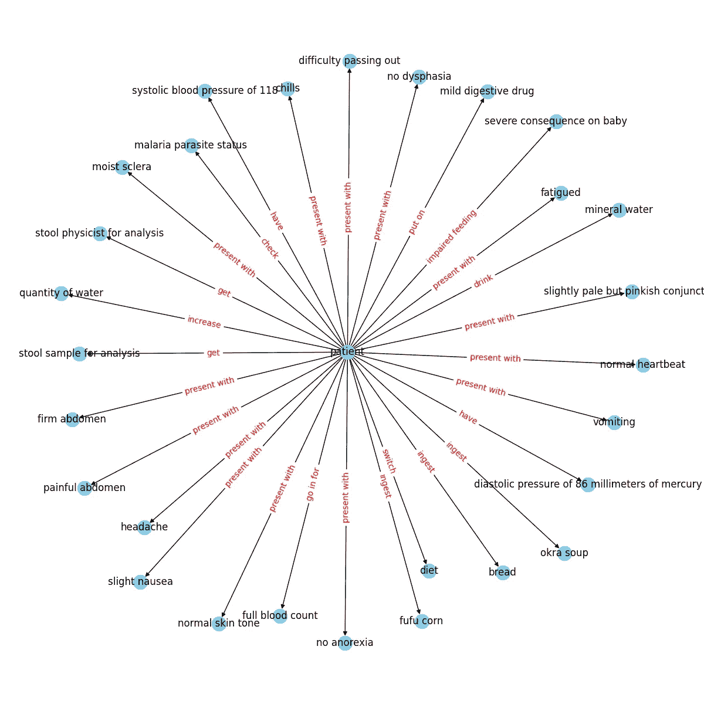

# 从视频构建知识图谱的入门指南

> 原文：[`towardsdatascience.com/a-beginners-guide-to-building-knowledge-graphs-from-videos-6cafcba5f3e5?source=collection_archive---------5-----------------------#2024-01-17`](https://towardsdatascience.com/a-beginners-guide-to-building-knowledge-graphs-from-videos-6cafcba5f3e5?source=collection_archive---------5-----------------------#2024-01-17)

## 构建一个管道来分析并存储视频中的数据。

[](https://mohammed249.medium.com/?source=post_page---byline--6cafcba5f3e5--------------------------------)[](https://towardsdatascience.com/?source=post_page---byline--6cafcba5f3e5--------------------------------) [Mohammed Mohammed](https://mohammed249.medium.com/?source=post_page---byline--6cafcba5f3e5--------------------------------)

·发表于[Towards Data Science](https://towardsdatascience.com/?source=post_page---byline--6cafcba5f3e5--------------------------------) ·阅读时间：10 分钟·2024 年 1 月 17 日

--

在深入讨论本文的技术内容之前，让我们先设定一下背景，回答一个你可能有的问题：什么是知识图谱？

为了回答这个问题，想象一下，不是将知识存储在文件柜中，而是将它们存储在一张织网中。每一个事实、概念、关于人、地点、事件甚至抽象概念的信息都是一个节点，而将它们连接在一起的线条则是它们之间的关系。这张错综复杂的网络，朋友们，就是知识图谱的精髓。


图片由[Shubham Dhage](https://unsplash.com/@theshubhamdhage?utm_source=medium&utm_medium=referral)提供，来自[Unsplash](https://unsplash.com/?utm_source=medium&utm_medium=referral)

可以把它想象成一张繁忙的城市地图，不仅显示街道，还揭示了地标、公园和商店之间的联系。同样，知识图谱不仅仅是存储冷冰冰的事实，它捕捉了事物如何相互联系的丰富画面。例如，你可能知道玛丽·居里发现了镭，然后通过一条线索发现镭被用于医学治疗，进而与医院和癌症研究相关联。你看到了吗？一个事实如何自然而然地引导到另一个事实，勾画出一个更大的图景。 

那么，为什么这种像地图一样存储知识的方式如此流行呢？嗯，想象一下在线搜索信息。传统的方法常常让你得到的是零散的片段，就像你只看到地图上的建筑物，却不知道连接它们的街道。而知识图谱则像是带你进行一场旅行，从一个事实引导到另一个事实，就像有一个友好的向导在信息世界的每个角落悄悄地讲述迷人的故事。很有趣，对吧？我知道。

自从我发现了这个魔法，它就吸引了我的注意力，我探索并玩弄了许多潜在的应用。在这篇文章中，我将向你展示如何构建一个管道，从视频中提取音频，然后将音频转录，再从转录的文本中构建一个知识图谱，从而实现对视频中信息的更加细致和互联的表示。

我将使用 Google Drive 来上传视频样本。我还将使用 Google Colab 编写代码，最后，你需要有 GPT Plus API 的访问权限来进行这个项目。我将把步骤分解清楚，确保对初学者来说易于理解：

+   设置一切。

+   从视频中提取音频。

+   将音频转录为文本。

+   构建知识图谱。

到了本文的最后，你将构建一个如下所示的图谱。



作者提供的图片

让我们直接开始吧！

# **1- 设置一切**

如前所述，我们将使用 Google Drive 和 Colab。在第一个单元格中，让我们将 Google Drive 连接到 Colab，并创建我们的目录文件夹（video_files、audio_files、text_files）。下面的代码可以完成这项工作。(*如果你想跟着代码一起操作，我已经将这个项目的所有代码上传到 GitHub，你可以从* [***这里***](https://github.com/mohammed-249/Data_Science_Projects/tree/main/NLP%20%7C%20Building%20Knowledge%20Graph%20from%20videos)*访问它。*)

```py
# installing required libraries
!pip install pydub
!pip install git+https://github.com/openai/whisper.git
!sudo apt update && sudo apt install ffmpeg
!pip install networkx matplotlib
!pip install openai
!pip install requests

# connecting google drive to import video samples

from google.colab import drive
import os
drive.mount('/content/drive')

video_files = '/content/drive/My Drive/video_files'
audio_files = '/content/drive/My Drive/audio_files'
text_files = '/content/drive/My Drive/text_files'

folders = [video_files, audio_files, text_files]
for folder in folders:
    # Check if the output folder exists
    if not os.path.exists(folder):
    # If not, create the folder
        os.makedirs(folder)
```

*或者，你也可以手动创建文件夹，并将视频样本上传到“video_files”文件夹，随你更方便的方式来做。*

现在我们有了三个文件夹，其中“video_files”文件夹中有一个视频样本，用于测试代码。

# 2- 从视频中提取音频

接下来，我们要做的是导入视频并从中提取音频。我们可以使用 *Pydub* 库，它是一个高级音频处理库，可以帮助我们完成这项工作。让我们看看代码，然后再在下面解释。

```py
from pydub import AudioSegment
# Extract audio from videos
for video_file in os.listdir(video_files):
    if video_file.endswith('.mp4'):
        video_path = os.path.join(video_files, video_file)
        audio = AudioSegment.from_file(video_path, format="mp4")

        # Save audio as WAV
        audio.export(os.path.join(audio_files, f"{video_file[:-4]}.wav"), format="wav")
```

安装完我们的包 *pydub* 后，我们从 *Pydub* 库中导入了 *AudioSegment* 类。接着，我们创建了一个循环，遍历我们之前创建的“video_files”文件夹中的所有视频文件，并通过 *AudioSegment.from_file* 将每个文件加载为音频。然后，使用 *audio.export* 将加载的音频导出为 WAV 文件，并保存到指定的“audio_files”文件夹中，文件名与视频文件相同，但扩展名为 .wav。

此时，你可以去 Google Drive 中的“audio_files”文件夹，那里可以看到提取的音频。

# 3- 音频转录为文本

在第三步，我们将把音频文件转录为文本文件，并将其作为 .txt 文件保存在“text_files”文件夹中。在这里，我使用了 OpenAI 的 Whisper ASR（自动语音识别）系统来完成这项工作。我之所以选择它，是因为它简单且相当准确，并且它有不同的模型可以提供不同的准确度。不过，模型越准确，模型的体积就越大，加载速度也会越慢，因此我将使用中等精度的模型来进行演示。为了使代码更简洁，我们将创建一个函数来转录音频，然后使用循环对目录中的所有音频文件应用这个函数。

```py
import re
import subprocess
# function to transcribe and save the output in txt file
def transcribe_and_save(audio_files, text_files, model='medium.en'):
    # Construct the Whisper command
    whisper_command = f"whisper '{audio_files}' --model {model}"
    # Run the Whisper command
    transcription = subprocess.check_output(whisper_command, shell=True, text=True)

    # Clean and join the sentences
    output_without_time = re.sub(r'\[\d+:\d+\.\d+ --> \d+:\d+\.\d+\]  ', '', transcription)
    sentences = [line.strip() for line in output_without_time.split('\n') if line.strip()]
    joined_text = ' '.join(sentences)

    # Create the corresponding text file name
    audio_file_name = os.path.basename(audio_files)
    text_file_name = os.path.splitext(audio_file_name)[0] + '.txt'
    file_path = os.path.join(text_files, text_file_name)

    # Save the output as a txt file
    with open(file_path, 'w') as file:
        file.write(joined_text)

    print(f'Text for {audio_file_name} has been saved to: {file_path}')

# Transcribing all the audio files in the directory
for audio_file in os.listdir(audio_files):
    if audio_file.endswith('.wav'):
        audio_files = os.path.join(audio_files, audio_file)
        transcribe_and_save(audio_files, text_files)
```

**使用的库：**

+   *os*: 提供与操作系统交互的方式，用于处理文件路径和文件名。

+   *re*: 用于模式匹配和替换的正则表达式模块。

+   *subprocess*: 允许创建额外的进程，这里用来从命令行执行 Whisper ASR 系统。

我们创建了一个 Whisper 命令，并将其保存为变量以便于处理。之后，我们使用 *subprocess.check_output* 来运行 Whisper 命令，并将生成的转录结果保存在 transcription 变量中。但此时的转录结果并不干净（*你可以通过在函数外打印 transcription 变量来检查，它包含时间戳和一些与转录无关的内容*），因此我们添加了一个清理代码，使用 *re.sub* 去除时间戳并将句子合并在一起。之后，我们在“text_files”文件夹中创建了一个与音频文件同名的文本文件，并将清理后的转录结果保存到其中。

现在，如果你去“text_files”文件夹，你可以看到包含转录结果的文本文件。哇，第三步成功完成！恭喜！

# 4- 构建知识图谱

这是关键部分——可能也是最长的部分。我将采用模块化方法，使用 5 个函数来处理这项任务，但在此之前，让我们先从必要的库和模块开始，包括用于发出 HTTP 请求的 *requests*，用于处理 JSON 数据的 *json*，用于处理数据框的 *pandas*，以及用于创建和可视化图形的 *networkx* 和 *matplotlib*。同时，还需要设置全局常量，这些常量是在代码中各个地方使用的变量。*API_ENDPOINT* 是 OpenAI API 的端点，*API_KEY* 是存储 OpenAI API 密钥的位置，*prompt_text* 将存储用作 OpenAI 提示输入的文本。所有这些都在这段代码中完成。

```py
import requests
import json
import pandas as pd
import networkx as nx
import matplotlib.pyplot as plt

# Global Constants API endpoint, API key, prompt text
API_ENDPOINT = "https://api.openai.com/v1/chat/completions"
api_key = "your_openai_api_key_goes_here"
prompt_text = """Given a prompt, extrapolate as many relationships as possible from it and provide a list of updates.
If an update is a relationship, provide [ENTITY 1, RELATIONSHIP, ENTITY 2]. The relationship is directed, so the order matters.
Example:
prompt: Sun is the source of solar energy. It is also the source of Vitamin D.
updates:
[["Sun", "source of", "solar energy"],["Sun","source of", "Vitamin D"]]
prompt: $prompt
updates:"""
```

**接下来，让我们继续分析我们函数的结构：**

**第一个函数**，*create_graph()*，该函数的任务是使用 *networkx* 库创建一个图形可视化。它接收一个 DataFrame *df* 和一个边标签字典 *rel_labels*（将在下一个函数中创建）作为输入。然后，它使用 DataFrame 创建一个有向图，并利用 *matplotlib* 进行可视化，经过一些自定义后输出我们需要的漂亮图形。

```py
# Graph Creation Function

def create_graph(df, rel_labels):
    G = nx.from_pandas_edgelist(df, "source", "target",
                              edge_attr=True, create_using=nx.MultiDiGraph())
    plt.figure(figsize=(12, 12))

    pos = nx.spring_layout(G)
    nx.draw(G, with_labels=True, node_color='skyblue', edge_cmap=plt.cm.Blues, pos=pos)
    nx.draw_networkx_edge_labels(
        G,
        pos,
        edge_labels=rel_labels,
        font_color='red'
    )
    plt.show()
```

DataFrame *df* 和边标签 *rel_labels* 是下一个函数 *preparing_data_for_graph()* 的输出。这个函数将作为输入的 OpenAI *api_response*（将在下一个函数中创建）进行处理，并从中提取实体关系三元组 (*source, target, edge*)。这里我们使用 *json* 模块解析响应并获取相关数据，然后过滤掉缺失数据的元素。之后，根据这些三元组构建一个知识库 DataFrame *kg_df*，最后创建一个字典 (*relation_labels*)，将节点对与对应的边标签进行映射，最终返回 DataFrame 和字典。

```py
# Data Preparation Function

def preparing_data_for_graph(api_response):
    #extract response text
    response_text = api_response.text
    entity_relation_lst = json.loads(json.loads(response_text)["choices"][0]["text"])
    entity_relation_lst = [x for x in entity_relation_lst if len(x) == 3]
    source = [i[0] for i in entity_relation_lst]
    target = [i[2] for i in entity_relation_lst]
    relations = [i[1] for i in entity_relation_lst]

    kg_df = pd.DataFrame({'source': source, 'target': target, 'edge': relations})
    relation_labels = dict(zip(zip(kg_df.source, kg_df.target), kg_df.edge))
    return kg_df,relation_labels
```

第三个函数是 *call_gpt_api()*，它负责向 OpenAI API 发送 POST 请求并输出 *api_response*。这里我们构造了一个包含模型信息、提示词和其他参数（如模型（此处为：*gpt-3.5-turbo-instruct*）、max_tokens、stop 和 temperature）的数据负载。然后通过 *requests.post* 发送请求并返回响应。我还加入了简单的错误处理，如果发生异常，将打印错误信息。try 块包含可能会在执行过程中抛出异常的请求代码，因此如果在此过程中发生异常（例如网络问题、API 错误等），except 块中的代码将会被执行。

```py
# OpenAI API Call Function
def call_gpt_api(api_key, prompt_text):
    global API_ENDPOINT
    try:
        data = {
            "model": "gpt-3.5-turbo",
            "prompt": prompt_text,
            "max_tokens": 3000,
            "stop": "\n",
            "temperature": 0
        }
        headers = {"Content-Type": "application/json", "Authorization": "Bearer " + api_key}
        r = requests.post(url=API_ENDPOINT, headers=headers, json=data)
        response_data = r.json()  # Parse the response as JSON
        print("Response content:", response_data)
        return response_data
    except Exception as e:
        print("Error:", e)
```

然后倒数第二个函数是 *main()* 函数，它协调脚本的主流程。首先，它读取之前在“text_files”文件夹中的文本文件内容，并将其保存到变量 *kb_text* 中。接着获取存储我们提示词的全局变量 *prompt_text*，然后用文本文件内容 *kb_text* 替换提示模板中的占位符 (*$prompt*)。接下来调用 *call_gpt_api()* 函数，传入 *api_key* 和 *prompt_text*，以获取 OpenAI API 的响应。然后将响应传递给 *preparing_data_for_graph()* 函数，以准备数据并获取 DataFrame 和边标签字典，最后将这两个值传递给 *create_graph()* 函数来构建知识图谱。

```py
# Main function

def main(text_file_path, api_key):

    with open(file_path, 'r') as file:
        kb_text = file.read()

    global prompt_text
    prompt_text = prompt_text.replace("$prompt", kb_text)

    api_response = call_gpt_api(api_key, prompt_text)
    df, rel_labels = preparing_data_for_graph(api_response)
    create_graph(df, rel_labels)code
```

最后是 *start()* 函数，它会遍历我们“text_files”文件夹中的所有文本文件——如果有多个文件，它会获取文件的名称和路径，并将其与 *api_key* 一起传递给主函数以完成任务。

```py
# Start Function

def start():
    for filename in os.listdir(text_files):
        if filename.endswith(".txt"):
        # Construct the full path to the text file
            text_file_path = os.path.join(text_files, filename)
    main(text_file_path, api_key)
```

如果你正确地按照步骤操作，运行 *start()* 函数后，你应该能看到类似的可视化效果。


图片来源：作者

你当然可以将这个知识图谱保存到 Neo4j 数据库中，并进一步拓展。

注意：此工作流仅适用于你拥有的视频，或其条款允许这种下载/处理的情况。

# 摘要：

知识图谱利用语义关系来表示数据，从而实现更细致和具有上下文意识的理解。这种语义丰富性使得查询和分析更加复杂，因为实体之间的关系被明确地定义了。

在本文中，我概述了如何构建一个流程，包括从视频中提取音频，使用 OpenAI 的 Whisper ASR 进行转录，以及构建知识图谱的详细步骤。作为对这一领域感兴趣的人，我希望本文能使初学者更容易理解，展示知识图谱应用的潜力和多样性。

这段代码的完整版本可以在[GitHub](https://github.com/mohammed-249/Data_Science_Projects/tree/main/NLP%20%7C%20Building%20Knowledge%20Graph%20from%20videos)找到。
