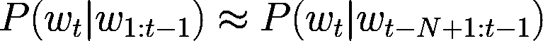
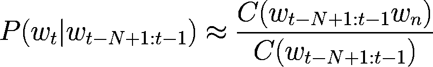
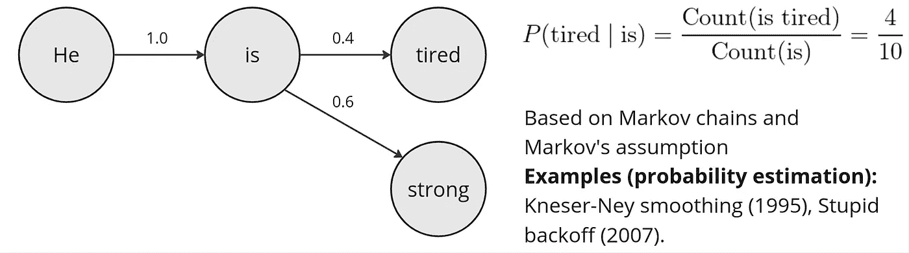
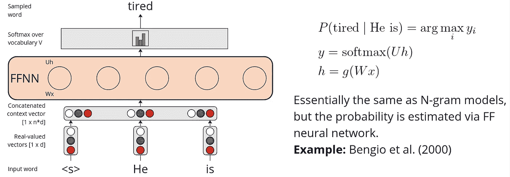
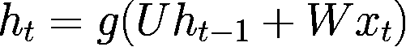
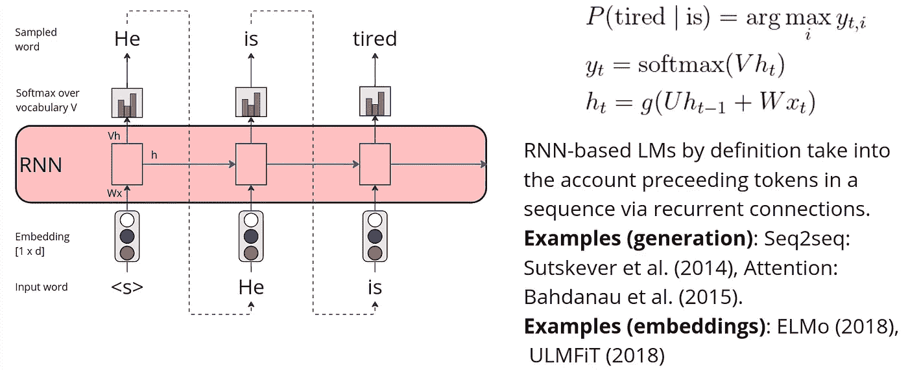
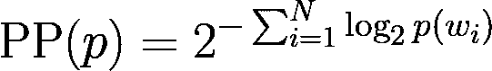
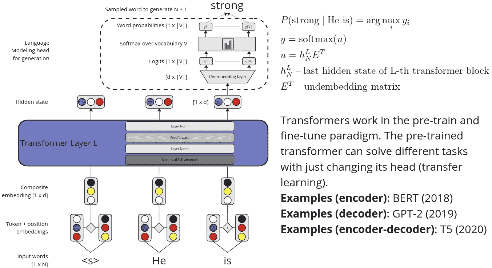

# 语言模型在文本生成中的演变概述

> 原文：[`towardsdatascience.com/a-birds-eye-view-on-the-evolution-of-language-models-for-text-generation-9b6b3fcb96a4?source=collection_archive---------7-----------------------#2024-07-10`](https://towardsdatascience.com/a-birds-eye-view-on-the-evolution-of-language-models-for-text-generation-9b6b3fcb96a4?source=collection_archive---------7-----------------------#2024-07-10)

 [Aleksandr Perevalov](https://perevalov.medium.com/?source=post_page---byline--9b6b3fcb96a4--------------------------------)

·发表于[Towards Data Science](https://towardsdatascience.com/?source=post_page---byline--9b6b3fcb96a4--------------------------------) ·阅读时间 8 分钟·2024 年 7 月 10 日

--

在本文中，我想分享一些关于语言模型（LM）在过去几十年发展过程中的笔记。本文可以作为一个温和的入门介绍，帮助理解语言模型历史中的概念要点。值得一提的是，我并没有深入探讨实现细节和背后的数学原理，但本文的描述层次足以让人正确理解语言模型的演变。

## 什么是语言建模？

一般来说，语言建模是将语言，特别是自然语言，形式化的过程，目的是使其机器可读并能够以各种方式处理。因此，这不仅仅是生成语言的问题，还是关于语言表示的问题。

由于生成式人工智能（GenAI）的普及，“语言建模”这一概念通常与文本生成过程紧密相关。因此，本文从文本生成的角度，探讨语言模型的演变过程。

# N-gram 语言模型

尽管 n-gram 语言模型的基础在 20 世纪中期就已经奠定，但这类模型的广泛应用始于 1980 年代和 1990 年代。

n-gram 语言模型利用了*马尔科夫假设*，该假设在语言模型的背景下指出，下一个词的概率仅依赖于前一个词。因此，利用 n-gram 语言模型对给定上下文的词的概率进行近似，可以形式化为以下方式：

给定一系列前面的词，预测下一个词的概率可以通过给定 N 个前面词的概率来近似（例如，N=2 — 二元语言模型）。（图片来源：作者）

其中*t*是整个序列中的单词数，*N*是上下文的大小（单字模型（1），双字模型（2）等）。现在，问题是如何估计这些 n-gram 概率？最简单的方法是使用 n-gram 计数（可以通过“无监督”的方式在大文本语料库中计算）：

给定前 N 个单词的下一个单词的概率：分子——结果序列在数据中出现的次数，分母——前一个单词序列在数据中出现的次数（图片来自作者）

显然，以上方程中的概率估计可能显得过于简单。如果分子甚至分母的值为零怎么办？这就是为什么更高级的概率估计方法包括平滑或回退（例如，[加法平滑](https://en.wikipedia.org/wiki/Additive_smoothing)，[愚蠢回退](https://aclanthology.org/D07-1090.pdf)，[Kneser-Ney 平滑](https://ieeexplore.ieee.org/document/479394)）。不过我们在这里不会深入探讨这些方法，然而从概念上讲，概率估计方法在任何平滑或回退方法下都不会改变。n-gram 语言模型的高级表示如下所示：

n-gram 语言模型的高级表示（图片来自作者）

得到计数之后，我们如何从这样的语言模型中生成文本呢？实际上，这个问题的答案适用于下面要讨论的所有语言模型。从语言模型中根据概率分布选择下一个单词的过程叫做*采样*。以下是适用于 n-gram 语言模型的几种*采样策略*：

+   *贪婪采样*——选择具有最高概率的单词；

+   *随机采样*——根据概率选择下一个随机单词

    分布。

# 前馈神经网络语言模型

尽管有平滑和回退，n-gram 语言模型的概率估计仍然直观上过于简单，无法建模自然语言。Yoshua Bengio 等人（2000 年）提出的一个具有改变游戏规则的创新方法非常简单，却很有创新性：*如果我们用神经网络来估计单词概率，而不是使用 n-gram 计数，会怎么样*？尽管论文声称递归神经网络（RNN）也可以用于这个任务，但主要内容集中在前馈神经网络（FFNN）架构上。

Bengio 提出的 FFNN 架构是一个简单的多类分类器（类别数量为词汇表的大小*V*）。训练过程基于预测上下文单词*c*中的缺失单词*w*的任务：P (*w|c*)，其中|*c*|是*上下文窗口大小*。Bengio 等人提出的 FFNN 架构如下所示：

FFNN 架构用于下一个单词概率估计（图片来自作者）

这样的基于 FFNN 的语言模型可以在大规模文本语料库上以自监督的方式进行训练（即不需要显式标注的数据集）。

那么采样呢？除了贪婪和随机策略外，还有两种可以应用于基于神经网络的语言模型的策略：

+   *top-k 采样* —— 与贪婪相同，但在经过重新归一化的 top-k 集合中进行

    词汇（softmax 在 top-k 词汇上重新计算），

+   *nucleus* *采样* —— 与 top-k 相同，但使用百分比而不是 k 作为数字。

# 循环神经网络语言模型

到目前为止，我们一直假设下一个词的概率仅依赖于前一个（或多个）词。我们还考虑了固定的上下文或 n-gram 大小来估计概率。*如果词与词之间的连接也很重要呢*？*如果我们想要考虑整个前置词序列来预测下一个词呢*？这可以通过 RNN 完美建模！

自然地，RNN 的优势在于它们能够捕捉整个词序列的依赖关系，同时将来自前一步（*t-1*）的隐藏层输出添加到当前步（*t*）的输入中：

简单 RNN 在步骤 t 处的隐藏层输出计算（图片来自作者）

其中 *h* — 隐藏层输出，*g(x)* — 激活函数，*U* 和 *W* — 权重矩阵。

RNN 还在大规模文本语料库上按照自监督的设置进行训练，以预测给定序列的下一个词。然后通过所谓的 *自回归生成* 过程进行文本生成，这也被称为 *因果语言建模生成*。下面演示了使用 RNN 进行的自回归生成：

使用 RNN 进行自回归文本生成和其他列出的示例（图片来自作者）

在实践中，经典的 RNN 很少用于语言模型任务。相反，有改进的 RNN 架构，例如堆叠和 [双向](https://ieeexplore.ieee.org/document/650093)，[长短期记忆（LSTM）](https://www.bioinf.jku.at/publications/older/2604.pdf) 及其变体。

[Sutskever 等人（2014）](https://proceedings.neurips.cc/paper_files/paper/2014/file/a14ac55a4f27472c5d894ec1c3c743d2-Paper.pdf) 提出了最著名的 RNN 架构之一 —— *编码器-解码器*（或 seq2seq）基于 LSTM 的架构。与简单的自回归生成不同，seq2seq 模型将输入序列编码为中间表示 —— 上下文向量 —— 然后使用自回归生成解码它。

然而，最初的 seq2seq 架构存在一个主要瓶颈——*编码器将整个输入序列压缩为一个表示——上下文向量*。为了消除这个瓶颈，Bahdanau 等人（2014 年）提出了注意力机制，它（1）为每个解码器隐藏状态生成一个单独的上下文向量（2）基于加权的编码器隐藏状态。因此，*注意力机制的直觉是每个输入词都会影响每个输出词，而且这种影响的强度是变化的*。

值得一提的是，基于 RNN 的模型被用于学习语言表示。特别是，最著名的模型包括[ELMo](https://aclanthology.org/N18-1202.pdf)（2018 年）和[ULMFiT](https://aclanthology.org/P18-1031.pdf)（2018 年）。

## 评估：困惑度

在没有将语言模型应用于特定任务（例如机器翻译）的情况下，有一个通用的衡量标准可以帮助我们了解语言模型的表现。这一标准叫做*困惑度*。

困惑度公式（图片由作者提供）

其中，*p* — 词的概率分布，*N* — 序列中的总词数，*wi* — 表示第*i*个词。由于困惑度使用了熵的概念，其直觉是*模型对预测序列的不确定程度*。困惑度越低，模型的预测不确定性越小，因而模型的预测能力越强。

# Transformer 语言模型

现代最先进的语言模型（LMs）利用了前一段提到的注意力机制，特别是[*自注意力机制*](https://papers.nips.cc/paper_files/paper/2017/file/3f5ee243547dee91fbd053c1c4a845aa-Paper.pdf)，它是[*Transformer 架构*](https://papers.nips.cc/paper_files/paper/2017/file/3f5ee243547dee91fbd053c1c4a845aa-Paper.pdf)的一个重要组成部分。

Transformer 语言模型（LMs）在计算效率方面相较于 RNN 语言模型（RNN LMs）具有显著优势，因为它们能够并行化计算。在 RNN 中，序列是逐步处理的，这使得 RNN 的速度较慢，尤其是处理长序列时。相比之下，Transformer 模型使用自注意力机制，能够同时处理序列中的所有位置。下面是带有*LM 头*的 Transformer 模型的高层表示。

简化版的 Transformer 语言模型架构（图片由作者提供）

为了表示输入标记，Transformer 将标记和位置嵌入加在一起。通常，最后一个 Transformer 层的最后隐藏状态用于通过 LM 头生成下一个词的概率。Transformer 语言模型是按照自监督范式进行*预训练*的。当考虑解码器或编码-解码器模型时，预训练任务是预测序列中的下一个词，类似于之前的语言模型。

值得一提的是，*自从 transformer（2017 年）的诞生以来，语言建模的最大进展体现在两个主要方向*： (1) [模型规模扩展](https://huggingface.co/blog/large-language-models) 和 (2) [指令微调](https://arxiv.org/abs/2308.10792)，包括[基于人类反馈的强化学习](https://en.wikipedia.org/wiki/Reinforcement_learning_from_human_feedback)。

## 评估：指令基准

经过指令微调的语言模型被认为是通用问题解决者。因此，困惑度可能不是最好的质量度量标准，因为它*隐含地*计算了这类模型的质量。评估经过指令微调的语言模型的*显式*方法是基于指令基准，

例如[大规模多任务语言理解（MMLU）](https://arxiv.org/abs/2009.03300)、[代码的 HumanEval](https://arxiv.org/abs/2107.03374)、[数学问题求解（MATH）](https://arxiv.org/abs/2103.03874)等。

# 总结

我们在这里考虑了语言模型在文本生成中的演变，涵盖了至少过去三十年的发展。尽管没有深入探讨细节，但可以清楚地看到自 1990 年代以来，语言模型的发展历程。

n-gram 语言模型通过使用 n-gram 计数和应用平滑方法来近似下一个单词的概率。为了改进这种方法，提出了前馈神经网络架构来近似单词的概率。尽管 n-gram 模型和 FFNN 模型仅考虑了固定数量的上下文，并忽略了输入句子中单词之间的联系，但 RNN 语言模型通过自然地考虑单词之间的联系以及整个输入令牌序列填补了这一空白。最终，transformer 语言模型在计算效率上优于 RNN，并利用自注意力机制生成了更多上下文化的表示。

自 2017 年 transformer 架构的发明以来，语言建模领域的最大进展被认为是模型规模扩展和指令微调，包括基于人类反馈的强化学习（RLHF）。

## 参考文献

我想感谢 Dan Jurafsky 和 James H. Martin 的[《语音与语言处理》](https://web.stanford.edu/~jurafsky/slp3/)一书，这本书是本文的主要灵感来源。

其他参考资料已作为超链接包含在文中。

# 后记

如果你想了解更多有关在实际工业用例（如 AI 助手、基于代理的系统等）中应用 LLM 的知识，请通过[contact (at) perevalov (dot) com]与我联系或访问我的[网站](https://perevalov.com/)。
