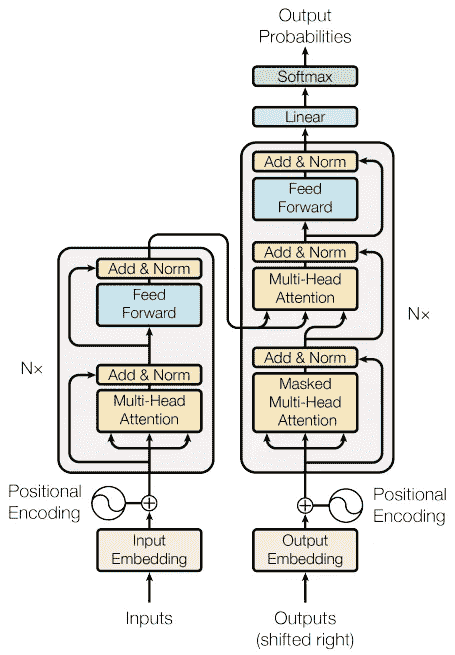

# 完整指南：编写你自己的 Transformer

> 原文：[`towardsdatascience.com/a-complete-guide-to-write-your-own-transformers-29e23f371ddd?source=collection_archive---------1-----------------------#2024-02-24`](https://towardsdatascience.com/a-complete-guide-to-write-your-own-transformers-29e23f371ddd?source=collection_archive---------1-----------------------#2024-02-24)

## 这是一个端到端的 Pytorch Transformer 实现，在这个过程中我们将涵盖诸如自注意力（self-attention）、编码器（encoders）、解码器（decoders）等关键概念，以及更多内容。

[](https://medium.com/@benjamin_47408?source=post_page---byline--29e23f371ddd--------------------------------)[](https://towardsdatascience.com/?source=post_page---byline--29e23f371ddd--------------------------------) [Benjamin Etienne](https://medium.com/@benjamin_47408?source=post_page---byline--29e23f371ddd--------------------------------)

·发表于[Towards Data Science](https://towardsdatascience.com/?source=post_page---byline--29e23f371ddd--------------------------------) ·阅读时间 18 分钟·2024 年 2 月 24 日

--


图片由[Susan Holt Simpson](https://unsplash.com/@shs521?utm_source=medium&utm_medium=referral)提供，来源于[Unsplash](https://unsplash.com/?utm_source=medium&utm_medium=referral)。

# 我们自己编写

当我决定深入研究 Transformer 架构时，在阅读或观看在线教程时，我常常感到沮丧，因为我觉得它们总是遗漏了一些内容：

+   Tensorflow 或 Pytorch 的官方教程使用了它们自己的 API，因此保持在高层次，迫使我必须进入它们的代码库去查看底层实现。这样非常耗时，而且阅读成千上万行代码并不总是容易的。

+   我找到的其他带有自定义代码的教程（文章末尾有链接）通常过于简化了使用场景，并且没有涉及如变长序列批处理的遮蔽等概念。

所以我决定自己写一个 Transformer，以确保我理解这些概念，并能够在任何数据集上使用它。

因此，在本文中，我们将采取一种系统的方法，逐层逐块地实现一个变换器（Transformer）。

显然，已经有许多不同的实现，以及来自 Pytorch 或 Tensorflow 的高级 API 可以直接使用——我相信它们的性能比我们将要构建的模型更好。

***“好吧，那为什么不使用 TF/Pytorch 的实现呢？”***

本文的目的是为了教育目的，我并不打算超过 Pytorch 或 Tensorflow 的实现。我确实相信，Transformer 背后的理论和代码并不简单直接，这也是为什么我希望通过这篇一步步的教程，帮助你更好地掌握这些概念，并在以后构建自己代码时更加得心应手。

从头开始构建自己的 Transformer 还有一个原因，那就是它能帮助你完全理解如何使用上述的 API。如果我们查看 Pytorch 中 Transformer 类的 `forward()` 方法的实现，你会看到很多晦涩的关键词，比如：


来源：[Pytorch 文档](https://pytorch.org/docs/stable/generated/torch.nn.Transformer.html)

如果你已经熟悉这些关键词，那么你可以愉快地跳过本文。

否则，本文将带你逐步了解这些关键词及其背后的概念。

# Transformer 简短介绍

如果你已经听说过 ChatGPT 或 Gemini，那么你已经接触过 Transformer。实际上，ChatGPT 中的“T”就代表 Transformer。

该架构首次由 Google 研究人员在 2017 年的《Attention is All you need》论文中提出。它具有革命性，因为以前的模型通常依赖于 RNNs 来进行序列到序列的学习（如机器翻译、语音转文本等），而 RNNs 在计算上是昂贵的，因为它们需要一步步地处理序列，而 Transformer 只需一次性查看整个序列，从而将时间复杂度从 O(n) 降低到 O(1)。


[(Vaswani 等人, 2017)](https://arxiv.org/abs/1706.03762)

Transformer 在 NLP 领域的应用非常广泛，包括语言翻译、问答系统、文档摘要、文本生成等。

Transformer 的整体架构如下：



[来源](https://www.tensorflow.org/text/tutorials/transformer)

# 多头注意力

我们将实现的第一个模块实际上是 Transformer 中最重要的部分，称为多头注意力机制。让我们来看一下它在整体架构中的位置。


[来源](https://www.tensorflow.org/text/tutorials/transformer)

注意力机制其实并不是 Transformer 所特有的，它早在 RNN 的序列到序列模型中就已经被使用过。


Transformer 中的注意力机制（来源：Tensorflow [文档](https://www.tensorflow.org/text/tutorials/transformer)）


Transformer 中的注意力机制（来源：Tensorflow [文档](https://www.tensorflow.org/text/tutorials/transformer)）

```py
import torch
import torch.nn as nn
import math

class MultiHeadAttention(nn.Module):
    def __init__(self, hidden_dim=256, num_heads=4):
        """
        input_dim: Dimensionality of the input.
        num_heads: The number of attention heads to split the input into.
        """
        super(MultiHeadAttention, self).__init__()
        self.hidden_dim = hidden_dim
        self.num_heads = num_heads
        assert hidden_dim % num_heads == 0, "Hidden dim must be divisible by num heads"
        self.Wv = nn.Linear(hidden_dim, hidden_dim, bias=False) # the Value part
        self.Wk = nn.Linear(hidden_dim, hidden_dim, bias=False) # the Key part
        self.Wq = nn.Linear(hidden_dim, hidden_dim, bias=False) # the Query part
        self.Wo = nn.Linear(hidden_dim, hidden_dim, bias=False) # the output layer

    def check_sdpa_inputs(self, x):
        assert x.size(1) == self.num_heads, f"Expected size of x to be ({-1, self.num_heads, -1, self.hidden_dim // self.num_heads}), got {x.size()}"
        assert x.size(3) == self.hidden_dim // self.num_heads

    def scaled_dot_product_attention(
            self, 
            query, 
            key, 
            value, 
            attention_mask=None, 
            key_padding_mask=None):
        """
        query : tensor of shape (batch_size, num_heads, query_sequence_length, hidden_dim//num_heads)
        key : tensor of shape (batch_size, num_heads, key_sequence_length, hidden_dim//num_heads)
        value : tensor of shape (batch_size, num_heads, key_sequence_length, hidden_dim//num_heads)
        attention_mask : tensor of shape (query_sequence_length, key_sequence_length)
        key_padding_mask : tensor of shape (sequence_length, key_sequence_length)

        """
        self.check_sdpa_inputs(query)
        self.check_sdpa_inputs(key)
        self.check_sdpa_inputs(value)

        d_k = query.size(-1)
        tgt_len, src_len = query.size(-2), key.size(-2)

        # logits = (B, H, tgt_len, E) * (B, H, E, src_len) = (B, H, tgt_len, src_len)
        logits = torch.matmul(query, key.transpose(-2, -1)) / math.sqrt(d_k) 

        # Attention mask here
        if attention_mask is not None:
            if attention_mask.dim() == 2:
                assert attention_mask.size() == (tgt_len, src_len)
                attention_mask = attention_mask.unsqueeze(0)
                logits = logits + attention_mask
            else:
                raise ValueError(f"Attention mask size {attention_mask.size()}")

        # Key mask here
        if key_padding_mask is not None:
            key_padding_mask = key_padding_mask.unsqueeze(1).unsqueeze(2) # Broadcast over batch size, num heads
            logits = logits + key_padding_mask

        attention = torch.softmax(logits, dim=-1)
        output = torch.matmul(attention, value) # (batch_size, num_heads, sequence_length, hidden_dim)

        return output, attention

    def split_into_heads(self, x, num_heads):
        batch_size, seq_length, hidden_dim = x.size()
        x = x.view(batch_size, seq_length, num_heads, hidden_dim // num_heads)

        return x.transpose(1, 2) # Final dim will be (batch_size, num_heads, seq_length, , hidden_dim // num_heads)

    def combine_heads(self, x):
        batch_size, num_heads, seq_length, head_hidden_dim = x.size()
        return x.transpose(1, 2).contiguous().view(batch_size, seq_length, num_heads * head_hidden_dim)

    def forward(
            self, 
            q, 
            k, 
            v, 
            attention_mask=None, 
            key_padding_mask=None):
        """
        q : tensor of shape (batch_size, query_sequence_length, hidden_dim)
        k : tensor of shape (batch_size, key_sequence_length, hidden_dim)
        v : tensor of shape (batch_size, key_sequence_length, hidden_dim)
        attention_mask : tensor of shape (query_sequence_length, key_sequence_length)
        key_padding_mask : tensor of shape (sequence_length, key_sequence_length)

        """
        q = self.Wq(q)
        k = self.Wk(k)
        v = self.Wv(v)

        q = self.split_into_heads(q, self.num_heads)
        k = self.split_into_heads(k, self.num_heads)
        v = self.split_into_heads(v, self.num_heads)

        # attn_values, attn_weights = self.multihead_attn(q, k, v, attn_mask=attention_mask)
        attn_values, attn_weights  = self.scaled_dot_product_attention(
            query=q, 
            key=k, 
            value=v, 
            attention_mask=attention_mask,
            key_padding_mask=key_padding_mask,
        )
        grouped = self.combine_heads(attn_values)
        output = self.Wo(grouped)

        self.attention_weigths = attn_weights

        return output
```

我们需要在这里解释几个概念。

## 1) 查询、键和值。

> ***查询***是你试图匹配的信息，
> 
> ***键***和 ***值*** 是存储的信息。

可以把它想象成使用字典：每当使用 Python 字典时，如果你的查询与字典的键不匹配，你将不会得到任何返回。但如果我们希望字典返回的是一组相似的信息呢？就像我们有：

```py
d = {"panther": 1, "bear": 10, "dog":3}
d["wolf"] = 0.2*d["panther"] + 0.7*d["dog"] + 0.1*d["bear"]
```

这基本上就是注意力的作用：观察数据的不同部分，并将它们融合成一个答案来回应你的查询。

代码的相关部分是这一部分，我们计算查询与键之间的注意力权重

```py
logits = torch.matmul(query, key.transpose(-2, -1)) / math.sqrt(d_k) # we compute the weights of attention
```

这是我们应用标准化权重到值上的情况：

```py
attention = torch.softmax(logits, dim=-1)
output = torch.matmul(attention, value) # (batch_size, num_heads, sequence_length, hidden_dim)
```

## 2) 注意力掩码和填充

在处理顺序输入的各部分时，我们不希望包含无用或禁止的信息。

无用信息例如填充：填充符号用于将批次中的所有序列对齐到相同的序列大小，我们的模型应忽略这些填充。我们将在最后一节回到这一点

禁止信息稍微复杂一些。在训练过程中，模型学习编码输入序列，并将目标与输入对齐。然而，由于推理过程涉及查看先前发出的标记来预测下一个标记（例如 ChatGPT 中的文本生成），我们在训练时也需要应用相同的规则。

这就是我们应用 *因果掩码* 的原因，以确保每个时间步的目标只能看到来自过去的信息。以下是应用掩码的对应部分（掩码的计算将在最后部分讨论）

```py
if attention_mask is not None:
    if attention_mask.dim() == 2:
        assert attention_mask.size() == (tgt_len, src_len)
        attention_mask = attention_mask.unsqueeze(0)
        logits = logits + attention_mask
```

# 位置编码

它对应于 Transformer 的以下部分：


当接收和处理输入时，Transformer 没有顺序感知，因为它将序列视为整体，这与 RNN 的做法不同。因此，我们需要加入一些时间顺序的提示，以便 Transformer 能学习依赖关系。

位置编码如何工作的具体细节超出了本文的范围，但可以随时阅读原始论文以了解更多。

```py
# Taken from https://pytorch.org/tutorials/beginner/transformer_tutorial.html#define-the-model
class PositionalEncoding(nn.Module):

    def __init__(self, d_model, dropout=0.1, max_len=5000):
        super(PositionalEncoding, self).__init__()
        self.dropout = nn.Dropout(p=dropout)

        pe = torch.zeros(max_len, d_model)
        position = torch.arange(max_len, dtype=torch.float).unsqueeze(1)
        div_term = torch.exp(torch.arange(0, d_model, 2).float() * (-math.log(10000.0) / d_model))

        pe[:, 0::2] = torch.sin(position * div_term)
        pe[:, 1::2] = torch.cos(position * div_term)
        pe = pe.unsqueeze(0)

        self.register_buffer('pe', pe)

    def forward(self, x):
        """
        Arguments:
            x: Tensor, shape ``[batch_size, seq_len, embedding_dim]``
        """
        x = x + self.pe[:, :x.size(1), :]
        return x
```

# 编码器

我们即将完成一个完整的编码器！编码器是 Transformer 的左侧部分


我们将向代码中添加一个小部分，即前馈部分：

```py
class PositionWiseFeedForward(nn.Module):
    def __init__(self, d_model: int, d_ff: int):
        super(PositionWiseFeedForward, self).__init__()
        self.fc1 = nn.Linear(d_model, d_ff)
        self.fc2 = nn.Linear(d_ff, d_model)
        self.relu = nn.ReLU()

    def forward(self, x):
        return self.fc2(self.relu(self.fc1(x)))
```

将各部分拼接起来，我们得到了一个编码器模块！

```py
class EncoderBlock(nn.Module):
    def __init__(self, n_dim: int, dropout: float, n_heads: int):
        super(EncoderBlock, self).__init__()
        self.mha = MultiHeadAttention(hidden_dim=n_dim, num_heads=n_heads)
        self.norm1 = nn.LayerNorm(n_dim)
        self.ff = PositionWiseFeedForward(n_dim, n_dim)
        self.norm2 = nn.LayerNorm(n_dim)
        self.dropout = nn.Dropout(dropout)

    def forward(self, x, src_padding_mask=None):
        assert x.ndim==3, "Expected input to be 3-dim, got {}".format(x.ndim)
        att_output = self.mha(x, x, x, key_padding_mask=src_padding_mask)
        x = x + self.dropout(self.norm1(att_output))

        ff_output = self.ff(x)
        output = x + self.norm2(ff_output)

        return output
```

如图所示，编码器实际上包含 N 个编码器块或层，以及用于输入的嵌入层。因此，我们通过添加嵌入层、位置编码和编码器块来创建一个编码器：

```py
class Encoder(nn.Module):
    def __init__(
            self, 
            vocab_size: int, 
            n_dim: int, 
            dropout: float, 
            n_encoder_blocks: int,
            n_heads: int):

        super(Encoder, self).__init__()
        self.n_dim = n_dim

        self.embedding = nn.Embedding(
            num_embeddings=vocab_size, 
            embedding_dim=n_dim
        )
        self.positional_encoding = PositionalEncoding(
            d_model=n_dim, 
            dropout=dropout
        )    
        self.encoder_blocks = nn.ModuleList([
            EncoderBlock(n_dim, dropout, n_heads) for _ in range(n_encoder_blocks)
        ])

    def forward(self, x, padding_mask=None):
        x = self.embedding(x) * math.sqrt(self.n_dim)
        x = self.positional_encoding(x)
        for block in self.encoder_blocks:
            x = block(x=x, src_padding_mask=padding_mask)
        return x
```

# 解码器

解码器部分是左侧部分，需要更多的构建工作。


有一种叫做*掩蔽多头注意力*的机制。还记得我们之前说过的*因果掩蔽*吗？这里也会用到。我们将使用多头注意力模块的 attention_mask 参数来表示这一点（更多关于如何计算掩蔽的细节在最后）：

```py
 # Stuff before

self.self_attention = MultiHeadAttention(hidden_dim=n_dim, num_heads=n_heads)
masked_att_output = self.self_attention(
    q=tgt, 
    k=tgt, 
    v=tgt, 
    attention_mask=tgt_mask, <-- HERE IS THE CAUSAL MASK
    key_padding_mask=tgt_padding_mask)

# Stuff after
```

第二种注意力机制叫做*交叉注意力*。它会使用解码器的查询与编码器的键和值进行匹配！请注意：在训练过程中，它们的长度可能不同，因此通常最好明确定义输入的预期形状，如下所示：

```py
def scaled_dot_product_attention(
            self, 
            query, 
            key, 
            value, 
            attention_mask=None, 
            key_padding_mask=None):
        """
        query : tensor of shape (batch_size, num_heads, query_sequence_length, hidden_dim//num_heads)
        key : tensor of shape (batch_size, num_heads, key_sequence_length, hidden_dim//num_heads)
        value : tensor of shape (batch_size, num_heads, key_sequence_length, hidden_dim//num_heads)
        attention_mask : tensor of shape (query_sequence_length, key_sequence_length)
        key_padding_mask : tensor of shape (sequence_length, key_sequence_length)

        """
```

这是我们使用编码器输出的部分，称为*记忆*，并将其与解码器输入结合的地方：

```py
# Stuff before
self.cross_attention = MultiHeadAttention(hidden_dim=n_dim, num_heads=n_heads)
cross_att_output = self.cross_attention(
        q=x1, 
        k=memory, 
        v=memory, 
        attention_mask=None,  <-- NO CAUSAL MASK HERE
        key_padding_mask=memory_padding_mask) <-- WE NEED TO USE THE PADDING OF THE SOURCE
# Stuff after
```

将各个部分组合在一起，我们得到了解码器的结构：

```py
class DecoderBlock(nn.Module):
    def __init__(self, n_dim: int, dropout: float, n_heads: int):
        super(DecoderBlock, self).__init__()

        # The first Multi-Head Attention has a mask to avoid looking at the future
        self.self_attention = MultiHeadAttention(hidden_dim=n_dim, num_heads=n_heads)
        self.norm1 = nn.LayerNorm(n_dim)

        # The second Multi-Head Attention will take inputs from the encoder as key/value inputs
        self.cross_attention = MultiHeadAttention(hidden_dim=n_dim, num_heads=n_heads)
        self.norm2 = nn.LayerNorm(n_dim)

        self.ff = PositionWiseFeedForward(n_dim, n_dim)
        self.norm3 = nn.LayerNorm(n_dim)
        # self.dropout = nn.Dropout(dropout)

    def forward(self, tgt, memory, tgt_mask=None, tgt_padding_mask=None, memory_padding_mask=None):

        masked_att_output = self.self_attention(
            q=tgt, k=tgt, v=tgt, attention_mask=tgt_mask, key_padding_mask=tgt_padding_mask)
        x1 = tgt + self.norm1(masked_att_output)

        cross_att_output = self.cross_attention(
            q=x1, k=memory, v=memory, attention_mask=None, key_padding_mask=memory_padding_mask)
        x2 = x1 + self.norm2(cross_att_output)

        ff_output = self.ff(x2)
        output = x2 + self.norm3(ff_output)

        return output

class Decoder(nn.Module):
    def __init__(
        self, 
        vocab_size: int, 
        n_dim: int, 
        dropout: float, 
        n_decoder_blocks: int,
        n_heads: int):

        super(Decoder, self).__init__()

        self.embedding = nn.Embedding(
            num_embeddings=vocab_size, 
            embedding_dim=n_dim,
            padding_idx=0
        )
        self.positional_encoding = PositionalEncoding(
            d_model=n_dim, 
            dropout=dropout
        )

        self.decoder_blocks = nn.ModuleList([
            DecoderBlock(n_dim, dropout, n_heads) for _ in range(n_decoder_blocks)
        ])

    def forward(self, tgt, memory, tgt_mask=None, tgt_padding_mask=None, memory_padding_mask=None):
        x = self.embedding(tgt)
        x = self.positional_encoding(x)

        for block in self.decoder_blocks:
            x = block(
                x, 
                memory, 
                tgt_mask=tgt_mask, 
                tgt_padding_mask=tgt_padding_mask, 
                memory_padding_mask=memory_padding_mask)
        return x
```

# 填充与掩蔽

记得在多头注意力部分，我们提到过在做注意力计算时，排除输入的某些部分。

在训练过程中，我们会考虑输入和目标的批次，其中每个实例可能具有不同的长度。考虑以下示例，我们将四个单词批处理在一起：banana, watermelon, pear, blueberry。为了将它们作为一个批次处理，我们需要将所有单词对齐到最长单词的长度（watermelon）。因此，我们将为每个单词添加一个额外的标记，PAD，使它们都达到与 watermelon 相同的长度。

在下面的图中，上表表示原始数据，下表表示编码后的版本：


（图片来源：作者）

在我们的案例中，我们希望排除填充索引对计算注意力权重的影响。因此，我们可以如下计算掩蔽，分别用于源数据和目标数据：

```py
padding_mask = (x == PAD_IDX)
```

那么因果掩蔽怎么办？如果我们希望模型在每个时间步只关注过去的步骤，这意味着对于每个时间步 T，模型只能关注 t 在 1…T 范围内的每个步骤。这是一个双重 for 循环，因此我们可以使用矩阵来计算这一点：


（图片来源：作者）

```py
def generate_square_subsequent_mask(size: int):
      """Generate a triangular (size, size) mask. From PyTorch docs."""
      mask = (1 - torch.triu(torch.ones(size, size), diagonal=1)).bool()
      mask = mask.float().masked_fill(mask == 0, float('-inf')).masked_fill(mask == 1, float(0.0))
      return mask
```

# 案例研究：一个单词反转 Transformer

现在让我们将各个部分整合起来，构建我们的 Transformer！

在我们的使用案例中，我们将使用一个非常简单的数据集来展示 Transformer 是如何学习的。

***“但是为什么要使用 Transformer 来反转单词？我已经知道如何在 Python 中使用 word[::-1]来做了！”***

这里的目标是观察 Transformer 的注意力机制是否有效。我们期望看到的是，当给定一个输入序列时，注意力权重会从右向左移动。如果是这样，这意味着我们的 Transformer 已经学会了一种非常简单的语法，即从右到左阅读，并且在进行实际的语言翻译时，能够推广到更复杂的语法。

让我们首先从我们自定义的 Transformer 类开始：

```py
import torch
import torch.nn as nn
import math

from .encoder import Encoder
from .decoder import Decoder

class Transformer(nn.Module):
    def __init__(self, **kwargs):
        super(Transformer, self).__init__()

        for k, v in kwargs.items():
            print(f" * {k}={v}")

        self.vocab_size = kwargs.get('vocab_size')
        self.model_dim = kwargs.get('model_dim')
        self.dropout = kwargs.get('dropout')
        self.n_encoder_layers = kwargs.get('n_encoder_layers')
        self.n_decoder_layers = kwargs.get('n_decoder_layers')
        self.n_heads = kwargs.get('n_heads')
        self.batch_size = kwargs.get('batch_size')
        self.PAD_IDX = kwargs.get('pad_idx', 0)

        self.encoder = Encoder(
            self.vocab_size, self.model_dim, self.dropout, self.n_encoder_layers, self.n_heads)
        self.decoder = Decoder(
            self.vocab_size, self.model_dim, self.dropout, self.n_decoder_layers, self.n_heads)
        self.fc = nn.Linear(self.model_dim, self.vocab_size)

    @staticmethod    
    def generate_square_subsequent_mask(size: int):
            """Generate a triangular (size, size) mask. From PyTorch docs."""
            mask = (1 - torch.triu(torch.ones(size, size), diagonal=1)).bool()
            mask = mask.float().masked_fill(mask == 0, float('-inf')).masked_fill(mask == 1, float(0.0))
            return mask

    def encode(
            self, 
            x: torch.Tensor, 
        ) -> torch.Tensor:
        """
        Input
            x: (B, S) with elements in (0, C) where C is num_classes
        Output
            (B, S, E) embedding
        """

        mask = (x == self.PAD_IDX).float()
        encoder_padding_mask = mask.masked_fill(mask == 1, float('-inf'))

        # (B, S, E)
        encoder_output = self.encoder(
            x, 
            padding_mask=encoder_padding_mask
        )  

        return encoder_output, encoder_padding_mask

    def decode(
            self, 
            tgt: torch.Tensor, 
            memory: torch.Tensor, 
            memory_padding_mask=None
        ) -> torch.Tensor:
        """
        B = Batch size
        S = Source sequence length
        L = Target sequence length
        E = Model dimension

        Input
            encoded_x: (B, S, E)
            y: (B, L) with elements in (0, C) where C is num_classes
        Output
            (B, L, C) logits
        """

        mask = (tgt == self.PAD_IDX).float()
        tgt_padding_mask = mask.masked_fill(mask == 1, float('-inf'))

        decoder_output = self.decoder(
            tgt=tgt, 
            memory=memory, 
            tgt_mask=self.generate_square_subsequent_mask(tgt.size(1)), 
            tgt_padding_mask=tgt_padding_mask, 
            memory_padding_mask=memory_padding_mask,
        )  
        output = self.fc(decoder_output)  # shape (B, L, C)
        return output

    def forward(
            self, 
            x: torch.Tensor, 
            y: torch.Tensor, 
        ) -> torch.Tensor:
        """
        Input
            x: (B, Sx) with elements in (0, C) where C is num_classes
            y: (B, Sy) with elements in (0, C) where C is num_classes
        Output
            (B, L, C) logits
        """

        # Encoder output shape (B, S, E)
        encoder_output, encoder_padding_mask = self.encode(x)  

        # Decoder output shape (B, L, C)
        decoder_output = self.decode(
            tgt=y, 
            memory=encoder_output, 
            memory_padding_mask=encoder_padding_mask
        )  

        return decoder_output
```

## 使用贪心解码进行推理

我们需要添加一个方法，它将充当 scikit.learn 中著名的`model.predict`。目标是让模型根据输入动态输出预测。在推理过程中，没有目标：模型首先通过关注输出生成一个 token，并使用自身的预测继续生成 token。这就是为什么这些模型通常被称为自回归模型，因为它们使用过去的预测来预测下一个。

贪心解码的问题在于它每一步都选择概率最高的 token。如果第一个 token 完全错误，这可能会导致非常糟糕的预测。还有其他解码方法，如 Beam search，它考虑一个候选序列的简短列表（可以理解为在每个时间步骤保持 top-k token 而不是 argmax），并返回具有最高总概率的序列。

现在，让我们实现贪心解码并将其添加到我们的 Transformer 模型中：

```py
def predict(
            self,
            x: torch.Tensor,
            sos_idx: int=1,
            eos_idx: int=2,
            max_length: int=None
        ) -> torch.Tensor:
        """
        Method to use at inference time. Predict y from x one token at a time. This method is greedy
        decoding. Beam search can be used instead for a potential accuracy boost.

        Input
            x: str
        Output
            (B, L, C) logits
        """

        # Pad the tokens with beginning and end of sentence tokens
        x = torch.cat([
            torch.tensor([sos_idx]), 
            x, 
            torch.tensor([eos_idx])]
        ).unsqueeze(0)

        encoder_output, mask = self.transformer.encode(x) # (B, S, E)

        if not max_length:
            max_length = x.size(1)

        outputs = torch.ones((x.size()[0], max_length)).type_as(x).long() * sos_idx
        for step in range(1, max_length):
            y = outputs[:, :step]
            probs = self.transformer.decode(y, encoder_output)
            output = torch.argmax(probs, dim=-1)

            # Uncomment if you want to see step by step predicitons
            # print(f"Knowing {y} we output {output[:, -1]}")

            if output[:, -1].detach().numpy() in (eos_idx, sos_idx):
                break
            outputs[:, step] = output[:, -1]

        return outputs
```

## 创建示例数据

我们定义了一个小数据集，它会反转单词，这意味着“helloworld”将返回“dlrowolleh”：

```py
import numpy as np
import torch
from torch.utils.data import Dataset

np.random.seed(0)

def generate_random_string():
    len = np.random.randint(10, 20)
    return "".join([chr(x) for x in np.random.randint(97, 97+26, len)])

class ReverseDataset(Dataset):
    def __init__(self, n_samples, pad_idx, sos_idx, eos_idx):
        super(ReverseDataset, self).__init__()
        self.pad_idx = pad_idx
        self.sos_idx = sos_idx
        self.eos_idx = eos_idx
        self.values = [generate_random_string() for _ in range(n_samples)]
        self.labels = [x[::-1] for x in self.values]

    def __len__(self):
        return len(self.values)  # number of samples in the dataset

    def __getitem__(self, index):
        return self.text_transform(self.values[index].rstrip("\n")), \
            self.text_transform(self.labels[index].rstrip("\n"))

    def text_transform(self, x):
        return torch.tensor([self.sos_idx] + [ord(z)-97+3 for z in x] + [self.eos_idx])
```

我们现在将定义训练和评估步骤：

```py
PAD_IDX = 0
SOS_IDX = 1
EOS_IDX = 2

def train(model, optimizer, loader, loss_fn, epoch):
    model.train()
    losses = 0
    acc = 0
    history_loss = []
    history_acc = [] 

    with tqdm(loader, position=0, leave=True) as tepoch:
        for x, y in tepoch:
            tepoch.set_description(f"Epoch {epoch}")

            optimizer.zero_grad()
            logits = model(x, y[:, :-1])
            loss = loss_fn(logits.contiguous().view(-1, model.vocab_size), y[:, 1:].contiguous().view(-1))
            loss.backward()
            optimizer.step()
            losses += loss.item()

            preds = logits.argmax(dim=-1)
            masked_pred = preds * (y[:, 1:]!=PAD_IDX)
            accuracy = (masked_pred == y[:, 1:]).float().mean()
            acc += accuracy.item()

            history_loss.append(loss.item())
            history_acc.append(accuracy.item())
            tepoch.set_postfix(loss=loss.item(), accuracy=100\. * accuracy.item())

    return losses / len(list(loader)), acc / len(list(loader)), history_loss, history_acc

def evaluate(model, loader, loss_fn):
    model.eval()
    losses = 0
    acc = 0
    history_loss = []
    history_acc = [] 

    for x, y in tqdm(loader, position=0, leave=True):

        logits = model(x, y[:, :-1])
        loss = loss_fn(logits.contiguous().view(-1, model.vocab_size), y[:, 1:].contiguous().view(-1))
        losses += loss.item()

        preds = logits.argmax(dim=-1)
        masked_pred = preds * (y[:, 1:]!=PAD_IDX)
        accuracy = (masked_pred == y[:, 1:]).float().mean()
        acc += accuracy.item()

        history_loss.append(loss.item())
        history_acc.append(accuracy.item())

    return losses / len(list(loader)), acc / len(list(loader)), history_loss, history_acc
```

然后训练模型若干轮：

```py
import torch
import time
import torch.nn as nn
import numpy as np
import matplotlib.pyplot as plt

from tqdm import tqdm
from torch.utils.data import DataLoader
from torch.nn.utils.rnn import pad_sequence
from mpl_toolkits.axes_grid1 import ImageGrid

def collate_fn(batch):
    """ 
    This function pads inputs with PAD_IDX to have batches of equal length
    """
    src_batch, tgt_batch = [], []
    for src_sample, tgt_sample in batch:
        src_batch.append(src_sample)
        tgt_batch.append(tgt_sample)

    src_batch = pad_sequence(src_batch, padding_value=PAD_IDX, batch_first=True)
    tgt_batch = pad_sequence(tgt_batch, padding_value=PAD_IDX, batch_first=True)
    return src_batch, tgt_batch

# Model hyperparameters
args = {
    'vocab_size': 128,
    'model_dim': 128,
    'dropout': 0.1,
    'n_encoder_layers': 1,
    'n_decoder_layers': 1,
    'n_heads': 4
}

# Define model here
model = Transformer(**args)

# Instantiate datasets
train_iter = ReverseDataset(50000, pad_idx=PAD_IDX, sos_idx=SOS_IDX, eos_idx=EOS_IDX)
eval_iter = ReverseDataset(10000, pad_idx=PAD_IDX, sos_idx=SOS_IDX, eos_idx=EOS_IDX)
dataloader_train = DataLoader(train_iter, batch_size=256, collate_fn=collate_fn)
dataloader_val = DataLoader(eval_iter, batch_size=256, collate_fn=collate_fn)

# During debugging, we ensure sources and targets are indeed reversed
# s, t = next(iter(dataloader_train))
# print(s[:4, ...])
# print(t[:4, ...])
# print(s.size())

# Initialize model parameters
for p in model.parameters():
    if p.dim() > 1:
        nn.init.xavier_uniform_(p)

# Define loss function : we ignore logits which are padding tokens
loss_fn = torch.nn.CrossEntropyLoss(ignore_index=PAD_IDX)
optimizer = torch.optim.Adam(model.parameters(), lr=0.001, betas=(0.9, 0.98), eps=1e-9)

# Save history to dictionnary
history = {
    'train_loss': [],
    'eval_loss': [],
    'train_acc': [],
    'eval_acc': []
}

# Main loop
for epoch in range(1, 4):
    start_time = time.time()
    train_loss, train_acc, hist_loss, hist_acc = train(model, optimizer, dataloader_train, loss_fn, epoch)
    history['train_loss'] += hist_loss
    history['train_acc'] += hist_acc
    end_time = time.time()
    val_loss, val_acc, hist_loss, hist_acc = evaluate(model, dataloader_val, loss_fn)
    history['eval_loss'] += hist_loss
    history['eval_acc'] += hist_acc
    print((f"Epoch: {epoch}, Train loss: {train_loss:.3f}, Train acc: {train_acc:.3f}, Val loss: {val_loss:.3f}, Val acc: {val_acc:.3f} "f"Epoch time = {(end_time - start_time):.3f}s"))
```


## 可视化注意力

我们定义了一个小函数来访问注意力头的权重：

```py
fig = plt.figure(figsize=(10., 10.))
images = model.decoder.decoder_blocks[0].cross_attention.attention_weigths[0,...].detach().numpy()
grid = ImageGrid(fig, 111,  # similar to subplot(111)
                nrows_ncols=(2, 2),  # creates 2x2 grid of axes
                axes_pad=0.1,  # pad between axes in inch.
                )

for ax, im in zip(grid, images):
    # Iterating over the grid returns the Axes.
    ax.imshow(im)
```


作者提供的图片

我们可以看到一个漂亮的从右到左的模式，当从上方读取权重时。y 轴底部的垂直部分可能表示由于填充掩蔽导致的掩蔽权重。

## 测试我们的模型！

为了用新数据测试我们的模型，我们将定义一个小的 `Translator` 类来帮助我们进行解码：

```py
class Translator(nn.Module):
    def __init__(self, transformer):
        super(Translator, self).__init__()
        self.transformer = transformer

    @staticmethod
    def str_to_tokens(s):
        return [ord(z)-97+3 for z in s]

    @staticmethod
    def tokens_to_str(tokens):
        return "".join([chr(x+94) for x in tokens])

    def __call__(self, sentence, max_length=None, pad=False):

        x = torch.tensor(self.str_to_tokens(sentence))
        x = torch.cat([torch.tensor([SOS_IDX]), x, torch.tensor([EOS_IDX])]).unsqueeze(0)

        encoder_output, mask = self.transformer.encode(x) # (B, S, E)

        if not max_length:
            max_length = x.size(1)

        outputs = torch.ones((x.size()[0], max_length)).type_as(x).long() * SOS_IDX

        for step in range(1, max_length):
            y = outputs[:, :step]
            probs = self.transformer.decode(y, encoder_output)
            output = torch.argmax(probs, dim=-1)
            print(f"Knowing {y} we output {output[:, -1]}")
            if output[:, -1].detach().numpy() in (EOS_IDX, SOS_IDX):
                break
            outputs[:, step] = output[:, -1]

        return self.tokens_to_str(outputs[0])

translator = Translator(model)
```

你应该能看到以下内容：


如果我们打印注意力头，我们将观察到以下内容：

```py
fig = plt.figure()
images = model.decoder.decoder_blocks[0].cross_attention.attention_weigths[0,...].detach().numpy().mean(axis=0)

fig, ax = plt.subplots(1,1, figsize=(10., 10.))
# Iterating over the grid returs the Axes.
ax.set_yticks(range(len(out)))
ax.set_xticks(range(len(sentence)))

ax.xaxis.set_label_position('top') 

ax.set_xticklabels(iter(sentence))
ax.set_yticklabels([f"step {i}" for i in range(len(out))])
ax.imshow(images)
```


作者提供的图片

我们可以清楚地看到，当我们倒置句子“reversethis”时，模型是从右到左进行关注的！（步骤 0 实际上接收的是句子的开始 token）。

# 结论

就这样，你现在能够编写 Transformer 并将其应用于更大的数据集，进行机器翻译或创建你自己的 BERT 例如！

我希望这个教程能向你展示在编写 Transformer 时的注意事项：填充和掩蔽可能是最需要关注的部分（无心的双关），因为它们将在推理过程中决定模型的良好性能。

在接下来的文章中，我们将看看如何创建你自己的 BERT 模型，以及如何使用 Equinox，一个基于 JAX 的高性能库。

敬请期待！

# 有用的链接

(+) [“注解版 Transformer”](https://nlp.seas.harvard.edu/2018/04/03/attention.html)

(+) “[从零开始学习 Transformers](https://peterbloem.nl/blog/transformers)”

(+) [“使用 Transformer 和 Keras 的神经机器翻译”](https://www.tensorflow.org/text/tutorials/transformer)

(+) [“图解 Transformer”](https://jalammar.github.io/illustrated-transformer/)

(+) [阿姆斯特丹大学深度学习教程](https://uvadlc-notebooks.readthedocs.io/en/latest/tutorial_notebooks/tutorial6/Transformers_and_MHAttention.html)

(+) [Pytorch 关于 Transformer 的教程](https://pytorch.org/tutorials/beginner/translation_transformer.html)
