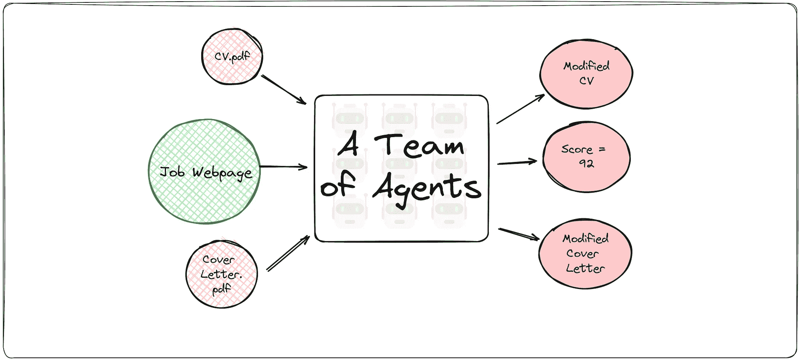
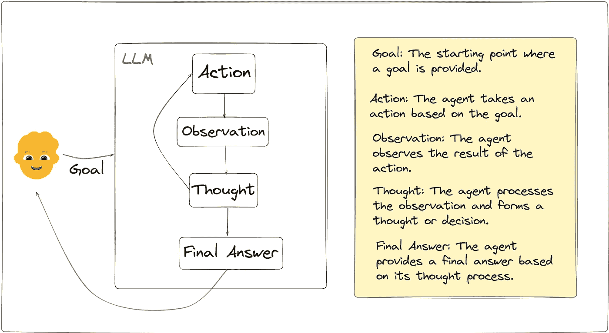
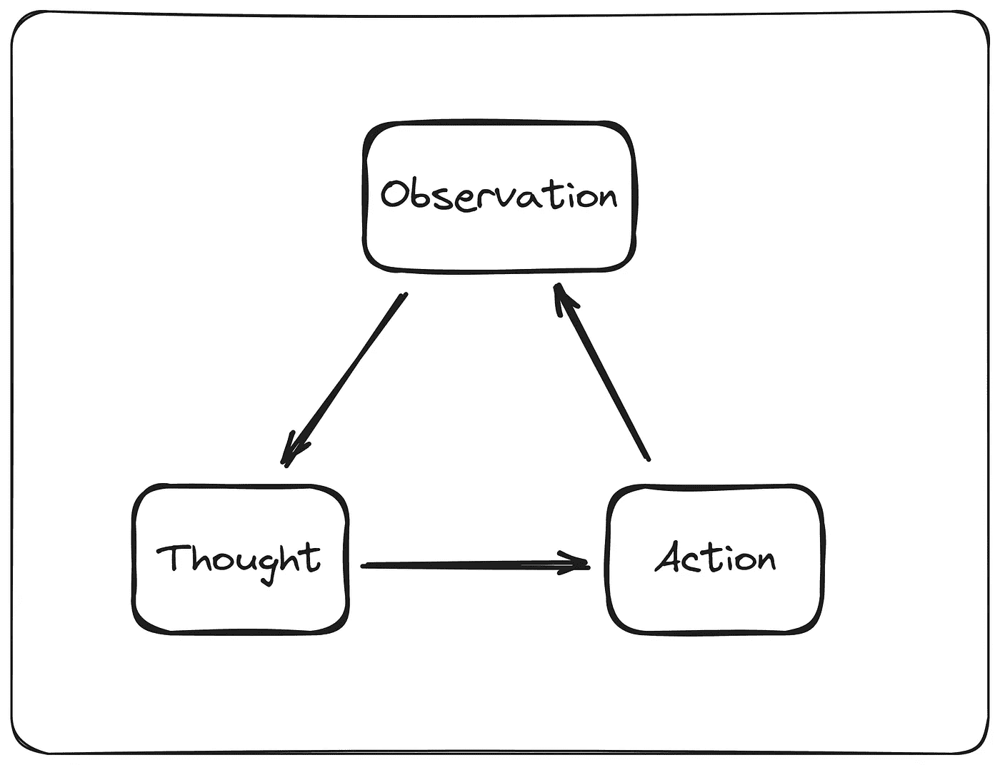
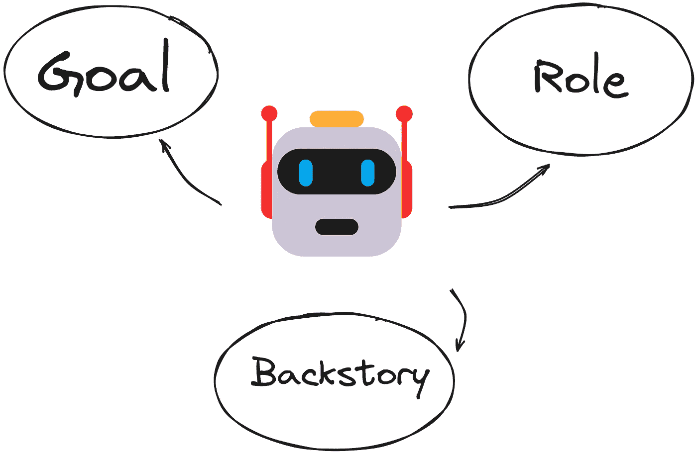
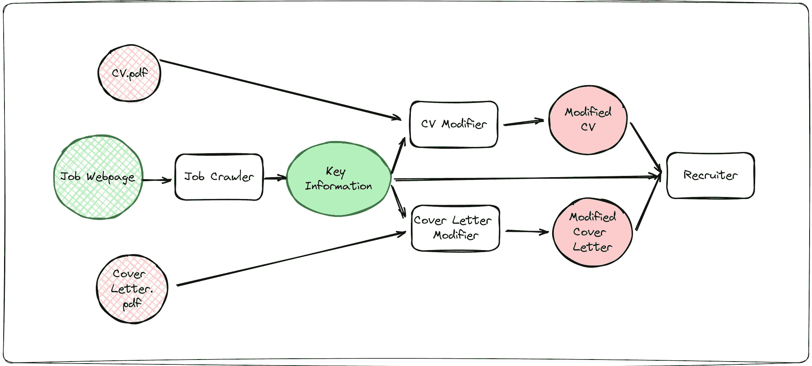
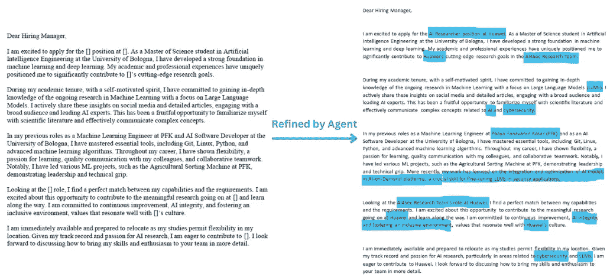

# 《实践中的协作 AI 代理综合指南》

> 原文：[`towardsdatascience.com/a-comprehensive-guide-to-collaborative-ai-agents-in-practice-1f4048947d9c?source=collection_archive---------1-----------------------#2024-07-03`](https://towardsdatascience.com/a-comprehensive-guide-to-collaborative-ai-agents-in-practice-1f4048947d9c?source=collection_archive---------1-----------------------#2024-07-03)

## 定义概述，以及构建一个 AI 代理团队，优化你的简历和求职信，帮助你申请工作

[](https://medium.com/@itshesamsheikh?source=post_page---byline--1f4048947d9c--------------------------------)[](https://towardsdatascience.com/?source=post_page---byline--1f4048947d9c--------------------------------) [Hesam Sheikh](https://medium.com/@itshesamsheikh?source=post_page---byline--1f4048947d9c--------------------------------)

·发表于[面向数据科学](https://towardsdatascience.com/?source=post_page---byline--1f4048947d9c--------------------------------) ·14 分钟阅读·2024 年 7 月 3 日

--


图片由 DALLE3 生成。

> 还不是会员？[免费阅读！](https://hesamsheikh.substack.com/)

代理型 AI 是 2024 年 AI 社区最热门的话题之一，背后有充分的理由。基础模型在**推理**和**规划**方面变得越来越复杂。凭借这些能力，我们可以利用大型语言模型（LLMs）将给定任务分解为更小的部分，逐步执行这些部分，并反思其结果，从而创建**AI 代理**。

如果你对 AI 充满热情，或者喜欢玩转语言模型，或者从事机器学习工作，那么全面理解 AI 代理以及它们如何在实际中运作，是跟上最新 AI 成就的必要条件。

如果你像我一样正在找工作，你一定知道，为每个申请的职位写一封求职信，或者调整简历以契合职位要求，是一项繁琐的工作。对于我的 AI 代理实现，**我将开发一个 AI 代理团队**，这些代理合作完成以下任务：

+   **提取**职位描述中的关键信息

+   **修改**你的简历和求职信以符合职位要求

+   **评估**从招聘者的角度来看最终结果，并给你打分，从 0 到 100 分



图 1\. 我们将创建一个 AI 代理团队来修改我们的简历和求职信，并给我们打分，从 0 到 100 分。（作者提供）

在本文中，我们将深入探讨什么是协作 AI 智能体，智能体与 LLM 有什么不同，并通过一个实际的实现来展示如何创建 AI 智能体比你预期的要简单得多。

· AI 智能体简化版

∘ LLM 驱动的 AI 智能体

· 多智能体协作

∘ 什么构成一个智能体

∘ 多智能体需要什么

· 代码实现：帮助你申请工作的智能体

# AI 智能体简化版

AI 智能体是一种以目标为导向的工具，旨在完成一组特定的任务。虽然 AI 语言模型的设计目的是为了响应特定的提示，AI 智能体则在更广泛的范围内运作，通过决策和任务执行来解决复杂问题。它们围绕一个任务进行推理，并通过使用可用工具，执行小任务来完成大目标。

> AI 聊天机器人会说话，AI 智能体会行动。

无论是在客户服务、金融还是软件开发领域，AI 智能体的目标都是一样的：**自动化**。希望 AI 智能体能够帮助个人和组织处理日常琐事，以更低的成本解决那些创意性较低的任务。


图 2\. 基于 LLM 的智能体模型结构概览。（来源：[Wikimedia](https://commons.wikimedia.org/wiki/File:AI_Agent_Overview.png))

## LLM 驱动的 AI 智能体

尽管 AI 智能体与大型语言模型（LLM）有很大不同，**LLM 是我们的 AI 智能体的大脑**。智能体需要 LLM 来执行智能的操作，进行推理，并规划下一步。也就是说，使用哪个 LLM 会完全改变智能体的行为。这就是为什么 AI 智能体话题的兴起得益于生成型 AI 的快速发展。

**注意：** 我们今天所听到的 AI 智能体，与传统文献和教科书中的定义略有不同。如果你仅仅是在搜索 AI 智能体，你会得到各种不同的定义，这可能会让你感到困惑。我们今天使用的 AI 智能体，也是当前 AI 社区的热门话题，是基于 LLM 的智能体，正是本文讨论的内容。



图 3\. （作者提供）

从本质上讲，自主 AI 智能体依赖于三个组成部分：

1.  **规划：** 这是智能体的核心功能，使其能够将一个目标拆分成更小的步骤，并逐一完成。它们规划的另一个方面是**自我反思**，从而从中学习。智能体如何进行自我反思很大程度上取决于实现方式，但一般框架可以参考图 4 所示。

1.  **记忆：** 要从过去的错误中学习，你必须记住它们。记忆是智能体存储并随后检索信息的组件，用来改进其行为。

1.  **工具使用**：简单的 LLM 和 AI 代理之间的一个关键区别是它们使用工具的能力。使用工具可以像调用 API 或使用 Python 函数读取或写入文件一样简单。



图 4. 自我反思是代理思考该做什么、执行并观察结果的有限循环，可能会采用新的方法来解决问题。（作者）

# 多代理协作

单一代理有什么不如多个代理的地方？**多个代理！**

拥有一个 AI 代理是一回事，但拥有多个相互协作的 AI 代理来分解任务并执行它们又是另外一回事。

但是，为什么我们**需要**多个代理？

当将目标分解成更小的部分时，你会得到需要不同技能集的子目标。这时你就需要多个代理。一个代理团队，每个代理都有特定的角色和技能，确保每个子目标都由相应的代理来处理。

你可能需要为每个代理提供不同的 LLM（大语言模型），这个 LLM 需要对该代理所承担的任务更加精细化。一个为编程能力创建的代理可能需要与一个负责写文章的代理完全不同的 LLM。

## 代理的构成

如何定义一个代理在很大程度上取决于你使用的实现或库。通常，代理归结为三个主要元素：



图 5.（作者）

1.  **目标**：代理旨在实现的具体目标。这决定了其决策框架。例如，“编写易于理解的面向对象 Python 代码。”

1.  **角色**：代理的功能。它是什么？调试器、数据科学家、销售市场人员等。

1.  **背景故事**：代理的背景。解释目标、角色以及代理擅长的领域。一个背景故事的例子可能是：“你是一位资深的 Python 程序员，专门编写优化的、文档齐全的代码以及其测试用例。”

## 多代理的需求

多代理的实现细节有一些需要考虑的细微差别。想象一下一个团队朝着同一个目标努力，举例来说，可以是餐厅厨房里的厨师团队。


由 DALLE3 创建的图像。

你需要一个领头大厨来领导团队。团队成员需要相互沟通。你需要他们能够将完成的工作传给其他厨师，为下一步的食物准备做好准备。这只是一个例子，说明了要让多个代理**协作完成共享任务**需要的许多要素。

通常，多个代理需要：

1.  **信息共享**：代理需要将自己的结果传递给其他代理，并分享他们的发现。一个代理完成的工作可能是另一个代理开始其任务的输入。

1.  **协作**：代理应该能够互相帮助，并在需要时委派工作。这在简单的场景中可能不是必须的，但在复杂的流程中是非常必要的。

1.  **经理代理**：控制代理之间任务的流动，保持任务的可控性。

# 代码实现：帮助你申请工作的代理

现在，让我们创建我们的代理团队。有多个库可以帮助你开发 AI 代理，例如 [LlamaIndex](https://www.llamaindex.ai/) 或 [LangChain](https://www.langchain.com/)。我将使用 [CrewAI](https://www.crewai.com/)，因为它的工作流程易于使用且抽象程度高。它是免费的，虽然可以充分控制代理，但在简单项目中能避免不必要的复杂性。

我将创建一个代理团队，帮助我根据给定的职位描述修改我的简历和求职信，以评估最终结果并看看我有多大机会获得面试机会。为此，我将创建**四个**代理：

1.  **职位爬虫**：该代理将接收职位发布的 URL，爬取网页，并提取关于职位要求、资格等的关键信息。

1.  **简历修改器**：基于职位信息，由职位爬虫提供，该代理会读取我的简历并对其进行增强，以便更好地符合职位描述。

1.  **求职信修改器**：这个代理的工作方式与简历修改器相同，但作用于我的求职信。

1.  **招聘者**：充当职位招聘者的角色，分析我修改后的简历和求职信。它将给出反馈，并提供一个[0–100]范围内的评分。



图 6. 代理工作流概述。（作者）

对于 LLM，我们将使用`gpt-4-turbo`。然而，使用 Ollama，你可以在本地**100%**并且**免费**运行 LLM。我在本文中不会详细讨论，但如果你想了解如何在本地运行`LLama-3`、`Mistral`、`Phi-3`等多个模型，请阅读这篇文章：

[](https://pub.towardsai.net/build-your-first-ai-agent-in-5-easy-steps-100-local-2fb771438a8f?source=post_page-----1f4048947d9c--------------------------------) [## 🚀 在 5 个简单步骤中构建您的第一个 AI 代理（100%本地化）

### 使用 CrewAI 创建 AI 代理，并通过 Ollama 在本地 100%运行它们，五个非常简单的步骤！

pub.towardsai.net](https://pub.towardsai.net/build-your-first-ai-agent-in-5-easy-steps-100-local-2fb771438a8f?source=post_page-----1f4048947d9c--------------------------------)

接下来，我将加载我的`OPENAI_API_KEY`并初始化我的`model`。这个模型是我们代理推理的核心：

```py
from dotenv import load_dotenv
from crewai import Agent, Task, Crew, Process
from langchain_openai import ChatOpenAI
from langchain.tools import tool
import re

# Load your OPENAI_API_KEY from your .env file
load_dotenv()

# The model for the agents
model = ChatOpenAI(model_name="gpt-4-turbo", temperature=0.8)
```

我们还需要定义两个**工具**，供代理使用。工具是代理用来执行特定任务的工具。为代理编写自定义工具就像编写一个 Python 函数一样简单。你只需要使用 Langchain 的工具装饰器将其包装起来。我们为这个项目所需的工具包括一个通过给定 URL 获取页面内容的工具和一个读取`CV.pdf`和`Cover Letter.pdf`内容的工具。

```py
from langchain_community.document_loaders import PyMuPDFLoader
import requests

# Tool for loading and reading a PDF locally
@tool
def fetch_pdf_content(pdf_path: str):
    """
    Reads a local PDF and returns the content 
    """
    loader = PyMuPDFLoader(pdf_path)
    data = loader.load()[0]
    return data.page_content

# Tool for loading a webpage
@tool
def get_webpage_contents(url: str):
    """
    Reads the webpage with a given URL and returns the page content
    """
    try:
        response = requests.get(url)
        response.raise_for_status()  # Check for HTTP errors
        return response.text
    except requests.exceptions.RequestException as e:
        return str(e)
```

准备好我的模型和所需的工具后，接下来是定义我的代理。CrewAI 中的代理需要三个主要属性，**角色**、**目标**和**背景故事**。对于每个代理，我们将指定一组所需的工具。代理还可以选择将部分任务委派给其他代理，但由于这个项目并不复杂，我们将`allow_delegation`设置为 False，适用于所有代理。

```py
job_crawler = Agent(
    role='Job Description Crawler',
    goal='Extract the relevant job description, requirements and qualificiations',
    backstory='Specialized in parsing HTML and retrieving important information from it',
    verbose=True,
    tools=[get_webpage_contents],
    allow_delegation=False,
    llm=model
)

cv_modifier = Agent(
    role='CV/Resume Writer',
    goal='Write a top-notch CV that increases the chance of landing an interview',
    backstory='Expert in writing CV that is best recieved by the recruiting team and HR',
    verbose=True,
    tools=[fetch_pdf_content],
    allow_delegation=False,
    llm=model
)

cover_letter_modifier = Agent(
    role='Cover Letter Writer',
    goal='Write an intriguing cover letter that boosts the chance of landing an interview',
    backstory='Expert in writing Cover Letter that is best recieved by the recruiting team and HR',
    verbose=True,
    tools=[fetch_pdf_content],
    allow_delegation=False,
    llm=model
)

recruiter = Agent(
    role='Hiring Manager',
    goal='Analyze how well a candidate is suited for a job description, given their CV and Cover Letter',
    backstory='Experienced hiring manager with an especialization of giving feedback to job seekers',
    verbose=True,
    allow_delegation=False,
    llm=model
)
```

现在我们需要列出任务。任务是你希望特定代理执行的具体工作。我将为每个代理分配一个任务。我将解释任务的描述，并具体说明我希望任务的输出是什么样的。

```py
def extract_job_information(page_url):
    return Task(
        description=f"Given this url: {page_url}, extract the job description, and relative information about the job",
        agent=job_crawler,
        expected_output="Key points of the job description, requirements, and qualifications needed for the job",
    )

def cv_modifying(cv_path):
    return Task(
        description=f"Read the CV at this local path: {cv_path}, then\
        modify the keypoints and the order of the skills, to make it emphasize what is needded by the job.\
        Do NOT add any extra skill or new information, keep it honest.",
        agent=cv_modifier,
        expected_output="A modified version of CV, tailor-made for the job description",
    )

def cover_letter_modifying(cv_path):
    return Task(
        description=f"Read the cover letter at this local path: {cv_path},\
        then baseed on the provided job description by 'job_crawler' agent, \
        modify it to make it target the provided job description. Fill in the empty brackets with the company name.\
        Do NOT add any extra skill or new information, keep it honest.",
        agent=cover_letter_modifier,
        expected_output="A modified version of cover letter, tailor-made for the job description",
    )

evaluate = Task(
        description=f"Provided the modified CV and Cover Letter, and the key points of the job description,\
        give a score to the candidate from 0-100, based on how well suited they are for this job",
        agent=recruiter,
        expected_output="Score in the range [0-100]",
    )
```

请注意，其中一些任务依赖于另一个任务的输出。例如，我需要修改后的简历和求职信来评估它们。而且，除非*Job Crawler*代理已经成功从网页上提取了职位信息，否则我也无法修改我的简历和求职信。

然而，你必须意识到，最终你是在从外部网站内容中提取关键信息。最佳实践是，在将这些工具用于个人或商业用途时，记得考虑网站的版权/权利。

这一切由 CrewAI 自动处理，确保代理之间共享所需的信息。

剩下的就是创建我的代理团队，并启动它们！

```py
# USER INPUTS
cover_letter_path = r'Cover Letter.pdf'
cv_path = r'CV.pdf'
job_url = [www.job.com]

extract_job_information_task = extract_job_information(job_url)
cv_modifying_task = cv_modifying(cv_path)
cover_letter_modifying_task = cover_letter_modifying(cover_letter_path)

# make the crew
crew = Crew(
    agents=[job_crawler, cv_modifier, cover_letter_modifier, recruiter],
    tasks=[
    extract_job_information_task,
    cv_modifying_task,
    cover_letter_modifying_task,
    evaluate
    ],
    verbose=2
)

# Let's start!
result = crew.kickoff()
```

这段代码接收用户输入的文件路径和网页地址。然后，我将使用之前定义的代理和任务来创建我的团队，并启动它们！

结果是所有代理的思维过程和结果的长输出。为了简洁起见，我将展示我的`Cover Letter Modifier`代理的思维过程示例：

```py
 > Entering new CrewAgentExecutor chain...
I need to read the content of the cover letter from the provided PDF file to understand its structure and content. This will help modify it according to the job description.

Action: fetch_pdf_content
Action Input: {"pdf_path": "Cover Letter.pdf"} 

Dear Hiring Manager, 
[Original cover letter, excluded for brevity]
Sincerely, 

Thought:
Now I have the content of the original cover letter. I need to tailor this cover letter to specifically address the job opening at Huawei's AI4Sec Research Team. I will adjust the content to highlight relevant experiences and skills that align with the job description provided.

Final Answer:
Dear Hiring Manager,
[Modified cover letter, excluded for brevity]
Sincerely,
```

你可以看到代理与自己进行思考，识别需要完成的任务，并使用手头的工具执行。

在每个代理完成任务后，我们可以看到它们的输出以及它们的表现如何。



图 7\. 模板求职信与代理修改后的求职信对比。（作者提供）

你可以看到，Cover Letter Modifier 代理成功地将我的求职信调整为符合职位描述的要求，甚至添加了一些职位描述中强调的要点。然而，CV Modifier 代理的输出稍显不足，需要对其代理和任务定义进行一些调整。

招聘代理还审阅了我修改后的简历和求职信，并给出了**92/100**的评分：

```py
Based on the detailed review of Hesam Sheikh Hassani’s CV and 
Cover Letter in relation to the key points of the job description
for the AI Researcher position at [Excluded Intentionally], I would score the candidate
a 92 out of 100\. Hesam exhibits a strong academic and professional 
background in Artificial Intelligence, particularly in machine learning
and deep learning, which aligns well with the requirements of the 
[Excluded Intentionally] Research Team at [Excluded Intentionally].

His experience with Large Language Models (LLMs) and his ability to 
communicate complex AI concepts effectively, as demonstrated through 
his engagement on social media and articles, are particularly impressive
and directly relevant to the position. His technical proficiency with tools 
critical for the role, such as Git, Linux, Python, and advanced 
machine learning algorithms, further strengthens his candidacy.

Hesam's previous roles and projects, such as the Agricultural Sorting Machine
at PFK and his work on AI-on-Demand platforms, showcase his leadership skills
and his capability to manage and execute AI projects, which is essential for
the role at [Excluded Intentionally]. His expressed eagerness to contribute to and learn from
[Excluded Intentionally]’s research initiatives, along with his alignment with [Excluded Intentionally]’s core
values of continuous improvement, AI integrity, and inclusiveness, make 
him a strong fit culturally and professionally for the position.

His immediate availability and willingness to relocate also add to his 
suitability for the role, ensuring a smooth transition and immediate 
contribution to the team. Thus, given Hesam Sheikh Hassani’s strong 
alignment with both the technical and cultural aspects of the AI 
Researcher position at [Excluded Intentionally], 
he is highly recommended for this role with a score of 92.
```

AI 代理修改简历和求职信的示例用例，主要是为了强调我们如何使用 AI 来自动化重复任务的范围，并作为教育示例。如果你想在实践中使用此类工具，最好记住一些限制：

+   AI 生成的简历或求职信可能会被招聘人员视为**红旗**。招聘经理可能会使用 AI 检测工具来排除此类候选人的申请。

+   像 ChatGPT 这样的 AI 工具仍然陷入了**简历语言**的陷阱。AI 在简历中的一些写作风格和用词很容易被识别。像“delve”或“spearhead”这样的词可能会让人觉得是 AI 生成的文本。这种写作风格可能会使你的简历显得不真实，缺乏亲和力。

[](https://pub.towardsai.net/why-does-chatgpt-use-delve-400621728787?source=post_page-----1f4048947d9c--------------------------------) [## 为什么 ChatGPT 这么常用“Delve”？谜底揭晓。

### ChatGPT 在回应提示时过度使用“Delve”这个词。这与 ChatGPT 的构建方式有关。

pub.towardsai.net](https://pub.towardsai.net/why-does-chatgpt-use-delve-400621728787?source=post_page-----1f4048947d9c--------------------------------)

+   AI 聊天机器人和 LLM 会受到**幻觉**的影响。在这个例子中，幻觉可能意味着在你的求职信和简历中添加你实际上并不具备的经验和技能，而这些内容可能是受到职位描述的启发。在修改简历/求职信时，请仔细检查是否有任何不现实的改动。

对大规模语言模型（LLMs）能做什么有明确的把握，让公司和专家处于有利地位。一个令人着迷的能力是 AI 代理。在本文中，我们探讨了 AI 代理是什么，它与 LLM 的不同之处，以及如何通过几行代码实现它们以自动化我们的重复任务。

**🌟 加入超过 1000 人，学习** Python、机器学习/MLOps/人工智能、数据科学和 LLM。[**关注我**](https://medium.com/@itshesamsheikh/subscribe)，并查看我的[**X/Twitter**](https://twitter.com/itsHesamSheikh)，我每天更新**。

感谢阅读，

— Hesam
