# 《Matplotlib 插入坐标轴的全面指南》

> 原文：[`towardsdatascience.com/a-comprehensive-guide-to-inset-axes-in-matplotlib-87400e00a4e5?source=collection_archive---------9-----------------------#2024-01-30`](https://towardsdatascience.com/a-comprehensive-guide-to-inset-axes-in-matplotlib-87400e00a4e5?source=collection_archive---------9-----------------------#2024-01-30)

## 包括 4 种创建方式和 2 种样式设置方式

[](https://medium.com/@mmore500?source=post_page---byline--87400e00a4e5--------------------------------)[](https://towardsdatascience.com/?source=post_page---byline--87400e00a4e5--------------------------------) [Matthew Andres Moreno](https://medium.com/@mmore500?source=post_page---byline--87400e00a4e5--------------------------------)

·发表于[Towards Data Science](https://towardsdatascience.com/?source=post_page---byline--87400e00a4e5--------------------------------) ·8 分钟阅读·2024 年 1 月 30 日

--

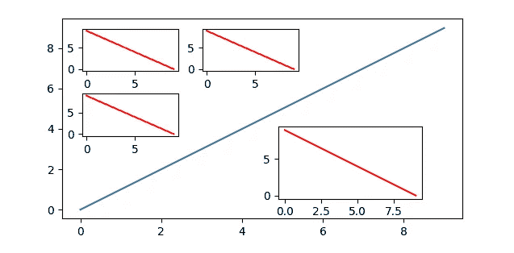

带有四个插入坐标轴的示例图

插入坐标轴是一种强大的数据可视化技术，可以突出特定的图形区域或添加详细的子图。它们是有效利用本来空白的图形空间的绝佳方式。

本教程展示了**4 种在*matplotlib*中创建插入坐标轴的方法**，这些方法可以让你根据坐标轴、整体图形、绝对单位（如英寸）或使用网格系统定位插入坐标轴——后者在处理多个插入坐标轴时特别有用。

我们还将介绍**2 种设置缩放插入图样式的方法**：使用经典的引导线和使用颜色编码覆盖层。

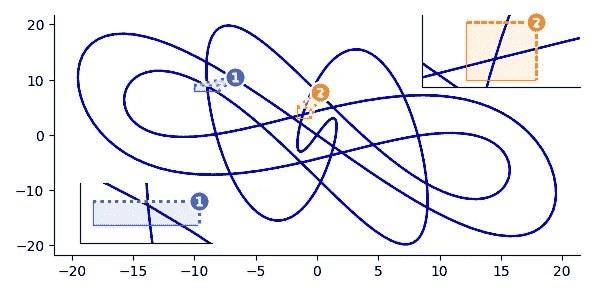

带有颜色编码覆盖层的插入坐标轴

在本教程结束时，你将能够确定哪种方法最符合你的需求，并且拥有一些可以复制/粘贴的代码来实现这一目标。

# 下面是我们将要覆盖的内容。

***创建插入坐标轴：***

1.  *预定义的坐标轴级位置代码*：`mpl_toolkits.axes_grid1.inset_axes`，

1.  *使用坐标轴级坐标手动定位*：`Axes.inset_axes`，并

1.  *使用图形级坐标手动定位*：`Figure.add_axes`；

1.  *多插入自动布局*：`Axes.inset_axes` 与 `outset.layout_corner_insets`。

***添加缩放指示器：***

5\. *引导线*：`Axes.indicate_inset_zoom` 和

6\. *颜色编码的覆盖层*：`OutsetGrid.marqueeplot`。

第四部分和第六部分使用了我最近发布的开源*Outset*库中的新工具，专门用于多尺度数据可视化，我很高兴能与社区分享。

# 方法 1：使用``*mpl_toolkits.axes_grid1.inset_axes`*``

这个函数简化了插入的添加。以下是如何使用它的说明，包括`loc`参数用于定位：

```py
import matplotlib.pyplot as plt
from mpl_toolkits.axes_grid1.inset_locator import inset_axes

fig, ax = plt.subplots(); ax.set_box_aspect(0.5)  # main figure and axes
ax.plot([0, 9], [0, 9])  # example plot

# create inset axes & plot on them
inset_ax = inset_axes(ax, width="30%", height=1.2, loc="upper left")
inset_ax.plot([9, 0], [0, 9], color="r")
plt.xticks([]); plt.yticks([])  # strip ticks, which collide w/ main ax
```

请注意，坐标轴的大小可以*相对于父坐标轴*指定，或者如这里所示，可以*以英寸*为单位指定`宽度`和`高度`。

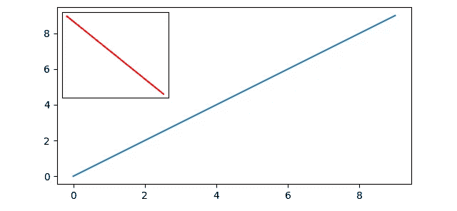

`loc`的支持位置代码如下：

```py
"upper right" | "upper left" | "lower left" | "lower right"
"right" | "center left" | "center right" | "lower center"
"upper center" | "center"
```

# 方法 2：使用`Axes.inset_axes`

Matplotlib 的`Axes`类提供了`inset_axes`成员函数，这是一个简单的方法来创建相对于父坐标轴的插入坐标轴：

```py
import matplotlib.pyplot as plt

fig, ax = plt.subplots(); ax.set_box_aspect(0.5)  # main figure and axes
ax.plot([0, 9], [0, 9])  # example plot

# create inset axes & plot on them
ins_ax = ax.inset_axes([.6, .15, .3, .3])  # [x, y, width, height] w.r.t. ax
ins_ax.plot([9, 0], [0, 9], color="r")
```

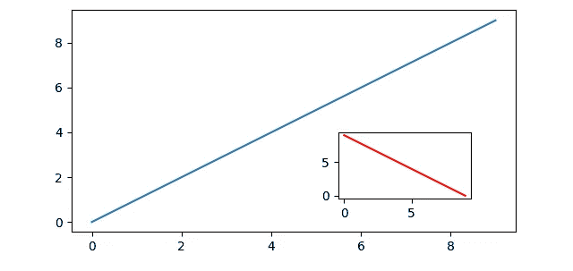

坐标是相对于父坐标轴指定的，因此——例如——(0, 0, 0.5, 0.2)将会在左下角创建一个坐标轴，宽度占父坐标轴的一半，高度占父坐标轴的 0.2。

要相对于父坐标轴`ax`以英寸为单位定位插入坐标轴，我们必须首先计算父坐标轴的尺寸（以英寸为单位）。

```py
w_inch, h_inch = ax.figure.get_size_inches() * ax.get_position().size
```

然后，将你的`x`、`y`、`w`和`h`（单位为英寸）传递给`Axes.inset_axes`，如下所示

```py
ax.inset_axes([x/w_inch, y/h_inch, w/w_inch, h/h_inch])
```

# 方法 3：使用`Figure.add_axes`

Matplotlib 的`Figure`类提供了类似的`add_axes`成员函数，它允许你相对于整体图形定位插入坐标轴。

```py
import matplotlib.pyplot as plt

fig, ax = plt.subplots(); ax.set_box_aspect(0.5)  # main figure and axes
ax.plot([0, 9], [0, 9])  # example plot

# create inset axes & plot on them
ins_ax = fig.add_axes([.2, .5, .2, .2])  # [x, y, width, height] w.r.t. fig
ins_ax.plot([9, 0], [0, 9], color="r") 
```

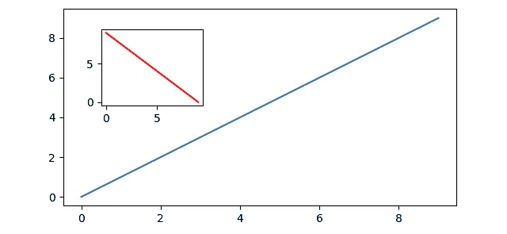

与之前类似，坐标是相对于父坐标轴指定的，因此——例如——(0.5, 0.5, 0.3, 0.2)将创建一个坐标轴，其高度为整体图形的 2/10，宽度为 3/10，左下角在图形内居中。

# 方法 4：`` `Axes.inset_axes ```py with `` `outset.layout_corner_insets` ``

For this next example, we will use the *outset* library, which provides specialized tools for working with inset axes in *matplotlib*. It can be installed as `python3 -m pip install outset`.

The *outset* library provides the flexible `outset.util.layout_corner_insets` utility to position multiple inset axes within a specified corner of a main axes. Here’s how to use it to pick positions for calls to `Axes.inset_axes`.

```

import matplotlib.pyplot as plt

import outset

fig, ax = plt.subplots(); ax.set_box_aspect(0.5)  # 主图形和坐标轴

ax.plot([0, 9], [0, 9])  # 示例图形

# ------ 选择插入坐标轴位置：左上角放 3 个，右下角放一个

inset_positions = outset.util.layout_corner_insets(  # 左上角位置

    3, "NW", # 插入的数量和位置的角落

    # 可选的布局调整...

    inset_pad_ratio=(.2,.35), inset_grid_size=(.6,.65), inset_margin_size=.05)

inset_positions.append(  # 生成右下角位置并添加到列表中

    outset.util.layout_corner_insets(1, "SE", inset_grid_size=.4))

# ----- 创建插入坐标轴并在其上绘图

inset_axes = [*map(ax.inset_axes, inset_positions)]  # 创建插入坐标轴

对于 inset_axes 中的 iax：  # 示例绘图

iax.plot([9, 0], [0, 9], color="r")

```py

Note the optional customizations to inset positioning made through keyword arguments to `outset.util.layout_corner_insets`. Here, “pad” refers to spacing between insets, “margin” refers to space between the insets and the main axes, and “grid size” refers to the overall fraction of axes space that insets are stacked into.


That covers it for techniques to place inset axes!

A common use case for inset axes is to provide magnification of an area of interest within the main plot. Next, we’ll look at two ways to visually correspond magnifying insets with a region of the main plot.

# Method 5: Zoom Indicator Leaders

A classic approach depicting zoom relationships draws connecting lines between the corners of the inset axes and the region it is magnifying. This works especially well when plotting small numbers of insets.

Matplotlib’s `Axes` includes the `indicate_inset_zoom` member function for this purpose. Here’s how to use it.

```

from math import isclose; import matplotlib.pyplot as plt

# 设置主图/坐标轴

fig, main_ax = plt.subplots(); main_ax.set_box_aspect(0.5)

inset_ax = main_ax.inset_axes(

[0.05, 0.65, 0.3, 0.3],  # 相对于坐标轴的[x, y, 宽度, 高度]

    xlim=[4, 5], ylim=[4, 5], # 设置视口并指示与主坐标轴的关系

    xticklabels=[], yticklabels=[]

)

# 添加绘图内容

对于 ax 在 main_ax 和 inset_ax 中：

    ax.plot([0, 9], [0, 9])  # 第一个示例线

    ax.plot([0, 9], [1, 8])  # 第二个示例线

# 添加缩放指示器

main_ax.indicate_inset_zoom(inset_ax, edgecolor="blue")

# 小心！如果插入坐标轴的纵横比与主坐标轴不匹配，请发出警告

if not isclose(inset_ax._get_aspect_ratio(), main_ax._get_aspect_ratio()):

    print("选择的嵌套框 x/ylim & 宽度/高度与主坐标轴的比例倾斜！")

```py

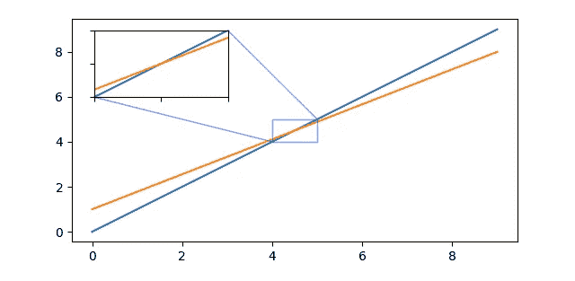

Note that to use `Axes.indicate_inset_zoom`, inset axes must be created using `Axes.inset_axes`.

# Method 6: Zoom Indicator Overlays

When working with larger numbers of insets, it may work better to correspond regions with numbered, color-coded highlights instead of leader lines.

The `outset` library’s `OutsetGrid` provides a `marqueeplot` member function for this purpose. Under this scheme, inset positioning is handled by `outset.inset_outsets`. Here’s how to create a zoom plot with color-coded position overlays.

```

from matplotlib import pyplot as plt

import numpy as np

import outset

# 示例改编自 [`matplotlib.org/stable/gallery/`](https://matplotlib.org/stable/gallery/)

i, a, b, c, d = np.arange(0.0, 2 * np.pi, 0.01), 1, 7, 3, 11

# 3 个坐标轴网格：源图和两个缩放框

grid = outset.OutsetGrid([  # 缩放部分的数据坐标...

    (-10, 8, -8, 9), (-1.6, 5, -0.5, 3)])  # ...如 (x0, y0, x1, y1)

grid.broadcast(plt.plot,  # 在所有坐标轴上运行绘图器

    # subsequent kwargs go to the plotter

    np.sin(i * a) * np.cos(i * b) * 20,  # 线条坐标

    np.sin(i * c) * np.cos(i * d) * 20,  # 线条坐标

    c="mediumblue",  zorder=-1,  # 线条样式

)

# 将嵌套框放置在源图的左下角（"SW"）

outset.inset_outsets(grid, insets="SW")

grid.marqueeplot()  # 渲染叠加注释

```py

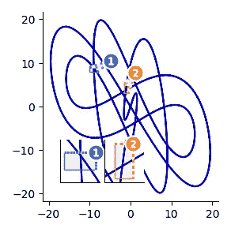

Note that inset positioning can be more finely controlled via `outset.util.layout_corner_insets`, as used for Method 4 above:

```

...  # 如前所示

customized_placements = outset.util.layout_corner_insets(

    2, "SW",  # 在左下角放置 2 个嵌套框

    inset_margin_size=0.05, inset_grid_size=(0.8, 0.55)  # 布局参数

)

outset.inset_outsets(grid, insets=customized_placements)

grid.marqueeplot()  # 渲染叠加注释

```py

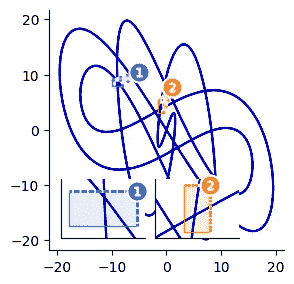

Inset placements can also be manually specified to `outset.inset_outsets`using axes-relative coordinates, too:

```

...  # 如前所示

outset.inset_outsets(grid, insets=[

    (0.05, 0.05, 0.25, 0.25),  # 两个嵌套框，使用相对于坐标轴的坐标...

    (0.7, 0.7, 0.3, 0.3),    # ...指定的 (x0, y0, 宽度, 高度)

])

grid.marqueeplot()  # 渲染叠加注释

```py

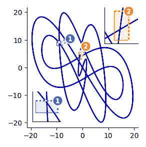

And, finally, to use bigger, side-by-side magnification panels instead of insets, just omit the call to `outset.inset_outsets`.

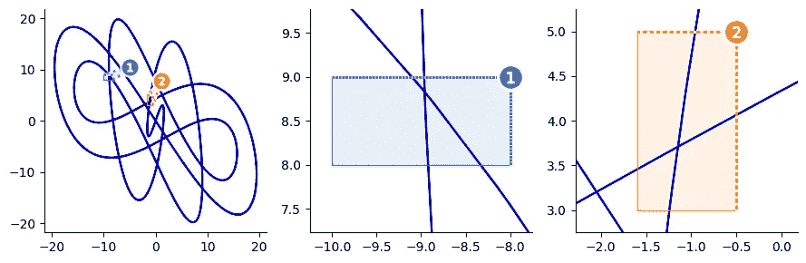

# Conclusion

Inset axes are a great way to take your *matplotlib* visualizations to the next level, whether you’re looking to highlight specific data regions or add detailed subplots.

Here, we’ve covered the variety of approaches at your disposal, both built in to *matplotlib* and using the *outset* library. Each method offers unique advantages, ensuring a good fit for nearly any inset plotting scenario.

Now go make something informative and beautiful! Happy plotting :)

# Further Information

*matplotlib* has some excellent inset example materials that are well worth checking out. In particular,

*   [Zoom region inset axes](https://matplotlib.org/stable/gallery/subplots_axes_and_figures/zoom_inset_axes.html)
*   [Inset locator demo](https://matplotlib.org/stable/gallery/axes_grid1/inset_locator_demo.html)

*outset* also provides some good example materials, notably one on [zoom plots over rain guage time series data](https://mmore500.com/outset/example-rain.html). *outset* also provides a useful [quickstart guide](https://mmore500.com/outset/quickstart.html) and [gallery page](https://mmore500.com/outset/gallery.html).

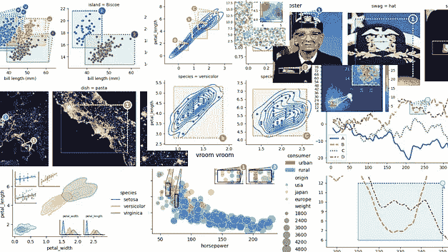

images from the outset gallery

Formal argument-by-argument listings for all code covered here can be found in the API documentation pages for [*outset*](https://mmore500.com/outset/_autosummary/outset.html) and [*matplotlib*](https://matplotlib.org/stable/api/index.html).

Both projects are open source on GitHub, *m*a*tplotlib* under a PSF license at [matplotlib/matplotlib](https://github.com/matplotlib/matplotlib) and *outset* under the MIT License at [mmore500/outset](https://github.com/mmore500/outset) — *outset* is a new project, consider leaving a ⭐️!

Joseph Early also has an excellent medium article on inset axes in matplotlib, which you can read here.

# Authorship

This tutorial is contributed by me, [Matthew Andres Moreno](https://mmore500.com/).


I currently serve as a postdoctoral scholar at the [University of Michigan](https://umich.edu), where my work is supported by the Eric and Wendy Schmidt AI in Science Postdoctoral Fellowship, a Schmidt Futures program.

My appointment is split between the university’s Ecology and Evolutionary Biology Department, the Center for the Study of Complexity, and the Michigan Institute for Data Science.

Find me on Twitter as [@MorenoMatthewA](https://twitter.com/morenomatthewa) and on GitHub as [@mmore500](https://github.com/mmore500/).

*disclosure:* I am the author of the *outset* library.

# Citations

*J. D. Hunter, “Matplotlib: A 2D Graphics Environment”, Computing in Science & Engineering, vol. 9, no. 3, pp. 90–95, 2007\.* [*https://doi.org/10.1109/MCSE.2007.55*](https://doi.org/10.1109/MCSE.2007.55)

*Matthew Andres Moreno. (2023). mmore500/outset. Zenodo.* [*https://doi.org/10.5281/zenodo.10426106*](https://doi.org/10.5281/zenodo.10426106)

# Appendix

To install dependencies for code snippets in this article,

```

python3 -m pip install \

    matplotlib `# ==3.8.2`\

    numpy `# ==1.26.2` \

    outset `# ==0.1.8`

```

*所有图像均为作者作品。*
