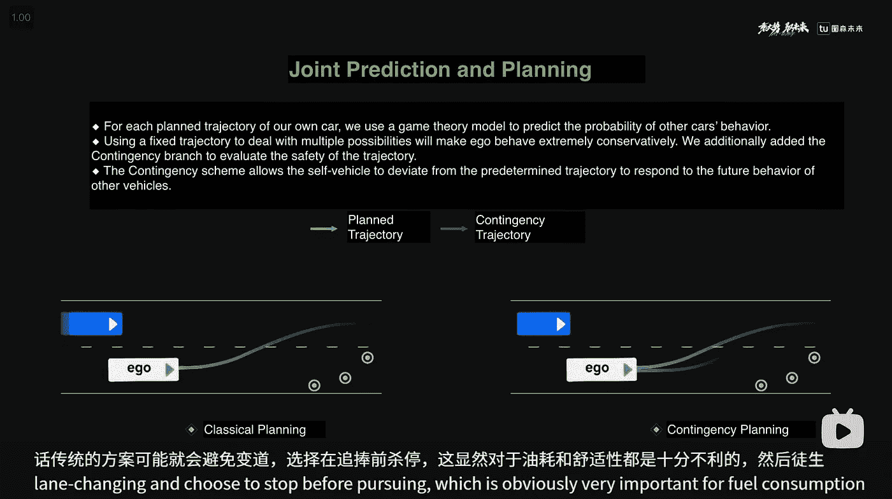

# 自动驾驶感知工程师规划速成课程

> 原文：[`towardsdatascience.com/a-crash-course-of-planning-for-perception-engineers-in-autonomous-driving-ede324d78717?source=collection_archive---------1-----------------------#2024-06-30`](https://towardsdatascience.com/a-crash-course-of-planning-for-perception-engineers-in-autonomous-driving-ede324d78717?source=collection_archive---------1-----------------------#2024-06-30)

## 规划与决策的基础

[](https://medium.com/@patrickllgc?source=post_page---byline--ede324d78717--------------------------------)[](https://towardsdatascience.com/?source=post_page---byline--ede324d78717--------------------------------) [Patrick Langechuan Liu](https://medium.com/@patrickllgc?source=post_page---byline--ede324d78717--------------------------------)

·发表于 [Towards Data Science](https://towardsdatascience.com/?source=post_page---byline--ede324d78717--------------------------------) ·44 分钟阅读·2024 年 6 月 30 日

--


AlphaGo、ChatGPT 和 FSD（图片来源：[Elena Popova](https://unsplash.com/@elenapopova?utm_content=creditCopyText&utm_medium=referral&utm_source=unsplash)、[Karthik Sridasyam](https://unsplash.com/@karthik1324?utm_content=creditCopyText&utm_medium=referral&utm_source=unsplash) 和 [Jonathan Kemper](https://unsplash.com/@jupp?utm_content=creditCopyText&utm_medium=referral&utm_source=unsplash) 于[Unsplash](https://unsplash.com/photos/a-computer-screen-with-a-text-description-on-it-5yuRImxKOcU?utm_content=creditCopyText&utm_medium=referral&utm_source=unsplash))

经典的模块化自动驾驶系统通常由感知、预测、规划和控制组成。直到大约 2023 年，AI（人工智能）或 ML（机器学习）主要增强了大多数量产自动驾驶系统中的**感知**功能，其在下游组件中的影响逐渐减弱。与规划堆栈中 AI 集成较低形成鲜明对比的是，端到端感知系统（例如[BEV 或鸟瞰图感知管道](https://medium.com/towards-data-science/monocular-bev-perception-with-transformers-in-autonomous-driving-c41e4a893944?sk=b7498a375cf92533e8242b1837f29af4)）已经在[量产汽车](https://medium.com/towards-data-science/bev-perception-in-mass-production-autonomous-driving-c6e3f1e46ae0?sk=8963783161435815fa1b0957fd325d39)中部署。


2023 年及之前的经典模块化自动驾驶堆栈设计（图表由作者制作）

这是有多个原因的。基于人工构建框架的经典栈比基于机器学习的特征更具可解释性，并且能够更快地进行迭代，以解决现场测试中的问题（几个小时内解决），而基于机器学习的特征可能需要几天或几周的时间才能完成。然而，让现成的人工驾驶数据闲置是没有意义的。此外，增加计算能力比扩展工程团队更具可扩展性。

幸运的是，学术界和工业界都有一个强烈的趋势，正在改变这种情况。首先，下游模块正变得越来越数据驱动，并且可能通过不同的接口进行集成，比如在[CVPR 2023 最佳论文 UniAD](https://arxiv.org/abs/2212.10156)中提出的接口。此外，受到日益增长的生成式 AI 浪潮的推动，一个单一的统一视觉-语言-动作（VLA）模型在处理复杂的机器人任务中显示出巨大的潜力（学术界的[RT-2](https://robotics-transformer2.github.io/assets/rt2.pdf)，工业界的 TeslaBot 和 1X）以及自动驾驶（学术界的[GAIA-1](https://arxiv.org/abs/2309.17080)、[DriveVLM](https://arxiv.org/abs/2402.12289)，工业界的 Wayve AI driver 和 Tesla FSD）。这将 AI 和数据驱动开发的工具集从感知层带入了规划层。

这篇博客文章旨在介绍规划栈的问题设置、现有方法以及挑战，以感知工程师的速成课程形式进行呈现。作为一名感知工程师，过去几周我终于有时间系统地学习经典的规划栈，并且我想分享我所学到的内容。我还会从 AI 实践者的角度分享我的思考，探讨 AI 如何提供帮助。

本文的目标读者是从事自动驾驶领域的 AI 实践者，特别是感知工程师。

这篇文章有点长（11100 字），下面的目录将最有可能帮助那些想要快速使用关键词进行 ctrl+F 搜索的人。

中文版本可以在[知乎知乎](https://zhuanlan.zhihu.com/p/706193528)上找到。

```py
**Table of Contents (ToC)**

Why learn planning?
What is planning?
  The problem formulation
  The Glossary of Planning
  Behavior Planning
  Frenet vs Cartesian systems
Classical tools-the troika of planning
  Searching
  Sampling
  Optimization
Industry practices of planning
  Path-speed decoupled planning
  Joint spatiotemporal planning
Decision making
  What and why?
  MDP and POMDP
  Value iteration and Policy iteration
  AlphaGo and MCTS-when nets meet trees
  MPDM (and successors) in autonomous driving
Industry practices of decision making
  Trees
  No trees
Self-Reflections
  Why NN in planning?
  What about e2e NN planners?
  Can we do without prediction?
  Can we do with just nets but no trees?
  Can we use LLMs to make decisions?
The trend of evolution
```

# 为什么要学习规划？

这引出了一个有趣的问题：为什么在 AI 时代，尤其是经典的规划栈值得学习？

从问题解决的角度来看，更好地理解客户的挑战，将使你作为一名感知工程师能够更有效地为下游客户服务，即使你的主要工作仍然集中在感知领域。

机器学习是一个工具，而不是一个解决方案。解决问题的最有效方法是将新工具与领域知识结合起来，特别是那些具有扎实数学公式的领域知识。受领域知识启发的学习方法可能会更具数据效率。随着规划从基于规则的系统向基于机器学习的系统过渡，即使端到端系统的早期原型和产品已经上路，仍然需要能够深入理解规划和机器学习基础的工程师。尽管发生了这些变化，传统方法和学习方法可能会在相当长的一段时间内继续共存，比例可能会从 8:2 转变为 2:8。对于在这一领域工作的工程师来说，理解这两个世界几乎是必不可少的。

从价值驱动的开发角度来看，理解传统方法的局限性至关重要。这个洞察力使你能够有效地利用新的机器学习工具来设计一个解决当前问题并带来即时影响的系统。

此外，规划是所有自主智能体中的关键部分，不仅仅是自动驾驶。理解什么是规划以及它如何运作，将使更多的机器学习人才参与到这一激动人心的话题中，推动真正自主智能体的发展，无论是汽车还是其他形式的自动化。

# 什么是规划？

## 问题表述

作为自动驾驶车辆的“大脑”，规划系统对于车辆的安全高效驾驶至关重要。规划者的目标是生成既安全、舒适，又能高效推进到目标的轨迹。换句话说，安全、舒适和效率是规划的三个关键目标。

作为规划系统的输入，所有感知输出都是必需的，包括静态路面结构、动态道路代理、占据网络生成的空闲空间和交通等待情况。规划系统还必须通过监控加速度和加速度变化来确保车辆的舒适性，以实现平滑的轨迹，同时考虑互动和交通礼让。

规划系统生成的轨迹是以一系列航路点的形式表示的，供自车的低层控制器跟踪。具体来说，这些航路点代表了自车在一系列固定时间戳下的未来位置。例如，每个航路点可能相隔 0.4 秒，覆盖 8 秒的规划范围，总共生成 20 个航路点。

一个经典的规划堆栈大致由全局路线规划、局部行为规划和局部轨迹规划组成。全局路线规划提供从起点到终点的路面级路径，该路径基于全局地图。局部行为规划决定接下来几秒钟内的语义驾驶动作类型（例如，跟车、轻推、侧方超车、让行和超车）。基于行为规划模块决定的行为类型，局部轨迹规划生成短期轨迹。全局路线规划通常由地图服务提供，一旦设置了导航，它就不在本文讨论的范围内。接下来，我们将重点讨论行为规划和轨迹规划。

行为规划和轨迹生成可以明确地协同工作，也可以合并成一个单一过程。在显式方法中，行为规划和轨迹生成是两个不同的过程，它们在一个层次结构框架内运行，工作频率不同，其中行为规划的频率为 1–5 Hz，轨迹规划的频率为 10–20 Hz。尽管大多数时候效率很高，但适应不同场景可能需要进行重大修改和微调。更高级的规划系统将两者合并成一个单一的优化问题。这种方法确保了可行性和最优性，不会做出任何妥协。


规划设计方法的分类（来源：[Fluid Dynamics Planner](https://arxiv.org/abs/2406.05708))

## 规划术语表

你可能已经注意到，上述部分中使用的术语与图像并不完全匹配。没有统一的标准术语被广泛采用。在学术界和工业界，工程师使用不同的名称来指代同一概念，或用相同的名称指代不同的概念，这并不罕见。这表明自动驾驶中的规划仍在积极发展中，并未完全统一。

在这里，我列出了本文中使用的符号，并简要解释了文献中出现的其他概念。

+   规划：一个顶级概念，与控制平行，用于生成轨迹的关键点。规划与控制一起被统称为 PnC（规划与控制）。

+   控制：一个顶级概念，接收轨迹关键点并生成高频率的转向、油门和刹车命令，供执行器执行。与其他领域相比，控制相对成熟，尽管 PnC 的常见观点存在，但它超出了本文的范围。

+   预测：一个顶级概念，用于预测除自车外的交通参与者的未来轨迹。预测可以看作是其他交通参与者的轻量级规划器，也称为运动预测。

+   行为规划：一个生成高级语义动作（如车道变换、超车）的模块，通常会生成粗略的轨迹。它也被称为任务规划或决策制定，特别是在交互的上下文中。

+   运动规划：一个模块，接收语义动作，并生成平滑、可行的轨迹航点，供控制在规划时域内执行。它也被称为轨迹规划。

+   轨迹规划：运动规划的另一种说法。

+   决策制定：专注于交互的行为规划。如果没有自车与其他主体的交互，则仅称为行为规划。它也被称为战术决策制定。

+   路径规划：在道路网络上找到首选路线，也称为任务规划。

+   基于模型的方法：在规划中，指的是手工构建的框架，这些框架用于经典的规划栈，与神经网络模型相对。基于模型的方法与基于学习的方法形成对比。

+   多模态：在规划的上下文中，通常指的是多个意图。这与感知中的多模态传感器输入或多模态大型语言模型（如 VLM 或 VLA）中的多模态有所不同。

+   参考线：基于全局路线信息和自车当前状态的局部（几百米范围内）且粗略的路径。

+   弗涅坐标：基于参考线的坐标系统。弗涅坐标将笛卡尔坐标系中的曲线路径简化为一条直线隧道模型。以下会有更详细的介绍。

+   轨迹：三维时空曲线，表示为笛卡尔坐标中的（x, y, t）或弗涅坐标中的（s, l, t）。轨迹由路径和速度组成。

+   路径：二维空间曲线，表示为笛卡尔坐标中的（x, y）或弗涅坐标中的（s, l）。

+   语义动作：一种高级抽象的动作（如跟车、轻推、侧超车、让行、超车），具有明确的人类意图。也被称为意图、策略、机动或原始运动。

+   动作：一个没有固定含义的术语。它可以指代控制的输出（执行器所执行的高频率转向、油门和刹车指令），也可以指代规划的输出（轨迹的航点）。语义动作指的是行为预测的输出。

不同的文献可能使用不同的符号和概念。以下是一些示例：

+   决策系统：有时也包括规划和控制。（来源：[自动驾驶城市车辆运动规划与控制技术综述](https://arxiv.org/pdf/1604.07446)，以及[BEVGPT](https://arxiv.org/abs/2310.10357)）

+   运动规划：有时是顶层的规划概念，包含行为规划和轨迹规划。（来源：[基于流体动力学的通用运动规划方法应用于自动驾驶车辆](https://arxiv.org/abs/2406.05708)）

+   规划：有时包括行为规划、运动规划以及路线规划。

这些变化展示了术语的多样性以及该领域不断发展的特点。

## 行为规划

作为一名机器学习工程师，你可能会注意到行为规划模块是一个 heavily 依赖人工设计的中间模块。对于其输出的具体形式和内容并没有共识。具体来说，行为规划的输出可以是参考路径或在自我机动过程中对目标物体的标注（例如，从左侧或右侧超车，超车或让行）。术语“语义动作”并没有严格的定义，也没有固定的方法。

行为规划与运动规划的解耦提高了在解决自动驾驶车辆极高维度动作空间时的效率。自动驾驶车辆的行为需要在通常为 10Hz 或更高的频率下推理（时间分辨率以路径点为单位），且大多数动作相对简单，如直行。解耦后，行为规划层只需以相对粗糙的分辨率推理未来场景，而运动规划层则基于行为规划做出的决策，在局部解空间中进行操作。行为规划的另一个好处是将非凸优化问题转化为凸优化问题，下面我们将进一步讨论这一点。

## 弗雷内坐标系与笛卡尔坐标系的对比

弗雷内坐标系是一种广泛采用的坐标系统，值得单独设立一个介绍部分。弗雷内框架通过独立地管理相对于参考路径的横向和纵向运动，简化了轨迹规划。sss 坐标表示纵向位移（沿道路的距离），而 lll（或 ddd）坐标表示横向位移（相对于参考路径的侧向位置）。

弗雷内坐标系将笛卡尔坐标系中的曲线路径简化为一个直线隧道模型。这种转换将曲线路段上的非线性道路边界约束转化为线性约束，从而显著简化后续的优化问题。此外，人类对纵向和横向运动的感知不同，弗雷内坐标系允许对这些运动进行独立且更灵活的优化。


从笛卡尔坐标系到弗雷内坐标系的转换示意图（来源：[笛卡尔规划器](https://ieeexplore.ieee.org/document/9703250)）

弗雷内坐标系需要清晰、结构化的道路图，且道路曲率较小。实际应用中，更适合用于曲率较小的结构化道路，如高速公路或城市快速路。然而，当参考线的曲率增加时，弗雷内坐标系的问题会被放大，因此在曲率较大的结构化道路上，如带导向线的城市交叉口，使用时应谨慎。

对于没有结构的道路，如港口、矿区、停车场或没有指引线的交叉口，推荐使用更灵活的笛卡尔坐标系统。笛卡尔系统更适合这些环境，因为它能更有效地处理更高的曲率和更少结构化的场景。

# 经典工具——规划的三驾马车

自动驾驶中的规划涉及从初始的高维状态（包括位置、时间、速度、加速度和震动）计算一条轨迹到目标子空间，确保满足所有约束条件。搜索、采样和优化是规划中最广泛使用的三种工具。

## 搜索

经典的图搜索方法在规划中很受欢迎，并且广泛应用于结构化道路上的路线/任务规划，或直接用于无结构环境（如停车场或城市交叉口，尤其是无地图场景）的运动规划，寻找最佳路径。其发展路径明确，从 Dijkstra 算法到 A*（A-star），再到混合 A*。

Dijkstra 算法通过探索所有可能的路径来找到最短路径，使其成为一种盲目（无信息）的搜索算法。它是一种系统的方法，保证最优路径，但部署时效率较低。如下面的图表所示，它几乎会探索所有方向。本质上，Dijkstra 算法是加权的广度优先搜索（BFS）。为了提高效率，我们可以利用目标位置的信息来缩小搜索空间。


Dijkstra 算法和 A* 搜索的可视化（来源：[PathFinding.js](https://qiao.github.io/PathFinding.js/visual/)，示例灵感来自于 [RedBlobGames](https://www.redblobgames.com/pathfinding/a-star/introduction.html)）

A* 算法使用启发式方法优先考虑看似更接近目标的路径，从而提高效率。它将当前的成本（Dijkstra）与到达目标的成本（启发式，本质上是贪婪的最佳优先搜索）结合起来。只有当启发式方法是可接受且一致的时，A* 才能保证最短路径。如果启发式方法不佳，A* 的性能可能会比 Dijkstra 基准差，甚至可能退化为贪婪最佳优先搜索。

在自动驾驶的具体应用中，混合 A* 算法通过考虑车辆运动学进一步改进了 A*。A* 可能无法满足运动学约束，也无法准确跟踪路径（例如，转向角度通常在 40 度以内）。尽管 A* 在网格空间中对状态和动作都进行操作，混合 A* 将它们分开，保持状态在网格中，但根据运动学允许连续的动作。

解析扩展（射击到目标）是混合 A* 提出的另一个关键创新。A* 的一种自然增强方法是将最近探索的节点与目标连接，使用不碰撞的直线。如果可能的话，我们就找到了这个解。在混合 A* 中，这条直线被替换为符合车辆动力学的杜宾曲线和里德-谢普（RS）曲线。这种提前停止方法通过更多关注远端的可行性，平衡了最优性和可行性。

混合 A* 在停车场场景和无地图的城市交叉口中被广泛使用。这里有一个非常好的视频展示了它如何在停车场场景中工作。


带有解析扩展的混合 A* 算法（来源：[2010 IJRR 混合 A* 论文](https://www.semanticscholar.org/paper/Path-Planning-for-Autonomous-Vehicles-in-Unknown-Dolgov-Thrun/0e8c927d9c2c46b87816a0f8b7b8b17ed1263e9c) 和 [2012 Udacity 课程](https://www.youtube.com/watch?v=qXZt-B7iUyw&ab_channel=Udacity)）

## 采样

另一个流行的规划方法是采样。著名的蒙特卡罗方法是一种随机采样方法。本质上，采样涉及随机或根据先验选择许多候选项，然后根据定义的成本选择最优的那个。对于基于采样的方法，快速评估许多选项至关重要，因为它直接影响自动驾驶系统的实时性能。

> 大型语言模型（LLMs）本质上提供样本，并且需要一个评估器，其定义的成本与人类偏好对齐。这个评估过程确保所选择的输出符合期望的标准和质量。这一过程基本上就是所谓的对齐。

如果我们已经知道给定问题或子问题的解析解，则可以在参数化的解空间中进行采样。例如，通常我们希望最小化冲击的平方的时间积分（位置 p(t) 的三阶导数，表示为 p 上的三点符号，其中一个点代表相对于时间的一个阶导数），这是在其他标准下进行的。


最小化平方冲击以提高驾驶舒适性（来源：[Werling 等人](https://www.semanticscholar.org/paper/Optimal-trajectory-generation-for-dynamic-street-in-Werling-Ziegler/6bda8fc13bda8cffb3bb426a73ce5c12cc0a1760)，ICRA 2010）

可以通过数学证明，五次（5 阶）多项式在位置-速度-加速度空间中提供了两种状态之间的冲击最优连接，即使在考虑额外的成本项时也是如此。通过在这个五次多项式的参数空间中进行采样，我们可以找到一个具有最小成本的解，从而获得近似解。成本考虑了诸如速度、加速度、冲击限制和碰撞检查等因素。这种方法本质上通过采样来解决优化问题。


横向运动时间配置文件的采样（来源：[Werling 等人](https://www.semanticscholar.org/paper/Optimal-trajectory-generation-for-dynamic-street-in-Werling-Ziegler/6bda8fc13bda8cffb3bb426a73ce5c12cc0a1760)，ICRA 2010）

基于采样的方法启发了众多机器学习论文，包括 CoverNet、Lift-Splat-Shoot、NMP 和 MP3。这些方法用大量数据库中的人类驾驶行为取代了数学上合理的五次多项式。轨迹的评估可以轻松并行化，这进一步支持了基于采样的方法。该方法有效地利用了大量专家示范，模仿了类似人类的驾驶行为，同时避免了对加速度和转向配置文件的随机采样。


从人类驾驶数据中进行采样以支持数据驱动的规划方法（来源：[NMP](http://www.cs.toronto.edu/~wenjie/papers/cvpr19/nmp.pdf)，[CoverNet](https://arxiv.org/abs/1911.10298) 和 [Lift-splat-shoot](https://arxiv.org/abs/2008.05711)）

## 优化

优化通过在给定约束下最大化或最小化特定的目标函数来找到问题的最佳解决方案。在神经网络训练中，采用类似的原理，使用梯度下降和反向传播调整网络的权重。然而，在神经网络之外的优化任务中，模型通常较为简单，且常常采用比梯度下降更有效的方法。例如，虽然梯度下降可以应用于二次规划，但它通常不是最有效的方法。

在自动驾驶中，优化规划成本通常会考虑动态物体以避免障碍物，静态道路结构以跟随车道，导航信息以确保正确路线，以及自车状态以评估平顺性。

优化可以分为凸优化和非凸优化两类。其主要区别在于，在凸优化场景中，只有一个全局最优解，而这个解也是局部最优解。这一特性使得优化问题不受初始解的影响。对于非凸优化，初始解非常重要，如下图所示。


凸优化与非凸优化（来源：[斯坦福课程资料](https://stanford.edu/~pilanci/papers/TALK_Sketching.pdf)）

由于规划涉及高度非凸优化，且存在多个局部最优解，因此它严重依赖于初始解。此外，凸优化通常运行得更快，因此更适用于诸如自动驾驶等车载实时应用。一个典型的方法是将凸优化与其他方法结合使用，首先勾画出一个凸的解空间。这就是将行为规划与运动规划分开的数学基础，在这个过程中，找到一个良好的初始解是行为规划的职责。

以避障为例，它通常会引入非凸问题。如果我们知道推动方向，那么这就变成了一个凸优化问题，障碍物的位置作为约束条件成为优化问题的下界或上界。如果我们不知道推动方向，我们需要先决定哪个方向来推动，这使得问题变成了一个由运动规划来解决的凸问题。这个推动方向的决定属于行为规划范畴。

> 当然，我们也可以通过直接优化非凸优化问题来解决，比如使用投影梯度下降、交替最小化、粒子群优化（PSO）和遗传算法等工具。然而，这超出了本文的讨论范围。


凸路径规划问题与非凸路径规划问题（作者制作的图表）


凸与非凸路径规划问题的解决过程（作者制作的图表）

我们如何做出这样的决策呢？我们可以使用前述的搜索或采样方法来解决非凸问题。基于采样的方法通过在参数空间中分散多个选项，类似于搜索，有效地处理非凸问题。

你也许会质疑，为什么仅仅决定从哪个方向推动就足够保证问题空间是凸的。为了说明这一点，我们需要讨论拓扑学。在路径空间中，相似的可行路径可以在没有障碍物干扰的情况下连续地互相转化。这些相似路径在拓扑学的正式语言中被归为“同伦类”，它们都可以通过一个初始解来探索，这个初始解与这些路径是同伦的。所有这些路径共同形成了一个驾驶通道，如上图中的红色或绿色阴影区域所示。对于三维时空情况，请参考[QCraft 技术博客](https://zhuanlan.zhihu.com/p/551381336)。

> 我们可以利用[*广义 Voronoi 图*](https://zhuanlan.zhihu.com/p/551381336)来列举所有同伦类，这大致对应于我们可用的不同决策路径。然而，这个话题涉及到高级数学概念，超出了本文的范围。

高效解决优化问题的关键在于优化求解器的能力。通常，求解器需要大约 10 毫秒来规划一条轨迹。如果我们能够将这一效率提高十倍，将对算法设计产生重大影响。这个改进在 2022 年特斯拉 AI 日中得到了突出展示。类似的改进也出现在感知系统中，随着可用计算能力提升十倍，从 2D 感知转向了鸟瞰图（BEV）。通过更高效的优化器，可以计算和评估更多选项，从而减少决策过程的重要性。然而，设计一个高效的优化求解器需要大量的工程资源。

> 每次计算能力提升 10 倍时，算法将进化到下一代。
> 
> — — 未验证的算法进化定律

# 规划的行业实践

各种规划系统的关键区别在于它们是否是时空解耦的。具体来说，时空解耦方法首先在空间维度上进行规划以生成路径，然后在该路径上规划速度轮廓。这种方法也被称为路径-速度解耦。

路径-速度解耦通常被称为横向-纵向（lat-long）解耦，其中横向（lat）规划对应路径规划，纵向（long）规划对应速度规划。这一术语似乎源自前面解释的弗雷内坐标系。

解耦方案更易于实现，能够解决大约 95%的问题。相比之下，联合方案具有更高的理论性能上限，但实现起来更具挑战性。它们涉及更多的参数调节，并且需要更有原则的参数调节方法。


解耦与联合规划的比较（来源：由作者制作，灵感来源于[Qcraft](https://www.xchuxing.com/article/63767)）


解耦与联合时空规划的优缺点（图表由作者制作）

## 路径-速度解耦规划

我们可以以[Baidu Apollo EM 规划器](https://arxiv.org/abs/1807.08048)为例，展示使用路径-速度解耦规划的系统。

EM 规划器通过将三维的站点-横向-速度问题转化为两个二维问题：站点-横向和站点-速度，从而显著降低了计算复杂度。Apollo 的 EM 规划器的核心是一个迭代的期望最大化（EM）步骤，由路径优化和速度优化组成。每个步骤被分为 E 步骤（在二维状态空间中的投影和公式化）和 M 步骤（在二维状态空间中的优化）。E 步骤涉及将三维问题投影到弗雷内 SL 框架或 ST 速度跟踪框架中。


Apollo EM 规划器中的 EM 迭代（来源：[百度 Apollo EM 规划器](https://arxiv.org/abs/1807.08048)）

在路径和速度优化中的 M 步（最大化步骤）涉及解决非凸优化问题。对于路径优化，这意味着决定是否将物体推向左侧或右侧；而对于速度优化，则涉及决定是超车还是对动态物体让行。Apollo EM 规划器通过两步法解决这些非凸优化挑战：动态规划（DP）和二次规划（QP）。

动态规划（DP）使用采样或搜索算法生成粗略的初步解，有效地将非凸空间修剪成凸空间。然后，二次规划（QP）将粗略的 DP 结果作为输入，在 DP 提供的凸空间内进行优化。本质上，DP 关注可行性，而 QP 则在凸约束下对解进行精炼，以实现最优解。

在我们定义的术语中，路径 DP 对应于横向基本规划（BP），路径 QP 对应于横向主规划（MP），速度 DP 对应于纵向基本规划（BP），速度 QP 对应于纵向主规划（MP）。因此，该过程涉及在路径和速度步骤中先进行基本规划（BP），然后进行主规划（MP）。


一个完整的自动驾驶系统，采用路径-速度解耦规划（图表由作者制作）

## 联合时空规划

虽然解耦规划可以解决自动驾驶中 95%的情况，但剩余的 5%涉及具有挑战性的动态交互，在这些情况下，解耦解往往导致次优的轨迹。在这些复杂场景中，展现智能是至关重要的，这也使其成为该领域的一个热点话题。

例如，在狭窄空间通过时，最优行为可能是减速让行或加速超车。这样的行为在解耦的解空间内无法实现，需要联合优化。联合优化允许更综合的方法，能够同时考虑路径和速度，从而有效处理复杂的动态交互。


一个完整的自动驾驶系统，采用联合时空规划（图表由作者制作）

然而，联合时空规划面临重大挑战。首先，在更高维的状态空间中直接解决非凸问题比使用解耦方案更加困难且耗时。其次，在时空联合规划中考虑交互性则更加复杂。我们将在后续讨论决策时更详细地探讨这一主题。

在这里，我们介绍了两种求解方法：暴力搜索和构建时空走廊进行优化。

粗暴搜索直接发生在三维时空空间中（空间为二维，时间为一维），可以在 XYT（笛卡尔坐标）或 SLT（弗雷内坐标）坐标系中执行。我们以 SLT 为例。SLT 空间长而平坦，类似于一个能量条。它在 L 维度上拉长，在 ST 面上平坦。对于粗暴搜索，我们可以使用混合 A 星算法，代价是进度代价与前进代价的组合。在优化过程中，我们必须遵守搜索约束，防止在 s 和 t 维度上发生反向移动。


空间时间晶格中的变道超车（来源：[基于 A*的时空优化](https://www.qichegongcheng.com/CN/abstract/abstract1500.shtml)）

另一种方法是构建时空走廊，本质上是一个曲线，表示汽车的足迹在三维时空状态空间中盘旋（例如 SLT）。[SSC（时空语义走廊，RAL 2019）](https://arxiv.org/abs/1906.09788)将语义元素提供的需求编码到语义走廊中，从而生成安全轨迹。语义走廊由一系列互相连接的无碰撞立方体组成，这些立方体的动态约束由时空域中的语义元素施加。在每个立方体内，它变成一个凸优化问题，可以使用二次规划（QP）来求解。

SSC 仍然需要一个 BP（行为规划）模块来提供粗略的驾驶轨迹。环境中的复杂语义元素相对于参考车道投影到时空域中。[EPSILON（TRO 2021）](https://arxiv.org/abs/2108.07993)展示了一个系统，其中 SSC 作为与行为规划器协同工作的运动规划器。在下一节中，我们将讨论行为规划，特别是专注于交互。在这种情况下，行为规划通常被称为决策制定。


时空走廊的示意图（来源：[SSC](https://arxiv.org/abs/1906.09788)）

# 决策制定

## 什么和为什么？

自动驾驶中的决策制定本质上是行为规划，但更侧重于与其他交通主体的交互。假设其他主体大多数是理性的，并且会以可预测的方式响应我们的行为，这种情况可以描述为“有噪声的理性”。

当先进的规划工具可用时，人们可能会质疑决策制定的必要性。然而，有两个关键因素——不确定性和交互——使得环境具有了概率性质，主要是由于动态物体的存在。交互是自动驾驶中最具挑战性的部分，它将自动驾驶与一般机器人技术区分开来。自动驾驶汽车不仅要导航，还必须预测并应对其他主体的行为，因此，稳健的决策制定对安全性和效率至关重要。

在没有互动的确定性（纯几何）世界中，决策将是多余的，通过搜索、采样和优化进行规划就足够了。在三维 XYT 空间中进行暴力搜索可以作为一种通用解决方案。

在大多数经典自动驾驶系统中，采用预测-然后规划的方法，假设自车与其他车辆之间是零阶互动。该方法将预测结果视为确定性的，要求自车做出相应的反应。这会导致过于保守的行为，典型例子就是“冻结机器人”问题。在这种情况下，预测填充了整个时空空间，阻止了像在拥挤条件下变道这样的动作——这是人类能更有效管理的事情。

为了处理随机策略，马尔可夫决策过程（MDP）或部分可观测马尔可夫决策过程（POMDP）框架是必不可少的。这些方法将重点从几何转向概率，解决混乱的不确定性。通过假设交通参与者理性行为或至少是嘈杂理性，决策可以帮助在本应混乱的时空空间中创建安全的行驶通道。

在规划的三个主要目标——安全、舒适性和效率——中，决策主要提升效率。保守的行为可以最大化安全性和舒适性，但通过决策有效地与其他道路参与者协商，对于实现最优效率至关重要。有效的决策也展现了智能。

## MDP 和 POMDP

我们将首先介绍马尔可夫决策过程（MDP）和部分可观测马尔可夫决策过程（POMDP），接着介绍它们的系统化解法，如价值迭代和策略迭代。

马尔可夫过程（MP）是一种处理动态随机现象的随机过程，不同于静态概率。在马尔可夫过程中，未来状态仅依赖于当前状态，因此仅凭当前状态就足够进行预测。对于自动驾驶而言，相关的状态可能只包括最后一秒的数据，我们可以扩展状态空间，允许使用更短的历史窗口（例如，取代更长的位置信息历史，可以使用更短的位置信息、速度、加速度等历史窗口）。

马尔可夫决策过程（MDP）是通过引入行动扩展了马尔可夫过程，涵盖了决策过程。MDP 模型中的决策过程，其结果既有部分随机性，也有部分由决策者或智能体控制。一个 MDP 可以通过五个因素来建模：

1.  状态（S）：环境的状态。

1.  行动（A）：智能体可以采取的、影响环境的动作。

1.  奖励（R）：环境因行动而给予智能体的奖励。

1.  转移概率（P）：智能体采取行动后，从旧状态转移到新状态的概率。

1.  折扣因子（γ）：未来奖励的折扣因子。

这也是强化学习（RL）使用的常见框架，RL 本质上是一个 MDP。MDP 或 RL 的目标是在长期内最大化累积回报。这要求智能体根据策略，在给定的环境状态下做出正确的决策。

策略π是一个映射，将每个状态 s ∈ S 和动作 a ∈ A(s)映射到在状态 s 下采取动作 a 的概率π(a|s)。MDP 或强化学习研究如何推导出最优策略的问题。


MDP 和 RL 中的智能体-环境接口（来源：[强化学习：导论](https://web.stanford.edu/class/psych209/Readings/SuttonBartoIPRLBook2ndEd.pdf)）

部分可观察的马尔可夫决策过程（POMDP）通过认识到状态不能直接观察到，而是通过观察来推测，增加了额外的复杂性。在 POMDP 中，智能体保持一种信念——对可能状态的概率分布——来估计环境的状态。由于环境的不确定性和部分可观察性，自动驾驶场景通常由 POMDP 更好地表示。MDP 可以看作是 POMDP 的一个特例，其中观察能够完美地揭示状态。


MDP 与 POMDP（来源：[POMDPs 作为随机应急规划](https://www.researchgate.net/figure/MDP-and-POMDP-visualization_fig1_374986767)）

POMDPs 可以主动收集信息，从而采取收集必要数据的行动，展现了这些模型的智能行为。这一能力在一些场景中尤为重要，比如在交叉口等待时，收集其他车辆意图和交通信号灯状态的信息对做出安全和高效的决策至关重要。

# 值迭代与策略迭代

**值迭代**和**策略迭代**是解决 MDP 或 POMDP 问题的系统方法。尽管由于其复杂性，这些方法在实际应用中不常用，但理解它们能够帮助我们洞察精确解的获取方式，以及如何在实践中简化这些方法，比如在 AlphaGo 中使用 MCTS，或者在自动驾驶中使用 MPDM。

在 MDP 中找到最佳策略，我们必须评估一个状态的潜在或期望回报，或者更具体地说，评估在该状态下采取某个动作的回报。这个期望回报不仅包括即时回报，还包括所有未来的回报，正式称为回报或累积折扣回报。（若要深入了解，请参考“[强化学习：导论](https://medium.com/p/ede324d78717/edit#:~:text=https%3A//web.stanford.edu/class/psych209/Readings/SuttonBartoIPRLBook2ndEd.pdf)”，这本书常被视为该领域的权威指南。）

价值函数（V）通过求和期望回报来描述状态的质量。动作价值函数（Q）则评估在特定状态下执行某一动作的质量。这两个函数都是根据给定策略来定义的。贝尔曼最优性方程表明，*最优*策略将选择能够*最大化*即时奖励以及从结果状态中获得的期望未来奖励的动作。简单来说，贝尔曼最优性方程建议考虑动作的即时奖励以及未来的后果。例如，在换工作时，不仅要考虑即时的加薪（R），还要考虑新职位带来的未来价值（S’）。


贝尔曼最优性方程（图表由作者制作）

一旦获得最优值函数，从贝尔曼最优性方程中提取最优策略是相对简单的。那么我们如何找到这个最优值函数呢？这时，价值迭代就派上用场了。


从最优值中提取最佳策略（图表由作者制作）

价值迭代通过反复更新每个状态的值，直到其稳定，从而找到最佳策略。这个过程是通过将贝尔曼最优性方程转化为更新规则来实现的。从本质上讲，我们使用最优的未来图景来引导迭代朝着它前进。通俗来说，就是“装作成功直到你成功！”


在贝尔曼方程的指导下更新价值函数（图表由作者制作）

价值迭代在有限状态空间内保证收敛，无论初始状态值如何（详细证明请参见[强化学习圣经](https://medium.com/p/ede324d78717/edit#:~:text=https%3A//medium.com/p/ede324d78717/edit%23%3A~%3Atext%3Dhttps%253A//web.stanford.edu/class/psych209/Readings/SuttonBartoIPRLBook2ndEd.pdf)）。如果折扣因子 gamma 设置为 0，意味着我们只考虑即时奖励，价值迭代将在一次迭代后收敛。较小的 gamma 会导致更快的收敛，因为考虑的视野更短，尽管这不一定总是解决具体问题的最佳选择。平衡折扣因子是工程实践中的关键方面。

有人可能会问，如果所有状态都初始化为零，这个方法如何有效。贝尔曼方程中的即时奖励对于引入额外信息并打破初始对称性至关重要。想一想那些能直接到达目标状态的状态，它们的价值像病毒一样传播在状态空间中。通俗来说，这就是不断地取得小胜利。


值函数和策略函数相互作用，直到它们一起收敛到最优值（来源：[强化学习：导论](https://web.stanford.edu/class/psych209/Readings/SuttonBartoIPRLBook2ndEd.pdf)）

然而，值迭代也存在低效的问题。它需要在每次迭代中通过考虑所有可能的行动来选择最优行为，类似于 Dijkstra 算法。尽管作为一种基本方法它是可行的，但通常不适用于现实世界的应用。


贝尔曼方程与贝尔曼最优方程的对比（图表由作者制作）

策略迭代在此基础上进行改进，依据当前策略采取行动，并根据贝尔曼方程（而非贝尔曼最优方程）进行更新。策略迭代将策略评估与策略改进解耦，使其成为一种更快速的解决方案。每一步都是根据给定的策略来执行，而不是探索所有可能的行动以找到最大化目标的行动。尽管策略迭代的每次迭代可能因策略评估步骤而计算量较大，但总体上它能更快地收敛。

简单来说，如果你只能完全评估某个行为的结果，最好还是依赖自己的判断，尽力利用当前可用的信息。

## AlphaGo 与蒙特卡洛树搜索（MCTS）——当网络遇见树

我们都听过 AlphaGo 在 2016 年击败世界顶级围棋选手的惊人故事。AlphaGo 将围棋的游戏规则视为马尔可夫决策过程（MDP），并通过蒙特卡洛树搜索（MCTS）进行求解。那么，为什么不使用值迭代或策略迭代呢？

值迭代和策略迭代是解决 MDP 问题的系统性迭代方法。然而，即使是改进后的策略迭代，仍然需要执行耗时的操作来更新每个状态的值。标准的 19x19 围棋棋盘大约有[2e170 种可能状态](https://senseis.xmp.net/?NumberOfPossibleGoGames=)。如此庞大的状态空间使得传统的值迭代或策略迭代方法无法解决。

AlphaGo 及其后续版本使用[蒙特卡洛树搜索](https://en.wikipedia.org/wiki/Monte_Carlo_tree_search)（MCTS）算法来寻找最佳走法，并通过值网络和策略网络进行指导，这些网络通过人类和计算机对局的数据进行训练。我们先来了解一下基础的 MCTS。


AlphaGo 的 MCTS 四个步骤，结合了值网络和策略网络（来源：[AlphaGo](https://www.nature.com/articles/nature16961)，《自然》2016）

**蒙特卡洛树搜索（MCTS）**是一种用于策略估计的方法，侧重于从当前状态进行决策。一次迭代涉及四个步骤：选择、扩展、模拟（或评估）和备份。

1.  **选择**：算法根据之前的模拟结果，遵循最有前景的路径，直到到达一个叶节点，即尚未完全探索的位置。

1.  **扩展**：添加一个或多个子节点，表示从叶节点出发的可能下一步。

1.  **模拟（评估）**：算法从新节点开始，随机进行一局游戏，直到结束，这称为“回放”。这通过模拟随机动作直到达到终止状态，评估从扩展节点的潜在结果。

1.  **回传**：算法根据游戏结果更新路径上节点的值。如果结果是胜利，节点的值增加；如果是失败，节点的值减少。这个过程将回放的结果向上传播，基于模拟的结果细化策略。

在一定次数的迭代后，MCTS 提供了在模拟过程中从根节点选择即时动作的百分比频率。在推理时，会选择访问次数最多的动作。这里是一个简单的[MTCS 互动示意图](https://vgarciasc.github.io/mcts-viz/)展示了井字游戏。

AlphaGo 中的 MCTS 通过两个神经网络得到增强。**值网络**评估给定状态（棋盘配置）的胜率。**策略网络**评估所有可能动作的分布。这些神经网络通过减少搜索树的有效深度和广度来改进 MCTS。策略网络有助于采样动作，集中搜索有前景的动作，而值网络提供了对位置的更准确评估，减少了广泛回放的需求。这种组合使得 AlphaGo 能够在围棋的广阔状态空间中进行高效且有效的搜索。


AlphaGo 的策略网络和值网络（来源：[AlphaGo](https://www.nature.com/articles/nature16961)，Nature 2016）

在**扩展**步骤中，策略网络对最可能的位置进行采样，有效地修剪了搜索空间的广度。在**评估**步骤中，值网络对位置进行本能的评分，而更快速、轻量级的策略网络则执行回放，直到游戏结束并收集奖励。然后，MCTS 使用两个网络评估的加权总和来做出最终评估。

> 注意，单次对值网络的评估接近使用 RL 策略网络的蒙特卡罗回放的准确度，但计算量少了 15,000 倍。这类似于快-慢系统的设计，类似于诺贝尔奖得主丹尼尔·卡尼曼所描述的[系统 1 与系统 2](https://medium.com/p/ede324d78717/edit#:~:text=https%3A//en.wikipedia.org/wiki/Thinking%2C_Fast_and_Slow)，也可见于最近的工作中，如[DriveVLM](https://arxiv.org/abs/2402.12289)。
> 
> 准确地说，AlphaGo 在不同的层次上结合了两种慢速-快速系统。在宏观层面，策略网络选择棋步，而更快的回滚策略网络评估这些棋步。在微观层面，更快的回滚策略网络可以通过一个价值网络来近似，该网络直接预测棋盘位置的胜率。

我们可以从 AlphaGo 中为自动驾驶学到什么？AlphaGo 展示了使用强大的世界模型（仿真）提取优秀策略的重要性。同样，自动驾驶也需要一个高精度的仿真，以有效地利用类似于 AlphaGo 的算法。这一方法强调了将强大的策略网络与详细、精确的仿真相结合，以增强决策和优化复杂动态环境中的表现的价值。

# MPDM（及其后继研究）在自动驾驶中的应用

在围棋游戏中，所有状态对两位玩家都是立即可用的，这使得它成为一个完备信息游戏，其中观察等于状态。这使得游戏可以通过 MDP 过程来表征。相比之下，自动驾驶是一个 POMDP 过程，因为状态只能通过观察来估计。

POMDP 通过一种原理性的方法将感知和规划联系起来。POMDP 的典型解决方案类似于 MDP 的解决方案，通过有限的前瞻来实现。然而，主要的挑战在于维度灾难（状态空间爆炸）和与其他代理的复杂交互。为了使实时进展可行，通常会做出特定领域的假设来简化 POMDP 问题。

[MPDM](https://ieeexplore.ieee.org/document/7139412)（以及[两个](https://www.roboticsproceedings.org/rss11/p43.pdf) [后续研究](https://link.springer.com/article/10.1007/s10514-017-9619-z)，和[白皮书](https://maymobility.com/resources/autonomy-at-scale-white-paper/)）是这一方向上的一项开创性研究。MPDM 将 POMDP 简化为对有限、离散的语义级策略集合进行闭环前向仿真，而不是为每辆车评估所有可能的控制输入。这一方法通过关注可管理的、有意义的策略，解决了[维度灾难](https://en.wikipedia.org/wiki/Curse_of_dimensionality)问题，从而实现了在自动驾驶场景中的有效实时决策。


语义动作有助于控制维度灾难（来源：[EPSILON](https://arxiv.org/abs/2108.07993)）

MPDM 的假设有两个方面。首先，许多人类驾驶员的决策涉及离散的高级语义动作（例如减速、加速、变道、停车）。在此背景下，这些动作被称为策略。第二个隐含假设是关于其他代理的：其他车辆将做出合理安全的决策。一旦车辆的策略确定，其行动（轨迹）也随之确定。


MPDM 框架（图表由作者创建）

MPDM 首先从多个选项中为自车选择一个策略（因此其名称中有“多策略”一词），并根据各自的预测为每个附近的代理选择一个策略。接着进行前向仿真（类似于 MCTS 中的快速展开）。经过评估后，最好的交互场景会传递给运动规划，例如在联合时空规划会议中提到的时空语义走廊（SCC）。

MPDM 使得智能和类人行为成为可能，例如，即使没有足够的空隙，依然能够主动切入密集的交通流中。这是基于预测-再规划管道无法实现的，因为它并未明确考虑交互。MPDM 中的预测模块通过前向仿真与行为规划模型紧密集成。

MPDM 假设在整个决策时域（10 秒）内使用单一策略。实质上，MPDM 采用了一种 MCTS 方法，具有一层深度和超宽的结构，考虑了所有可能的代理预测。这为改进留下了空间，启发了许多后续工作，如 EUDM、EPSILON 和 MARC。例如，EUDM 考虑了更灵活的自我策略，并分配了一个深度为四的策略树，每个策略涵盖 2 秒的时间段，整个决策时域为 8 秒。为了弥补因树深增加带来的额外计算量，EUDM 通过引导分支执行更高效的宽度修剪，识别关键场景和重要车辆。这种方法探索了一个更平衡的策略树。

MPDM 和 EUDM 中的前向仿真使用了非常简单的驾驶员模型（纵向仿真使用智能驾驶员模型 IDM，横向仿真使用纯追踪算法 PP）。MPDM 指出，高保真度的真实感不如闭环特性本身重要，只要策略层决策不受低级动作执行不准确性的影响。


决策制定的概念图，其中预测、行为规划（BP）和运动规划（MP）紧密集成（图表由作者创建）

自动驾驶中的应急规划涉及生成多种潜在轨迹，以应对各种可能的未来场景。一个关键的激励性例子是，经验丰富的驾驶员会预见到多种未来情景，并始终为安全备选方案做计划。这种预见性方法能够带来更平稳的驾驶体验，即使在车辆突然切入自车道时也能保持平稳。

应急规划的一个关键方面是推迟决策分岔点。这意味着延迟不同潜在轨迹分歧的点，为自车提供更多时间来收集信息并应对不同的结果。通过这样做，车辆可以做出更明智的决策，从而实现更平稳、更自信的驾驶行为，类似于经验丰富的驾驶员。


风险意识应急规划（来源：[MARC](https://arxiv.org/abs/2308.12021)，RAL 2023）

> MARC 也将行为规划和运动规划结合在一起。这扩展了前向仿真的概念和实用性。换句话说，MPDM 和 EUDM 仍然使用策略树进行高层次行为规划，并依赖其他运动规划管道，如[语义时空通道（SSC）](https://arxiv.org/abs/1906.09788)，这是因为在策略树中的自车运动仍然由高度量化的行为桶来表征。MARC 通过保持除自车外其他代理的量化行为，但在前向展开中直接使用更精细的运动规划来扩展这一点。从某种意义上说，这是一种混合方法，其中“混合”与混合 A*中的含义相似，结合了离散和连续。

MPDM 及其所有后续工作可能的一个缺点是，它们依赖于为类似高速公路结构的环境设计的简单策略，例如车道保持和变道。这种依赖可能限制了前向仿真在处理复杂交互时的能力。为了解决这个问题，跟随 MPDM 的例子，使 POMDPs 更有效的关键是通过高层次策略树的扩展来简化动作和状态空间。通过列举所有相对物体的时空相对位置标签，然后执行引导分支，可能能够创建一个更灵活的策略树。

# 决策制定的行业实践

决策制定仍然是当前研究的热门话题。即使是经典的优化方法也未被完全探索。机器学习方法有可能大放异彩，产生颠覆性影响，尤其是在大型语言模型（LLM）问世后，借助如思维链（CoT）或蒙特卡洛树搜索（MCTS）等技术。

## 树

树是进行决策的系统化方法。特斯拉 2021 年和 2022 年的 AI 日展示了它们的决策能力，深受 AlphaGo 及其后继版本 MuZero 的影响，用以处理高度复杂的交互。

从高层次来看，特斯拉的方法遵循行为规划（决策制定）后接运动规划。它首先寻找一个凸形通道，然后将其输入到连续优化中，采用时空联合规划。这种方法有效地解决了狭窄通过等场景，这是路径-速度解耦规划的典型瓶颈。


神经网络启发式引导的蒙特卡罗树搜索（MCTS）（来源：[Tesla AI Day 2021](https://youtu.be/j0z4FweCy4M?t=4514)）

特斯拉还采用了一种混合系统，结合了数据驱动和基于物理的检查。从定义的目标开始，特斯拉的系统生成种子轨迹并评估关键场景。然后，它会分支创建更多的场景变体，如对交通代理进行让步或请求。这样的政策树交互搜索在[2021 年](https://pic1.zhimg.com/80/v2-ede609df14524ce4a9c23689367f791c_1440w.webp)和[2022 年](https://pic2.zhimg.com/v2-48022fc4ee278be6f730d3b2ee587b19_r.png)的展示中有所展示。

特斯拉在机器学习应用中的一个亮点是通过轨迹优化加速树搜索。对于每个节点，特斯拉使用基于物理的优化和神经网络规划器，实现了 10 毫秒与 100 微秒的时间差——带来了 10 倍到 100 倍的性能提升。神经网络通过专家演示和离线优化器进行训练。

轨迹评分通过将经典物理基础检查（如碰撞检查和舒适度分析）与预测干预可能性和人类相似度的神经网络评估器相结合来完成。这种评分有助于修剪搜索空间，将计算集中在最有前景的结果上。

虽然许多人认为机器学习应该应用于高层决策，但特斯拉基本上使用机器学习来加速优化，从而加速树搜索。

蒙特卡罗树搜索（MCTS）方法似乎是决策的终极工具。有趣的是，研究大规模语言模型（LLM）的人们正在尝试将 MCTS 融入 LLM，而从事自动驾驶的人们则在尝试用 LLM 取代 MCTS。

大约两年前，特斯拉的技术采用了这种方法。然而，从 2024 年 3 月开始，特斯拉的全自动驾驶（FSD）切换到了更加端到端的方法，明显不同于他们之前的做法。

# 无树

我们仍然可以考虑不隐式生成树的交互。可以实现临时逻辑，以在预测与规划之间进行一级交互。即使是一级交互，也能产生良好的行为，正如 TuSimple 所展示的那样。MPDM 的原始形式本质上就是一级交互，但它以更有原则和可扩展的方式执行。


预测与规划之间的多级交互（来源：[TuSimple AI Day](https://www.bilibili.com/video/BV1Em4y1u7P7/?vd_source=73e03d3e246aa3ec284f028c7dcf0fa7)，中文，由作者翻译）

TuSimple 也展示了执行应急规划的能力，类似于[MARC](https://arxiv.org/abs/2308.12021)中提出的方法（尽管 MARC 也能适应定制的风险偏好）。



应急规划（来源：[TuSImple AI day](https://www.bilibili.com/video/BV1Em4y1u7P7/?vd_source=73e03d3e246aa3ec284f028c7dcf0fa7)，中文，作者翻译）

# 自我反思

在学习了经典规划系统的基本构建块之后，包括行为规划、运动规划和通过决策来处理交互的有原则方法，我一直在反思系统中潜在的瓶颈以及机器学习（ML）和神经网络（NN）如何提供帮助。我在此记录下我的思考过程，以便将来参考，也为其他可能有类似问题的人提供帮助。请注意，本节中的信息可能包含个人偏见和推测。

# 为什么在规划中使用神经网络（NN）？

让我们从三个不同的角度来看待这个问题：在现有的模块化管道中，作为端到端（e2e）神经网络（NN）规划器，或者作为端到端的自动驾驶系统。

回到最初的设计，我们来回顾一下自动驾驶中规划系统的问题定义。目标是获得一个能够确保安全、舒适和高效的轨迹，同时在一个高度不确定且交互密集的环境中运行，并遵循车载的实时工程约束。以下图表总结了这些因素：目标、环境和约束。


神经网络在规划中的潜力（图表由作者制作）

自动驾驶中的不确定性可以指感知（观察）中的不确定性以及预测未来长期代理行为的不确定性。规划系统还必须处理其他代理未来轨迹预测中的不确定性。正如前面讨论的，采用有原则的决策系统是有效管理这些不确定性的方法。

另外，一个通常被忽视的方面是，规划必须容忍不确定的、不完美的，有时是不完整的感知结果，特别是在当前以视觉为中心且没有高清地图的驾驶时代。车载标准定义（SD）地图作为先验有助于缓解这种不确定性，但它仍然对一个高度手工制作的规划系统构成重大挑战。这个感知不确定性曾被 Level 4（L4）自动驾驶公司认为是一个已解决的问题，尤其是通过大量使用激光雷达（Lidar）和高清地图。然而，随着行业朝着没有这两项“拐杖”的量产自动驾驶解决方案发展，这个问题再次浮出水面。神经网络规划器更为强健，能够处理大部分不完美和不完整的感知结果，这对于以视觉为中心且没有高清地图的量产高级驾驶辅助系统（ADAS）至关重要。

交互应该通过一个有原则的决策系统来处理，例如蒙特卡洛树搜索（MCTS）或简化版的 MPDM。主要的挑战是通过利用自动驾驶领域的知识进行智能剪枝，成长一个平衡的策略树，以应对维度灾难（组合爆炸）问题。MPDM 及其变种在学术界和工业界（如特斯拉）提供了如何以平衡的方式成长这棵树的良好示例。

神经网络（NN）还可以通过加速运动规划优化，增强规划器的实时性能。这可以将计算负载从 CPU 转移到 GPU，实现数量级的加速。优化速度的十倍提升可以从根本上影响高层次算法设计，例如 MCTS。

轨迹也需要更具人类特征。可以利用大量的人类驾驶数据训练人类相似度和接管预测模型。相比维持一个不断壮大的工程团队，增加计算池的规模更具可扩展性。


基于神经网络（NN）的规划堆栈可以更有效地利用人类驾驶数据（图表由作者制作）

# 那么，端到端（e2e）神经网络规划器呢？

端到端（e2e）神经网络（NN）规划器仍然构成一个模块化的自动驾驶（AD）设计，接受结构化的感知结果（以及可能的潜在特征）作为输入。该方法将预测、决策和规划融合到一个单一网络中。诸如[DeepRoute（2022）和华为（2024）](https://medium.com/p/ede324d78717/edit#:~:text=https%3A//www.xchuxing.com/article/124221)等公司声称采用此方法。请注意，这里省略了相关的原始传感器输入，如导航信息和自车信息。


配备端到端规划器的完整自动驾驶堆栈（图表由作者制作）

这个端到端（e2e）规划器可以进一步发展成一个结合感知与规划的端到端自动驾驶系统。这正是[Wayve 的 LINGO-2（2024）](https://medium.com/p/ede324d78717/edit#:~:text=https%3A//wayve.ai/thinking/lingo%2D2%2Ddriving%2Dwith%2Dlanguage/)和特斯拉的 FSDv12（2024）声称实现的目标。

这种方法的好处有两个方面。首先，它解决了感知问题。驾驶中有许多方面我们无法通过常用的感知接口轻松地显式建模。例如，手工打造一个驾驶系统来[绕过水坑](https://medium.com/p/ede324d78717/edit#:~:text=https%3A//x.com/AIDRIVR/status/1760841783708418094)或[减速通过坑洼或裂缝](https://medium.com/p/ede324d78717/edit#:~:text=https%3A//x.com/AIDRIVR/status/1759843256513564997)是非常具有挑战性的。虽然传递中间的感知特征可能有所帮助，但它可能无法从根本上解决问题。

此外，涌现行为可能帮助更系统地解决极端情况。大模型的涌现行为可能导致智能处理边缘情况，例如上述的例子。


一个完整的自动驾驶堆栈包括一个一体化模型（e2e）驾驶员（图表由作者制作）

我的猜测是，在其最终形态下，端到端（e2e）驾驶员将是一个大规模视觉与行动原生的多模态模型，并通过蒙特卡罗树搜索（MCTS）增强，假设没有计算限制。

到 2024 年共识为止，自动驾驶中的世界模型通常是一个多模态模型，至少覆盖视觉和行动模式（或 VA 模型）。虽然语言可以加速训练、增强可控性并提供可解释性，但它不是必需的。在其完全发展形态下，世界模型将是一个 VLA（视觉-语言-行动）模型。

开发世界模型至少有两种方法：

1.  **视频原生模型**：训练一个模型预测未来的视频帧，基于或输出相应的行动，正如 GAIA-1 等模型所展示的。

1.  **多模态适配器**：从一个预训练的大型语言模型（LLM）开始，并添加多模态适配器，如 Lingo-2、RT2 或 ApolloFM 等模型所示。这些多模态 LLM 并非天生适用于视觉或行动，但需要的训练资源明显较少。

一个世界模型可以通过行动输出自身生成策略，从而直接控制车辆。或者，MCTS 可以查询世界模型并利用其策略输出引导搜索。虽然这种世界模型-MCTS 方法计算密集度更高，但由于其明确的推理逻辑，它可能在处理极端情况时具有更高的上限。

## 我们能做到不进行预测吗？

当前大多数运动预测模块将自车之外的代理未来轨迹表示为一个或多个离散轨迹。是否这种预测-规划接口足够或必要，仍然是一个问题。

在经典的模块化管道中，预测仍然是必需的。然而，预测-再规划的管道确实限制了自动驾驶系统的上限，如在决策制定部分讨论的那样。一个更关键的问题是如何将这一预测模块更有效地整合进整个自动驾驶堆栈中。预测应该辅助决策制定，并且在整体决策框架中使用可查询的预测模块，如 MPDM 及其变种，是优选方案。只要正确整合，例如通过策略树展开，具体的轨迹预测没有严重问题。

预测的另一个问题是，开放式关键绩效指标（KPIs），例如平均位移误差（ADE）和最终位移误差（FDE），并不是有效的指标，因为它们无法反映对规划的影响。相反，应该考虑像意图层次的召回率和精确度等指标。

在端到端系统中，可能不需要显式预测模块，但隐式监督——以及来自经典堆栈的其他领域知识——绝对可以帮助，或者至少能提高学习系统的数据效率。评估预测行为，无论是显式的还是隐式的，也有助于调试这样的端到端系统。

# 我们能仅依靠神经网络而没有树形结构吗？

结论优先。对于助手，神经网络（nets）能够实现非常高的，甚至是超人类的表现。对于智能体，我认为使用树形结构仍然是有益的（尽管不一定是必须的）。

首先，树形结构可以增强神经网络。树形结构能够提升给定网络的性能，无论其是否基于神经网络。在 AlphaGo 中，即使使用通过监督学习和强化学习训练的策略网络，整体表现仍然不如基于蒙特卡罗树搜索的 AlphaGo，后者将策略网络作为一个组件进行集成。

其次，神经网络可以提炼树形结构。在 AlphaGo 中，蒙特卡罗树搜索（MCTS）使用了价值网络和来自快速回滚策略网络的奖励来评估树中的节点（状态或棋盘位置）。AlphaGo 论文还提到，尽管单独使用价值函数也可以，但结合两者的结果会得到最佳效果。价值网络本质上是通过直接学习状态-价值对来提炼策略回滚的知识。这类似于人类如何将缓慢的系统 2 的逻辑思维提炼成快速、直觉性的系统 1 反应。丹尼尔·卡尼曼在他的书《[思考，快与慢](https://en.wikipedia.org/wiki/Thinking,_Fast_and_Slow)》中描述了一个国际象棋大师如何在多年练习后快速识别模式并做出迅速决策，而新手则需要付出相当大的努力才能达到类似的结果。类似地，AlphaGo 中的价值网络被训练来提供对给定棋盘位置的快速评估。


无需搜索的国际象棋大师级水平（来源：[DeepMind, 2024](https://arxiv.org/abs/2402.04494)）

最近的论文探讨了神经网络在这一快速系统中的上限。《[无搜索的国际象棋](https://arxiv.org/abs/2402.04494)》一文证明，在有足够数据的情况下（这些数据通过传统算法的树搜索准备），可以达到大师级水平。数据量和模型规模与系统熟练度之间存在明显的“扩展法则”，表明随着数据量和模型复杂度的增加，系统的熟练度也会提高。

所以我们这里有一对强力组合：树提升网络，网络提炼树。这种正反馈循环本质上就是 AlphaZero 用来自我启动，达到在多种游戏中超越人类表现的机制。

相同的原则也适用于大规模语言模型（LLMs）的开发。对于游戏来说，由于我们有明确的奖励——胜利或失败，我们可以使用前向展开来确定某个动作或状态的价值。对于 LLMs，奖励不像围棋那样明确，因此我们依赖人类偏好，通过人类反馈的强化学习（RLHF）来评估模型。然而，像 ChatGPT 这样的模型已经经过训练，我们可以使用监督微调（SFT），这本质上是模仿学习，用以提炼出更小但仍然强大的模型，而无需 RLHF。

回到最初的问题，网络可以通过大量高质量的数据实现极高的性能。这对于一个助手可能已经足够，具体取决于对错误的容忍度，但对于一个自主智能体来说，可能还不够。对于面向驾驶辅助（ADAS）的系统，通过模仿学习的网络可能是足够的。

树可以通过显式的推理循环显著提升网络的性能，这使得它们可能更适合完全自主的智能体。树或推理循环的程度取决于工程资源的投入回报。例如，哪怕只有一个层次的交互，也能带来显著的好处，正如在[TuSimple AI Day](https://www.bilibili.com/video/BV1Em4y1u7P7/?vd_source=73e03d3e246aa3ec284f028c7dcf0fa7)中所展示的那样。

# 我们可以使用 LLMs 做决策吗？

从下面关于当前最热 AI 系统代表的总结中，我们可以看到，LLMs 并不是为了执行决策制定而设计的。本质上，LLMs 是被训练来完成文档的，甚至是经过 SFT 对齐的 LLM 助手也将对话视为一种特殊类型的文档（完成一个对话记录）。


2024 年代表性的 AI 产品（图表由作者制作）

我不完全同意最近关于 LLMs 是慢速系统（系统 2）的说法。由于硬件限制，它们在推理时确实不必要地慢，但在它们的原始形式中，LLMs 是快速系统，因为它们无法进行反事实检查。诸如“思维链”（CoT）或“思维树”（ToT）之类的提示技术，实际上是简化版的蒙特卡洛树搜索（MCTS），使得 LLMs 的功能更像是较慢的系统。

有大量研究尝试将完整的 MCTS 与大规模语言模型（LLMs）结合。具体来说，[LLM-MCTS](https://arxiv.org/abs/2305.14078)（NeurIPS 2023）将 LLM 视为常识性的“世界模型”，并使用 LLM 引导的策略动作作为启发式方法来指导搜索。在复杂的新任务中，LLM-MCTS 在性能上远远超过了单独的 MCTS 和 LLM 引导的策略。来自 [OpenAI 的高度推测 Q-star](https://www.lesswrong.com/posts/JnM3EHegiBePeKkLc/possible-openai-s-q-breakthrough-and-deepmind-s-alphago-type) 看起来似乎采用了类似的方式，通过 MCTS 增强 LLM，就如其名称所示。

# 演变趋势

以下是自动驾驶规划栈的粗略演变。之所以说粗略，是因为列出的解决方案不一定比上面的更加先进，而且它们的首次出现可能并不按照严格的时间顺序排列。尽管如此，我们仍然可以观察到一些总体趋势。请注意，行业中列出的代表性解决方案基于我对各种新闻稿的解读，可能存在误差。

一种趋势是朝着更端到端的设计发展，将更多的模块整合成一个系统。我们看到规划栈从路径-速度解耦规划发展到联合时空规划，从预测-然后-规划系统发展到联合预测与规划系统。另一个趋势是越来越多地将基于机器学习的组件纳入其中，特别是在最后三个阶段。这两种趋势汇聚成一个端到端的神经网络规划器（没有感知）甚至是一个端到端的神经网络驾驶员（有感知）。


规划演变的粗略历史（图表由作者制作）

# 重点

+   **机器学习作为工具**：机器学习是一种工具，而不是独立的解决方案。即使在当前的模块化设计中，它也能帮助进行规划。

+   **完整的公式化**：从完整的问题公式化开始，然后做出合理的假设，以平衡性能和资源。这有助于为未来的系统设计创造清晰的方向，并随着资源的增加进行改进。回想一下从 POMDP 的公式化到像 AlphaGo 的 MCTS 和 MPDM 这样的工程解决方案的过渡。

+   **算法的适应性**：理论上优美的算法（例如，Dijkstra 和价值迭代）在理解概念上非常有用，但在实际工程中需要适应（将价值迭代转化为 MCTS，就像将 Dijkstra 算法转化为混合 A-star 一样）。

+   **确定性与随机性**：规划在解决确定性（不一定是静态）场景方面表现出色。随机场景中的决策是朝着完全自主迈进的最具挑战性的任务。

+   **应急规划**：这有助于将多个未来情景合并为一个共同的行动。采取积极进取的态度是有益的，这样你总能依靠备份计划。

+   **端到端模型**：端到端模型是否能解决完全自动化问题尚不明确。它可能仍然需要经典方法，如 MCTS。神经网络可以处理辅助任务，而树结构则能管理代理。

# 致谢

+   这篇博客文章深受[邓文超博士](https://wenchaoding.github.io/personal/index.html)在[深蓝学院](https://www.shenlanxueyuan.com/course/671)的规划课程启发。

+   感谢[Naiyan Wang](https://winsty.net/)和 Jingwei Zhao 的深入和启发性讨论。感谢[论文推土机](https://www.zhihu.com/people/george-reagan)、[Invictus](https://www.zhihu.com/people/REX-X-96-9)、[XXF](https://zhuanlan.zhihu.com/p/704847315)、PYZ 和 JCL 在初稿中提供的关键反馈。感谢与[伯克利大学的赵伟教授](https://zhanwei.site/)就学术界趋势进行的深刻讨论。

# 参考文献

+   [UniAD: 面向规划的自动驾驶](https://arxiv.org/abs/2212.10156)，CVPR 2023 最佳论文

+   [自动驾驶行业与学术界端到端规划回顾：2022–2023](https://arxiv.org/abs/2401.08658)，Arxiv 2024

+   [BEVGPT: 用于自动驾驶预测、决策和规划的生成预训练大模型](https://arxiv.org/abs/2310.10357)，AAAI 2024

+   [基于流体动力学的自动驾驶通用运动规划](https://arxiv.org/abs/2406.05708)，Arxiv 2024

+   [Tusimple AI Day](https://www.bilibili.com/video/BV1Em4y1u7P7/?vd_source=73e03d3e246aa3ec284f028c7dcf0fa7)，中文带英文字幕在哔哩哔哩，2023 年 07 月

+   [Qcraft 关于联合时空规划的技术博客](https://zhuanlan.zhihu.com/p/551381336)，中文在知乎，2022 年 08 月

+   [自动驾驶全栈回顾](https://zhuanlan.zhihu.com/p/53495492)，中文在知乎，2018 年 12 月

+   [Tesla AI Day 规划](https://zhuanlan.zhihu.com/p/572950979)，中文在知乎，2022 年 10 月

+   [关于 ApolloFM 的技术博客](https://mp.weixin.qq.com/s/8d1qXTm5v4H94HxAibp1dA)，中文清华 AIR 发布，2024 年

+   [在 Frenet 坐标系中为动态街道场景生成最优轨迹](https://www.semanticscholar.org/paper/Optimal-trajectory-generation-for-dynamic-street-in-Werling-Ziegler/6bda8fc13bda8cffb3bb426a73ce5c12cc0a1760)，ICRA 2010

+   [MP3: 一个统一的模型来映射、感知、预测和规划](https://arxiv.org/abs/2101.06806)，CVPR 2021

+   [NMP: 端到端可解释的神经运动规划器](http://www.cs.toronto.edu/~wenjie/papers/cvpr19/nmp.pdf)，CVPR 2019 口头报告

+   [Lift, Splat, Shoot: 通过隐式反投影到 3D 编码任意相机装置的图像](https://arxiv.org/abs/2008.05711)，ECCV 2020

+   [CoverNet: 使用轨迹集进行多模态行为预测](https://arxiv.org/abs/1911.10298)，CVPR 2020

+   [百度 Apollo EM 动作规划器](https://arxiv.org/abs/1807.08048)，百度，2018 年

+   [AlphaGo: 利用深度神经网络和树搜索掌握围棋](https://www.nature.com/articles/nature16961)，《自然》2016 年

+   [AlphaZero: 一种通用强化学习算法，通过自我对弈掌握国际象棋、将棋和围棋](https://www.science.org/doi/full/10.1126/science.aar6404)，Science 2017

+   [MuZero: 通过规划与学习模型掌握 Atari、围棋、国际象棋和将棋](https://www.nature.com/articles/s41586-020-03051-4)，Nature 2020

+   [ToT: 思维树：使用大语言模型进行深思熟虑的问题解决](https://arxiv.org/abs/2305.10601)，NeurIPS 2023 Oral

+   [CoT: 思维链提示引发大语言模型中的推理](https://arxiv.org/abs/2201.11903)，NeurIPS 2022

+   [LLM-MCTS: 大语言模型作为大规模任务规划中的常识知识](https://arxiv.org/abs/2305.14078)，NeurIPS 2023

+   [MPDM: 动态不确定环境下的多策略决策制定用于自动驾驶](https://ieeexplore.ieee.org/document/7139412)，ICRA 2015

+   [MPDM2: 基于变点行为预测的自动驾驶多策略决策制定](https://www.roboticsproceedings.org/rss11/p43.pdf)，RSS 2015

+   [MPDM3: 基于变点行为预测的自动驾驶多策略决策制定：理论与实验](https://link.springer.com/article/10.1007/s10514-017-9619-z)，RSS 2017

+   [EUDM: 使用引导分支的高效不确定性意识决策制定用于自动驾驶](https://arxiv.org/abs/2003.02746)，ICRA 2020

+   [MARC: 自动驾驶的多策略和风险意识应急规划](https://arxiv.org/abs/2308.12021)，RAL 2023

+   [EPSILON: 高度互动环境下自动驾驶车辆的高效规划系统](https://arxiv.org/abs/2108.07993)，TRO 2021
