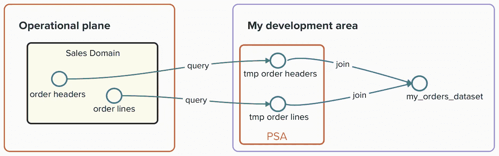
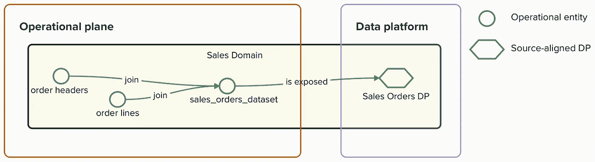
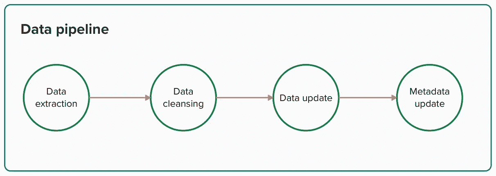
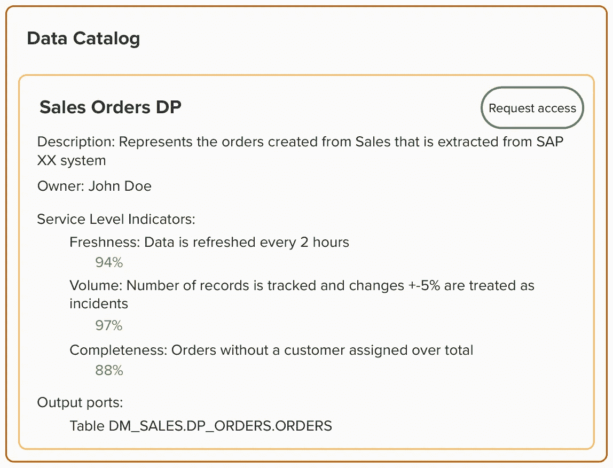

# 数据网格实现：加速从 ERP/CRM 系统中提取价值

> 原文：[`towardsdatascience.com/a-data-mesh-implementation-expediting-value-extraction-from-erp-crm-systems-66ac65644fe2?source=collection_archive---------5-----------------------#2024-02-01`](https://towardsdatascience.com/a-data-mesh-implementation-expediting-value-extraction-from-erp-crm-systems-66ac65644fe2?source=collection_archive---------5-----------------------#2024-02-01)

## 从大型操作系统中启用快速数据开发

[](https://medium.com/@david.rubio_63959?source=post_page---byline--66ac65644fe2--------------------------------)[](https://towardsdatascience.com/?source=post_page---byline--66ac65644fe2--------------------------------) [David Rubio](https://medium.com/@david.rubio_63959?source=post_page---byline--66ac65644fe2--------------------------------)

·发布于[Towards Data Science](https://towardsdatascience.com/?source=post_page---byline--66ac65644fe2--------------------------------) ·阅读时间 7 分钟·2024 年 2 月 1 日

--


图片由[Benjamin Zanatta](https://unsplash.com/@benjaminzanatta?utm_source=medium&utm_medium=referral)提供，来自[Unsplash](https://unsplash.com/?utm_source=medium&utm_medium=referral)

# 面对“怪物”时的挑战

对于从事务性系统（如 ERP（企业资源规划）和 CRM（客户关系管理））构建分析的数据显示工程师来说，主要的挑战在于如何弥合原始操作数据与领域知识之间的鸿沟。ERP 和 CRM 系统的设计和构建是为了满足广泛的业务流程和功能需求。**这种通用性使得它们的数据模型复杂且晦涩，需要领域专家的参与**。

更难以管理的是，在大型组织中，常见的设置是拥有多个这些系统的实例，并且某些底层过程负责在它们之间传输数据，这可能导致数据重复、不一致以及不透明。

操作团队沉浸在日常职能中，而从操作过程中生成的数据中提取业务价值的团队之间的脱节，仍然是一个显著的摩擦点。

# 搜索数据

想象一下，作为一名数据工程师/分析师，你的任务是识别公司内部的畅销产品。你的第一步可能是找到订单。然后你开始研究数据库对象，发现几个视图，但它们之间存在一些不一致之处，你不知道该使用哪个。此外，识别数据所有者也非常困难，其中一个数据所有者甚至最近已经离开公司。因为你不想在不确定的情况下开始开发，你决定直接处理操作原始数据。这听起来是不是很熟悉？  

# 访问操作数据  

我曾通过连接事务数据库中的视图或操作系统提供的 API 来请求原始数据。  

  

订单快照存储在我自己的开发区域（图像由作者提供）  

为了防止我的数据提取影响操作端的性能，我定期查询这些数据并将其存储在数据仓库中的持久化暂存区（PSA）。这让我能够使用这些快照执行复杂的查询和数据管道，而不会消耗操作系统的任何资源，但如果我没有意识到其他团队也在进行相同的提取，可能会导致数据的重复。  

# 理解操作数据  

一旦原始操作数据可用，我就面临下一个挑战：解读所有复杂的对象和属性，并处理它们之间数十种关系的迷宫（即 SAP 中的通用物料数据，[`leanx.eu/en/sap/table/mara.html`](https://leanx.eu/en/sap/table/mara.html)）  

尽管 ERP 或 CRM 系统中的标准对象有很好的文档记录，**但我需要处理许多需要领域专业知识的自定义对象和属性**，因为这些对象无法在标准数据模型中找到。大多数时候，我发现自己在不断进行‘试错’查询，试图对齐操作对象之间的键，根据属性的值来解释属性的含义，并通过操作界面截图验证我的假设。  

# 数据网格中的操作数据管理  

数据网格的实施改善了我在以下方面的体验：  

+   **知识**：我可以快速识别暴露数据的所有者。**所有者与生成数据的领域之间的距离是加速进一步分析开发的关键。**

+   **可发现性**：共享数据平台提供了一个操作数据集的目录，形式为源对齐的数据产品，帮助我理解暴露数据的状态和性质。  

+   **可访问性**：我可以轻松地请求访问这些数据产品。由于这些数据存储在共享数据平台中，而非操作系统中，我不需要与操作团队对接，争取在特定窗口期执行我的数据提取，从而避免影响操作性能。  

# 源对齐数据产品  

根据数据网格（Data Mesh）分类法，基于操作源构建的数据产品被称为源对齐数据产品：

> 源领域数据集密切代表了原始数据在创建时的状态，并未根据特定消费者进行调整或建模 —— [Zhamak Dehghani](https://twitter.com/zhamakd)

源对齐数据产品旨在在共享数据平台中以一对一关系表示操作源与操作实体，并且不应包含可能更改其任何属性的业务逻辑。

## 所有权

在数据网格实现中，**这些数据产品应该**

**严格** **由生成原始数据的业务领域拥有**。该领域的负责人负责数据的质量、可靠性和可访问性，并将数据视为可以由同一团队及组织中其他数据团队使用的产品。

**这种所有权确保了领域知识接近暴露的数据**。这对于快速开发分析数据产品至关重要，因为其他数据团队所需的任何澄清都可以迅速且有效地处理。

## 实现

按照这种方法，销售领域负责发布“sales_orders”数据产品并将其提供到共享数据目录中。



销售订单数据产品暴露销售订单数据集（图片来自作者）

负责维护数据产品的数据管道可以这样定义：



数据管道步骤（图片来自作者）

**数据提取**

构建源对齐数据产品的第一步是从操作源中提取我们要暴露的数据。有很多数据集成工具提供了简化数据摄取的 UI，数据团队可以在这里创建作业，使用 JDBC 连接或 API 从操作源提取原始数据。为了避免浪费计算工作，并且在可能的情况下，只应增量地添加自上次提取以来更新的原始数据到数据产品中。

**数据清洗**

现在我们已经获得了所需的数据，下一步是进行一些整理，以便消费者不必处理真实源中的现有不一致性。尽管在构建源对齐数据产品时不应实现任何业务逻辑，但基本的清洗和标准化是允许的。

```py
-- Example of property standardisation in a sql query used to extract data
case
  when lower(SalesDocumentCategory) = 'invoice' then 'Invoice'
  when lower(SalesDocumentCategory) = 'invoicing' then 'Invoice'
  else SalesDocumentCategory
end as SALES_DOCUMENT_CATEGORY
```

**数据更新**

一旦提取的操作数据准备好供消费，数据产品的内部数据集将增量更新为最新快照。

数据产品的一个要求是**可互操作**。这意味着我们需要暴露全局标识符，以便我们的数据产品可以在其他领域中普遍使用。

**元数据更新**

数据产品需要是**可理解的**。生产者需要为所包含的实体和属性加入有意义的元数据。这些元数据应涵盖每个属性的以下方面：

+   业务描述：每个属性对业务的意义。例如，“*销售订单的业务类别*”。

+   源系统：与运营领域中的原始属性建立映射。例如，“*原始来源：ERP | MARA-MTART 表 BIC/MARACAT 属性*”。

+   数据特征：数据的特定特征，如枚举和选项。例如，“*它是一个包含以下选项的枚举：发票、付款、投诉*”。

数据产品还需要是**可发现的**。生产者需要将它们发布到共享的数据目录中，并通过定义输出端口资产来指明数据的消费方式，这些端口资产充当数据暴露的接口。

而且，数据产品必须是**可观察的**。生产者需要部署一组监控工具，可以在目录中显示。当潜在消费者在目录中发现数据产品时，他们可以快速了解数据的健康状况。

# 消费者体验

现在，再次想象你是一名数据工程师，负责识别公司内的畅销产品。但这次，假设你可以访问一个数据目录，其中提供代表每个领域实际情况的数据产品，这些领域塑造了业务。你只需在数据产品目录中输入“订单”，就可以找到销售数据团队发布的条目。只需一眼，你就能评估数据的质量和新鲜度，并阅读详细的内容描述。



数据目录中销售订单数据产品的条目示例（图片由作者提供）

这个升级的体验消除了传统发现方法中的不确定性，使你能够立即开始处理数据。更重要的是，你知道在需要进一步信息时，谁对数据负责。并且，每当销售订单数据产品出现问题时，你将收到通知，以便你提前采取行动。

# 结论

我们已经识别出通过来源对齐的数据产品启用运营数据的若干好处，特别是当它们由数据生产者拥有时：

+   **精心策划的运营数据可访问性**：在大型组织中，与来源对齐的数据产品代表了运营和分析领域之间的桥梁。

+   **减少与运营工作的冲突**：运营系统的访问被隔离在与来源对齐的数据产品管道中。

+   **事实来源**：一个公共的数据目录，列出了精心策划的运营业务对象，减少了组织内部的重复和不一致。

+   **明确的数据所有权**：与来源对齐的数据产品应由生成运营数据的领域**拥有，以确保领域知识**紧密接近暴露的数据。

根据我自己的经验，这种方法在大型组织面临不同领域之间的数据不一致性和在运营数据之上构建分析时遇到阻力的情况下非常有效。**数据网格鼓励每个领域建立它们生成的核心实体的“真实来源”**，并将其提供在共享目录中，允许其他团队访问这些数据并在整个组织中创建一致的度量标准。**这使得分析数据团队能够加速工作，生成能够推动真实商业价值的分析。**

# 参考文献

[](https://martinfowler.com/articles/data-monolith-to-mesh.html?source=post_page-----66ac65644fe2--------------------------------) [## 如何从单一数据湖转向分布式数据网格

### 集中式数据湖存在问题。未来的数据网格需要领域、自助服务平台以及……

martinfowler.com](https://martinfowler.com/articles/data-monolith-to-mesh.html?source=post_page-----66ac65644fe2--------------------------------)

[`www.oreilly.com/library/view/data-mesh/9781492092384/`](https://www.oreilly.com/library/view/data-mesh/9781492092384/)

*感谢我的 Thoughtworks 同事 Arne（两次！）、Pablo、Ayush 和 Samvardhan，感谢他们花时间审阅本文的早期版本*
