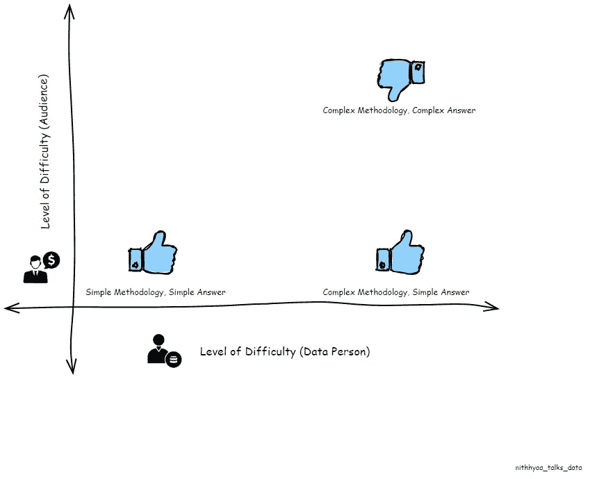
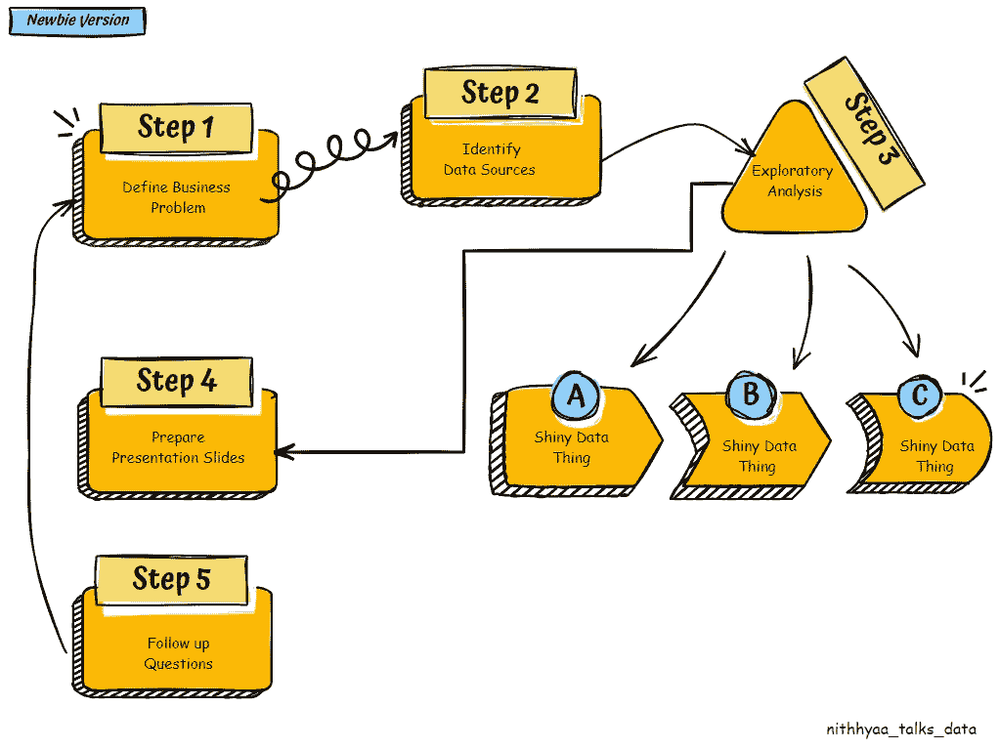
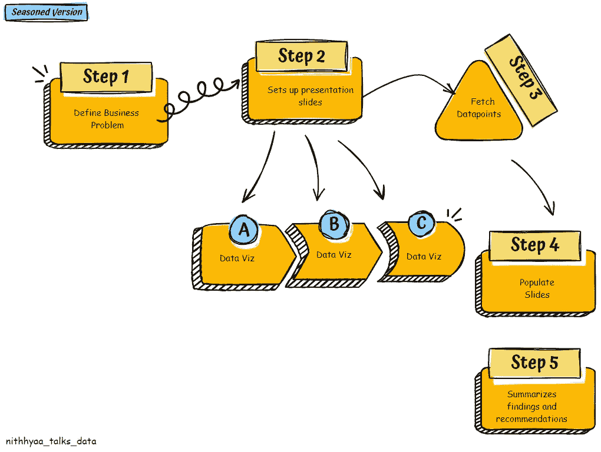

# 数据人员应对分析瘫痪的指南

> 原文：[`towardsdatascience.com/a-data-persons-guide-to-tackling-analysis-paralysis-96df01873023?source=collection_archive---------1-----------------------#2024-02-14`](https://towardsdatascience.com/a-data-persons-guide-to-tackling-analysis-paralysis-96df01873023?source=collection_archive---------1-----------------------#2024-02-14)

## **一个简单且有效的框架，帮助你建立数据展示的信心**

 [Nithhyaa Ramamoorthy](https://medium.com/@nithhyaa_talks_data?source=post_page---byline--96df01873023--------------------------------)

·发布于 [Towards Data Science](https://towardsdatascience.com/?source=post_page---byline--96df01873023--------------------------------) ·阅读时间 9 分钟·2024 年 2 月 14 日

--

> **“如果你不能简单地解释它，那说明你还没有完全理解它。” — 阿尔伯特·爱因斯坦**

如果你是一个数据人员，你很可能在职业生涯中经历过在做数据展示时信心不足的各种阶段。我们在大学、研究生院和训练营中都接受过广泛的训练，学习如何进行数据挖掘并从复杂的数据集中提取洞察。按照书本上的标准，我们知道首先是数据清洗和准备，然后是数据探索，最后是挖掘和发现模式。但在现实世界中，当我们面临真正的商业问题时，常常会花费数小时怀疑自己的方法论，有时甚至怀疑整个前提。更糟糕的是，我们可能会陷入长时间的分析瘫痪中。为了帮助应对这种心态，我在此分享一个简单的框架。

> **注意：** 在整篇文章中，我将使用“数据人员”这一术语，而不是交替使用数据分析师、数据科学家、数据专家、数据主题专家等术语。不论我们的职称如何，毕竟我们都是充满好奇心的人，拥有丰富的信息资源，试图利用手头的数据资源创造影响。

图片由作者提供

1.  **用你自己的术语框定商业问题：**

作为一名数据人员，你将在职业生涯中学习许多数据处理和脚本语言。但理解业务问题并能够用简单的英语进行解释是一项更为重要的技能。数据人员拥有独特的能力，能够解构问题陈述并将其映射到可用的数据点，建立联系并找到答案。以下是一个例子：

> 来自利益相关者的问题：“我不知道为什么自上个季度以来，我的客户没有更多地转向订阅计划了。”
> 
> 数据人员的解读：“我在寻找过去三个月选择订阅计划的客户数量相比单次购买数量的下降趋势。”
> 
> 数据人员的分析计划：“我可以查看过去几个月新客户与回访客户的比例，并看看他们来自哪些获取渠道。我还应该检查我们的订阅流程中是否有任何页面的流失情况。我还需要检查在哪些地区出现了较高的流失率。”

**2\. 确定利益相关者**

你的主要利益相关者是提出业务问题的人，但根据数据揭示的内容，可能还有其他一些利益相关者群体需要被包括在你的演示听众中。你的听众的数据素养水平也决定了你在演示中使用的语言。更重要的是，你需要确保这个群体愿意听取你的建议，这样你的数据工作才能在组织层面产生应有的影响。

**3\. 在深入数据之前准备好你的幻灯片**

这看起来有些违背直觉且不合逻辑，但在你开始寻找组织数据时，准备好带有占位符的幻灯片将确保你在寻找所需数据点之前，已经有了一个初步的列表。这也会帮助你专注于问题陈述，而不会被你发现的其他有趣数据点所分心。如果出现了一些与问题陈述不完全对齐的有趣内容，你可以将它们保存在附录中。就我个人而言，我发现这种思维方式的转变非常具有变革性。在数据探索之前进行这一步骤，确保了：

+   你已经有了一个与问题陈述一致的数据故事，并且这个故事可以根据你从分析中得到的发现稍后进行修改。

+   这样可以避免你陷入过多的偏题和被新的、引人注目的数据事物分散注意力。（是的，丰富和清晰的数据集是一种特权，但当它让我们无法专注于目标时，也可能导致浪费时间的数据迷宫。）

这一步的更深入分析将在文章的后半部分进行说明。

**4\. 抵制将所有分析和方法论细节都纳入的冲动**

在我看来，这是最困难的一步。不管问题多么简单，数据人员在缩小答案到一组特定数据点之前，都会花费大量时间进行数据准备和探索。可能花了你好几天或几周时间来准备一个干净的数据集，你的探索步骤可能涉及几个失败的假设和假定，才最终得出答案。新的、更有趣的关联可能已经出现，但如果这些信息对你呈现的数据故事没有任何有用的补充，请抑制将其包括在演示中的冲动。

**5. 填充幻灯片**

如果你已经完成了所有前面的步骤，插入数据和发现到幻灯片中应该会变得非常简单。

> 我喜欢按问题、问题的影响、发现、建议和下一步的顺序安排它们。这能确保你的数据故事容易跟随，即使你不在场讲解和浏览整个幻灯片，它也能自我说明。

在其他应用场景中，如例行性能更新或回顾性总结，顺序可能会有所不同。但对于需要数据洞察来辅助决策的典型请求，这个顺序是一个很好的起点。确保这一步的关键是拥有准确且相关的数据点，能够清晰地支持你的故事。除此之外，我还有一些小建议，帮助你将分析解决方案整洁地收尾。这些小细节在演示过程中能起到重要作用，帮助观众记住关键洞察。

+   清晰地标明共享的关键数据点是好兆头还是坏兆头，可以通过使用箭头和颜色来表示。（例如：低跳出率是好事，而低转化率是坏兆头。）

+   始终为幻灯片中共享的任何数字（数据点）添加背景信息，包括基准细节或趋势分析。（例如：本月的转化率为 12%，这一数据与同一产品线的其他 SKU 一致，且高于过去三年同月的平均转化率。）

+   将洞察与每个幻灯片中原始业务问题的某个部分联系起来。

+   在脚注中包括诸如样本大小、分析时间框架和重要注释等细节将有助于建立信任和信誉。

除了这些，找到创造你自己数据讲故事风格的方法将帮助你的工作在所有其他模板化的分析报告中脱颖而出。

> 你不能总是为你制作的演示文稿加水印，但你通过上述技巧建立的讲故事风格和信誉将帮助人们将你与数据卓越联系起来。

**6. 记录学习**

提升的简单有效方式就是通过失败并记录下所学的经验。随着你获得更多展示数据工作的机会，别忘了记录下哪些做法有效，哪些无效。很快，你将会根据你的观众和利益相关者群体，拥有一份关于可视化、分析和建议的类型清单。这个清单越大，你的数据演示就会变得越有影响力。

> 在我作为分析实习生的最初几周，我感到非常不自在，因为我在迎新期间结识的大多数同伴都选择了与数据科学完全无关的轮岗方向。这是 2012 年，所以我当时并不懂得将自己的感受标记为“冒名顶替综合症”，但我在 One Note 上创建了一个小部分，记录了所有我的分析被好评的情况，以及那些我需要花大量时间通过电子邮件反复解释幻灯片内容的情况。这项练习帮助我意识到：

+   如果你与组织的优先事项没有对齐，那么你（作为数据人员）所兴奋的内容，很可能与观众所兴奋的内容不同。

（差不多十年前，我花了几周时间追踪一个数据源，最终让我能够连接两个不同产品线的记录，并进行相似度建模。当时我非常兴奋，花了好几页幻灯片讲述这项技术的伟大，并投入时间进行分析。但最终，由于它与公司当季的优先事项没有直接关联，听众无法共享我那种兴奋感。现在回想起来，我真想给当时的初级分析师自己盖上一条毯子，告诉他要放远视角，关注业务简报。）

+   你的分析演示的观众不仅仅是会议中的人，还包括那些将会在组织内转发你演示的人。一份以数据为支撑、清晰简洁的观察和建议的演示本身就能说服他人，并且有潜力触及更多决策者。

我在初级分析师阶段记录的这两项经验，已经陪伴我超过十年。从一个简单的习惯开始，它如今已经变成了一个针对我在组织中不同观众的个人规则清单，帮助我做出更有影响力的演示。

## **让我们通过一个示例场景来实践这个框架**

让我们看一个假设的业务问题，以及使用或不使用这些策略时分析解决过程的不同。

**业务问题：** 一个电子商务办公用品商店的桌面和移动网页版体验存在差异。（假设这是 2000 年代末，那时响应式网页设计还不是主流。）你部门的领导在考虑应该优先重设计哪一部分，并且这个决定是否会影响收入指标。

**新手数据人员版：**

1.  数据人员接手问题。

1.  搜索公司数据仓库，找出包含每次网站访问详细信息的数据源。他们找到了一个丰富的数据集，包含大约 30 个属性。

1.  他们花时间探索数据集，发现了几个新的亮眼数据属性。

亮眼的事物 1：移动设备品牌——他们产生了兴趣，并寻找按移动设备品牌的购买模式。偷偷地对这些品牌作出评判。（不需要翻白眼，我们都做过。）

亮眼的事物 2：屏幕分辨率——他们对屏幕分辨率是否会影响用户互动指标产生了兴趣。

亮眼的事物 3：移动设备品牌——他们对是否某些设备品牌的“购买时间”较短产生了兴趣。

亮眼的事物 4：人口统计数据——他们对通过七个不同的用户属性来查看购买模式产生了兴趣。

4. 准备演示文稿：继续在幻灯片中包含所有的学习成果和分析方法。

5. 由于未提供明确的建议，业务部门有更多后续问题。对于每个后续问题，从第 1 步重新开始。

**资深数据人员的版本：**

1.  数据人员接手问题。

1.  设置演示文稿的顺序如下：

幻灯片 1：业务问题，决策受影响的因素，相关利益相关者

幻灯片 2：数据可视化展示了桌面与移动设备访问占比，以及桌面与移动设备转化占比。

幻灯片 3：数据可视化展示了新客户与回访客户的占比，按每种设备类型进行展示。

幻灯片 4：数据可视化展示了同一用户在后续访问中使用的设备。

幻灯片 5：学习与建议的占位符

3. 确定数据源和填充幻灯片所需的属性。

4. 填充幻灯片：基于幻灯片 1-4 中的观察，数据人员说明回访用户占客户基数的主要部分。超过 70% 的回访订单是在桌面设备上下单的。虽然首单通常是在移动设备上下单，但再订购请求通常是通过桌面处理的。因此，保持过时的桌面体验会影响大部分忠实客户。这帮助领导层得出结论，必须优先考虑桌面重设计工作。

**结论：**

总结：有效的数据讲故事就是让复杂的事情看起来简单，这样你的数据技能就能够在组织中推动决策制定，尽管不同的成员数据素养水平不同。

**关于作者：**

Nithhyaa Ramamoorthy 是一位数据领域专家，拥有超过 12 年的分析和大数据经验，尤其专注于医疗健康与消费者行为的交集。她拥有信息科学的硕士学位，并且最近获得了 CSPO 证书以及其他多个认证。她热衷于运用自己的分析技能推动商业决策，创建根植于同理心的包容性和公平的数字产品。她目前在梅奥诊所——数字健康中心担任分析主管。
