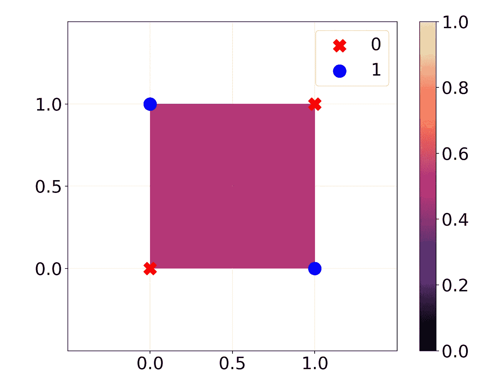
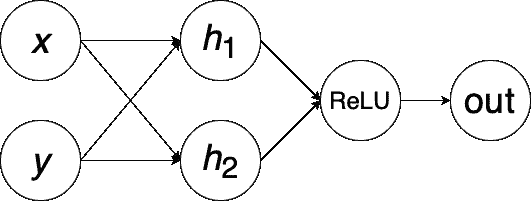
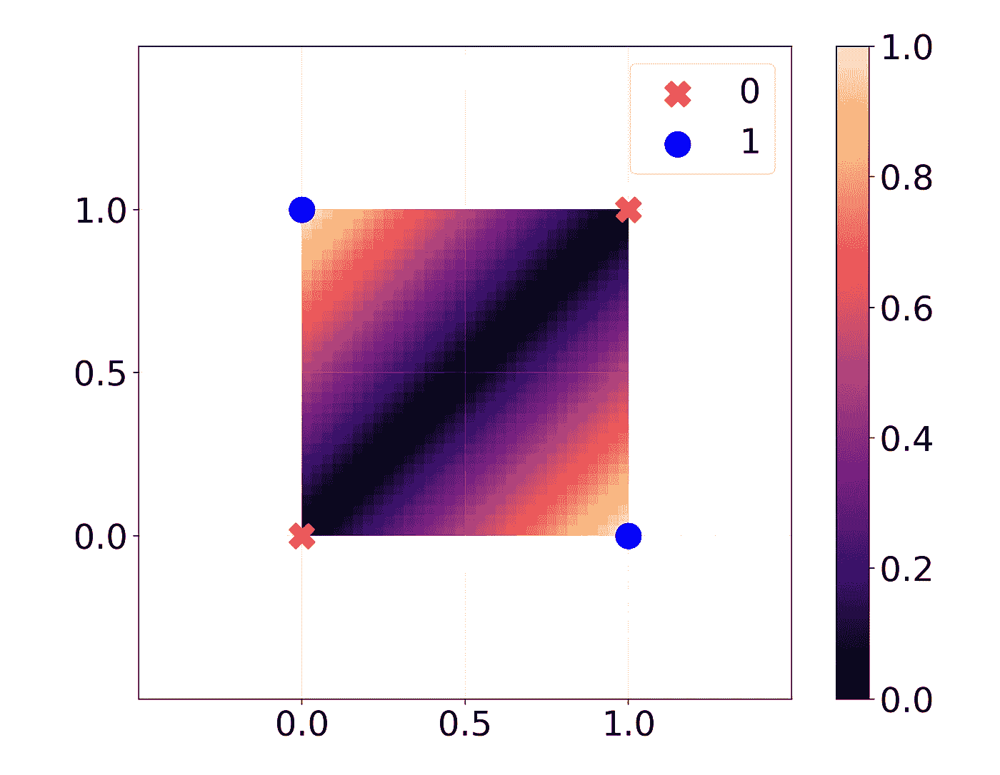
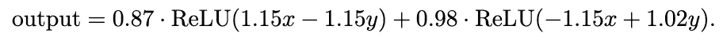
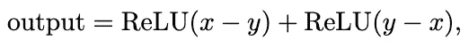
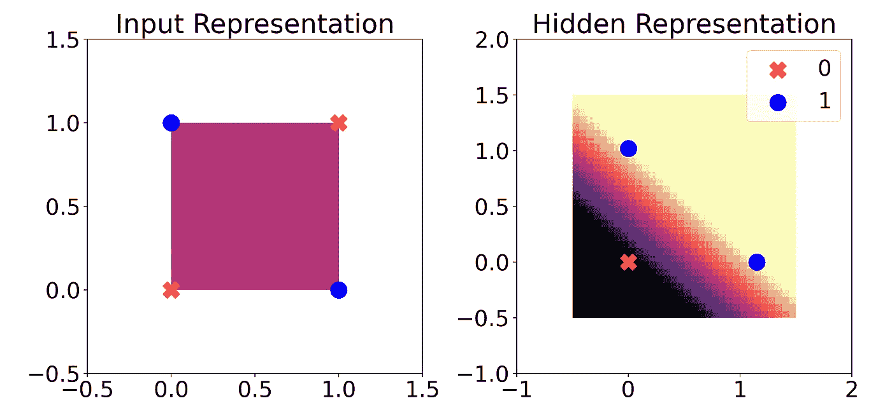
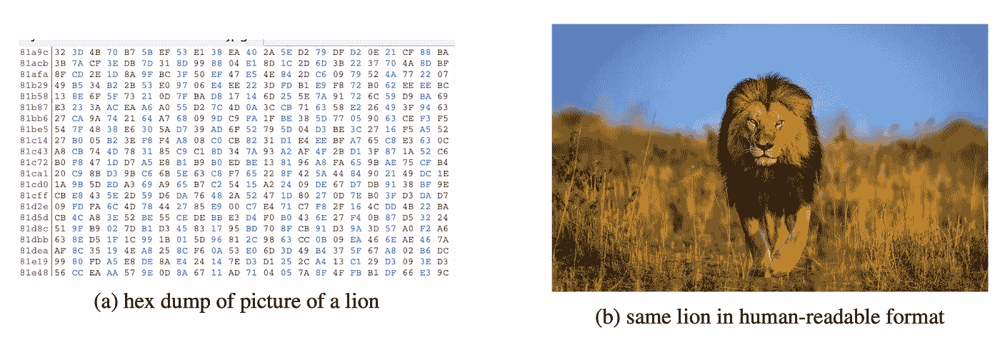

# 深度学习中的非线性全新视角

> 原文：[`towardsdatascience.com/a-fresh-look-at-nonlinearity-in-deep-learning-a79b6955d2ad?source=collection_archive---------1-----------------------#2024-08-15`](https://towardsdatascience.com/a-fresh-look-at-nonlinearity-in-deep-learning-a79b6955d2ad?source=collection_archive---------1-----------------------#2024-08-15)

## 我们需要非线性激活函数的传统理由只是这个故事的一个维度。

[](https://medium.com/@crackalamoo?source=post_page---byline--a79b6955d2ad--------------------------------)[](https://towardsdatascience.com/?source=post_page---byline--a79b6955d2ad--------------------------------) [Harys Dalvi](https://medium.com/@crackalamoo?source=post_page---byline--a79b6955d2ad--------------------------------)

·发布于[Towards Data Science](https://towardsdatascience.com/?source=post_page---byline--a79b6955d2ad--------------------------------) ·阅读时间 8 分钟·2024 年 8 月 15 日

--

softmax、ReLU、sigmoid 和 tanh 函数有什么共同点？它们都是**激活函数**——而且它们都是**非线性**的。但我们为什么一开始就需要激活函数，特别是非线性激活函数呢？有一种传统的解释，也有一种新的看法。

传统的理由是：如果没有非线性激活函数，一个深度神经网络仅仅是矩阵乘法和加偏置的组合。这些是**线性变换**，你可以通过线性代数证明，**线性变换的组合仍然是线性变换**。

所以无论我们堆叠多少线性层，没有激活函数，我们的整个模型也不过比线性回归更差。它将完全无法捕捉到非线性关系，甚至是像 XOR 这样简单的关系。

引入激活函数：通过允许模型**学习一个非线性函数**，我们获得了建模各种复杂真实世界关系的能力。

这个你可能已经很熟悉的故事完全正确。但任何话题的研究都能从不同的角度受益，尤其是深度学习，其具备许多可解释性挑战。今天，我想和你分享一种看待激活函数需求的全新方式，以及它揭示的深度学习模型内部工作原理。

简而言之，我想和你分享的是：我们通常构建深度学习分类器的方式会在模型中引入 **归纳偏差**。具体来说，**使用线性层作为输出**意味着模型的其余部分必须找到输入的 **线性可分** 转换。这背后的直觉非常有用，所以我将分享一些例子，希望能澄清这些术语。

# 传统解释

让我们通过一个例子来重新审视传统的非线性激活函数的理由。我们将看一个简单的案例：**XOR**。



一个带有彩色真实值的 XOR 函数图。背景颜色代表线性回归的预测值。图片由作者提供。

在这里，我训练了一个线性回归模型来拟合 XOR 函数，输入为两个二进制值（真实值以点的形式绘制）。我将回归的输出作为背景颜色绘制。回归模型什么也没学到：它在所有情况下都预测为 0.5。

现在，我将训练一个非常基础的深度学习模型，使用 MSE 损失函数。只有**一个具有两个神经元的线性层**，接着是 **ReLU** 激活函数，最后是输出神经元。为了简化起见，我只使用权重，不使用偏置。



我们基本神经网络的示意图。由作者使用 [draw.io](https://draw.io) 制作。

现在会发生什么？



另一个 XOR 函数的图，这次是用一个简单的深度学习模型的预测结果绘制的。图片由作者提供。

哇，现在完美了！权重看起来怎么样？

```py
Layer 1 weight: [[ 1.1485, -1.1486],
                [-1.0205,  1.0189]]

(ReLU)

Layer 2 weight: [[0.8707, 0.9815]]
```

所以对于两个输入 *x* 和 *y*，我们的输出是：



这真的很像



你可以验证，这是对于输入 *x* 和 *y* 在 {0, 1} 中的 XOR 函数。

如果没有 ReLU，我们可以将模型简化为 0.001*y* - 0.13*x*，这是一个完全不起作用的线性函数。所以就是这样，传统的解释：由于 XOR 是一个本质上非线性的函数，它不能被任何线性函数精确建模。即使是线性函数的组合也不行，因为那仍然是另一个线性函数。**引入非线性 ReLU 函数** 让我们能够捕捉到非线性关系。

# 深入挖掘：归纳偏差

现在我们将继续研究相同的 XOR 模型，但我们将通过不同的视角来观察它，以更好地理解该模型的 **归纳偏差**。

什么是归纳偏差？面对任何问题，都有许多解决方法。本质上，归纳偏差是模型架构中内建的一种特性，使得模型倾向于选择某种特定的方法来解决问题，而不是其他方法。

在这个深度学习模型中，我们的最终层是一个简单的线性层。这意味着，除非模型在最终层之前的输出能够通过线性回归求解，否则模型完全无法工作。换句话说，**输出前的最后一个隐藏状态必须是线性可分的，模型才能正常工作。**这种归纳偏差是我们模型架构的特性，而不是 XOR 函数的特性。

幸运的是，在这个模型中，我们的隐藏状态只有两个神经元。因此，我们可以在二维空间中进行可视化。它看起来是什么样子？



XOR 函数的输入表示通过深度学习转化为隐藏表示（经过一层线性层和 ReLU 激活）。背景颜色表示线性回归模型的预测。图片来源：作者。

如我们之前所见，单独的线性回归模型对 XOR 输入并不有效。但是，一旦我们将输入通过神经网络的第一层和 ReLU 激活函数，输出类别就可以被**一条线**整齐地*分开*（**线性可分**）。这意味着线性回归现在可以起作用，实际上我们最终的层只是在执行这种线性回归。

那么，这告诉我们关于归纳偏差什么信息呢？由于我们最后一层是一个线性层，因此该层之前的表示**必须**至少大致是线性可分的。否则，作为线性回归功能的最后一层将会失败。

# 线性分类器探针

对于 XOR 模型，这看起来可能只是我们之前看到的传统观点的一个微不足道的扩展。但是，如何处理更复杂的模型呢？随着模型的加深，我们可以通过这种方式观察非线性，从而获得更多的洞察。[这篇论文](https://arxiv.org/pdf/1610.01644)由 Guillaume Alain 和 Yoshua Bengio 撰写，探讨了这个思想，并使用**线性分类器探针**进行研究。[1]



“左侧的十六进制转储包含的信息内容比右侧的图像多。只有其中之一可以被人脑处理，以便及时挽救他们的生命。计算的便利性很重要。不仅仅是熵。” 图示和说明来自 Alain & Bengio, 2018（[链接](https://arxiv.org/pdf/1610.01644)）。[1]

对于像 MNIST 手写数字这样的许多情况，做出预测所需的所有信息已经存在于输入中：只是需要处理这些信息。Alain 和 Bengio 观察到，随着模型的加深，我们实际上在每一层的可用信息**减少**，而不是增加。但好处是，在每一层，已有的信息变得“更容易使用”。我们所指的是，每一层之后，信息变得越来越**线性可分**。

我们如何找出每一层之后模型的表示有多线性可分？Alain 和 Bengio 建议使用他们所称的**线性分类器探针**。其想法是在每一层之后，我们训练一个**线性回归模型，使用该层的隐状态作为输入来预测最终输出**。

这实际上就是我们在最后的 XOR 图中所做的：我们在倒数第二层的隐状态上训练了一个线性回归模型，发现这个回归成功地预测了最终输出（1 或 0）。在数据不线性可分时，我们无法使用原始输入来完成这一任务。记住，最后一层本质上是线性回归，因此在某种意义上，这种方法就像是在模型中提前创建了一个新的最终层。

Alain 和 Bengio 将这一方法应用于一个在 MNIST 手写数字数据集上训练的卷积神经网络：在每次卷积、ReLU 激活和池化之后，他们都加入了一个线性探针。他们发现，测试误差几乎总是从一个探针到下一个探针时减少，表明线性可分性在增加。

为什么数据会变得线性可分，而不是“多项式可分”或其他形式的可分？因为最后一层是线性的，我们使用的损失函数会迫使模型中的其他层一起工作，并为最终层创造一个线性可分的表示，以便进行预测。

这个想法是否同样适用于大型语言模型（LLM）？事实上，是的。[Jin 等人 (2024)](https://arxiv.org/pdf/2404.07066)使用线性分类器探针展示了 LLM 如何学习不同的概念。他们发现，**简单的概念**，例如某个城市是否是某个国家的首都，**在模型的早期阶段就变得线性可分**：仅需少数几个非线性激活就能建模这些关系。相比之下，许多**推理技能**直到模型的后期才变得线性可分，或者对于较小的模型来说完全无法线性可分。[2]

# 结论

当我们使用**激活函数**时，我们将**非线性**引入到深度学习模型中。这当然是很重要的知识，但通过从多种角度解读线性和非线性的后果，我们能获得更多的价值。

上述解释是从整体上看待模型，但一个有用的思维模型集中在深度学习模型的**最终线性层**上。由于这是一个线性层，之前的所有内容必须是线性可分的；否则，模型无法正常工作。因此，在训练过程中，模型的其他层会共同协作，**找到一个线性表示，供最终层用于预测**。

对于同一事物，拥有多种直觉总是有益的。在深度学习中尤为如此，因为模型可能是如此的黑箱化，任何能够提升可解释性的技巧都很有帮助。许多论文都应用了这一直觉，取得了令人着迷的结果：Alain 和 Bengio（2018）利用这一直觉提出了**线性分类器探测**的概念，而 Jin 等人（2024）在此基础上，逐层观察语言模型中越来越复杂的概念发展。

希望这个新的非线性思维模型对你有所帮助，并且你现在能够为黑箱深度神经网络带来更多的启示！


图片来源：[Nashad Abdu](https://unsplash.com/@nashadabdu?utm_source=medium&utm_medium=referral) via [Unsplash](https://unsplash.com/?utm_source=medium&utm_medium=referral)

# 参考文献

[1] G. Alain 和 Y. Bengio，[使用线性分类器探测理解中间层](https://arxiv.org/abs/1610.01644)（2018），arXiv

[2] M. Jin 等人，[探索概念深度：大规模语言模型如何在不同层次上获取知识？](https://arxiv.org/abs/2404.07066)（2024），arXiv
