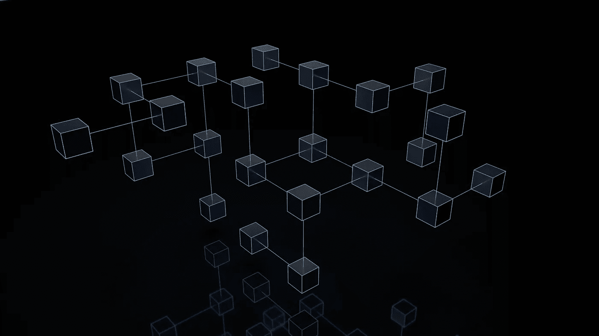

# 分布式推理的**DCIN**简介

> 原文：[`towardsdatascience.com/a-gentle-introduction-to-the-dcin-for-decentralized-inference-f42f41367a95?source=collection_archive---------6-----------------------#2024-10-29`](https://towardsdatascience.com/a-gentle-introduction-to-the-dcin-for-decentralized-inference-f42f41367a95?source=collection_archive---------6-----------------------#2024-10-29)

图片来源：[Shubham Dhage](https://unsplash.com/@theshubhamdhage?utm_source=medium&utm_medium=referral)于[Unsplash](https://unsplash.com/?utm_source=medium&utm_medium=referral)

## 分布式协作智能网络如何运作

 [Marcello Politi](https://medium.com/@marcellopoliti?source=post_page---byline--f42f41367a95--------------------------------)

·发表于 [Towards Data Science](https://towardsdatascience.com/?source=post_page---byline--f42f41367a95--------------------------------) ·阅读时间 25 分钟 ·2024 年 10 月 29 日

--

## 引言

我们正站在人工智能和 Web3 领域新时代的门槛上。

传统上，人工智能推理一直是集中式数据中心和高性能计算集群的领域，只有少数人能够访问。即便在许多去中心化推理网络中，节点运营商仍然必须依赖高端硬件，才能赚取奖励，实际上只是为了弥补开支。

这不是*民主化人工智能的访问*：大多数用户无法积极参与推理阶段，因为 GPU 的成本过高，而那些希望拥有*适度*去中心化或隐私保护的客户则被困在非常慢或昂贵的解决方案中。

在过去的几个月里，我和我的团队一直在努力开发一项希望能够在人工智能和 Web3 的交集领域树立标杆的技术：**DCI 网络**。

但在讨论这个问题之前，让我们先回顾一下我们为何会陷入这种境地。

# 一些背景

**神经网络**正如其名，是由人工神经元组成的网络，按**层次**组织…
