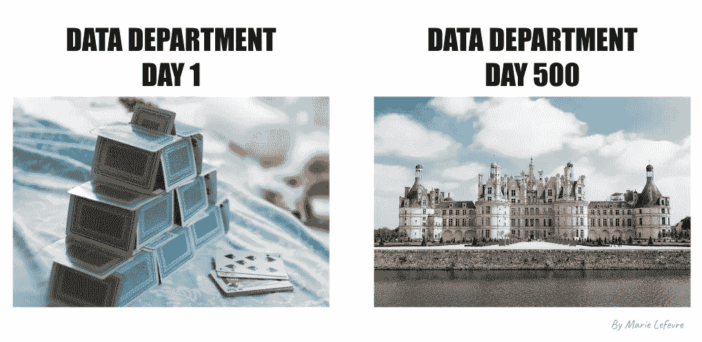

# 从零开始建立数据部门指南

> 原文：[`towardsdatascience.com/a-guide-to-building-a-data-department-from-scratch-0388e0eb0397?source=collection_archive---------2-----------------------#2024-03-12`](https://towardsdatascience.com/a-guide-to-building-a-data-department-from-scratch-0388e0eb0397?source=collection_archive---------2-----------------------#2024-03-12)

## 数据战略

## 一些实用的建议，来自曾经走过这条路的人

 [Marie Lefevre](https://marielefevre.medium.com/?source=post_page---byline--0388e0eb0397--------------------------------)

·发表于[Towards Data Science](https://towardsdatascience.com/?source=post_page---byline--0388e0eb0397--------------------------------) ·阅读时间：7 分钟·2024 年 3 月 12 日

--

在寻找有关**如何在中型公司建立数据部门**的建议和最佳实践时，我遇到的大多数资源要么是关于[创建数据驱动的组织](https://www.oreilly.com/library/view/creating-a-data-driven/9781491916902/)，要么是关于[建立数据团队](https://www.castordoc.com/blog/how-to-build-your-data-team)。然而，我两年多前所处的位置则需要一种更务实的方法：

> 作为组织中的第一位（也是唯一的）数据人员，你如何具体开始引入数据最佳实践并建立数据部门？

最近有被要求在某公司建立数据部门吗？你计划在不久的将来承担这个角色吗？或者，出于好奇，**你是否一直在想，一个组织是如何从几乎不使用数据到拥有一个多人的数据团队的？** 如果是这样，本文就是为你准备的。

从零开始建立数据部门的挑战（图片由作者提供，基于[Sigmund](https://unsplash.com/fr/photos/cartes-de-jeu-blanches-et-bleues-sur-table-bleue-et-blanche-8ts_MPjebEk)和[Dorian Mongel](https://unsplash.com/fr/photos/photo-de-paysage-du-chateau-blanc-et-brun-Yui3DZiX7yM)在 Unsplash 上的图片）

# 设置背景

**当我在 2021 年 11 月被聘为我当前公司第一位“数据人员”**时，我面临的是一片空白。高层管理已经为一名数据人员解锁了预算，但公司距离数据驱动还很远。我的经理曾与技术和数据角色合作过，但他的背景是……
