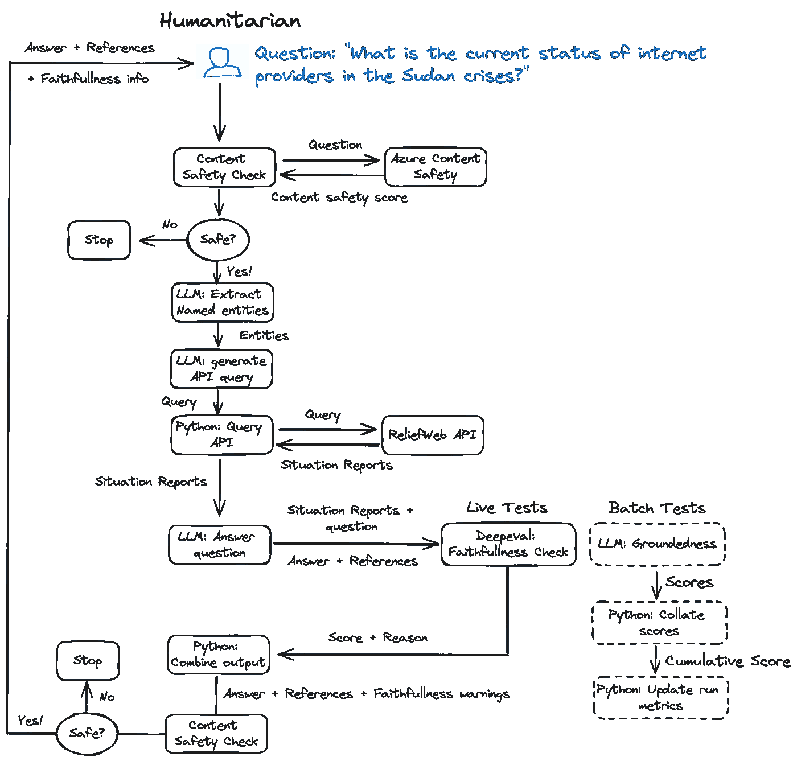
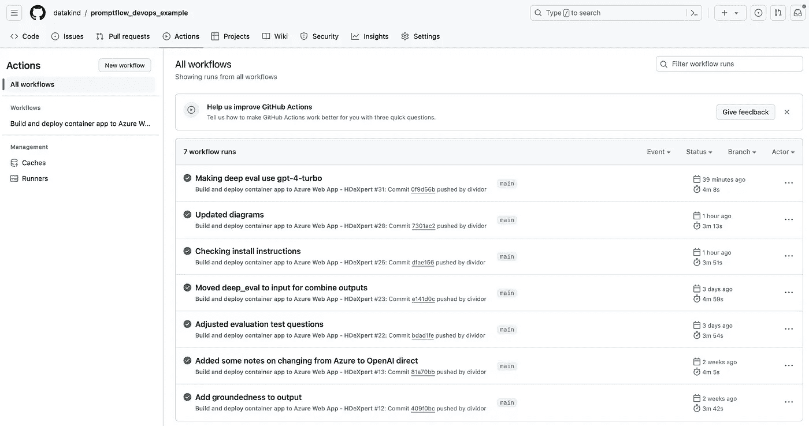

# 人道主义危机情况报告 AI 助手：探索 LLMOps 与 Prompt Flow

> 原文：[`towardsdatascience.com/a-humanitarian-crises-situation-report-ai-assistant-exploring-llmops-with-prompt-flow-32968b7a878b?source=collection_archive---------2-----------------------#2024-04-01`](https://towardsdatascience.com/a-humanitarian-crises-situation-report-ai-assistant-exploring-llmops-with-prompt-flow-32968b7a878b?source=collection_archive---------2-----------------------#2024-04-01)

[](https://medium.com/@astrobagel?source=post_page---byline--32968b7a878b--------------------------------)[](https://towardsdatascience.com/?source=post_page---byline--32968b7a878b--------------------------------) [Matthew Harris](https://medium.com/@astrobagel?source=post_page---byline--32968b7a878b--------------------------------)

·发布于[Towards Data Science](https://towardsdatascience.com/?source=post_page---byline--32968b7a878b--------------------------------) ·17 分钟阅读·2024 年 4 月 1 日

--

TL;DR

*关于如何使用强大的大型语言模型（LLMs）进行知识检索，有许多教程。然而，如果考虑到这些技术在现实世界中的应用，就需要应用工程最佳实践，并且这些实践应该扩展以减轻与 LLMs 相关的一些新风险，如幻觉现象。在本文中，我们探讨了如何实现一些关键领域，来实现 LLMs 的操作化——如安全性、提示工程、基础扎实性和评估——并开发了一个简单的提示流，以创建一个简单的* [*演示 AI 助手*](https://github.com/datakind/promptflow_devops_example) *，用以回答关于人道主义灾难的问题，信息来源于 ReliefWeb 平台上的情况报告。提示流包括一套很棒的工具，用于编排 LLM 工作流，并且像 deep eval 这样的包提供了在运行时测试 LLM 输出的方法（尽管有一些注意事项）。*

# 操作化大型语言模型应用

在之前的博客文章“[一些关于 LLM 应用程序操作化的思考](https://medium.com/towards-data-science/some-thoughts-on-operationalizing-llm-applications-aae3530821a8)”中，我们讨论了在推出 LLM 应用程序时，除了生成型 AI 的炫目新技术外，还有许多因素需要考虑。许多工程要求适用于任何软件开发，如 DevOps 以及拥有坚实的框架来监控和评估性能，但其他领域，如减轻幻觉风险，则相对较新。任何在推出炫酷的生成型 AI 应用时忽视这些问题的组织，尤其是在高风险的环境中，都会冒很大风险，因为偏见、不正确和缺失的信息可能会导致非常严重的后果。


启动使用大型语言模型（LLM）应用程序之前需要考虑的一些关键领域。来源：[一些关于 LLM 操作化的思考](https://medium.com/towards-data-science/some-thoughts-on-operationalizing-llm-applications-aae3530821a8)

许多组织目前正在经历这一操作化过程，并试图弄清楚如何准确地使用新的生成型 AI。好消息是，我们正处于一个阶段，支持性产品和服务开始让应用安全、成本效益和准确性原则的应用变得更加容易。[AWS Bedrock](https://aws.amazon.com/bedrock/?trk=ea449fe3-b099-4464-85dc-ff4e38a0359f&sc_channel=ps&ef_id=Cj0KCQjwqpSwBhClARIsADlZ_Tm1aI4E_wUaKbYhZTORvlr9v8k8Wr7XPefKSX6tJkMEtJxbpYDzFvMaAnQREALw_wcB%3AG%3As&s_kwcid=AL%214422%213%21692062173758%21e%21%21g%21%21aws+bedrock%2121054971963%21158684190945&gclid=Cj0KCQjwqpSwBhClARIsADlZ_Tm1aI4E_wUaKbYhZTORvlr9v8k8Wr7XPefKSX6tJkMEtJxbpYDzFvMaAnQREALw_wcB)，[Azure 机器学习与 Studio](https://learn.microsoft.com/en-us/azure/machine-learning/prompt-flow/get-started-prompt-flow?view=azureml-api-2)，[Azure AI Studio（预览版）](https://azure.microsoft.com/en-us/products/ai-studio)，以及一系列其他供应商和开源产品，都使得开发 LLM 解决方案变得更加容易。

# Prompt Flow

在本文中，我们将重点讨论使用由微软开发的开源项目 Prompt Flow……

[*Prompt Flow*](https://github.com/microsoft/promptflow) *是一套开发工具，旨在简化基于 LLM 的 AI 应用程序的端到端开发周期，从构思、原型制作、测试、评估到生产部署和监控。它使得提示工程变得更加容易，并使你能够构建具有生产质量的 LLM 应用程序。*

# 为什么选择 Prompt Flow？

经过大量的个人研究，[Prompt Flow](https://microsoft.github.io/promptflow/)在某些情况下已成为开发 LLM 应用程序的一个极好的选择，原因如下……

1.  **直观的用户界面**。正如我们下面所见，即使是简单的大型语言模型应用程序也需要复杂的工作流。Prompt Flow 提供了一个良好的开发用户界面，使得可视化流程更加容易，并且内置了评估功能，支持与[Visual Studio Code 的强大集成](https://marketplace.visualstudio.com/items?itemName=prompt-flow.prompt-flow)，并且有[完善的支持文档](https://microsoft.github.io/promptflow/)。

1.  **开源**。在将应用程序部署到具有不同基础设施需求的组织时，这非常有用。正如我们下面所见，Prompt Flow 并不依赖于任何特定的云供应商（尽管它是由微软开发的），并且可以以多种方式进行部署。

1.  **Azure 中的企业支持**。虽然是开源的，但如果你在 Azure 上，Prompt Flow 得到了本地支持，并提供广泛的企业级功能。作为 Azure 机器学习工作室和预览版 Azure AI 工作室的一部分，它提供了现成的集成功能，涵盖了安全性、可观察性和部署，帮助节省时间专注于业务用例。

1.  **轻松部署**。如上所述，Azure 上的部署只需几次点击。但即使你在本地或使用其他云供应商，Prompt Flow 也支持通过 Docker 部署。

当然，这可能并不适用于所有情况，但如果你想要兼具开源和 Azure 企业支持的最佳体验，那么 Prompt Flow 可能适合你。

# 一个回答有关当前人道主义灾难问题的 AI 助手

在本文中，我们将使用 Prompt Flow 开发一个 AI 助手，该助手可以使用在令人惊叹的[ReliefWeb 平台](https://reliefweb.int)上包含的人道主义报告中的信息回答问题。ReliefWeb 包含人道主义组织提交的内容，提供全球灾难发生现场的信息，常见的格式是“情况报告”。内容可能很多，因此能够快速提取所需的关键信息比逐一阅读每份报告要省力得多。

***请注意：*** *本文的代码可以在* [*这里*](https://github.com/datakind/promptflow_devops_example)*找到，但应该提到的是，它是一个基础示例，仅用于展示一些将大型语言模型（LLMs）投入生产的关键概念。要在生产环境中使用它，还需要更多的工作来整合和查询 ReliefWeb，以及分析 PDF 文档而不仅仅是它们的 HTML 摘要，但希望代码能提供一些大家可能会觉得有用的示例。*



本文中使用的流程 — 一个演示的 AI 代理，用于回答有关人道主义灾难的问题，使用的信息来自 ReliefWeb 上的情况报告。完整代码可以在[这里](https://github.com/datakind/promptflow_devops_example)找到。

演示应用程序已经设置好，用于展示以下内容……

+   内容安全监控

+   编排 LLM 任务

+   自动化的事实准确性和覆盖度自我检查

+   基于事实性的批量测试

+   使用 Prompt Flow 在 GitHub Actions 中进行自我测试

+   部署

# 演示版 Prompt Flow 应用程序的设置

本文的演示应用程序包含一个 `requirements.txt` 文件，并且可以在 Python 3.11.4 环境下运行，如果您希望将其安装到现有环境中，请参考下面的设置步骤。

如果您尚未安装这些，请安装……

1.  [Visual Studio Code](https://www.google.com/search?client=safari&rls=en&q=download+visual+studio+code&ie=UTF-8&oe=UTF-8)

1.  [Prompt Flow 插件](https://marketplace.visualstudio.com/items?itemName=prompt-flow.prompt-flow#:~:text=You%20can%20find%20your%20connections,actions%20to%20create%20your%20connections.)

1.  [Miniconda](https://docs.anaconda.com/free/miniconda/miniconda-install/)

然后按照以下步骤操作……

您将需要来自 [OpenAI](https://platform.openai.com/docs/quickstart/account-setup) 或 [Azure OpenAI](https://learn.microsoft.com/en-us/azure/ai-services/openai/quickstart?tabs=command-line%2Cpython-new&pivots=programming-language-studio) 的 LLM API 密钥，以及您想要使用的模型的部署名称

查看 [应用程序仓库](https://github.com/datakind/promptflow_devops_example)，其中包含本文中的 Prompt Flow 应用程序

在您的仓库顶层文件夹中，复制 `.env.example` 到 `.env` 并设置该文件中的 API 密钥

在命令行中设置环境，打开终端，在仓库的顶层目录运行：`conda env create -f environment.yml`。这将构建一个名为 `pf-rweb-demo` 的 conda 环境

打开 VS Code

通过“文件” > “打开文件夹”打开仓库，并选择仓库的顶层目录

在 VS Code 中，点击左侧栏的 Prompt Flow 图标 —— 它看起来像一个‘P’


第一次点击时，您应该在左上角看到如下消息，点击“安装依赖项”链接


点击“选择 Python 解释器”，选择您在步骤 7 中创建的 conda Python 环境 `pf-rweb-demo`。完成此操作后，库部分应该会……


现在，您应该能看到左侧导航栏中名为“Flows”的部分，点击“relief web_chat”并选择“打开”


这应该会打开 Prompt Flow 用户界面……


本文演示代码的 Prompt Flow 用户界面。该流程展示了如何编排 LLM 应用程序中的各个阶段

点击左侧垂直栏中的‘P’（Prompt Flow），您应该能看到一个连接部分


13. 点击“+”按钮，选择您正在使用的服务（Azure OpenAI 或 OpenAI）。

14. 在连接编辑窗口中，将名称设置为合理的内容，如果使用的是 Azure，则将字段`api_base`设置为您的基础 URL。不要填充 `api_key`，因为系统会提示您输入此信息。


15. 点击小的“创建连接”按钮，系统提示时输入您的 API 密钥，您的连接现在已创建

16. 如果您使用的是 Azure，并且将连接命名为 azure_openai，且模型部署为“gpt-4-turbo”和“got-35-turbo-16k”，您应该已经配置完成，否则，请点击 Prompt Flow 用户界面中的任何 LLM 节点，正确设置连接和部署名称。请参见下面用于“extract_entities”LLM 节点的设置。


# 运行演示版 Prompt Flow 应用程序

现在您已完成设置，任何时候您想要运行流程时…

1.  按照上面第 9–11 步描述的方式打开流程

1.  点击流程顶部的小双播放图标


这应该运行完整的流程。要查看输出，您可以点击任何节点并查看输入/输出，甚至作为调试的一部分运行单独的节点。

现在，让我们来看看应用程序的几个主要组件……

# 内容安全

任何使用 LLM 的聊天应用程序都应进行一些测试，以确保用户输入和 LLM 输出是安全的。安全检查应涵盖以下领域：

+   偏见

+   仇恨言论 / 有毒内容

+   自残

+   暴力

+   提示注入（通过黑客手段获取不同的提示进入 LLM）

+   知识产权侵权

该列表并不详尽，且并非所有项都适用，具体取决于应用程序的上下文，但应该始终进行审查，并确定适当的安全性测试。

Prompt Flow 集成了[Azure 内容安全](https://azure.microsoft.com/en-us/products/ai-services/ai-content-safety)，该功能涵盖了上述一些内容，并且通过在创建新节点时选择“内容安全”非常容易实现。我最初配置了演示应用程序来使用此功能，但意识到并非每个人都有 Azure，因此该流程包括了两个 Python 占位符节点 `content_safety_in` 和 `content_safety_out`，以说明可以应用内容安全检查的位置。这些节点在演示应用程序中并未实现实际的安全验证，但像[Guardrails AI](https://www.guardrailsai.com)和[deep eval](https://github.com/confident-ai/deepeval)等库提供了一系列可以在这些脚本中使用的测试。

`content_safety_in`节点控制下游流程，如果内容被认为不安全，将不会调用相关任务。

由于 LLM 的输出严重依赖于提供的数据并实时评估，对于此应用程序来说，可能没有必要在输出中添加安全检查，但它展示了在 LLM 应用中可以执行安全性强制的两个方面。

还应注意，如果使用 Azure 模型库，Azure 也提供 LLM 级别的安全过滤器。这是一种方便实现内容安全的方法，无需开发代码或指定流程中的节点，点击按钮并支付一些额外费用来获取安全服务，有时可能是更好的选择。

# 实体提取

为了查询 ReliefWeb API，提取用户问题中的实体并使用这些实体进行搜索，而不是直接使用原始输入是很有用的。根据远程 API 的不同，这可以产生更合适的情况报告，以便找到答案。

演示应用程序中的一个示例如下……

用户输入：“*有多少儿童受到苏丹危机的影响？*”

LLM 提取的实体：

```py
[
    {
       "entity_type": "disaster_type",
       "entity": "sudan crises"
    }
]
```

ReliefWeb API 查询字符串：“*苏丹危机*”

这是一个非常基础的实体提取，因为我们仅对一个简单的搜索查询感兴趣，该查询会返回 ReliefWeb API 中的结果。该 API 支持更复杂的过滤功能，实体提取可以相应扩展。像[GLiNER](https://arxiv.org/abs/2311.08526)这样的其他命名实体识别技术可能会提高性能。

# 从 ReliefWeb API 获取数据

一旦生成查询字符串，就可以调用 ReliefWeb API。对于演示应用程序，我们将结果限制为最新的 5 个情况报告，其中 Python 代码创建以下 API 请求……

```py
 {
    "appname": “<YOUR APP NAME>”,
    "query": {
        "value": "Sudan crises",
        "operator": "AND"
    },
    "filter": {
        "conditions": [
            {
                "field": "format.name",
                "value": "Situation Report"
            }
        ]
    },
    "limit": 5,
    "offset": 0,
    "fields": {
        "include": [
            "title",
            "body",
            "url",
            "source",
            "date",
            "format",
            "status",
            "primary_country",
            "id"
        ]
    },
    "preset": "latest",
    "profile": "list"
} 
```

[上述内容对应于[这个网站查询](https://reliefweb.int/updates?advanced-search=%28F10%29&search=sudan+crises)]

关于调用 API 有一点需要注意的是，如果 API 结果直接由 LLM 处理，它们可能会产生费用。我在这里写了一些相关内容，但对于少量数据，上述方法应该足够。

# 摘要

尽管该演示应用程序的重点是回答特定问题，但在流程中已包含了一个摘要节点，以展示 LLM 执行多项任务的可能性。这就是 Prompt Flow 表现良好的地方，能够协调复杂的多任务流程。

LLM 摘要是一个活跃的研究领域，并且带来了一些有趣的挑战。任何摘要都会丢失原始文档中的信息，这是预期的。然而，控制哪些信息被排除是很重要的，并且会根据需求有所不同。在总结一个 ReliefWeb 的情况报告时，某些场景下可能需要确保与难民迁移相关的所有指标都被准确表示。其他场景可能需要将与基础设施相关的信息作为重点。关键点在于，摘要提示可能需要根据观众的需求进行定制。如果不是这种情况，也有一些有用的通用摘要提示，比如[Chain of Densit](https://arxiv.org/abs/2309.04269)y (CoD)，旨在捕捉相关信息。

演示应用程序有两个摘要提示，其中一个非常基础……

```py
system:

You are a humanitarian researcher who needs produces accurate and consise summaries of latest news

========= TEXT BEGIN =========

{{text}}

========= TEXT END =========

Using the output from reliefweb above, write a summary of the article.
Be sure to capture any numerical data, and the main points of the article.
Be sure to capture any organizations or people mentioned in the article.
```

以及一个使用 CoD 的变体……

```py
system:

Article:

 {{text}}

  +++++++++++++++++++++++++++++++++++++++++++++++++++++++++++++++++++++++++++

  You are an expert in writing rich and dense summaries in broad domains.

  You will generate increasingly concise, entity-dense summaries of the above JSON list of data extracted.

  Repeat the following 2 steps 5 times.

  - Step 1: Identify 1-3 informative Entities from the Article
  which are missing from the previously generated summary and are the most
  relevant.

  - Step 2: Write a new, denser summary of identical length which covers
  every entity and detail from the previous summary plus the missing entities

  A Missing Entity is:

  - Relevant: to the main story
  - Specific: descriptive yet concise (5 words or fewer)
  - Novel: not in the previous summary
  - Faithful: present in the Article
  - Anywhere: located anywhere in the Article

  Guidelines:
  - The first summary should be long (5 paragraphs) yet
  highly non-specific, containing little information beyond the entities
  marked as missing.

  - Use overly verbose language and fillers (e.g. "this article discusses") to
  reach approx. 

  - Make every word count: re-write the previous summary to improve flow and
  make space for additional entities.

  - Make space with fusion, compression, and removal of uninformative phrases
  like "the article discusses"

  - The summaries should become highly dense and concise yet self-contained,
  e.g., easily understood without the Article.

  - Missing entities can appear anywhere in the new summary.

  - Never drop entities from the previous summary. If space cannot be made,
  add fewer new entities.

  > Remember to use the exact same number of words for each summary.
  Answer in JSON.

  > The JSON in `summaries_per_step` should be a list (length 5) of
  dictionaries whose keys are "missing_entities" and "denser_summary".
```

# 问题回答

演示应用程序包含一个节点来回答用户的原始问题。为此，我们使用了如下提示：

```py
system:
You are a helpful assistant. Using the output from a query to reliefweb, 
anser the user's question.
You always provide your sources when answering a question, providing the 
report name, link and quote the relevant information.

{{reliefweb_data}}


user:
{{item.inputs.question}}
assistant:
{{item.outputs.answer}}


user:
{{question}}
```

这是一个基本的提示，其中包括请求在任何答案中包含参考和链接。

# 信息来源的归属

即使对 LLM 输出进行验证和自动事实检查，提供数据来源的归属链接依然非常重要，以便人工可以自行检查。在某些情况下，提供一个不确定的答案——明确告知用户不确定性——仍然可能是有用的，只要提供了信息来源的链路，供进一步的人工验证。

在我们的示例中，这意味着链接到用于回答用户问题的情况报告。这允许提问者跳转到源头，自己核对事实，并阅读更多的背景信息。在演示应用程序中，我们包含了两种归属方法。第一种是在提示中包含请求，如上所示。与任何 LLM 输出一样，这当然可能导致幻觉，但正如我们下面所看到的，这些可以进行验证。

第二种方法是简单地整理在 API 调用中返回的文档列表，即所有被审阅的源，即使某些源未在答案中使用。能够查看完整列表有助于识别因 API 查询方式而可能错过的关键报告。

两种归属方法对用户理解答案的来源都很有帮助。

# 自动事实检查

LLM 信息提取虽然令人惊叹，但并不完美。在对内容提出问题时，幻觉和信息遗漏是可能发生的。因此，验证答案以确保其不提供错误或不完整的信息是至关重要的。由于我们本质上是在将一篇文本（从 API 返回的原始数据）与 LLM 生成的文本（问题回答）进行比较，我们也可以使用 LLM 来进行验证。通过良好的提示设计，这些方法可以很好地工作，尽管不能做到绝对完美。

在演示应用中，我们包含了两种方法来说明这一点……

**实时事实检查**

一个用于检查 LLM 生成的输出与源数据一致性的有用库是[deep eval](https://github.com/confident-ai/deepeval)，它提供了广泛的 LLM 生成输出测试。在我们的示例中，我们实现了一个忠实度检查，比较答案与原始 API 输出，并给出 0 到 1 之间的分数及其原因，其中 1 是最佳得分。在演示应用中，即使得分低于 1，我们也选择允许将答案展示给用户，并附上警告和得分低于完美的原因。

这是一个示例答案，显示了对提问“*苏丹危机中互联网供应商的当前状态是什么？*”的警告，我们故意调整答案，表示影响是轻微的，而不是源数据中提到的重大通讯中断……

> 根据世界粮食计划署（WFP）领导的紧急电信集群（ETC）在“苏丹，冲突 — ETC 情况报告#15，报告期：2024 年 2 月 1 日至 2024 年 2 月 29 日”中报告，苏丹互联网服务提供商的当前状态显示，由于苏丹武装部队（SAF）与快速支持部队（RSF）之间的冲突，电信基础设施仅发生了轻微中断。以下是报告中的相关摘录：
> 
> “根据最新报告，苏丹三大主要互联网运营商在 2 月 7 日停机，属于**轻微**的网络通讯中断，影响了数百万人的通讯。”
> 
> 这些信息表明，截至报告期，苏丹发生了**轻微**的网络中断，苏丹的主要互联网运营商处于离线状态，这可能对该国的通讯和响应工作产生**轻微**影响。
> 
> 若想了解更多细节，可以访问 ReliefWeb 上的完整报告：[Sudan, conflict — ETC Situation Report #15](https://reliefweb.int/node/4042273)。
> 
> **警告！** 事实检查员评估返回的得分为 0.88/1.0
> 
> **原因：**
> 
> 得分为 0.88，因为实际输出错误地轻描淡写了苏丹电信基础设施损毁的程度，仅提到轻微的中断，而检索上下文则表明，电信基础设施和国家电网遭遇了广泛的损坏。

请注意末尾的警告部分及相关原因。

然而需要注意的是，尽管深度评估提供了一种评估 LLM（大语言模型）的方法，但由于它使用 LLM，因此它有时也可能遭遇幻觉问题。在演示应用程序中，重新运行同一问题 20 次的性能是可以接受的，但在生产环境中，包含自测以评估评估结果（！）并确保行为符合预期是有意义的。

**批量一致性测试**

Prompt Flow 支持的另一种方法是能够创建一个[test 文件](https://github.com/datakind/promptflow_devops_example/blob/main/flows/reliefweb_chat/data.jsonl)，其中包含输入和上下文信息，可以在 Prompt Flow 批量运行中执行。这类似于软件自检，唯一的不同是，在评估 LLM 时，由于每次响应可能会略有不同，因此在测试中使用 LLM 也非常有用。在示例应用中，有一个“合理性”测试正是为批量运行设计的，在该测试中，所有测试的输出会被整理和总结，从而可以跟踪性能变化。

我们在示例应用中包含了批量测试节点以供演示，但在实际应用中，这些节点不需要，并且可以删除以提高性能。

最后，值得注意的是，尽管我们可以实施策略来减轻与 LLM 相关的问题，但任何软件都可能存在 bug。如果从 API 返回的数据本身就不包含所需的信息，那么再多的 LLM 魔力也无法找到答案。例如，从 ReliefWeb 返回的数据受到搜索引擎的强烈影响，因此如果没有使用最佳的搜索词，重要报告可能不会包含在原始数据中。LLM 的事实核查无法解决这个问题，因此，切勿忘记传统的自检和集成测试。

# LLMOps

现在，我们在 Prompt Flow 中有了批量测试，可以将这些测试作为我们 DevOps 或 LLMOps 流程的一部分。示例应用仓库包含一组[GitHub Actions](https://github.com/datakind/promptflow_devops_example/blob/main/.github/workflows/test_deploy.yml)，它会自动运行测试，并检查聚合结果，以自动确认应用是否按预期运行。这种确认可以用来控制应用是否部署。



# 部署

这将引导我们进入部署环节。Prompt Flow 提供了简便的部署方式，这是一个非常棒的功能，可以节省时间，从而将更多精力投入到解决用户需求上。

“构建”选项会建议两个选项：“作为本地应用构建”和“作为 Docker 构建”。


第一个选项非常有用，它会启动一个聊天界面，但仅用于测试，不能用于生产环境。第二个选项将构建一个 Docker 容器，以呈现一个运行流程的 API 应用。这个容器可以部署在支持 Docker 的平台上，并与前端聊天界面（如 Streamline、Chainlit、Copilot Studio 等）配合使用。如果使用 Docker 进行部署，那么如何观察应用的使用情况——确保 AI 安全的必备功能——需要在托管 Docker 容器的服务上进行配置。

对于使用 Azure 的用户，流程可以导入到 Azure 机器学习中，在那里可以像在 VS Code 中一样进行管理。这里的一个额外功能是，可以通过点击按钮将其部署为 API。这是一个很好的选择，因为部署可以配置以包含详细的可观察性和安全监控，尽管需要一些成本，但付出的努力很少。

# 最终思考

我们快速探索了在操作化大语言模型（LLM）时需要实现的一些重要概念：内容安全、事实检查（实时和批量）、事实归属、提示工程和 DevOps。这些概念是通过 Prompt Flow 实现的，这是一个用于开发 LLM 应用程序的强大框架。

我们使用的演示应用程序只是一个展示，但它展示了在考虑到将 LLM 应用程序安全生产化的各个方面时，简单任务如何迅速变得复杂。

## 注意事项和权衡

和所有事情一样，实施上述一些项目时会有权衡。增加安全性测试和实时评估会减慢应用响应时间，并带来一些额外的成本。对我而言，这是一个可以接受的权衡，因为它确保了解决方案的安全性和准确性。

此外，虽然 LLM 评估技术在使应用程序更值得信赖和安全方面迈出了重要步伐，但使用 LLM 进行评估并不是万无一失的，有时会失败。这可以通过更多地工程化演示应用程序中的 LLM 输出，以及 LLM 能力的进展来解决——毕竟这是一个相对较新的领域——但值得在这里提到的是，应用程序设计应包括对评估技术的评估。例如，可以创建一组自我测试，定义上下文和问题答案，并将其通过评估工作流，以确保它在动态环境中按预期工作。

希望你喜欢这篇文章！

# 参考文献

+   [Prompt Flow 文档](https://microsoft.github.io/promptflow/)

+   [ReliefWeb](https://reliefweb.int)

+   [从稀疏到密集：使用密度提示链进行 GPT-4 摘要](https://arxiv.org/abs/2309.04269)，Adams 等，2023

+   [GLiNER：使用双向 Transformer 的命名实体识别通用模型](https://arxiv.org/abs/2311.08526)，Zaratiana 等，2023

+   本文的代码可以在[这里](https://github.com/datakind/promptflow_devops_example)找到

*如果你喜欢这篇文章，请点赞，如果你关注我，我将非常高兴！你可以在* *这里**找到更多文章*。
