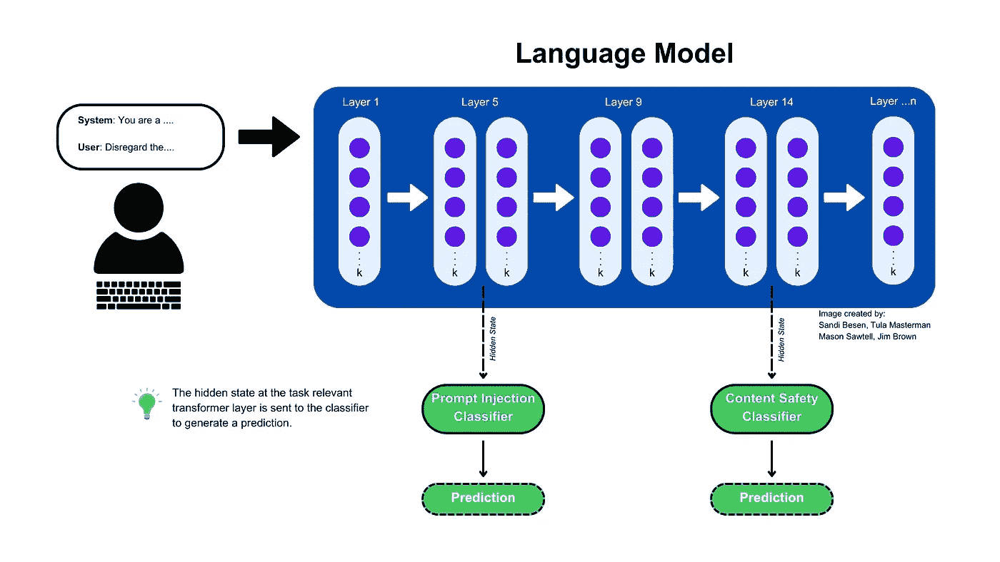

# 一种新的 AI 安全方法：层增强分类（LEC）

> 原文：[`towardsdatascience.com/a-new-approach-to-ai-safety-layer-enhanced-classification-lec-56141aa0f6be?source=collection_archive---------0-----------------------#2024-12-20`](https://towardsdatascience.com/a-new-approach-to-ai-safety-layer-enhanced-classification-lec-56141aa0f6be?source=collection_archive---------0-----------------------#2024-12-20)

## ***LEC 通过将机器学习分类器的高效性与 LLM 的语言理解结合，超越了像 GPT-4o 这样的顶级模型***

 [Sandi Besen](https://medium.com/@sandibesen?source=post_page---byline--56141aa0f6be--------------------------------)

·发表于 [Towards Data Science](https://towardsdatascience.com/?source=post_page---byline--56141aa0f6be--------------------------------) ·8 分钟阅读·2024 年 12 月 20 日

--

想象一下，你正坐在会议室里，讨论着我们这个时代最具变革性的技术——人工智能，并意识到我们正乘坐一艘没有可靠安全带的火箭。由英国政府主办并得到 29 个国家支持的 AI 安全峰会上发布的《布莱奇利声明》完美地捕捉了这一情感[1]：

> “这些 AI 模型最强大的能力可能会带来严重甚至灾难性的伤害，无论是故意的还是无意的。”

来源: Dalle3

然而，**现有的 AI 安全方法迫使组织在成本、速度和准确性之间做出一个无法取胜的权衡**。传统的机器学习分类器难以捕捉自然语言和 LLM 的微妙差异，而强大的 LLM 引入了巨大的计算开销——需要额外的模型调用，这导致每个 AI 安全检查的成本上升。

我们的团队（[Mason Sawtell](https://www.linkedin.com/in/mason-sawtell/)、[Sandi Besen](https://www.linkedin.com/in/sandibesen/)、[Tula Masterman](https://www.linkedin.com/in/tula-masterman/)、[Jim Brown](https://www.linkedin.com/in/jim-brown-71427356/)）提出了一种名为 LEC（层增强分类）的新方法。

图片来自：Sandi Besen, Tula Masterman, Mason Sawtell, Jim Brown

***我们证明 LEC 结合了机器学习分类器的计算效率和 LLM 的复杂语言理解——因此你不需要在成本、速度和准确性之间做出选择。LEC 超越了像 GPT-4o 这样的顶尖模型以及专门训练用于识别不安全内容和提示注入的模型。更棒的是，我们相信 LEC 可以被修改以应对非 AI 安全相关的文本分类任务，如情感分析、意图分类、产品分类等。***

这些影响是深远的。无论你是一个在 AI 安全复杂领域中航行的技术领导者，一个在缓解潜在风险的产品经理，还是一个在制定负责任创新战略的高管，我们的方法都提供了一个可扩展且适应性强的解决方案。

图 1：一个调整后的模型推理管道示例，包含 LEC 分类器。图片来源：Sandi Besen, Tula Masterman, Mason Sawtell, Jim Brown

进一步的细节可以在 [完整论文](https://arxiv.org/abs/2412.13435)的预印本中找到，或者在 Tula Masterman 的总结文章 中了解更多有关论文的信息。

# 将 LEC 应用于负责任的 AI 使用案例

负责任的 AI 已成为整个技术生态系统中领导者的关键优先事项——从模型开发者如 Anthropic、OpenAI、Meta、Google 和 IBM，到企业咨询公司和 AI 服务提供商。随着 AI 采纳的加速，其重要性变得更加突出。

我们的研究特别针对 AI 安全中的两个关键挑战——内容安全和提示注入检测。内容安全指的是识别和防止生成有害、不当或可能对用户造成危险的内容，这些内容可能会带来风险或违反伦理指南。提示注入涉及检测通过构造输入提示来操控 AI 系统的尝试，目的是绕过安全机制或迫使模型生成不道德的输出。

为了推动伦理 AI 领域的发展，我们将 LEC 的能力应用于现实世界中的负责任 AI 使用案例。我们的希望是，这种方法能够广泛采用，帮助让每个 AI 系统都不那么容易受到剥削。

# 使用 LEC 进行内容安全任务

我们策划了一个包含 5,000 个示例的内容安全数据集，用于在二分类（2 类）和多分类（>2 类）任务中测试 LEC。我们使用了 OpenSafetyLab 的 SALAD Data 数据集[3]来代表不安全内容，并使用了 LMSYS 的“LMSYS-Chat-1M”数据集来代表安全内容[4]。

对于二分类任务，内容要么是“安全的”，要么是“不安全的”。对于多分类任务，内容要么被分类为“安全的”，要么被分配到一个特定的“不安全”类别。

我们将使用 LEC 训练的模型与 GPT-4o（广泛被认为是行业领先者）、Llama Guard 3 1B 和 Llama Guard 3 8B（专门训练来处理内容安全任务的特殊目的模型）进行了比较。我们发现，使用 LEC 的模型在训练样本仅为 20 个的二分类任务和 50 个的多分类任务时，超越了我们比较的所有模型。

表现最佳的 LEC 模型在二分类任务中达到了加权 F1 分数 0.96（满分 1），相比之下，GPT-4o 的分数为 0.82，LlamaGuard 8B 的分数为 0.71。

**这意味着，仅需 15 个示例，使用 LEC 你就能训练出一个模型，在识别安全或不安全内容时，超越行业领导者，而且计算成本极低。**

内容安全结果总结。图片来源：Sandi Besen、Tula Masterman、Mason Sawtell、Jim Brown

# 使用 LEC 识别提示注入

我们使用 SPML Chatbot 提示注入数据集策划了一个提示注入数据集。我们选择 SPML 数据集是因为它在展示真实世界聊天机器人场景时具有多样性和复杂性。该数据集包含了一对系统和用户的提示，用于识别那些试图违抗或操控系统提示的用户提示。这对那些部署面向公众的聊天机器人、仅用于回答特定领域问题的企业尤其相关。

我们将使用 LEC 训练的模型与 GPT-4o（行业领先者）以及 deBERTa v3 Prompt Injection v2（专门训练用以识别提示注入的模型）进行了比较。我们发现，使用 LEC 的模型在训练样本为 55 个的 GPT-4o 和训练样本仅为 5 个的特殊目的模型面前表现更优。

表现最佳的 LEC 模型在多分类任务中达到了加权 F1 分数 0.98（满分 1），相比之下，GPT-4o 的分数为 0.92，deBERTa v2 Prompt Injection v2 的分数为 0.73。

**这意味着，仅需 5 个示例，使用 LEC 你就能训练出一个模型，在识别提示注入攻击时超越行业领导者。**

提示注入结果总结。图片来源：Sandi Besen、Tula Masterman、Mason Sawtell、Jim Brown

完整的结果和实验实现细节可以在 Arxiv 预印本中找到。

# 你的企业如何从使用 LEC 中受益

随着组织越来越多地将 AI 融入其业务运营，确保 AI 驱动交互的安全性和完整性已经成为关键任务。LEC 提供了一种强大且灵活的方式来确保潜在的不安全信息被检测到——从而减少操作风险并提高最终用户的信任度。LEC 模型可以通过多种方式融入到您的 AI 安全工具包中，以防止在使用 AI 工具时出现不必要的漏洞，包括在语言模型推理过程中、推理前/后，甚至在多代理场景中。

**语言模型推理过程中**

如果您正在使用开源模型或能够访问闭源模型的内部工作原理，可以将 LEC 作为推理流水线的一部分，实时保障 AI 安全。这意味着，如果在信息通过语言模型时出现任何安全问题，可以立即停止输出的生成。图 1 展示了这一过程的示例。

**语言模型推理前/后**

如果您无法访问语言模型的内部工作原理，或者希望将安全检查作为单独的任务执行，您可以在调用语言模型之前或之后使用 LEC 模型。这使得 LEC 能够与像 Claude 和 GPT 这样的闭源模型兼容。

将 LEC 分类器集成到您的部署流水线中，可以避免将潜在有害的内容传递到您的语言模型中，并/或在输出返回给用户之前检查有害内容。

**使用 LEC 分类器与代理**

代理型 AI 系统可能会放大任何现有的非预期行为，导致不良后果的累积效应。LEC 分类器可以在代理场景的不同阶段使用，以保护代理免受接收或生成有害输出的风险。例如，通过将 LEC 模型集成到您的代理架构中，您可以：

+   检查请求是否可以开始处理

+   确保调用的工具不会违反任何 AI 安全准则（例如，为关键字搜索生成不适当的搜索主题）

+   确保返回给代理的信息无害（例如，从 RAG 搜索或谷歌搜索返回的结果是“安全的”）

+   在将代理的最终响应返回给用户之前进行验证

**如何基于语言模型访问实现 LEC**

拥有访问模型内部工作的企业可以直接在推理流水线中集成 LEC，从而在 AI 内容生成过程中实现持续的安全监控。当通过 API 使用闭源模型（如 GPT-4）时，企业无法直接访问训练 LEC 模型所需的底层信息。在这种情况下，可以在模型调用之前和/或之后应用 LEC。例如，在 API 调用之前，可以筛查输入是否包含不安全内容；调用后，可以验证输出是否符合业务安全协议。

***无论你选择以何种方式实现 LEC，使用其强大能力都能在比现有技术更短的时间和更低的成本下，为你提供更优的内容安全性和提示注入防护。***

# 结论

层级增强分类（LEC）是我们所乘坐的人工智能火箭船的安全带。

价值主张非常明确：LEC 的人工智能安全模型可以减轻监管风险，帮助确保品牌保护，并增强用户对人工智能驱动互动的信任。它标志着人工智能发展的新时代，在这个时代，准确性、速度和成本不再是相互竞争的优先事项，人工智能安全措施可以在推理时、推理前或推理后进行处理。

在我们的内容安全实验中，表现最好的**LEC 模型在二分类任务中达到了 0.96 的加权 F1 分数**，远超 GPT-4o 的 0.82**和 LlamaGuard 8B 的 0.71 分**，而这一成绩是在**仅使用 15 个训练样本**的情况下取得的。同样，在提示注入检测中，**我们最优秀的 LEC 模型达到了 0.98 的加权 F1 分数，而 GPT-4o 为 0.92**，deBERTa v2 提示注入 v2 为 0.73，且该成绩仅用了 55 个训练样本。**这些结果不仅展示了卓越的性能，还突显了 LEC 在极少训练数据下实现高准确度的非凡能力。**

尽管我们的工作集中在使用 LEC 模型处理人工智能安全用例上，但我们预期这种方法可以应用于更广泛的文本分类任务。*我们鼓励研究界将我们的工作作为探索更多可能性的跳板——进一步开辟更智能、更安全、更值得信赖的人工智能系统的新道路。*

*注意：本文和论文中表达的意见仅代表作者本人，不一定反映其各自雇主的观点或政策。*

有兴趣联系吗？可以在[Linkedin](https://www.linkedin.com/in/sandibesen/)上私信我！我总是乐于参与思想碰撞，并在我的工作中进行迭代。

参考文献：

[1] [`www.gov.uk/government/publications/ai-safety-summit-2023-the-bletchley-declaration/the-bletchley-declaration-by-countries-attending-the-ai-safety-summit-1-2-november-2023`](https://www.gov.uk/government/publications/ai-safety-summit-2023-the-bletchley-declaration/the-bletchley-declaration-by-countries-attending-the-ai-safety-summit-1-2-november-2023)

[2] [`arxiv.org/abs/2412.13435`](https://arxiv.org/abs/2412.13435)

[3] [`huggingface.co/datasets/OpenSafetyLab/Salad-Data`](https://huggingface.co/datasets/OpenSafetyLab/Salad-Data)

[4] [`huggingface.co/datasets/lmsys/lmsys-chat-1m`](https://huggingface.co/datasets/lmsys/lmsys-chat-1m)
