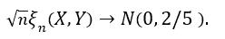

# 新的相关系数

> 原文：[`towardsdatascience.com/a-new-coefficient-of-correlation-64ae4f260310?source=collection_archive---------0-----------------------#2024-03-31`](https://towardsdatascience.com/a-new-coefficient-of-correlation-64ae4f260310?source=collection_archive---------0-----------------------#2024-03-31)


作者图片

[](https://medium.com/@tim.sumner?source=post_page---byline--64ae4f260310--------------------------------)[](https://towardsdatascience.com/?source=post_page---byline--64ae4f260310--------------------------------) [Tim Sumner](https://medium.com/@tim.sumner?source=post_page---byline--64ae4f260310--------------------------------)

·发表于[Towards Data Science](https://towardsdatascience.com/?source=post_page---byline--64ae4f260310--------------------------------) ·阅读时间：10 分钟·2024 年 3 月 31 日

--

如果有人告诉你，存在一种新的方法来衡量两个变量之间的关系，就像相关性一样，但可能更好呢？更具体来说，2020 年发表了一篇名为[A New Coefficient of Correlation](https://www.tandfonline.com/doi/full/10.1080/01621459.2020.1758115)[1]的论文，介绍了一种新的衡量方法，当且仅当两个变量独立时其值为 0，当且仅当一个变量是另一个变量的函数时其值为 1，最后还具有一些良好的理论性质，允许进行假设检验，同时在实际应用中对数据几乎不做任何假设。在深入讨论之前，让我们简要了解一下传统的相关性衡量方法是如何工作的。

# 相关性复习

很少有工具能像流行的相关系数那样，帮助理解数据，并且被广泛使用（也常常被误用）。这个工具正式被称为皮尔逊的*r*，是几乎每一门入门统计学或商业课程中教授的样本相关系数，可以说是每个数据专业人士必须熟悉的第一工具。这其中的原因有很多，其中之一是它既易于使用又容易解释。作为提醒，样本相关系数衡量的是两个变量之间的*线性*关系，并且可以通过以下公式计算。


最后提醒一下，这个值的范围是从-1 到+1，负值表示两个变量之间存在反向的*线性*关系，正值则表示相反的情况。请注意，至此我们一直强调的是衡量*线性*关系。线性关系可以理解为关系的形态大致可以用一条直线来表示。


对大多数人来说，现实世界中线性关系的出现是罕见的，这一点应该不足为奇。这就是为什么几十年来，像斯皮尔曼的*ρ*（rho）和肯达尔的*τ*（tau）等其他度量方法应运而生的原因。这些新的度量方法在识别*单调*关系方面要比线性关系更为有效，而这也使得它们更具鲁棒性，因为线性关系只是单调关系的一种特殊形式。单调关系基本可以理解为始终增加或始终减少的关系。


大多数时候，相关性被用来识别的并不一定是两个变量之间的线性或单调关系，而是试图识别是否存在**任何**关系。这就带来了问题，因为如果关系既不是线性的也不是单调的，这些现有的度量方法就无法很好地工作。请注意，下面的图形都清楚地展示了两个变量之间存在强关系，但常用的相关性技术仅擅长识别单调关系。


尽管这些相关性方法存在明显的局限性，但它们仍被广泛用于得出有关各种数据的结论。那么，是否有可能识别出比上述示例中更为复杂的关系呢？这时，引入了新的系数***ξ***（发音为“ksaai”）。

在继续之前，最后提一下，2022 年发布了一篇名为[《关于线性和单调关联的神话》](https://www.tandfonline.com/doi/full/10.1080/00031305.2021.2004922)**[2]**的论文，讨论了哪种常见的相关性度量方法适用于哪种类型的数据。早些时候，我曾建议，皮尔逊的*r*最适合用于线性度量，而斯皮尔曼的*ρ*和肯达尔的*τ*则更适用于单调数据。尽管这一规则在许多数据专业人士中广为流传并被普遍应用，但这篇论文指出，这不一定是事实，实际上在某些情况下，情况可能正好相反。

# 公式

在介绍公式之前，首先需要完成一些准备工作。正如我们之前所说，相关性可以被看作是衡量两个变量之间关系的一种方式。假设我们正在衡量 *X* 和 *Y* 之间当前的相关性。如果确实存在线性关系，那么它可以被认为是互相共享的，这意味着 *X* 和 *Y* 之间的相关性总是等于 *Y* 和 *X* 之间的相关性。然而，在这种新方法中，我们不再衡量 *X* 和 *Y* 之间的线性关系，而是我们的目标是衡量 *Y* 在多大程度上是 *X* 的函数。理解这种细微但重要的区别将使得理解公式变得更容易，因为通常来说，*ξ*(*X*,*Y*) 不再等于 *ξ*(*Y*,*X*)。

继续沿着这个思路，假设我们仍然想衡量 *Y* 在多大程度上是 *X* 的函数。请注意，每个数据点都是 *X* 和 *Y* 的有序对。首先，我们必须将数据按 (*X*₍₁₎,*Y*₍₁₎), … ,(*X*₍*ₙ*₎,*Y*₍*ₙ*₎) 的顺序排序，使得 *X*₍₁₎ ≤ *X*₍₂₎ ≤ ⋯ ≤ *X*₍*ₙ*₎。换句话说，我们必须根据 *X* 排序数据。然后我们就能创建变量 *r*₁, *r*₂, … ,*rₙ*，其中 *rᵢ* 等于 *Y*₍*ᵢ*₎ 的排名。现在这些排名已经确定，我们就可以开始计算了。

根据你所使用的数据类型，有两种公式。如果数据中不可能有平局（或极不可能有平局），则我们有


如果允许平局，则有


其中 *lᵢ* 定义为满足 *Y*₍*ⱼ*₎ ≥ *Y*₍*ᵢ*₎ 的 *j* 的数量。最后一个重要的说明是当允许平局时。除了使用第二个公式外，为了获得最佳的估计，重要的是随机排序观察到的平局，以便选择一个值被排名为高于/低于另一个值，这样 (*rᵢ*₊₁ — *rᵢ*) 就不会像之前那样等于零。然后，变量 *lᵢ* 就是 *Y*₍*ᵢ*₎ 实际大于或等于的观察数量。

为了不深入探讨理论，还值得简要指出，这种新的相关性背后有一些很好的渐近理论，使得在不对基础分布做任何假设的情况下，进行假设检验变得非常容易。这是因为这种方法依赖于数据的排名，而不是数据本身的值，因此它是一种无参数统计量。如果 *X* 和 *Y* 是独立的，并且 *Y* 是连续的，那么



这意味着如果你有足够大的样本量，那么这个相关性统计量大致遵循正态分布。如果你想测试两个变量之间的独立性程度，这会非常有用。

# 代码

随着这一新方法的发布，R 包[XICOR](https://cran.r-project.org/web/packages/XICOR/index.html)也已发布，其中包含一些相关的函数，包括一个名为 xicor() 的函数，当提供 *X* 和 *Y* 向量或矩阵时，可以轻松计算统计量 *ξ*，并提供假设检验的 p 值等附加信息。与我撰写的所有文章一样，我将提供 R、Python 和 Julia 的原始函数，您可以选择复制并保留它们。在这里，*X* 和 *Y* 必须是向量或数组，对于 Python 和 Julia，您可能需要分别安装 NumPy 和 Random 包。

我需要说明的是，这三个函数写得非常简单，仅用于介绍性目的。话虽如此，对于任何专业用途，我鼓励使用由专业库或更高效的贡献者提供的更高效的函数。例如，[这里](https://gist.github.com/itamarfaran/0cffce51cd0e3d78ddf509b72a9e702d)是由[Itamar Faran](https://medium.com/@itamar.faran)编写的一个 Python 函数，其执行速度远快于下面提供的函数。

```py
## R Function ##
xicor <- function(X, Y, ties = TRUE){
  n <- length(X)
  r <- rank(Y[order(X)], ties.method = "random")
  set.seed(42)
  if(ties){
    l <- rank(Y[order(X)], ties.method = "max")
    return( 1 - n*sum( abs(r[-1] - r[-n]) ) / (2*sum(l*(n - l))) )
  } else {
    return( 1 - 3 * sum( abs(r[-1] - r[-n]) ) / (n² - 1) )    
  }
}

## Python Function ##
from numpy import array, random, arange

def xicor(X, Y, ties=True):
    random.seed(42)
    n = len(X)
    order = array([i[0] for i in sorted(enumerate(X), key=lambda x: x[1])])
    if ties:
        l = array([sum(y >= Y[order]) for y in Y[order]])
        r = l.copy()
        for j in range(n):
            if sum([r[j] == r[i] for i in range(n)]) > 1:
                tie_index = array([r[j] == r[i] for i in range(n)])
                r[tie_index] = random.choice(r[tie_index] - arange(0, sum([r[j] == r[i] for i in range(n)])), sum(tie_index), replace=False)
        return 1 - n*sum( abs(r[1:] - r[:n-1]) ) / (2*sum(l*(n - l)))
    else:
        r = array([sum(y >= Y[order]) for y in Y[order]])
        return 1 - 3 * sum( abs(r[1:] - r[:n-1]) ) / (n**2 - 1)

## Julia Function ##
import Random
function xicor(X::AbstractVector, Y::AbstractVector, ties::Bool=true)
    Random.seed!(42)
    n = length(X)
    if ties
        l = [sum(y .>= Y[sortperm(X)]) for y ∈ Y[sortperm(X)]]
        r = copy(l)
        for j ∈ 1:n
            if sum([r[j] == r[i] for i ∈ 1:n]) > 1
                tie_index = [r[j] == r[i] for i ∈ 1:n]
                r[tie_index] = Random.shuffle(r[tie_index] .- (0:sum([r[j] == r[i] for i ∈ 1:n])-1))
            end
        end
        return 1 - n*sum( abs.(r[2:end] - r[1:n-1]) ) / (2*sum(l.*(n .- l)))
    else
        r = [sum(y .>= Y[sortperm(X)]) for y ∈ Y[sortperm(X)]]
        return 1 - 3 * sum( abs.(r[2:end] - r[1:end-1]) ) / (n² - 1)
    end
end
```

# 示例

为了初步了解使用这个新公式可能带来的好处，让我们比较几个模拟示例的计算相关系数值，这些示例突出了每种相关性方法之间的关键差异。


从顶部开始，我们可以看到使用这种新方法的相关性不再告诉你关系的方向，因为值不再是负数。然而，正如预期的那样，当关系变强时，这个值接近 1，而当关系变弱时，它接近 0，就像上述方法一样。

接下来是令人兴奋的部分。从下方的四个图表可以明显看出，这种新方法在识别一般显著关系方面，比传统计算方法更为有效。像上面展示的这些案例正是推动这一新公式研究的主要动力，因为第二个示例表明，皮尔逊的 *r* 结论是 *X* 和 *Y* 之间没有显著关系，而实际上它们之间明显存在一个抛物线关系；第三个示例表明，同样的方法得出结论认为两者之间有轻微的正相关，而实际上，这一关系似乎没有上升趋势。

到目前为止，我们只看了模拟数据。现在让我们用一个真实世界的例子，展示使用这种新相关性方法的一些可视化结果。假设我们想要衡量大脑信号和时间之间的独立性。

以下数据是通过流行的 R 包[astsa](https://www.rdocumentation.org/packages/astsa/versions/2.1)提供的功能性磁共振成像（fMRI）测量的大脑活动记录，数据以 BOLD 信号的形式呈现。为了提供更多背景信息，该数据集包含了在五个受试者中，皮层、丘脑和小脑八个不同大脑位置的平均反应。每个受试者暴露于手部周期性刷洗 32 秒，然后暂停 32 秒，形成 64 秒的信号周期。数据每 2 秒记录一次，总共记录了 256 秒（*n* = 128）。


假设我们希望测量大脑的这三部分中哪一部分最可能与时间相关，这意味着它们在执行规定的刺激时参与度最高。从上图来看，皮层信号的噪声最小，而丘脑信号之一的噪声最大，但让我们通过我们新的相关性统计量来量化这一点。下表显示了使用流行的皮尔逊*r*和新相关性*ξ*的八个测量值的相关性值。


上表揭示了常用的相关性方法始终显示这些关系为负值或接近零，这意味着几乎没有可观察到的关系，如果有关系的话，它呈现出下降趋势。显然情况并非如此，因为其中一些波长与时间之间存在明显的强关系，而且它们看起来都没有呈现出趋势。

此外，新的相关性值在识别哪些位置最不嘈杂方面表现得更好，这也是本分析的主要目的。结果显示，皮层的部分区域在刺激期间最为显著地被使用，因为这些区域的相关性值平均最高，但丘脑的某些部分也似乎有参与，使用标准方法并不容易检测到这一结果。

# 结论

还有更多可以做的工作，以继续我们开始的分析，例如使用前面介绍的渐近理论进行正式的独立性假设检验，但本报告的目的是简单地介绍这个新度量，并展示这些计算有多简单以及如何利用这些结果。如果您有兴趣了解更多关于这种方法的优缺点，我鼓励您阅读下文参考资料中介绍该方法的正式出版物。

这种新方法远非完美，但它是为了解决当前普遍接受的方法中一些最显著的问题而创造的。自从发现它以来，我一直在为自己的个人研究使用它，并且它已被证明非常有帮助。

除非另有说明，所有的图像、图表和表格均为作者提供。

[1] S. Chatterjee， [一种新的相关系数](https://www.tandfonline.com/doi/full/10.1080/01621459.2020.1758115)（2020），《美国统计学会期刊》。

[2] E. Heuvel 和 Z. Zhan， [线性和单调关联的误区](https://www.tandfonline.com/doi/full/10.1080/00031305.2021.2004922)（2022），《美国统计学家》。
