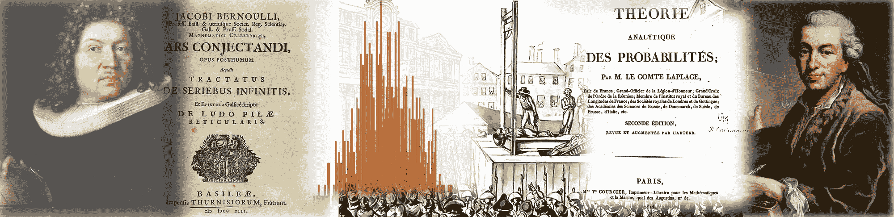
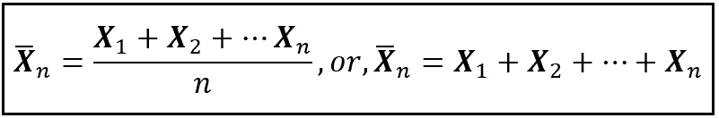
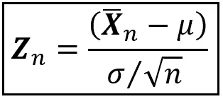
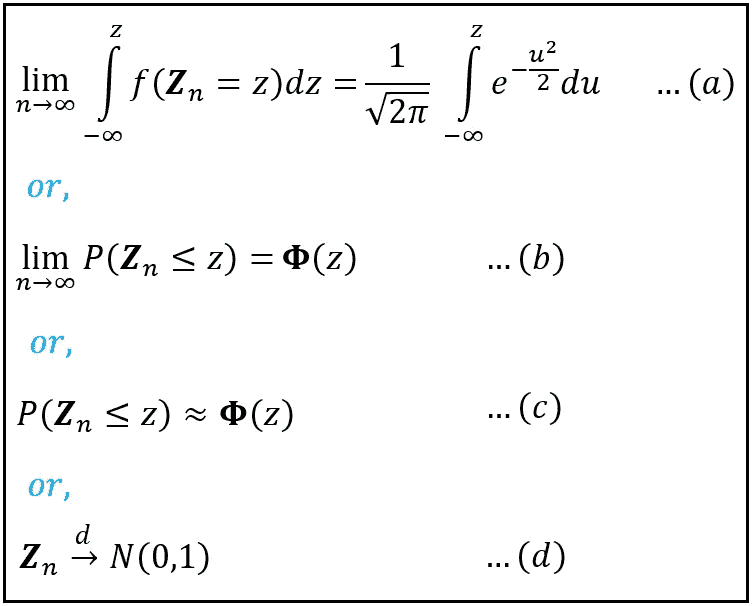
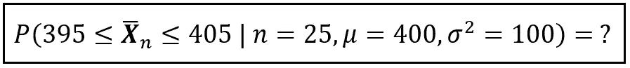
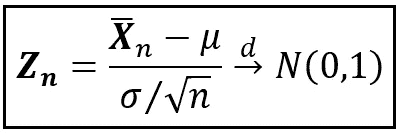
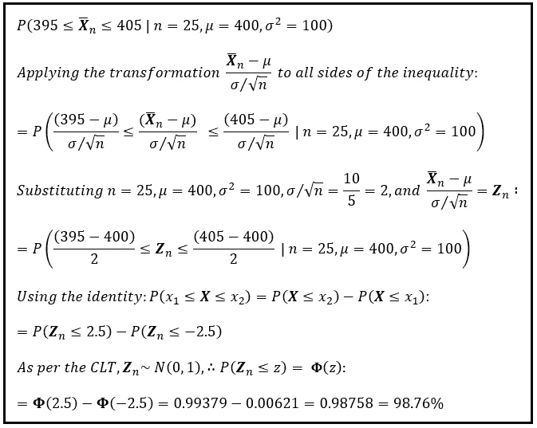
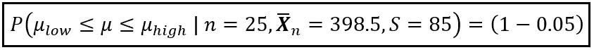
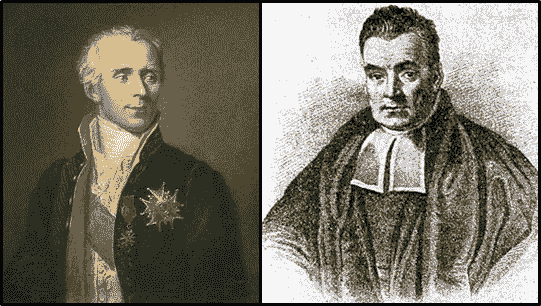
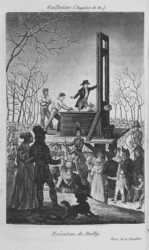

# 中心极限定理的新视角

> 原文：[`towardsdatascience.com/a-new-look-at-the-central-limit-theorem-d80735682f90?source=collection_archive---------6-----------------------#2024-01-08`](https://towardsdatascience.com/a-new-look-at-the-central-limit-theorem-d80735682f90?source=collection_archive---------6-----------------------#2024-01-08)

[公有领域](https://commons.wikimedia.org/wiki/File:Jakob_Bernoulli.jpg)/[公有领域](https://picryl.com/media/bernoulli-ars-conjectandi-1713-058b-fba7d8)/图片来源/ [公有领域](https://commons.wikimedia.org/wiki/File:Octobre_1793,_supplice_de_9_%C3%A9migr%C3%A9s.jpg)/[公有领域](https://archive.org/details/thorieanalytiqu01laplgoog/page/n6/mode/2up)/[CC BY-SA 4.0](https://commons.wikimedia.org/wiki/File:Pierre-Simon_de_Laplace_by_Johann_Ernst_Heinsius_(1775).jpg)

## 它的定义、众多应用、与逆概率的深刻关联，以及它的历史一瞥

 [Sachin Date](https://timeseriesreasoning.medium.com/?source=post_page---byline--d80735682f90--------------------------------)

·发表于 [Towards Data Science](https://towardsdatascience.com/?source=post_page---byline--d80735682f90--------------------------------) ·11 分钟阅读·2024 年 1 月 8 日

--

尽管中心极限定理内容丰富，但它有一个简明的定义。简单来说，它阐述了以下内容：**该** [**标准化**](https://en.wikipedia.org/wiki/Standard_score#Calculation) **的样本和或均值** [**i.i.d.**](https://en.m.wikipedia.org/wiki/Independent_and_identically_distributed_random_variables) **随机变量** [**在分布上收敛**](https://en.m.wikipedia.org/wiki/Convergence_of_random_variables#Definition) **到** [**N(0,1)**](https://en.m.wikipedia.org/wiki/Normal_distribution#Standard_normal_distribution)。围绕这一核心概念构建了一个适度大小的变体和特例的网络，但定理的主题仍然保持不变。

中心极限定理定义的简洁明了掩盖了其多种不同的用途，这些用途只有在你仔细解构其定义中的词汇并加以应用时才会显现出来。

中心极限定理的定义背后还隐藏着一条长达三百多年的发现之路。在众多数学家的贡献下，中心极限定理在 17、18、19 和 20 世纪间掀起了一场研究人员的淘金热。

在数学思想的发展历史中，很少有那么多的研究人员在如此多的世纪中对单一思想作出如此重大的贡献。但中心极限定理（CLT）并非普通的思想。它是统计学的金标准。

# 中心极限定理的应用

看到中心极限定理（CLT）的作用时，可能会感到十分吸引人。在接下来的这个视频中，你将看到 CLT 如何作用于从一个指数分布的总体中抽取的大小为 n 的随机样本。这个模拟生成了 1000 个不同的大小为 10 的随机样本。它计算了每个样本的均值，并绘制了这 1000 个均值的频率分布图。这种分布看起来完全不像正态分布。但一旦样本大小从 10 增加到 20、30、40、50 等，你将看到样本均值是如何迫不及待地排列成一个正态分布的。

中心极限定理的应用（作者视频）

# 中心极限定理到底是什么？

中心极限定理有着不断变化的定义，通常会根据具体背景进行调整。让我们拆解它的定义。

我们将从一个熟悉的随机样本开始。让我们使用符号(**X_**1, **X_**2, …, **X_**n)表示从一个基础总体中随机抽取（有放回）大小为 n 的样本。由于每个样本元素**X**_i 是独立且随机地（有放回）从总体中选择的，(**X**_1, **X**_2, …, **X**_n)是一组 n 个独立同分布的（[i.i.d.](https://en.m.wikipedia.org/wiki/Independent_and_identically_distributed_random_variables)）随机变量。我们进一步假设总体的均值为μ，且方差σ²是有限且正的。

设**X**_bar_n 为**样本均值**或**样本和**。它的定义如下：

n 个 i.i.d.随机变量的均值或和（作者图片）

一些统计学教材用**X**_bar_n 表示样本均值，用**S**_n 表示样本和。

由于**X**_bar_n 是 n 个随机变量的函数，**X**_bar_n 本身是一个随机变量，具有自己的均值和方差，分别用符号 E(**X**_bar_n)和 Var(**X**_bar_n)表示。

假设**X**_bar_n 是均值。由于**(X**_1, **X**_2, …, **X**_n)是 i.i.d.变量，可以证明：

E(**X**_bar_n) = μ

Var(**X**_bar_n) = σ²/n

现在让我们定义一个新的随机变量**Z**_n，如下所示：

**X**的标准化版本（作者图片）

**Z**_n，在此定义下，称为**标准化样本均值**。它是样本均值与总体均值之间的距离，以（可能是分数）标准差的数量表示。你还可以通过另一种方法计算**Z**_n。如果你使用公式（**X**_i — μ）/（σ/√n）对原始样本的每个数据点**X**_i 进行变换，并取变换后样本的简单均值，你将得到标准化样本均值**Z**_n。

根据上述装置，**中心极限定理**对于**Z**_n**做出了以下所有等价的陈述：**

> 随着样本大小的增加，Z_n 的累积分布函数（CDF）开始越来越像标准正态随机变量 N(0,1)的 CDF，并且当样本大小趋近于∞时，它与 N(0,1)的 CDF 完全一致。
> 
> 随着样本大小无限增大，Z_n 的 CDF 趋近于 N(0,1)的 CDF。
> 
> 对于大样本量，Z_n 大致是一个标准正态 N(0,1)随机变量。

以方程形式表示，三个陈述如下：

中心极限定理以几种不同的等价方式表达（图源：作者）

在（a）中，左边的积分是**Z**_n 的 CDF，而右边的积分是 N(0, 1)的 CDF。

在（b）和（c）中，P(**Z**_n ≤ z)只是表示**Z**_n 的 CDF 的另一种方式。**Φ**(z)是标准正态随机变量 N(0, 1)的 CDF 常用的表示法。

在（c）中，波浪等号（或半等号‘ ≃’）表示渐近相等。

在（d）中，箭头上的‘*d*’表示分布收敛。

请注意，中心极限定理并不假设**X**_1、**X**_2、……、**X**_n 的概率分布。它们不需要服从正态分布，而这一点大大扩展了中心极限定理的适用性。**X**_1、**X**_2、……、**X**_n 只需是独立同分布的，甚至在某些特殊版本的中心极限定理中，这两个限制条件也有所放宽。

# 你可以用中心极限定理做什么？

中心极限定理无处不在。在简单的[频率派推断](https://en.wikipedia.org/wiki/Frequentist_inference)问题中，在最小二乘估计法中，在最大似然估计法中，在贝叶斯推断中，在时间序列模型分析中——无论你在哪个统计学领域研究，你很快会发现某种形式的中心极限定理在发挥作用。每当你遇到它时，都可以利用它为自己带来好处。

让我们来看一下这些好处。

## 计算观察到特定样本均值的概率

这是一个中心极限定理的简单应用。我将通过一个例子来说明。假设你的宽带连接平均速度为 400 Mbps，方差为 100 Mbps。即 μ=400 Mbps 和 σ²=100 Mbps。如果你在一天的 25 个随机时刻测量宽带速度，样本均值落在 395 Mbps 和 405 Mbps 之间的概率是多少？即，以下这个概率是多少：

样本带宽均值落在 395 和 405 Mbps 之间的概率是多少？（图片来自作者）

在上面的概率中，竖线 ‘|’ 表示‘条件在’。

解决方案在于这样的洞察：根据中心极限定理（CLT），标准化的样本均值大致服从标准正态分布。

标准化均值在分布上收敛于 N(0,1)（图片来自作者）

你可以利用这个事实，通过以下步骤来计算解决方案：

(图片来自作者)

我们看到，在所有 25 次测量的随机样本中，98.76% 的样本带宽均值会落在 395 Mbps 和 405 Mbps 之间。

这是中心极限定理（CLT）的经典应用。为了理解为什么，回想一下我如何用一个天真的假设开始这个例子，假设你会知道你互联网连接的真实带宽 μ 和方差 σ²。嗯，你真的知道吗？你看，μ 和 σ² 是总体值，而在实际中，你不太可能知道任何参数的总体值。

## 围绕未知总体均值构建置信区间

更常见和实际的中心极限定理应用是围绕**未知总体均值** μ 或方差 σ² 构建一个 (1 —α)100% **置信区间**。继续以带宽为例，假设这次正确的是你*不知道* μ 和 σ²。假设你在一天的随机时刻进行了 25 次测量，得到了一个大小为 25 的随机样本，样本均值为 398.5 Mbps，样本方差为 85 Mbps。给定这个观察到的样本均值和方差，什么样的区间 [μ_low, μ_high] 可以使得**真实的未知均值** μ 落在这个区间内的概率为 95%？

这里 n = 25, **X**_bar_n = 398.5, S = 85。未知数是 μ 和 σ²。你需要找到一个区间 [μ_low, μ_high]，使得：

总体均值的 95% 置信区间（图片来自作者）

注意到这个概率是与之前情况中的概率**相反**的。在之前的情况中，你在寻找 P(**X**_bar_n|n,μ,σ²)，即给定 n, μ 和 σ² 下 **X**_bar_n 的概率。而这里你（实际上）在寻找 P(μ**|**n,**X**_bar_n,σ²)，即给定 n, **X**_bar_n 和 σ² 下 μ 的概率。

P(μ|n,X_bar_n, σ²) 或简称 P(μ|**X**_bar_n)，被称为**逆概率**。顺便提一下，因为你的连接速度是一个实数，P(μ**|X**_bar_n) 是实数均值 μ 在观察到的均值 **X**_bar_n 下的**概率密度函数**。

那么我们究竟在说什么呢？我们是在说**存在无限多个可能的真实均值，每一个均值都有一个概率密度，这个概率密度位于一个固定形状的概率密度函数上，形状在你观察到样本均值的那一刻就已经确定**吗？

是的，这正是我们所说的。如果这个问题开始让你联想到量子力学的[**多世界解释**](https://plato.stanford.edu/entries/qm-manyworlds/)，你并不孤单！

如果你对**逆概率**感到困惑，不要太自责。这确实是一个深奥的概念。数学家们在逆概率问题上钻研了一个多世纪，直到法国数学家[**皮埃尔-西蒙·拉普拉斯**](https://en.wikipedia.org/wiki/Pierre-Simon_Laplace)和英国长老会牧师[**托马斯·贝叶斯**](https://en.wikipedia.org/wiki/Thomas_Bayes)在 18 世纪末独立地解开了这个难题（显然是指问题，而不是他们的脑袋）。在这篇文章的续集中，我将详细介绍拉普拉斯对逆概率的精彩解决方法，他在量子力学的多世界解释首次[出现在科学期刊上](https://journals.aps.org/rmp/abstract/10.1103/RevModPhys.29.454)之前，就已经提出了这一方法，足足有两个世纪之久。拉普拉斯被称为“法国牛顿”绝非偶然。

[皮埃尔-西蒙·拉普拉斯](https://commons.wikimedia.org/wiki/File:Laplace,_Pierre-Simon,_marquis_de.jpg)（1749–1827），和[托马斯·贝叶斯](https://commons.wikimedia.org/wiki/File:Thomas_Bayes.gif)（1701–1761）（公有领域图片）

顺便提一下，提到头部受伤，拉普拉斯的大部分工作发生在 18 世纪中叶到 19 世纪初的法国社会剧变的背景下。尽管拉普拉斯巧妙地保持了自己免受动荡和法国[1789–1799 年革命](https://en.wikipedia.org/wiki/French_Revolution)后随之而来的不断变化的权力格局的影响，但许多他的同行科学家却不自觉地被解除了一切世俗责任。

1793 年 11 月 12 日：[**让·西尔万·巴耶**](https://en.wikipedia.org/wiki/Jean_Sylvain_Bailly)——法国天文学家、数学家、自由石匠、政治领袖——凝视着他眼前的[未来](https://commons.wikimedia.org/wiki/File:Death_of_Bailly.jpg)（公有领域图片）。

拉普拉斯对逆概率的解答提供了一个非常自然且令人满意的理由，用以围绕未知的总体均值构建置信区间——你猜对了——就是**中心极限定理**。

现在我可以简单地告诉你如何使用中心极限定理来构建围绕未知均值的置信区间。只需几分钟。我将展示大多数教科书采用的方法步骤，完成它。但请听我说：如果你跟随拉普拉斯的路径来构建置信区间，这将会更加有趣，因为它将会穿越他计算逆概率的方法。这正是我们将要构建置信区间的方式，接下来的文章会讲解这一过程。

与此同时，这里是中心极限定理的第三个应用场景。

## 误差的正态性和最小二乘估计的合理性

在 19 世纪初，拉普拉斯利用中心极限定理来论证测量误差服从正态分布。回顾起来，他的论证异常简单。可以把测量误差看作是无数原因的效果之和。拉普拉斯假设这些原因是独立的、均匀分布的随机变量。如果某一测量的误差是若干原因的随机样本之和，那么根据中心极限定理，它们的标准化和必须在分布上收敛于标准正态分布。这就是[**基本误差假设**](https://link.springer.com/chapter/10.1007/978-0-387-87857-7_3)。

与此同时，在 1809 年，[**约翰·卡尔·弗里德里希·高斯**](https://en.wikipedia.org/wiki/Carl_Friedrich_Gauss)(1777–1855)在现今的德国提出了**最小二乘估计法**。他的整个方法依赖于一个假设，即测量误差服从正态分布；一个高斯自己甚至都不信的假设，但他为此提供了一个非常复杂的论证。随后，拉普拉斯及时伸出援手，提出了他的“基本误差假设”，以此来证明高斯的假设，即误差服从正态分布，从而使高斯的**最小二乘估计法**得到了合法性。

## 在时间序列模型中的应用

最终，某些高级形式的中心极限定理，例如[马尔可夫中心极限定理](https://en.wikipedia.org/wiki/Martingale_central_limit_theorem)和[戈尔丁中心极限定理](https://www.jstor.org/stable/3212425)，被用来**构建**时间序列模型预测的**置信区间**。如果不使用这些中心极限定理的特殊形式，就无法轻松分析这些模型预测结果的准确性。

# 更深入地探讨中心极限定理（CLT）的起源

互联网速度测试是一个有趣的例子。如果你想提高样本平均值的准确性，你的直觉可能是增加一天中测量的频率。但多频繁才算足够呢？每小时一次？每秒一次？每飞秒一次？问题是，样本空间是由一个实数值——时间——来索引的，这使得样本空间是不可数的无限集合。

在这种情况下，均值的实际值——如果它确实存在——是无法测量的。没有人——至少在地球上的任何人——能够知道真实的值是什么。但是，我们是否有办法让大自然揭示出真实的值呢？只要我们有某种方式来衡量该估计值的准确性，我们甚至会乐于知道真实值的估计。

1687 年，一位非常著名的科学家思考了这样的问题。他的思考使他发现了**（弱）大数法则**。这也引发了一系列研究，持续了一个多世纪，最终导致了**德莫伊夫定理**、**正态曲线**、拉普拉斯的**逆概率方法**，以及最终的**中心极限定理**。这位科学家是**雅各布·伯努利**。

下周加入我，我将讨论**雅各布·伯努利**发现的**弱大数法则**。WLLN 是**中心极限定理**的基石。拔掉 WLLN，CLT 的庞大建筑物就会崩塌成一堆废墟。我们将看看是如何发生的。敬请期待。

# 参考文献和版权

## 书籍和论文

Bernoulli, Jakob (2005) [1713]，*大数法则，第四部分《猜想的艺术》（英文翻译）*，Oscar Sheynin 翻译，柏林：NG Verlag，ISBN 978–3–938417–14–0 [**PDF 下载**](http://www.sheynin.de/download/bernoulli.pdf)

Seneta, Eugene. *大数法则的三百年历史*。Bernoulli 19 (4) 1088–1121，2013 年 9 月。[`doi.org/10.3150/12-BEJSP12`](https://doi.org/10.3150/12-BEJSP12) [**PDF 下载**](https://arxiv.org/pdf/1309.6488)

Fischer, H., [*中心极限定理的历史：从经典到现代概率论*](https://books.google.com/books?id=v7kTwafIiPsC&redir_esc=y)，Springer 科学与商业媒体，2010 年 10 月

Hald, A., [*从伯努利到费舍尔的参数统计推断历史，1713–1935*](https://link.springer.com/book/10.1007/978-0-387-46409-1)，Springer，2006

Stigler, S. M., [*统计学的历史：1900 年前不确定性的测量*](https://books.google.com/books/about/The_History_of_Statistics.html?id=-LXuAAAAMAAJ&redir_esc=y)，哈佛大学出版社，1986 年 9 月

## 图像和视频

本文中的所有图像和视频版权归[Sachin Date](https://www.linkedin.com/in/sachindate/)所有，采用[CC-BY-NC-SA](https://creativecommons.org/licenses/by-nc-sa/4.0/)许可协议，除非在图像或视频下方提到不同的来源和版权。

*感谢阅读！如果你喜欢这篇文章，请* [***关注我***](https://timeseriesreasoning.medium.com/) *获取更多关于统计学和统计建模的内容。*
