# 一种强大的 EDA 工具：分组聚合

> 原文：[`towardsdatascience.com/a-powerful-eda-tool-group-by-aggregation-696736c5f3a1?source=collection_archive---------5-----------------------#2024-07-04`](https://towardsdatascience.com/a-powerful-eda-tool-group-by-aggregation-696736c5f3a1?source=collection_archive---------5-----------------------#2024-07-04)


照片由[Mourizal Zativa](https://unsplash.com/@mourimoto?utm_source=unsplash&utm_medium=referral&utm_content=creditCopyText)提供，来自[Unsplash](https://unsplash.com/s/photos/lego-pieces?utm_source=unsplash&utm_medium=referral&utm_content=creditCopyText)

## 学习如何使用分组聚合从数据中发现洞察

[](https://medium.com/@pararawendy19?source=post_page---byline--696736c5f3a1--------------------------------)[](https://towardsdatascience.com/?source=post_page---byline--696736c5f3a1--------------------------------) [Pararawendy Indarjo](https://medium.com/@pararawendy19?source=post_page---byline--696736c5f3a1--------------------------------)

·发表于[Towards Data Science](https://towardsdatascience.com/?source=post_page---byline--696736c5f3a1--------------------------------) ·阅读时间：7 分钟·2024 年 7 月 4 日

--

探索性数据分析（EDA）是数据分析师的核心能力。每天，数据分析师的任务是看到“未见之事”，或者从浩瀚的数据海洋中提取有用的洞察。

在这方面，我想分享一种我认为有助于从数据中提取相关洞察的技巧：分组聚合。

为此，本文的其余部分将按以下方式安排：

1.  在 Pandas 中进行分组聚合的解释

1.  数据集：地铁州际交通

1.  地铁交通探索性数据分析（EDA）

# 分组聚合

分组聚合是一种数据操作技巧，包含两个步骤。首先，我们根据特定列的值对数据进行分组。其次，我们在分组数据上执行一些聚合操作（例如，求和、平均、求中位数、计数唯一值等）。

分组聚合在数据粒度较细时尤其有用，典型的如事实表（交易数据）和间隔较窄的时间序列数据。通过在比原始数据粒度更高的层次进行聚合，我们可以以更紧凑的方式表示数据——并且可能在此过程中提炼出有用的洞察。

在 pandas 中，我们可以使用以下通用语法形式进行分组聚合。

```py
df.groupby(['base_col']).agg(
  agg_col=('ori_col','agg_func')
)
```

其中，`base_col`是作为分组基础的列，`agg_col`是通过对`ori_col`列进行`agg_func`聚合后定义的新列。

例如，考虑著名的泰坦尼克号数据集，以下显示了其五行数据。

```py
import pandas as pd
import seaborn as sns

# import titanic dataset
titanic = sns.load_dataset("titanic")
titanic.head()
```

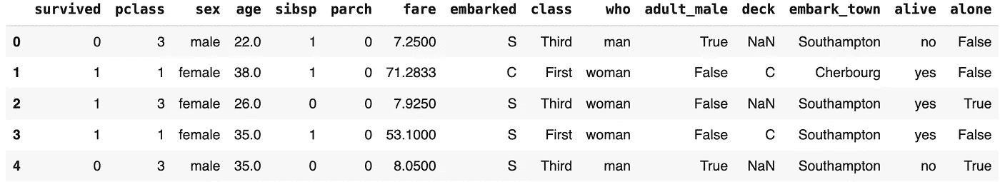

泰坦尼克号数据的前 5 行（作者提供的图片）

我们可以通过`survived`列对这些数据进行分组，然后通过计算`fare`列的中位数来聚合，得到以下结果。

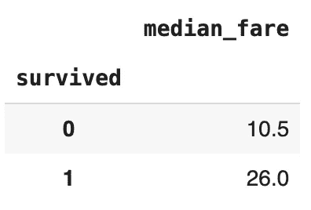

按生存状态划分的泰坦尼克号乘客票价中位数（作者提供的图片）

突然间，我们看到一个有趣的见解：生还的乘客有更高的票价中位数，且几乎翻倍。这可能与优先为高级舱乘客（即票价较高的乘客）提供救生艇有关。

希望这个简单的例子能够展示通过分组聚合从数据中提取见解的潜力。那么，现在让我们在一个更有趣的数据集上尝试一下分组聚合！

# 数据集

我们将使用地铁州际交通量数据集。这是一个公开可用的数据集，具有[创意共享 4.0 许可证](https://archive.ics.uci.edu/dataset/492/metro+interstate+traffic+volume)（允许以任何目的共享和修改数据集）。

该数据集包含 2012-2018 年间明尼阿波利斯-圣保罗，明尼苏达州 I-94 西行的每小时交通量数据，同时也包含天气详情。数据字典信息可以在其[UCI 机器学习库](https://archive.ics.uci.edu/dataset/492/metro+interstate+traffic+volume)页面找到。

```py
import pandas as pd

# load dataset
df = pd.read_csv("dir/to/Metro_Interstate_Traffic_Volume.csv")

# convert date_time column from object to proper datetime format
df['date_time'] = pd.to_datetime(df['date_time'])

# head
df.head()
```

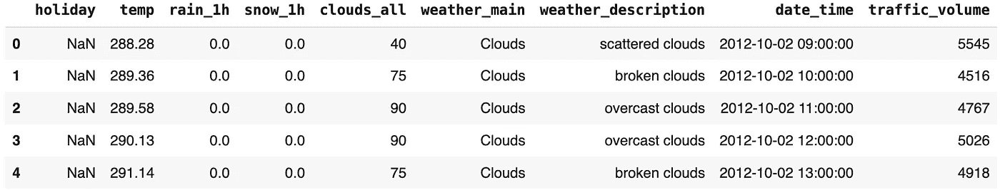

交通数据（df）头部（作者提供的图片）

对于这个博客示例，我们将仅使用 2016 年及之后的数据，因为早期的交通数据缺失（自己尝试检查一下，作为练习！）。

此外，我们将添加一个新的列`is_congested`，如果`traffic_volume`超过 5000，则值为 1，否则为 0。

```py
# only consider 2016 onwards data
df = df.loc[df['date_time']>="2016-01-01",:]

# feature engineering is_congested column
df['is_congested'] = df['traffic_volume'].apply(lambda x: 1 if x > 5000 else 0)
```

# 地铁交通 EDA

以分组聚合作为主要方法，我们将尝试回答以下分析问题。

1.  交通量的月度变化如何？

1.  一周内每天的交通概况如何（星期一、星期二等）？

1.  典型的 24 小时交通量是如何变化的，按工作日与周末进行区分？

1.  哪些天气条件与更高的拥堵率相关？

## 交通量的月度变化

这个问题要求我们按月聚合（求和）交通量数据。由于我们没有`month`列，我们需要基于`date_time`列派生出该列。

有了`month`列，我们可以基于该列进行分组，并计算`traffic_volume`的总和。代码如下所示。

```py
# create month column based on date_time
# sample values: 2016-01, 2026-02
df['month'] = df['date_time'].dt.to_period("M")

# get sum of traffic_volume by month
monthly_traffic = df.groupby('month', as_index=False).agg(
    total_traffic = ('traffic_volume', 'sum')
)

# convert month column to string for viz
monthly_traffic['month'] = monthly_traffic['month'].astype(str)

monthly_traffic.head()
```

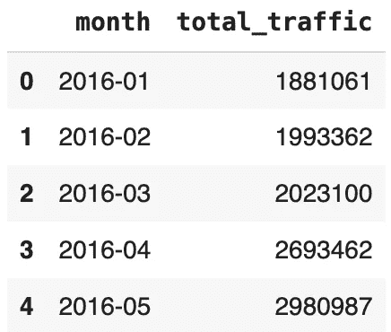

月度交通头部（作者提供的图片）

我们可以从这个数据框中绘制折线图！

```py
# draw time series plot
plt.figure(figsize=(12,5))
sns.lineplot(data=monthly_traffic, x ="month", y="total_traffic")
plt.xticks(rotation=90)
plt.title("Monthly Traffic Volume")
plt.show()
```

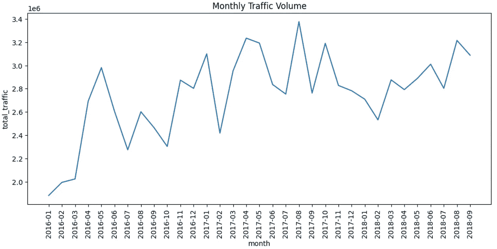

月度交通量（作者提供的图片）

上面的可视化显示，在所考虑的数据期间内，交通量普遍增加。

## 每日交通概况

为了分析这一点，我们需要创建两个额外的列：`date`和`dayname`。前者用作主要的分组依据，而后者用于在展示数据时进行细分。

在接下来的代码中，我们定义了`date`和`dayname`列。之后，我们基于这两列进行分组，以获取`traffic_volume`的总和。请注意，由于`dayname`比`date`更粗略（聚合层级较高），实际上意味着我们是基于`date`值进行聚合的。

```py
# create column date from date_time
# sample values: 2016-01-01, 2016-01-02
df['date'] = df['date_time'].dt.to_period('D')

# create  dayname column
# sample values: Monday, Tuesday
df['dayname'] = df['date_time'].dt.day_name()

# get sum of traffic, at date level
daily_traffic = df.groupby(['dayname','date'], as_index=False).agg(
    total_traffic = ('traffic_volume', 'sum')
)

# map dayname to number for viz later
dayname_map = {
    'Monday': 1,
    'Tuesday': 2,
    'Wednesday': 3,
    'Thursday': 4,
    'Friday': 5,
    'Saturday': 6,
    'Sunday': 7
}

daily_traffic['dayname_index'] = daily_traffic['dayname'].map(dayname_map)
daily_traffic = daily_traffic.sort_values(by='dayname_index')

daily_traffic.head()
```

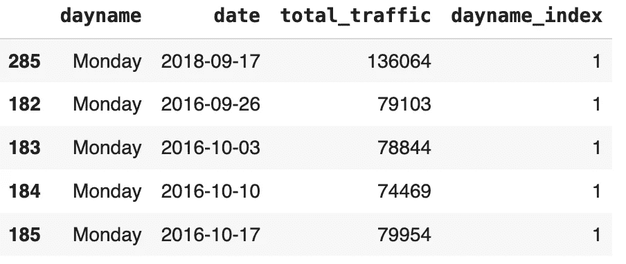

daily_traffic 头部数据（图像来源：作者）

上表包含了按星期名称划分的每日总交通量的不同表现形式。箱形图可有效展示这些交通量的变化，让我们能够理解星期一、星期二等的交通量差异。

```py
# draw boxplot per day name
plt.figure(figsize=(12,5))
sns.boxplot(data=daily_traffic, x="dayname", y="total_traffic")
plt.xticks(rotation=90)
plt.title("Daily Traffic Volume")
plt.show()
```

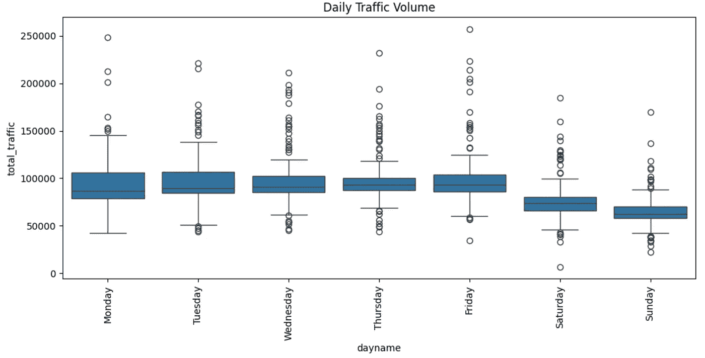

上图显示，所有工作日（周一至周五）的交通密度大致相同。周末（周六和周日）的交通较少，其中周日的交通最少。

## 按周末状态细分的小时交通模式

与之前的问题类似，我们需要创建两个新列来回答这个问题，即`hour`和`is_weekend`。

使用相同的技巧，我们将按`is_weekend`和`hour`列进行分组，以获取`traffic_volume`的平均值。

```py
# extract hour digit from date_time
# sample values: 1,2,3
df['hour'] = df['date_time'].dt.hour

# create is_weekend flag based on dayname
df['is_weekend'] = df['dayname'].apply(lambda x: 1 if x in ['Saturday', 'Sunday'] else 0)

# get average traffic at hour level, broken down by is_weekend flag
hourly_traffic = df.groupby(['is_weekend','hour'], as_index=False).agg(
    avg_traffic = ('traffic_volume', 'mean')
)

hourly_traffic.head()
```

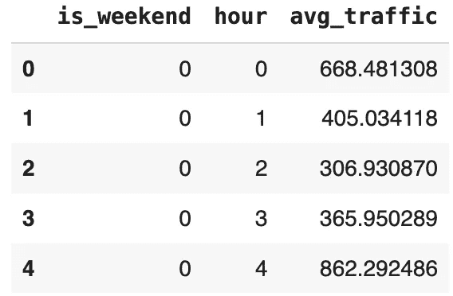

hourly_traffic 头部数据（图像来源：作者）

对于可视化，我们可以使用条形图，并按照`is_weekend`标志进行细分。

```py
# draw as barplot with hue = is_weekend
plt.figure(figsize=(20,6))
sns.barplot(data=hourly_traffic, x='hour', y='avg_traffic', hue='is_weekend')
plt.title("Average Hourly Traffic Volume: Weekdays (blue) vs Weekend (orange)", fontsize=14)
plt.show()
```

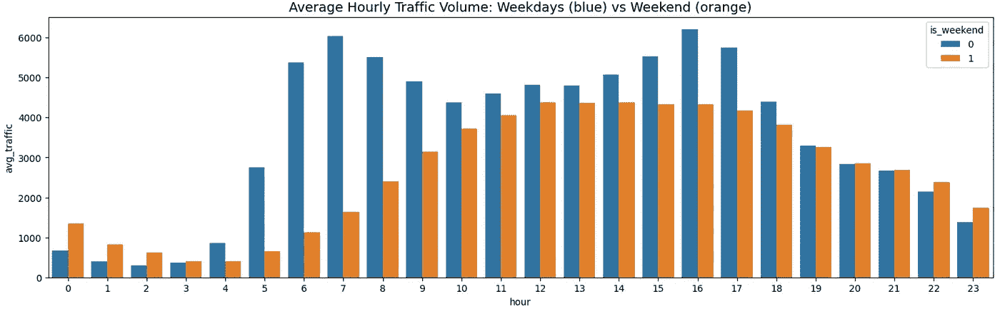

按周末状态划分的小时交通模式（图像来源：作者）

非常有趣且丰富的可视化！观察结果：

1.  工作日的交通呈双峰分布模式。它在早上 6 点到 8 点和下午 4 点到 5 点之间达到交通量的峰值。这是直观的，因为这些时间段代表着人们上下班的时间。

1.  周末的交通遵循完全不同的模式。它呈单峰形状，且有一个较大的高峰区间（12–17 点）。尽管总体上（交通量较少）低于工作日的同一时段，但值得注意的是，周末的深夜时段（22–2 点）交通实际上更高。这可能是因为人们在周末晚上待得更晚。

## 与拥堵相关的天气类型

为了回答这个问题，我们需要计算数据集中每种天气条件下的拥堵率（利用`is_congested`列）。我们能通过分组聚合来计算吗？当然可以！

需要注意的关键点是，`is_congested`列是二进制的。因此，拥堵率可以通过简单地对该列求平均值来计算！二进制列的平均值等于`count(rows with value = 1)/count(all rows)` —— 这就是拥堵率的定义。

基于这一精妙的观察，我们所要做的就是按`weather_description`分组，对`is_congested`求平均值（即均值）。接下来，我们按`congested_rate`降序排列结果。

```py
# rate of congestion (is_congested) , grouped by weather description
congested_weather = df.groupby('weather_description', as_index=False).agg(
    congested_rate = ('is_congested', 'mean')
).sort_values(by='congested_rate', ascending=False, ignore_index=True)

congested_weather.head()
```

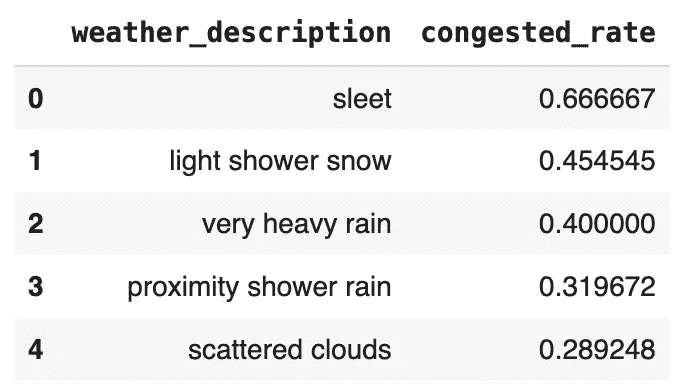

拥堵天气头（图片由作者提供）

```py
# draw as barplot
plt.figure(figsize=(20,6))
sns.barplot(data=congested_weather, x='weather_description', y='congested_rate')
plt.xticks(rotation=90)
plt.title('Top Weather with High Congestion Rates')
plt.show()
```

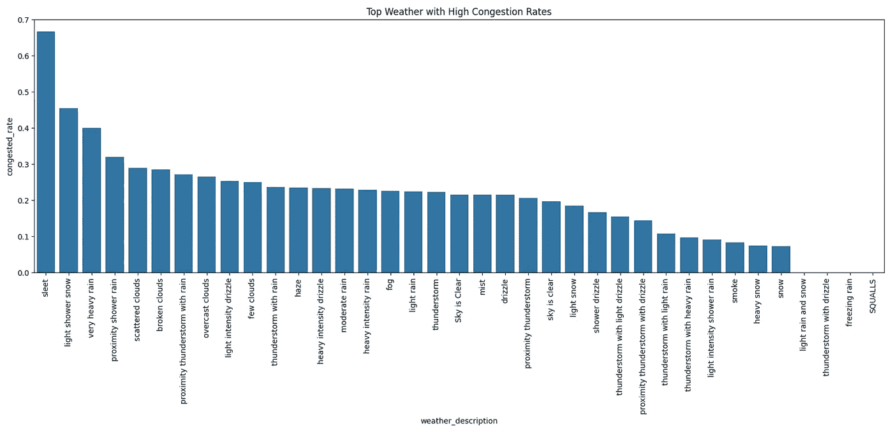

基于拥堵率的天气排行（图片由作者提供）

从图表来看：

1.  拥堵率最高的三种天气情况是冰雹、小阵雪和暴雨。

1.  与此同时，小雨和雪、带毛毛雨的雷暴、冰冻雨和阵风并未引起任何拥堵。在如此极端的天气下，人们一定都待在室内了！

# 结尾

在这篇博客文章中，我们介绍了如何在 EDA 练习中使用分组聚合。正如我们所看到的，这项技术在从数据中揭示有趣且有用的见解时非常有效，尤其是在处理粒度数据时。

希望你能在下一个 EDA 项目中练习使用分组聚合！总的来说，感谢你的阅读，欢迎在[LinkedIn](https://www.linkedin.com/in/pararawendy-indarjo/)上与我联系！👋
