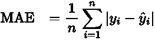

# 搜索评估的实用框架

> 原文：[`towardsdatascience.com/a-practical-framework-for-search-engine-evaluation-f8eb4f403a37?source=collection_archive---------10-----------------------#2024-07-12`](https://towardsdatascience.com/a-practical-framework-for-search-engine-evaluation-f8eb4f403a37?source=collection_archive---------10-----------------------#2024-07-12)

## 基于数据的方法提升用户体验和业务表现

 [Kaizad Wadia](https://kaizadw.medium.com/?source=post_page---byline--f8eb4f403a37--------------------------------)

·发表于[Towards Data Science](https://towardsdatascience.com/?source=post_page---byline--f8eb4f403a37--------------------------------) ·阅读时间 13 分钟·2024 年 7 月 12 日

--

搜索评估 — 图片来源：[inspiring.team](https://stock.adobe.com/uk/images/seo-concept/233052868)

搜索功能在当今几乎所有数字资产中的用户体验中都起着至关重要的作用。无论是电商平台、内容丰富的网站，还是内部知识库，搜索结果的质量都能决定用户的失望与满足之间的差异。

那么，你如何知道你的搜索算法是否返回了相关的结果呢？你如何确定它满足了用户需求并推动了业务目标的实现呢？虽然这是一个非常重要的子应用，但实际上我们缺乏一个结构化的方法来评估搜索算法。

这正是该搜索算法评估框架所提供的内容。通过建立一个系统的搜索质量评估程序，企业将能够获得关于算法表现的有意义的洞见，了解在哪些方面应投入更多努力以推动改进，并学会如何衡量长期的进展。

在这篇文章中，我们将探讨一个完整的搜索算法评估框架，包括通过用户行为定义相关性、量化性能指标的测量方法，以及如何将这些方法调整以满足特定的业务需求。

# 搜索评估的商业案例

搜索评估不仅仅是一个纯技术性工作，它是一个战略性的商业决策，且在每个环节中都有广泛的影响。要理解这一点，首先需要考虑搜索在当今数字环境中的地位。

对于许多企业来说，搜索功能将是用户与其数字产品互动的首要方式。这可以是客户在电商网站上寻找产品、员工在内部知识库中查找信息，或者读者在内容平台上探索——通常，搜索是首先发生的。然而，当这一关键功能表现不佳时，可能会导致严重的后果。

搜索表现不佳会导致用户满意度和参与度下降。当用户找不到自己想要的内容时，他们会很快感到沮丧。这种沮丧情绪迅速对跳出率施加压力，最终减少在网站上的停留时间，最终导致错失机会。

另一方面，一个经过精细调整的搜索功能可以成为推动企业成功的最大驱动力之一。它可以提高转化率，改善用户参与度，有时甚至能开辟全新的收入渠道。对于内容网站来说，改进的搜索可能推动广告展示和订阅，而对于内部系统，它可能显著缩短员工寻找信息时浪费的时间。

在这个极度个性化的时代，良好的搜索功能将处于所有个性化体验的核心。搜索表现评估有助于理解和了解用户的偏好和行为，从而不仅为搜索改进提供指导，也为更广泛的战略决策提供依据。

通过全面投资于搜索评估，你所做的并不仅仅是改善一个技术功能。这实际上是在为你的企业在数字时代蓬勃发展的韧性进行投资。

# 评估搜索相关性的常用方法

衡量企业搜索功能表现的基本问题并非技术性问题。具体来说，是定义任何用户进行的某一特定搜索所构成的相关结果。简而言之，问题是：“对于任何特定的搜索，什么算是好的搜索结果？”

这一过程高度主观，因为不同的用户可能对同一个查询有不同的意图和期望。质量的定义也因行业细分而异。每种类型的业务都需要根据自身的目标和用户群体，采取不同的方式来完成这一评估。

尽管这一问题复杂且主观，但它推动了搜索社区开发出几种广泛采用的度量标准和方法，用以满足对搜索算法评估的需求。这些方法将相关性和用户满意度进行操作化，从而尝试量化这些指标。因此，它们提供了评估和改善搜索表现的一种方式。单一方法无法捕捉搜索相关性的全部复杂性，但它们的结合能为搜索算法服务用户的效果提供有价值的洞见。在接下来的部分，我们将探讨一些常见的评估方法，包括点击流分析和以人为本的方法。

## 点击流分析

获取洞察的最常见指标之一是通过用户与网站互动时获得的指标。第一个是点击率（CTR），即在看到结果后点击该结果的用户比例。

点击率并不一定衡量搜索结果的相关性，更多的是衡量其吸引力。然而，大多数企业仍然倾向于优先考虑吸引人的结果，而非用户倾向忽视的结果。

其次是停留时间，即用户点击某个页面后停留在该页面上的时间。如果停留时间较短，表示用户没有足够参与内容。这可能意味着该搜索结果对他们来说不相关。

我们还有跳出率（BR）。跳出率是指在没有点击任何结果的情况下离开搜索的用户比例。

通常，较高的跳出率表明没有任何搜索结果对用户相关，因此一个好的搜索引擎应该尽量减少跳出率。

最后，另一个可以分析的指标（如果适用）是任务完成率（TCR）。任务完成率是指完成了一个期望任务（例如购买产品）的用户占所有浏览该任务的用户的比例。

这个指标在行业和使用场景上具有高度的特定性。例如，这是一个电子商务企业非常重视的指标，而学术期刊通常不会。较高的任务完成率表明产品或服务对客户有吸引力，因此在搜索算法中优先考虑它是相关的。

## 以人为本的评估方法

虽然点击流分析提供了一些有用的定量数据，但以人为本的评估方法为搜索相关性提供了关键的定性洞察。这些方法基于直接的人类判断，获取对搜索结果质量和相关性的反馈。

可能衡量搜索效果最直接的方式就是直接询问用户。这可以通过在每个搜索结果旁放置一个简单的点赞/点踩按钮来实现，让用户表明一个结果是否有用。更详细的问卷进一步可以检查用户满意度和搜索体验的具体情况，从非常基础到相当复杂，提供关于用户感知和需求的第一手宝贵数据。

更正式地说，许多组织可以使用[评审小组、搜索分析师或工程师](https://www.google.com/search/howsearchworks/how-search-works/rigorous-testing/)。通过生成各种测试查询，并根据预定义的标准或量表（例如，1–10 的相关性评分）对结果进行评估。尽管这一过程可能非常耗时且成本高昂，但它提供了自动化系统无法比拟的细致评估。评审人员可以评估上下文相关性、内容质量以及最重要的，与业务目标的相关性。

[基于任务的用户测试](https://blog.useberry.com/task-based-usability-testing/)提供了用户在使用搜索引擎执行特定任务时的表现信息。它不仅揭示了结果的相关性，还能深入分析搜索体验的其他方面，包括易用性和满意度等参数。这些方法能够揭示出可用性问题和用户行为，这些往往是单独依赖定量数据时所忽视的。

这些以人为中心的方法，虽然比自动化分析方法资源消耗更大，但却能提供对搜索相关性深刻的洞察。通过将这些方法与定量方法结合使用，组织可以深入了解其搜索表现及需要改进的领域。

# 搜索算法的定量评估指标

在定义了什么构成良好搜索结果的系统后，接下来就是衡量我们的搜索算法如何检索这些结果。在机器学习领域，这些参考评估被称为[真实标签](https://en.wikipedia.org/wiki/Ground_trut)。以下指标适用于信息检索系统的评估，其中大多数在[推荐系统](https://link.springer.com/chapter/10.1007/978-0-387-85820-3_8)中也有相应的对照。在接下来的部分中，我们将介绍一些相关的定量指标，从简单的如精确率和召回率，到更复杂的衡量指标，如标准化折扣累积增益（NDCG）。

## 混淆矩阵

尽管混淆矩阵通常是机器学习分类问题中的一种工具，但它也可以有效地用于搜索算法的评估。由于搜索结果通常被简单地分类为相关或不相关，混淆矩阵提供了一种直观的方式来衡量搜索性能。此外，可以从中计算出一些重要的指标，使其在保持简洁易用的同时，更具实用性。下方展示了应用于信息检索的混淆矩阵。

检索系统的混淆矩阵

在这里，对于给定的搜索查询，结果搜索可以被归入以下四个类别：它被正确检索，尽管是错误检索但不相关，或者它本可以正确忽略，或者结果是相关的，但无论如何被忽略了。

我们在这里需要考虑的主要是第一页，因为大多数用户很少会翻到之后的页面。我们引入了一个截断点，通常这个截断点大约是每页结果的数量。

让我们运行一个示例。假设我们有一个电商网站，每页列出 10 个产品。库中共有 50 个产品，其中 8 个是实际相关的。搜索算法成功地将其中 7 个相关产品显示在第一页。在这种情况下：

+   RR = 7（正确返回的相关产品）

+   IR = 3（页面总数 10 — 7 个相关 = 显示的 3 个不相关结果）

+   RI = 1（8 个总相关项目 — 显示的 7 个 = 丢失的 1 个相关产品）

+   II = 39（50 个总产品 — 显示的 10 个 — 丢失的 1 个相关 = 正确忽略的 39 个）

从混淆矩阵中可以得出的关键指标包括精确度和召回率。精确度是指检索到的项目中相关的比例。在给定的示例中，精确度为 7/10。这也被称为[Precision @ K](https://www.evidentlyai.com/ranking-metrics/precision-recall-at-k)，其中 K 是排名前几的项目的截断点。

召回率是指检索到的相关项目的比例。在给定的示例中，召回率为 7/8。

这些都是需要跟踪的重要指标，因为低精确度表示用户看到很多不相关的结果，而低召回率表示许多相关的结果未能显示给用户。这两个指标通过一个单一的度量综合并平衡，即 F1 分数，它取了这两个指标的调和平均数。在上述示例中，F1 分数为 7/9。

我们可以归结出这一简单搜索性能度量的两个重要局限性。第一个是它没有考虑结果的顺序，仅仅关注是否成功检索到相关项。这可以通过扩展混淆矩阵中得出的指标，提供更先进的度量方法来缓解，例如[均值平均精度（MAP）](https://www.evidentlyai.com/ranking-metrics/mean-average-precision-map)。第二个局限性是（从我们的示例中可以看出）如果我们每页的相关结果少于实际结果数量，即使算法检索到了所有相关项，它也永远无法获得完美的得分。

总体而言，混淆矩阵提供了一种简单的方式来检查搜索算法的性能，通过将搜索结果分类为相关或不相关。这是一个相当简化的度量方法，但它与大多数搜索结果评估方法（特别是类似用户需要对特定结果提供点赞/点踩反馈的情况）兼容并且有效。

## 经典误差度量

存储搜索索引的大多数数据库，例如[OpenSearch](https://opensearch.org/)，通常会为搜索结果分配分数，并检索分数最高的文档。如果提供了这些分数，则可以利用实际数据分数推导出更多关键度量指标。

一种非常常见的度量指标是平均绝对误差（MAE），它比较了被认为是正确或理想的分数与算法为给定搜索结果分配的分数之间的差异。然后计算所有这些偏差的平均值，使用以下公式，其中帽子符号表示估计值，y 是给定搜索结果的实际分数。

较高的 MAE 表示搜索结果表现不佳，MAE 为零意味着搜索结果完全符合实际数据。

一个类似但更加常见的度量指标是均方误差（MSE），它与平均绝对误差相似，但每个偏差都会被平方。

使用均方误差（MSE）相对于平均绝对误差（MAE）的主要优点是，MSE 会对极端值进行惩罚，因此几条评分极差的结果会导致 MSE 远高于 MAE。

总体而言，通过为结果分配分数，我们可以使用更多经典的方法来量化搜索算法所感知的相关性与我们通过经验数据发现的相关性之间的差异。

## 高级信息检索度量

许多组织会使用高级度量指标，如归一化折扣累积增益（NDCG）和平均倒数排名（MRR），来洞察其搜索系统的表现。这些指标提供了超越简单搜索质量的精度和召回的深入分析。

[归一化折扣累积增益（NDCG）](https://www.evidentlyai.com/ranking-metrics/ndcg-metric)是衡量搜索结果排名质量的度量指标。特别是在有等级相关性评分的情况下，它考虑了结果的相关性，并将其按顺序排列在搜索输出中。NDCG 的核心思想是将最相关的结果展示在搜索结果列表的顶部。首先，需要计算 DCG 以进行 NDCG 的计算。在这种情况下，DCG 是仅从搜索索引获得的相关性分数的总和，通过其位置的对数进行折扣，然后与理想排名进行归一化，最终得到一个介于 0 和 1 之间的分数。DCG 计算的表示如下所示：

这里，p 是搜索结果在排名中的位置，rel 是位置 i 的结果相关性分数。这个计算对于真实分数和实际数据的分数都要进行，两个值的商就是 NDCG。

在上述公式中，IDCG 指的是理想或真实相关性评分的 DCG 计算。NDCG 之所以特别有用，是因为它能够处理多级相关性判断。它可以区分那些有些相关的结果和那些高度相关的结果。此外，NDCG 通过位置调节这一点，使用一个递减函数来反映用户通常不会查看列表下方的结果。NDCG 评分为 1 意味着算法返回的结果是按最相关的顺序排列的。

相对而言，[平均倒数排名（MRR）](https://www.evidentlyai.com/ranking-metrics/mean-reciprocal-rank-mrr)聚焦于第一个正确或相关结果的排名。MRR 通过计算某一查询集合中，首个相关文档的倒数排名的平均值来评估。

这里，Q 表示查询的数量，rank 表示给定查询中第一个相关结果的位置。MRR 值介于 0 和 1 之间，值越高越好。MRR 为 1 意味着对于任何查询，最相关的结果始终出现在最顶部位置。这个指标特别适用于评估搜索性能，特别是在用户通常寻找单一信息的应用中，如问答系统或电商平台上的产品搜索。

这些度量标准，当应用于系统时，会为搜索算法的表现提供一个视角。

# 实施综合评估系统

在每个搜索算法中，都需要一个综合评估系统，结合上述方法和定量度量。

尽管自动化度量在提供定量数据方面具有强大的作用，但我们不应忽视人类判断在真正评估搜索相关性中的作用。在评估过程中，通过定期的专家评审和用户反馈评审来增加上下文。专家和用户反馈的定性特征有助于赋予有时模糊的定量结果更多的意义，进而揭示自动化度量可能忽视的系统问题。人类因素将反馈放入上下文中并为其增加维度，确保我们不仅优化数字指标，还优化真实的用户满意度。

最后，需要将度量标准调整为业务需求。适用于电商网站的度量标准可能完全不适用于内容平台或内部知识库。一个相关的评估框架视角应当根据上下文量身定制——基于与业务目标的相关性以及被评估算法的期望。定期的评审和调整评估标准将确保与不断变化的业务目标和最终用户需求保持一致。

*除非另有说明，图片由作者创建。*
