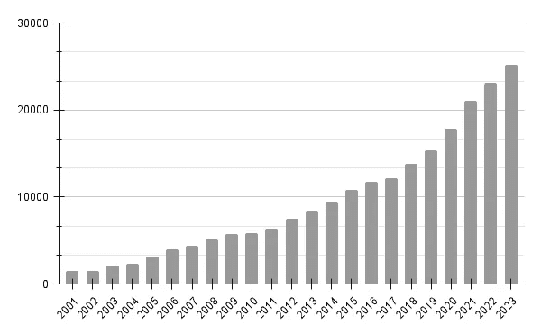
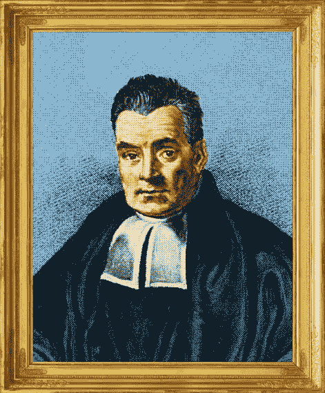
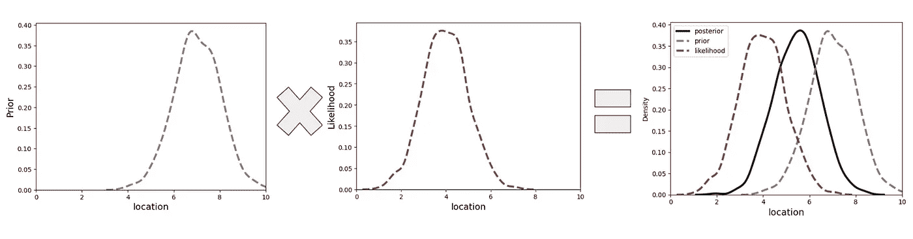

# 贝叶斯数据科学：什么，为什么，以及如何

> 原文：[`towardsdatascience.com/a-practical-guide-to-becoming-a-bayesian-data-scientist-i-c4f7a1844825?source=collection_archive---------1-----------------------#2024-04-18`](https://towardsdatascience.com/a-practical-guide-to-becoming-a-bayesian-data-scientist-i-c4f7a1844825?source=collection_archive---------1-----------------------#2024-04-18)

## 选择频率派和贝叶斯方法之间的争论是上世纪的大辩论之一，近期贝叶斯方法在科学领域的应用有了激增。

 [Samvardhan Vishnoi](https://medium.com/@samvardhanvishnoi2026?source=post_page---byline--c4f7a1844825--------------------------------)

·发表于 [Towards Data Science](https://towardsdatascience.com/?source=post_page---byline--c4f7a1844825--------------------------------) ·阅读时长：5 分钟·2024 年 4 月 18 日

--

在 [sciencedirect.com](http://sciencedirect.com) 上提到贝叶斯统计的文章数量（2024 年 4 月）——图表由作者提供

## 这有什么不同？

哲学上的差异其实非常微妙，有人认为伟大的贝叶斯批评家费舍尔在某种程度上本身也是一位贝叶斯学派的人。虽然有无数文章深入探讨公式上的差异，但实际的好处是什么呢？贝叶斯分析能为普通的数据科学家提供什么，是频率派方法已经涵盖不了的？本文旨在为读者提供一个关于贝叶斯方法的动机、构思和应用的实用介绍。让我们深入了解。

# 先验信念

频率派统计学家专注于描述数据的精确分布，而贝叶斯观点则更**主观**。主观性和统计学？没错，它们实际上是兼容的。

让我们从简单的例子开始，比如掷硬币。假设你掷硬币 10 次，得到正面 7 次。那么，得到正面的概率是多少？

P(正面) = 7/10 (0.7)?

显然，这里我们遇到了低样本量的问题。然而，从贝叶斯的角度来看，我们可以直接编码我们的信念，假设如果硬币是公平的，那么正面和反面的概率必须相等，即 1/2。虽然在这个例子中选择似乎非常明显，但当我们面对更复杂、不太显而易见的现象时，讨论会更加微妙。

*然而*，这个简单的例子是一个强有力的起点，突出了贝叶斯分析的最大**优点**和**缺点**：

**优点**：处理**数据不足**。假设你正在建模一个国家的传染病传播，而该国的数据收集稀缺。你会使用这些少量的数据来得出所有的结论吗？还是希望将类似国家中常见的模式（即有依据的先验信念）纳入模型中？虽然选择显而易见，但这直接导致了缺点的出现。

**缺点**：*先验*信念**难以构建**。例如，如果硬币实际上不是公平的，那么假设 P (正面朝上) = 0.5 就是错误的，并且几乎不可能在没有长期实验的情况下找到真正的 P (正面朝上)。在这种情况下，假设 P (正面朝上) = 0.5 反而会对寻找真相带来不利影响。然而，每一个统计模型（无论是频率派的还是贝叶斯派的）都必须在某种层面上做出假设，而人类大脑中的“统计推理”实际上与贝叶斯推理非常相似，即构建*先验*信念系统，在每个新情境中都影响我们的决策。此外，从建模角度来看，构建错误的先验信念通常并不意味着“死刑”，如果我们能从足够的数据中学习（这一点将在后续文章中进一步讨论）。

# 贝叶斯定理

那么这一切在数学上看起来是什么样的呢？贝叶斯定理为此奠定了基础。假设我们有一个参数 θ，它定义了某个模型，能够描述我们的数据（例如，θ 可能代表均值、方差、相对于协变量的斜率等）。贝叶斯定理表明

托马斯·贝叶斯在 1700 年代提出了贝叶斯定理，并在去世后发布。[[*图片*](https://commons.wikimedia.org/wiki/File:ThomasBayes.png) *通过维基共享资源，依据* [知识共享](https://en.wikipedia.org/wiki/en:Creative_Commons) [署名-相同方式共享 4.0 国际](https://creativecommons.org/licenses/by-sa/4.0/deed.en)，未经改动]

**P (θ = t|data) ∝ P (data|θ = t) * P (θ=t)**

用更简单的话说，

+   **P (θ = t|data)** 表示在给定数据的情况下，θ 等于 t 的条件概率（也就是*后验*）。

+   反过来，**P (data|θ)** 表示在 θ = t 时，观察到我们数据的概率（也就是‘*似然*’）。

+   最后，**P (θ=t)** 只是 θ 取值 t 的概率（即臭名昭著的‘*先验*’）。

那么，这个神秘的 t 是什么呢？它可以取多个可能的值，这取决于 θ 的含义。实际上，你需要尝试很多值，并检查每个值下数据的*似然*。这是一个关键步骤，你真的非常希望自己检查了θ的最佳可能值，即那些覆盖数据的最大*似然*区域的值（对那些在意的人来说，就是全局最小值）。

这就是贝叶斯推理的核心内容！

1.  为可能的 θ 值构建一个先验信念，

1.  用每个 θ 值下的*似然*，结合观察到的数据进行缩放，且

1.  返回计算结果，即*后验*，它告诉你每个测试的θ值的概率。

从图形上看，结果大致如下：

**先验（左）**与**似然（中）**的结合形成了**后验（右）**（图像改编自 Andrew Gelman 的书籍）。这里，θ 编码了飞机的东西向位置坐标。先验信念认为飞机偏向东部而不是西部。数据挑战了这一先验，因此后验位于两者之间。[图片使用作者生成的数据]

这也突显了贝叶斯统计的下一个重大优势——

+   我们对θ分布的整体形状有了一个大致的了解（例如，峰值有多宽，尾部有多重，等等），这可以使我们进行更为稳健的推断。为什么？因为我们不仅能更好地理解它，还能够量化**不确定性**（与传统的点估计和标准差相比）。

+   由于这个过程是迭代的，我们可以随着更多数据流入模型，不断更新我们的信念（估计），这使得构建完全**在线**的模型变得更加容易。

> 听起来很简单！但其实并非如此…

这个过程涉及大量计算，你需要为每个可能的θ值计算*似然*。好吧，如果假设θ的范围很小，比如 [0,1]，也许这会很简单。我们可以使用暴力**网格**方法，在离散的区间（例如 10，0.1 区间，或者 100，0.01 区间，或更多……你懂的）测试值，以所需的分辨率映射整个空间。

> 但如果空间非常庞大，而且上帝保佑，如果涉及到额外的参数，像任何现实生活中的建模场景一样怎么办？

现在，我们不仅需要测试可能的参数值，还需要测试所有可能的组合，即解空间呈指数级扩展，这使得网格搜索在计算上变得不可行。幸运的是，物理学家已经在高效采样问题上做了大量工作，今天已经有了先进的算法（例如，Metropolis-Hastings MCMC、变分推断），它们能够快速探索高维参数空间并找到凸点。你也不必自己编写这些复杂的算法，像 PyMC 或 STAN 这样的概率计算语言使得这个过程变得高度简化且直观。

## **STAN**

STAN 是我最喜欢的工具，因为它支持与更多常见的数据科学语言（如 Python、R、Julia、MATLAB 等）接口，从而有助于推广。STAN 依赖于最先进的哈密尔顿蒙特卡洛采样技术，几乎可以确保在规定时间内对良好指定的模型进行合理的收敛。在我下篇文章中，我将介绍如何开始使用 STAN，涵盖简单和复杂的回归模型，并附带完整的 Python 代码讲解。我还会介绍完整的贝叶斯建模工作流，包括模型**规范**、**拟合**、**可视化**、**比较**和**解释**。

关注并保持关注！
