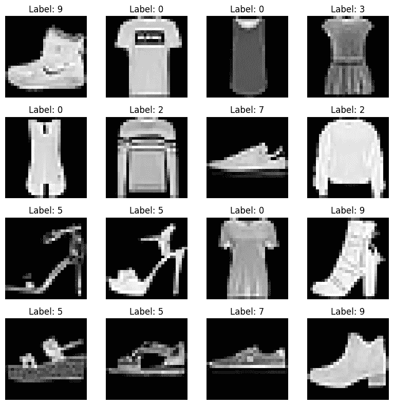
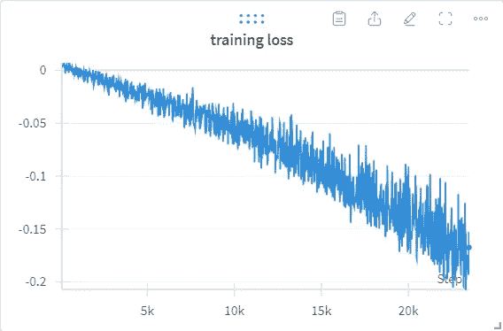

# 对比学习实用指南

> 原文：[`towardsdatascience.com/a-practical-guide-to-contrastive-learning-26e912c0362f?source=collection_archive---------1-----------------------#2024-07-30`](https://towardsdatascience.com/a-practical-guide-to-contrastive-learning-26e912c0362f?source=collection_archive---------1-----------------------#2024-07-30)

## 如何使用 FashionMNIST 构建你的第一个 SimSiam 模型

[](https://mengliuz.medium.com/?source=post_page---byline--26e912c0362f--------------------------------)[](https://towardsdatascience.com/?source=post_page---byline--26e912c0362f--------------------------------) [孟刘赵](https://mengliuz.medium.com/?source=post_page---byline--26e912c0362f--------------------------------)

·发表于 [Towards Data Science](https://towardsdatascience.com/?source=post_page---byline--26e912c0362f--------------------------------) ·阅读时长 10 分钟·2024 年 7 月 30 日

--

对比学习在当今有很多应用场景。从自然语言处理（NLP）和计算机视觉到推荐系统，对比学习可以在没有任何显式标签的情况下学习数据的潜在表示，然后可以用于下游的分类、检测、相似度搜索等任务。

网上有很多资源可以帮助读者理解对比学习的基本概念，因此我不会再写一篇重复这些信息的博客文章。相反，在本文中，我将展示如何将你的监督学习问题转化为对比学习问题。具体来说，我将从一个基本的分类模型开始，使用 [FashionMNIST](https://github.com/zalandoresearch/fashion-mnist/tree/master) 数据集（[MIT 许可证](https://github.com/zalandoresearch/fashion-mnist/blob/master/LICENSE)）。接着，我将处理一个有有限训练标签的高级问题（例如，将完整的 60,000 个标签的训练集缩减为 1,000 个标签）。我将介绍 [SimSiam](https://arxiv.org/pdf/2011.10566) 这一最先进的对比学习方法，并提供逐步的指导，说明如何按 SimSiam 风格修改原始的线性层。最终，我会展示结果 —— SimSiam 在一个非常基础的配置下，能够提高 15%的 F1 分数。


图片来源：[`pxhere.com/en/photo/395408`](https://pxhere.com/en/photo/395408)

现在，让我们开始吧。首先，我们将加载 FashionMNIST 数据集。我们使用一个自定义的 FashionMNIST 类来获取训练集的一个子集，命名为 finetune_dataset。自定义 FashionMNIST 类的源代码将在本文结尾处提供。

```py
import matplotlib.pyplot as plt

import torchvision.transforms as transforms

from FashionMNIST import FashionMNIST

train_dataset = FashionMNIST("./FashionMNIST", 
                             train=True, 
                             transform=transforms.ToTensor(), 
                             download=True,
                             )
test_dataset = FashionMNIST("./FashionMNIST", 
                            train=False, 
                            transform=transforms.ToTensor(), 
                            download=True,
                            )
finetune_dataset = FashionMNIST("./FashionMNIST", 
                                train=True, 
                                transform=transforms.ToTensor(), 
                                download=True, 
                                first_k=1000,
                                )

# Create a subplot with 4x4 grid
fig, axs = plt.subplots(4, 4, figsize=(8, 8))

# Loop through each subplot and plot an image
for i in range(4):
    for j in range(4):
        image, label = train_dataset[i * 4 + j]  # Get image and label
        image_numpy = image.numpy().squeeze()    # Convert image tensor to numpy array
        axs[i, j].imshow(image_numpy, cmap='gray')  # Plot the image
        axs[i, j].axis('off')  # Turn off axis
        axs[i, j].set_title(f"Label: {label}")  # Set title with label

plt.tight_layout()  # Adjust layout
plt.show()  # Show plot
```

代码将展示来自 train_dataset 的图像网格。



来自 FashionMNIST 训练集的前 16 张图像。图片来自作者。

接下来，我们将定义监督分类模型。该架构包含一个卷积层的主干网络和一个由两层线性层组成的 MLP 头部。这将为接下来的实验设置一个一致的基准，因为 SimSiam 仅会替换 MLP 头部以进行对比学习。

```py
import torch.nn as nn

class supervised_classification(nn.Module):

    def __init__(self):
        super(supervised_classification, self).__init__()

        self.backbone = nn.Sequential(
                                nn.Conv2d(1, 32, kernel_size=3, stride=2, padding=1),
                                nn.ReLU(),
                                nn.BatchNorm2d(32),
                                nn.Conv2d(32, 64, kernel_size=3, stride=2, padding=1),
                                nn.ReLU(),
                                nn.BatchNorm2d(64),
                                nn.Conv2d(64, 128, kernel_size=3, stride=2, padding=1),
                                nn.ReLU(),
                                nn.BatchNorm2d(128),
        )

        self.fc = nn.Sequential(
                                nn.Linear(128*4*4, 32),
                                nn.ReLU(),
                                nn.Linear(32, 10),
        )

    def forward(self, x):
        x = self.backbone(x).view(-1, 128 * 4 * 4)

        return self.fc(x)
```

我们将训练模型 10 个 epoch：

```py
import tqdm

import torch
import torch.optim as optim
from torch.utils.data import DataLoader

import wandb

wandb_config = {
    "learning_rate": 0.001,
    "architecture": "fashion mnist classification full training",
    "dataset": "FashionMNIST",
    "epochs": 10,
    "batch_size": 64,
    }

wandb.init(
    # set the wandb project where this run will be logged
    project="supervised_classification",
    # track hyperparameters and run metadata
    config=wandb_config,
)

# Initialize model and optimizer
device = torch.device('cuda' if torch.cuda.is_available() else 'cpu')

supervised = supervised_classification()

optimizer = optim.SGD(supervised.parameters(), 
                      lr=wandb_config["learning_rate"], 
                      momentum=0.9, 
                      weight_decay=1e-5,
                      )

train_dataloader = DataLoader(train_dataset, 
                              batch_size=wandb_config["batch_size"], 
                              shuffle=True,
                              )

# Training loop
loss_fun = nn.CrossEntropyLoss()
for epoch in range(wandb_config["epochs"]):
    supervised.train()

    train_loss = 0
    for batch_idx, (image, target) in enumerate(tqdm.tqdm(train_dataloader, total=len(train_dataloader))):
        optimizer.zero_grad()

        prediction = supervised(image)

        loss = loss_fun(prediction, target)
        loss.backward()
        optimizer.step()

        wandb.log({"training loss": loss})

torch.save(supervised.state_dict(), "weights/fully_supervised.pt")
```

使用 scikit-learn 包中的 classification_report，我们将得到以下结果：

```py
from sklearn.metrics import classification_report

supervised = supervised_classification()

supervised.load_state_dict(torch.load("weights/fully_supervised.pt"))
supervised.eval()
supervised.to(device)

target_list = []
prediction_list = []
for batch_idx, (image, target) in enumerate(tqdm.tqdm(test_dataloader, total=len(test_dataloader))):
    with torch.no_grad():
        prediction = supervised(image.to(device))

    prediction_list.extend(torch.argmax(prediction, dim=1).detach().cpu().numpy())
    target_list.extend(target.detach().cpu().numpy())

print(classification_report(target_list, prediction_list))

# Create a subplot with 4x4 grid
fig, axs = plt.subplots(4, 4, figsize=(8, 8))

# Loop through each subplot and plot an image
for i in range(4):
    for j in range(4):
        image, label = test_dataset[i * 4 + j]  # Get image and label
        image_numpy = image.numpy().squeeze()    # Convert image tensor to numpy array
        prediction = supervised(torch.unsqueeze(image, dim=0).to(device))
        prediction = torch.argmax(prediction, dim=1).detach().cpu().numpy()
        axs[i, j].imshow(image_numpy, cmap='gray')  # Plot the image
        axs[i, j].axis('off')  # Turn off axis
        axs[i, j].set_title(f"Label: {label}, Pred: {prediction}")  # Set title with label

plt.tight_layout()  # Adjust layout
plt.show()  # Show plot
```


完全监督模型的分类结果。图片来自作者。

现在，让我们思考**一个新问题**。如果我们只获得训练集标签的有限子集，例如，仅有 60,000 张图像中的 1000 张有标签，我们该怎么办？自然的想法是简单地在有限的标注数据集上训练模型。因此，在不改变主干网络的情况下，我们让模型在有限的子集上训练 100 个 epoch（我们增加训练 epoch 数，以便与 SimSiam 的训练做公平比较）：

```py
import tqdm

import torch
import torch.optim as optim
from torch.utils.data import DataLoader

import wandb

wandb_config = {
    "learning_rate": 0.001,
    "architecture": "fashion mnist classification full training on finetune set",
    "dataset": "FashionMNIST",
    "epochs": 100,
    "batch_size": 64,
    }

wandb.init(
    # set the wandb project where this run will be logged
    project="supervised_classification",
    # track hyperparameters and run metadata
    config=wandb_config,
)

# Initialize model and optimizer
device = torch.device('cuda' if torch.cuda.is_available() else 'cpu')

supervised = supervised_classification()

optimizer = optim.SGD(supervised.parameters(), 
                      lr=wandb_config["learning_rate"], 
                      momentum=0.9, 
                      weight_decay=1e-5,
                      )

finetune_dataloader = DataLoader(finetune_dataset, 
                                 batch_size=wandb_config["batch_size"], 
                                 shuffle=True,
                                 )

# Training loop
loss_fun = nn.CrossEntropyLoss()
for epoch in range(wandb_config["epochs"]):
    supervised.train()

    train_loss = 0
    for batch_idx, (image, target) in enumerate(tqdm.tqdm(finetune_dataloader, total=len(finetune_dataloader))):
        optimizer.zero_grad()

        prediction = supervised(image)

        loss = loss_fun(prediction, target)
        loss.backward()
        optimizer.step()

        wandb.log({"training loss": loss})

torch.save(supervised.state_dict(), "weights/fully_supervised_finetunedataset.pt")
```


在有限训练集上的完全监督训练损失。图片来自作者。


在测试集上的定量评估结果。注意，通过减少训练集大小，性能下降超过 25%。图片来自作者。

现在是进行**对比学习**的时候了。为了缓解标注标签不足的问题，并充分利用大量的未标注数据，可以使用对比学习来有效地帮助主干网络学习数据表示，而无需特定任务。主干网络可以在给定的下游任务中冻结，并仅在有限的标注数据集上训练一个浅层网络，从而获得令人满意的结果。

最常用的对比学习方法包括 SimCLR、SimSiam 和 MOCO（请参见我之前的[关于 MOCO 的文章](https://medium.com/towards-data-science/from-moco-v1-to-v3-towards-building-a-dynamic-dictionary-for-self-supervised-learning-part-1-745dc3b4e861)）。在这里，我们对 SimCLR 和 SimSiam 进行了比较。

**SimCLR**在数据批次内计算正样本对和负样本对，这需要硬负样本挖掘、NT-Xent 损失（它扩展了批次上的余弦相似度损失）以及较大的批量大小。SimCLR 还需要 LARS 优化器来适应较大的批量大小。

**SimSiam**使用的是一种孪生网络架构，它避免了使用负样本对，进而避免了对大批量数据的需求。SimSiam 与 SimCLR 的区别如下表所示。


SimCLR 和 SimSiam 的比较。图片来自作者。


SimSiam 架构。图片来源：[`arxiv.org/pdf/2011.10566`](https://arxiv.org/pdf/2011.10566)

从上图可以看出，SimSiam 架构仅包含两个部分：编码器/主干网络和预测器。在训练过程中，Siamese 部分的梯度传播被停止，并计算预测器和主干网络输出之间的余弦相似度。

那么，我们如何在实际中实现这个架构呢？继续基于监督分类设计，我们**保持主干网络不变，仅修改 MLP 层**。在监督学习架构中，MLP 输出一个包含 10 个元素的向量，表示 10 个类别的概率。但对于 SimSiam 来说，目标不是进行“分类”，而是学习“表示”，因此我们需要输出的维度与主干网络的输出维度相同，以便进行损失计算。负余弦相似度公式如下：

```py
import torch.nn as nn
import matplotlib.pyplot as plt

class SimSiam(nn.Module):

    def __init__(self):

        super(SimSiam, self).__init__()

        self.backbone = nn.Sequential(
                                nn.Conv2d(1, 32, kernel_size=3, stride=2, padding=1),
                                nn.ReLU(),
                                nn.BatchNorm2d(32),
                                nn.Conv2d(32, 64, kernel_size=3, stride=2, padding=1),
                                nn.ReLU(),
                                nn.BatchNorm2d(64),
                                nn.Conv2d(64, 128, kernel_size=3, stride=2, padding=1),
                                nn.ReLU(),
                                nn.BatchNorm2d(128),
        )

        self.prediction_mlp = nn.Sequential(nn.Linear(128*4*4, 64),
                               nn.BatchNorm1d(64),
                               nn.ReLU(),
                               nn.Linear(64, 128*4*4),
        )

    def forward(self, x):
        x = self.backbone(x)

        x = x.view(-1, 128 * 4 * 4)
        pred_output = self.prediction_mlp(x)
        return x, pred_output

cos = nn.CosineSimilarity(dim=1, eps=1e-6)
def negative_cosine_similarity_stopgradient(pred, proj):
    return -cos(pred, proj.detach()).mean()
```

训练 SimSiam 的伪代码在原始论文中如下所示：


SimSiam 的训练伪代码。来源：[`arxiv.org/pdf/2011.10566`](https://arxiv.org/pdf/2011.10566)

我们将其转化为真实的训练代码：

```py
import tqdm

import torch
import torch.optim as optim
from torch.utils.data import DataLoader
from torchvision.transforms import RandAugment

import wandb

wandb_config = {
    "learning_rate": 0.0001,
    "architecture": "simsiam",
    "dataset": "FashionMNIST",
    "epochs": 100,
    "batch_size": 256,
    }

wandb.init(
    # set the wandb project where this run will be logged
    project="simsiam",
    # track hyperparameters and run metadata
    config=wandb_config,
)

# Initialize model and optimizer
device = torch.device('cuda' if torch.cuda.is_available() else 'cpu')

simsiam = SimSiam()

random_augmenter = RandAugment(num_ops=5)

optimizer = optim.SGD(simsiam.parameters(), 
                      lr=wandb_config["learning_rate"], 
                      momentum=0.9, 
                      weight_decay=1e-5,
                      )

train_dataloader = DataLoader(train_dataset, batch_size=wandb_config["batch_size"], shuffle=True)

# Training loop
for epoch in range(wandb_config["epochs"]):
    simsiam.train()

    print(f"Epoch {epoch}")
    train_loss = 0
    for batch_idx, (image, _) in enumerate(tqdm.tqdm(train_dataloader, total=len(train_dataloader))):
        optimizer.zero_grad()

        aug1, aug2 = random_augmenter((image*255).to(dtype=torch.uint8)).to(dtype=torch.float32) / 255.0, \
                        random_augmenter((image*255).to(dtype=torch.uint8)).to(dtype=torch.float32) / 255.0

        proj1, pred1 = simsiam(aug1)
        proj2, pred2 = simsiam(aug2)

        loss = negative_cosine_similarity_stopgradient(pred1, proj2) / 2 + negative_cosine_similarity_stopgradient(pred2, proj1) / 2
        loss.backward()
        optimizer.step()

        wandb.log({"training loss": loss})

    if (epoch+1) % 10 == 0:
        torch.save(simsiam.state_dict(), f"weights/simsiam_epoch{epoch+1}.pt")
```

我们训练了 100 个 epoch，以便与有限的监督训练进行公平比较；训练损失如下所示。注意：由于其 Siamese 设计，SimSiam 可能对超参数，如学习率和 MLP 隐藏层，非常敏感。原始的 SimSiam 论文提供了 ResNet50 主干网络的详细配置。对于基于 ViT 的主干网络，我们建议阅读[MOCO v3 论文](https://arxiv.org/abs/2104.02057)，该论文采用了 SimSiam 模型，并使用动量更新方案。



SimSiam 的训练损失。图片由作者提供。

然后，我们在测试集上运行训练好的 SimSiam，并使用 UMAP 降维可视化表示：

```py
import tqdm
import numpy as np

import torch

device = torch.device('cuda' if torch.cuda.is_available() else 'cpu')

simsiam = SimSiam()                      

test_dataloader = DataLoader(test_dataset, batch_size=32, shuffle=False)
simsiam.load_state_dict(torch.load("weights/simsiam_epoch100.pt"))

simsiam.eval()
simsiam.to(device)

features = []
labels = []
for batch_idx, (image, target) in enumerate(tqdm.tqdm(test_dataloader, total=len(test_dataloader))):

    with torch.no_grad():

        proj, pred = simsiam(image.to(device))

    features.extend(np.squeeze(pred.detach().cpu().numpy()).tolist())
    labels.extend(target.detach().cpu().numpy().tolist())

import plotly.express as px
import umap.umap_ as umap

reducer = umap.UMAP(n_components=3, n_neighbors=10, metric="cosine")
projections = reducer.fit_transform(np.array(features))

px.scatter(projections, x=0, y=1,
    color=labels, labels={'color': 'Fashion MNIST Labels'}
)
```


SimSiam 表示在测试集上的 UMAP 降维。图片由作者提供。

有趣的是，在上面的降维图中，出现了两个小岛：类别 5、7、8 以及部分 9。如果我们查看 FashionMNIST 类别列表，就知道这些类别对应的是鞋类，如“凉鞋”、“运动鞋”、“包”和“短靴”。而大的紫色簇对应的是衣物类，如“T 恤/上衣”、“裤子”、“套头衫”、“连衣裙”、“外套”和“衬衫”。SimSiam 展示了在视觉领域中学习有意义的表示。

既然我们已经得到了正确的表示，那么它们如何帮助我们的分类问题呢？我们只需将训练好的 SimSiam 主干网络加载到我们的分类模型中。然而，我们并不是在有限的训练集上微调整个架构，而是微调线性层并冻结主干网络，因为我们不想破坏已经学到的表示。

```py
import tqdm

import torch
import torch.optim as optim
from torch.utils.data import DataLoader

import wandb

wandb_config = {
    "learning_rate": 0.001,
    "architecture": "supervised learning with simsiam backbone",
    "dataset": "FashionMNIST",
    "epochs": 100,
    "batch_size": 64,
    }
wandb.init(
    # set the wandb project where this run will be logged
    project="simsiam-finetune",
    # track hyperparameters and run metadata
    config=wandb_config,
)

# Initialize model and optimizer
device = torch.device('cuda' if torch.cuda.is_available() else 'cpu')

supervised = supervised_classification()

model_dict = supervised.state_dict()
simsiam_dict = {k: v for k, v in model_dict.items() if k in torch.load("simsiam.pt")}
supervised.load_state_dict(simsiam_dict, strict=False)

finetune_dataloader = DataLoader(finetune_dataset, batch_size=32, shuffle=True)

for param in supervised.backbone.parameters():
    param.requires_grad = False
parameters = [para for para in supervised.parameters() if para.requires_grad]
optimizer = optim.SGD(parameters, 
                      lr=wandb_config["learning_rate"], 
                      momentum=0.9, 
                      weight_decay=1e-5,
                      )

# Training loop
for epoch in range(wandb_config["epochs"]):
    supervised.train()

    train_loss = 0
    for batch_idx, (image, target) in enumerate(tqdm.tqdm(finetune_dataloader)):
        optimizer.zero_grad()

        prediction = supervised(image)

        loss = nn.CrossEntropyLoss()(prediction, target)
        loss.backward()
        optimizer.step()

        wandb.log({"training loss": loss})

torch.save(supervised.state_dict(), "weights/supervised_with_simsiam.pt")
```

这是 SimSiam 预训练分类模型的评估结果。与仅使用监督学习的方法相比，平均 F1 分数提高了 15%。


SimSiam 模型在有限数据集上微调后的分类分数。图像来自作者。

总结。我们展示了一个简单但直观的例子，使用 FashionMNIST 进行对比学习。通过使用 SimSiam 进行骨干网络预训练，仅在有限的训练集（仅包含完整训练集的 2%标签）上微调线性层，我们将平均 F1 分数提高了 15%，超过了完全监督学习方法。训练好的权重、笔记本和自定义的 FashionMNIST 数据集类都包含在这个[GitHub 仓库](https://github.com/adoskk/MachineLearningBasics/tree/main/unsupervised_learning/simsiam)中。

试试看！

**参考文献：**

+   Chen 等，探索简单的 Siamese 表示学习。CVPR 2021。

+   Chen 等，视觉表示的对比学习简单框架。ICML 2020。

+   Chen 等，训练自监督视觉 Transformer 的经验研究。ICCV 2021。

+   Xiao 等，Fashion-MNIST：用于基准测试机器学习算法的新型图像数据集。arXiv 预印本 2017。Github：[`github.com/zalandoresearch/fashion-mnist`](https://github.com/zalandoresearch/fashion-mnist)
