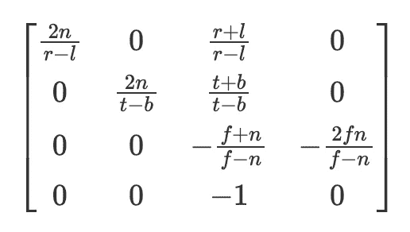
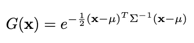

# Python 工程师的 3D 高斯点洒射入门（第二部分）

> 原文：[`towardsdatascience.com/a-python-engineers-introduction-to-3d-gaussian-splatting-part-2-7e45b270c1df?source=collection_archive---------1-----------------------#2024-06-13`](https://towardsdatascience.com/a-python-engineers-introduction-to-3d-gaussian-splatting-part-2-7e45b270c1df?source=collection_archive---------1-----------------------#2024-06-13)

## 理解并编码高斯在 3D 高斯点洒射中的应用

[](https://medium.com/@dcaustin33?source=post_page---byline--7e45b270c1df--------------------------------)[](https://towardsdatascience.com/?source=post_page---byline--7e45b270c1df--------------------------------) [Derek Austin](https://medium.com/@dcaustin33?source=post_page---byline--7e45b270c1df--------------------------------)

·发布于 [Towards Data Science](https://towardsdatascience.com/?source=post_page---byline--7e45b270c1df--------------------------------) ·8 分钟阅读·2024 年 6 月 13 日

--  

现在来讲讲高斯分布！每个人最喜欢的分布。如果你是刚加入我们的读者，我们在第一部分中讨论了如何根据相机位置将三维点转换为二维。本文将继续探讨高斯点洒射中的高斯部分。我们将在我们的[GitHub](https://github.com/dcaustin33/intro_to_gaussian_splatting)中使用 part_2.ipynb 文件。

我们在这里做的一个小改动是使用不同于上一篇文章中所示的内部矩阵的透视投影矩阵。然而，这两者在将点投影到二维时是等效的，我个人认为第一部分介绍的方法更容易理解，不过我们更改了方法，以便在 Python 中尽可能地复制作者的代码。具体来说，我们的“内部”矩阵将由这里展示的 OpenGL 投影矩阵给出，乘法的顺序将变为 points @ external.transpose() @ internal。



内部透视投影矩阵。参数将在下面的段落中进行解释。

对于那些对这个新内部矩阵感到好奇的人（否则可以跳过这一段），r 和 l 是左右裁剪平面，本质上是指根据照片的宽度，哪些点可能在视图中，t 和 b 是上下裁剪平面。N 是近裁剪平面（即点将被投影到的位置），而 f 是远裁剪平面。想要了解更多信息的人，我发现 scratchapixel 上的章节内容非常有参考价值（[`www.scratchapixel.com/lessons/3d-basic-rendering/perspective-and-orthographic-projection-matrix/opengl-perspective-projection-matrix.html`](https://www.scratchapixel.com/lessons/3d-basic-rendering/perspective-and-orthographic-projection-matrix/opengl-perspective-projection-matrix.html)）。这也返回了标准化设备坐标（在-1 和 1 之间），然后我们将其投影到像素坐标。题外话暂且不提，任务依旧是相同的，将 3D 点投影到 2D 图像平面。然而，在本教程的这一部分，我们现在使用的是高斯点而不是点。

```py
def getIntinsicMatrix(
    focal_x: torch.Tensor,
    focal_y: torch.Tensor,
    height: torch.Tensor,
    width: torch.Tensor,
    znear: torch.Tensor = torch.Tensor([100.0]),
    zfar: torch.Tensor = torch.Tensor([0.001]),,
) -> torch.Tensor:
    """
    Gets the internal perspective projection matrix

    znear: near plane set by user
    zfar: far plane set by user
    fovX: field of view in x, calculated from the focal length
    fovY: field of view in y, calculated from the focal length
    """
    fovX = torch.Tensor([2 * math.atan(width / (2 * focal_x))])
    fovY = torch.Tensor([2 * math.atan(height / (2 * focal_y))])

    tanHalfFovY = math.tan((fovY / 2))
    tanHalfFovX = math.tan((fovX / 2))

    top = tanHalfFovY * znear
    bottom = -top
    right = tanHalfFovX * znear
    left = -right

    P = torch.zeros(4, 4)

    z_sign = 1.0

    P[0, 0] = 2.0 * znear / (right - left)
    P[1, 1] = 2.0 * znear / (top - bottom)
    P[0, 2] = (right + left) / (right - left)
    P[1, 2] = (top + bottom) / (top - bottom)
    P[3, 2] = z_sign
    P[2, 2] = z_sign * zfar / (zfar - znear)
    P[2, 3] = -(zfar * znear) / (zfar - znear)
    return P
```

一个 3D 高斯点由 x、y 和 z 坐标以及相关的协方差矩阵组成。正如作者所指出的：“一种显而易见的方法是直接优化协方差矩阵Σ，以获得表示辐射场的 3D 高斯。但协方差矩阵只有在它们是正半定时才具有物理意义。由于我们对所有参数的优化使用的是梯度下降方法，而梯度下降方法无法轻松约束以生成这样的有效矩阵，因此更新步骤和梯度非常容易产生无效的协方差矩阵。”¹

因此，作者使用了协方差矩阵的分解方法，该方法始终产生正半定的协方差矩阵。特别地，他们使用了 3 个“尺度”参数和 4 个四元数，这些四元数被转换为 3x3 的旋转矩阵（R）。然后，协方差矩阵由下式给出：


协方差矩阵的方程，其中 R 表示从四元数导出的 3x3 旋转矩阵，S 是 3 个尺度参数。图片由作者提供。

注意，在将四元数转换为旋转矩阵之前，必须对四元数向量进行归一化，以获得有效的旋转矩阵。因此，在我们的实现中，一个高斯点由以下参数组成：坐标（3x1 向量）、四元数（4x1 向量）、尺度（3x1 向量）和一个最终的浮动值，表示不透明度（即该高斯点的透明度）。现在，我们只需要优化这 11 个参数来得到我们的场景——听起来很简单，对吧！

事实证明，事情比这更复杂。如果你记得高中数学，某一点上高斯函数的强度由以下方程给出：



某一点 x 处的高斯强度由均值（mu）和协方差矩阵的逆给出。图片由作者提供。

然而，我们关心的是 3D 高斯在 2D 中的强度，也就是在图像平面上的强度。但你可能会说，我们知道如何将点投影到 2D！尽管如此，我们还没有讨论如何将协方差矩阵投影到 2D，因此如果我们还没有找到 2D 协方差矩阵，显然无法求得 2D 协方差矩阵的逆矩阵。

现在是有趣的部分（取决于你怎么看）。《EWA Splatting》这篇由 3D 高斯喷溅的作者引用的论文，准确展示了如何将 3D 协方差矩阵投影到 2D²。然而，这假设了你已经掌握了雅可比仿射变换矩阵的知识，下面我们将进行计算。我发现代码在理解复杂概念时非常有帮助，因此我提供了一些代码示例，以说明如何从 3D 协方差矩阵转到 2D。

```py
def compute_2d_covariance(
    points: torch.Tensor,
    external_matrix: torch.Tensor,
    covariance_3d: torch.Tensor,
    tan_fovY: torch.Tensor,
    tan_fovX: torch.Tensor,
    focal_x: torch.Tensor,
    focal_y: torch.Tensor,
) -> torch.Tensor:
    """
    Compute the 2D covariance matrix for each gaussian
    """
    points = torch.cat(
        [points, torch.ones(points.shape[0], 1, device=points.device)], dim=1
    )
    points_transformed = (points @ external_matrix)[:, :3]
    limx = 1.3 * tan_fovX
    limy = 1.3 * tan_fovY
    x = points_transformed[:, 0] / points_transformed[:, 2]
    y = points_transformed[:, 1] / points_transformed[:, 2]
    z = points_transformed[:, 2]
    x = torch.clamp(x, -limx, limx) * z
    y = torch.clamp(y, -limy, limy) * z

    J = torch.zeros((points_transformed.shape[0], 3, 3), device=covariance_3d.device)
    J[:, 0, 0] = focal_x / z
    J[:, 0, 2] = -(focal_x * x) / (z**2)
    J[:, 1, 1] = focal_y / z
    J[:, 1, 2] = -(focal_y * y) / (z**2)

    # transpose as originally set up for perspective projection
    # so we now transform back
    W = external_matrix[:3, :3].T

    return (J @ W @ covariance_3d @ W.T @ J.transpose(1, 2))[:, :2, :2]
```

首先，tan_fovY 和 tan_fovX 是视场角一半的正切值。我们使用这些值来限制我们的投影，防止任何过度的、屏幕外的投影影响我们的渲染。可以从 3D 到 2D 的变换中推导出雅可比矩阵，这个变换在第一部分中介绍过，但我已经为你省去了麻烦，展示了预期的推导过程。最后，如果你记得我们在上面转置了旋转矩阵，以便重排项，因此在倒数第二行进行转置后，我们会返回最终的协方差计算。正如 EWA 喷溅论文中所指出的，由于我们只关心 2D 图像平面，可以忽略第三行和第三列。你可能会问，为什么一开始不能这么做？嗯，协方差矩阵的参数会根据你观察的角度而变化，因为在大多数情况下它不会是完美的球体！现在我们已经转换到正确的视角，协方差矩阵中的 z 轴信息就变得无用，可以丢弃。

鉴于我们已经有了 2D 协方差矩阵，我们距离能够计算每个高斯对图像中任意像素的影响已经很接近，我们只需要找到反转的协方差矩阵。再回顾一下线性代数，要找到 2x2 矩阵的逆矩阵，你只需要找到行列式，然后进行一些项的重排。这里有一些代码，可以帮助你引导这一过程。

```py
def compute_inverted_covariance(covariance_2d: torch.Tensor) -> torch.Tensor:
    """
    Compute the inverse covariance matrix

    For a 2x2 matrix
    given as
    [[a, b],
     [c, d]]
     the determinant is ad - bc

    To get the inverse matrix reshuffle the terms like so
    and multiply by 1/determinant
    [[d, -b],
     [-c, a]] * (1 / determinant)
    """
    determinant = (
        covariance_2d[:, 0, 0] * covariance_2d[:, 1, 1]
        - covariance_2d[:, 0, 1] * covariance_2d[:, 1, 0]
    )
    determinant = torch.clamp(determinant, min=1e-3)
    inverse_covariance = torch.zeros_like(covariance_2d)
    inverse_covariance[:, 0, 0] = covariance_2d[:, 1, 1] / determinant
    inverse_covariance[:, 1, 1] = covariance_2d[:, 0, 0] / determinant
    inverse_covariance[:, 0, 1] = -covariance_2d[:, 0, 1] / determinant
    inverse_covariance[:, 1, 0] = -covariance_2d[:, 1, 0] / determinant
    return inverse_covariance
```

哇，现在我们可以计算图像中每一个像素的强度了。然而，这样做非常慢，而且不必要。例如，我们真的不需要浪费计算能力去搞清楚一个位于(0,0)的溅射如何影响一个位于(1000, 1000)的像素，除非协方差矩阵非常庞大。因此，作者选择计算他们所称的“半径”来表示每个溅射的影响。如下代码所示，我们计算沿每个轴的特征值（记住，特征值表示变动）。然后，我们取最大特征值的平方根，得到一个标准差度量，并将其乘以 3.0，这样可以覆盖 99.7%的分布范围，位于 3 个标准差内。这个半径帮助我们确定溅射所涉及的最小和最大 x、y 值。在渲染时，我们仅计算位于这些范围内的像素的溅射强度，节省了大量不必要的计算。聪明吧？

```py
def compute_extent_and_radius(covariance_2d: torch.Tensor):
    mid = 0.5 * (covariance_2d[:, 0, 0] + covariance_2d[:, 1, 1])
    det = covariance_2d[:, 0, 0] * covariance_2d[:, 1, 1] - covariance_2d[:, 0, 1] ** 2
    intermediate_matrix = (mid * mid - det).view(-1, 1)
    intermediate_matrix = torch.cat(
        [intermediate_matrix, torch.ones_like(intermediate_matrix) * 0.1], dim=1
    )

    max_values = torch.max(intermediate_matrix, dim=1).values
    lambda1 = mid + torch.sqrt(max_values)
    lambda2 = mid - torch.sqrt(max_values)
    # now we have the eigenvalues, we can calculate the max radius
    max_radius = torch.ceil(3.0 * torch.sqrt(torch.max(lambda1, lambda2)))

    return max_radius
```

上述所有步骤为我们提供了预处理过的场景，可以在渲染步骤中使用。回顾一下，我们现在拥有了二维中的点、与这些点相关的颜色、二维中的协方差、二维中的逆协方差、排序后的深度顺序、每个溅射的最小 x、最小 y、最大 x、最大 y 值，以及相关的不透明度。有了这些组件，我们终于可以开始渲染图像了！

1.  Kerbl, Bernhard, 等人. “用于实时辐射场渲染的 3D 高斯溅射.” *ACM 图形学学报* 42.4 (2023): 1–14.

1.  Zwicker, Matthias, 等人. “EWA 溅射.” *IEEE 计算机视觉与图形学学报* 8.3 (2002): 223–238.
