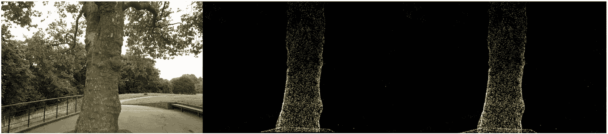
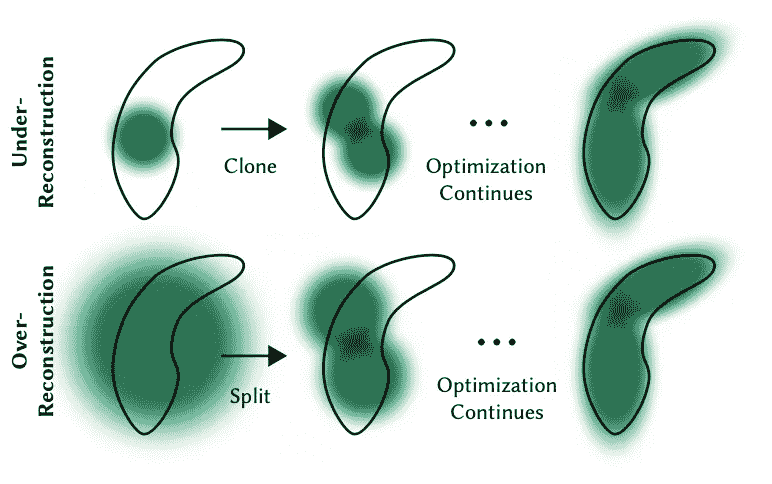

# 一位 Python 工程师的 3D 高斯喷溅入门（第三部分）

> 原文：[`towardsdatascience.com/a-python-engineers-introduction-to-3d-gaussian-splatting-part-3-398d36ccdd90?source=collection_archive---------5-----------------------#2024-07-18`](https://towardsdatascience.com/a-python-engineers-introduction-to-3d-gaussian-splatting-part-3-398d36ccdd90?source=collection_archive---------5-----------------------#2024-07-18)

## 高斯喷溅教程的第三部分，展示如何将喷溅渲染到 2D 图像上

[](https://medium.com/@dcaustin33?source=post_page---byline--398d36ccdd90--------------------------------)[](https://towardsdatascience.com/?source=post_page---byline--398d36ccdd90--------------------------------) [Derek Austin](https://medium.com/@dcaustin33?source=post_page---byline--398d36ccdd90--------------------------------)

·发表于 [Towards Data Science](https://towardsdatascience.com/?source=post_page---byline--398d36ccdd90--------------------------------) ·8 分钟阅读·2024 年 7 月 18 日

--

最后，我们进入了高斯喷溅过程中的最有趣的阶段：渲染！这一步可以说是最关键的，因为它决定了我们模型的真实感。然而，它也可能是最简单的。在我们系列的[第一部分](https://medium.com/towards-data-science/a-python-engineers-introduction-to-3d-gaussian-splatting-part-1-e133b0449fc6)和[第二部分](https://medium.com/towards-data-science/a-python-engineers-introduction-to-3d-gaussian-splatting-part-2-7e45b270c1df)中，我们展示了如何将原始的喷溅数据转换为可以渲染的格式，但现在我们实际上要做的是渲染工作，将其绘制到固定的像素集上。作者们使用 CUDA 开发了一个快速渲染引擎，虽然这个引擎有些难以跟随。因此，我认为首先通过 Python 代码讲解，使用简单的`for`循环来保持清晰，是非常有益的。对于那些渴望深入了解的人，所有必要的代码都可以在我们的[GitHub](https://github.com/dcaustin33/intro_to_gaussian_splatting)上找到。

让我们讨论如何渲染每一个独立的像素。从我们之前的[文章](https://medium.com/towards-data-science/a-python-engineers-introduction-to-3d-gaussian-splatting-part-2-7e45b270c1df)中，我们已经具备了所有必要的组件：2D 点、关联的颜色、协方差、排序后的深度顺序、2D 逆协方差、每个溅射的最小和最大 x 和 y 值，以及关联的不透明度。借助这些组件，我们可以渲染任何像素。给定特定的像素坐标，我们会遍历所有的溅射，直到达到饱和度阈值，按照溅射的深度顺序相对于相机平面（先投影到相机平面，然后按深度排序）。对于每个溅射，我们首先检查像素坐标是否在由最小和最大 x 和 y 值定义的范围内。这个检查决定了我们是继续渲染还是忽略这些坐标的溅射。接下来，我们使用溅射的均值、溅射的协方差和像素坐标来计算该像素位置的高斯溅射强度。

```py
def compute_gaussian_weight(
   pixel_coord: torch.Tensor,  # (1, 2) tensor
   point_mean: torch.Tensor,
   inverse_covariance: torch.Tensor,
) -> torch.Tensor:

   difference = point_mean - pixel_coord
   power = -0.5 * difference @ inverse_covariance @ difference.T
   return torch.exp(power).item()
```

我们将这个权重与溅射的不透明度相乘，以获得一个名为 alpha 的参数。在将这个新值添加到像素之前，我们需要检查是否超过了我们的饱和度阈值。如果像素已经饱和，我们不希望其他位于后面的溅射影响像素的着色并浪费计算资源。因此，我们使用一个阈值来确保一旦超过这个阈值，我们就停止渲染。实际上，我们将饱和度阈值从 1 开始，然后将其与 min(0.99, (1 — alpha)) 相乘得到一个新值。如果该值小于我们的阈值（0.0001），我们就停止渲染这个像素，并认为它已经完成。如果不是，我们将按饱和度 * (1 — alpha) 的值加权颜色，并更新饱和度为 new_saturation = old_saturation * (1 — alpha)。最后，我们遍历每一个像素（或者实际中是每个 16x16 的瓦片）进行渲染。完整的代码如下所示。

```py
def render_pixel(
       self,
       pixel_coords: torch.Tensor,
       points_in_tile_mean: torch.Tensor,
       colors: torch.Tensor,
       opacities: torch.Tensor,
       inverse_covariance: torch.Tensor,
       min_weight: float = 0.000001,
   ) -> torch.Tensor:
       total_weight = torch.ones(1).to(points_in_tile_mean.device)
       pixel_color = torch.zeros((1, 1, 3)).to(points_in_tile_mean.device)
       for point_idx in range(points_in_tile_mean.shape[0]):
           point = points_in_tile_mean[point_idx, :].view(1, 2)
           weight = compute_gaussian_weight(
               pixel_coord=pixel_coords,
               point_mean=point,
               inverse_covariance=inverse_covariance[point_idx],
           )
           alpha = weight * torch.sigmoid(opacities[point_idx])
           test_weight = total_weight * (1 - alpha)
           if test_weight < min_weight:
               return pixel_color
           pixel_color += total_weight * alpha * colors[point_idx]
           total_weight = test_weight
       # in case we never reach saturation
       return pixel_color
```

现在我们可以渲染一个像素，那么我们也可以渲染一张图像的一部分，或者说是作者所称的一个瓦片！

```py
 def render_tile(
     self,
     x_min: int,
     y_min: int,
     points_in_tile_mean: torch.Tensor,
     colors: torch.Tensor,
     opacities: torch.Tensor,
     inverse_covariance: torch.Tensor,
     tile_size: int = 16,
 ) -> torch.Tensor:
     """Points in tile should be arranged in order of depth"""

     tile = torch.zeros((tile_size, tile_size, 3))

     # iterate by tiles for more efficient processing
     for pixel_x in range(x_min, x_min + tile_size):
         for pixel_y in range(y_min, y_min + tile_size):
             tile[pixel_x % tile_size, pixel_y % tile_size] = self.render_pixel(
                 pixel_coords=torch.Tensor([pixel_x, pixel_y])
                 .view(1, 2)
                 .to(points_in_tile_mean.device),
                 points_in_tile_mean=points_in_tile_mean,
                 colors=colors,
                 opacities=opacities,
                 inverse_covariance=inverse_covariance,
             )
     return tile
```

最后，我们可以使用所有这些瓦片来渲染整个图像。注意我们如何检查确保溅射实际上会影响当前瓦片（x_in_tile 和 y_in_tile 代码）。

```py
def render_image(self, image_idx: int, tile_size: int = 16) -> torch.Tensor:
    """For each tile have to check if the point is in the tile"""
    preprocessed_scene = self.preprocess(image_idx)
    height = self.images[image_idx].height
    width = self.images[image_idx].width

    image = torch.zeros((width, height, 3))

    for x_min in tqdm(range(0, width, tile_size)):
        x_in_tile = (x_min >= preprocessed_scene.min_x) & (
            x_min + tile_size <= preprocessed_scene.max_x
        )
        if x_in_tile.sum() == 0:
            continue
        for y_min in range(0, height, tile_size):
            y_in_tile = (y_min >= preprocessed_scene.min_y) & (
                y_min + tile_size <= preprocessed_scene.max_y
            )
            points_in_tile = x_in_tile & y_in_tile
            if points_in_tile.sum() == 0:
                continue
            points_in_tile_mean = preprocessed_scene.points[points_in_tile]
            colors_in_tile = preprocessed_scene.colors[points_in_tile]
            opacities_in_tile = preprocessed_scene.sigmoid_opacity[points_in_tile]
            inverse_covariance_in_tile = preprocessed_scene.inverse_covariance_2d[
                points_in_tile
            ]
            image[x_min : x_min + tile_size, y_min : y_min + tile_size] = (
                self.render_tile(
                    x_min=x_min,
                    y_min=y_min,
                    points_in_tile_mean=points_in_tile_mean,
                    colors=colors_in_tile,
                    opacities=opacities_in_tile,
                    inverse_covariance=inverse_covariance_in_tile,
                    tile_size=tile_size,
                )
            )
    return image
```

最终，既然我们已经具备了所有必要的组件，我们就可以渲染图像了。我们从 treehill 数据集中获取所有的 3D 点，并将它们初始化为高斯溅射。为了避免代价高昂的最近邻搜索，我们将所有的尺度变量初始化为 0.01（注意，使用如此小的方差时，我们需要在一个位置上有较强的溅射集中才能使其可见。较大的方差会使得过程变得相当缓慢）。然后我们所需要做的就是调用 render_image，传入我们尝试模拟的图像编号，正如你所看到的，我们得到了一个稀疏的点云集，看起来像我们的图像！（查看底部的附加部分，了解使用 pyTorch 的便捷工具编译 CUDA 代码的等效 CUDA 内核！）



实际图像，CPU 实现，CUDA 实现。图片来自作者。

虽然反向传递不在本教程的内容中，但有一点需要提到的是，尽管我们一开始只有这些点，但在大多数场景中，我们很快会有数十万个 splats。这是由于将大 splats（由较大的轴方差定义）分解为更小的 splats，并移除具有极低透明度的 splats。例如，如果我们真的将缩放初始化为三个最邻近点的均值，我们将覆盖大部分空间。为了获得精细的细节，我们需要将这些 splats 分解成更小的 splats，以便捕捉精细的细节。它们还需要填充那些高斯分布稀少的区域。它们将这两种情况称为过度重建和欠重建，并通过各种 splats 的大梯度值来定义这两种情况。然后根据 splats 的大小拆分或克隆它们（见下图），并继续优化过程。

尽管反向传递不在本教程的范围内，但需要注意的是，虽然我们一开始只有几个点，但很快在大多数场景中会有数十万个 splats。这一增加是由于将大 splats（在轴上具有较大方差）拆分成更小的 splats，并移除透明度非常低的 splats。例如，如果我们最初将缩放设置为三个最近邻点的均值，大部分空间会被覆盖。为了实现更细致的细节，我们需要将这些大 splats 分解成更小的 splats。此外，少数高斯分布的区域也需要填充。这些场景被称为过度重建和欠重建，特征是各种 splats 的大梯度值。根据它们的大小，splats 会被拆分或克隆（见下图），优化过程继续进行。



来自作者原始论文，讨论在训练过程中如何对高斯分布进行拆分或克隆。来源：[`arxiv.org/abs/2308.04079`](https://arxiv.org/abs/2308.04079)

这就是高斯 Splatting 的简单介绍！你现在应该对高斯场景渲染的前向传递过程有了很好的直觉。虽然它有点复杂，并不完全是神经网络，但只需一点线性代数，我们就能在 2D 中渲染 3D 几何！

如果你对某些内容有疑问，或者我哪里弄错了，随时可以在评论区留言，你也可以通过 LinkedIn 或 Twitter 与我联系！

# 奖金 — CUDA 代码

使用 PyTorch 的 CUDA 编译器编写自定义 CUDA 核心！

```py
def load_cuda(cuda_src, cpp_src, funcs, opt=True, verbose=False):
    return load_inline(
        name="inline_ext",
        cpp_sources=[cpp_src],
        cuda_sources=[cuda_src],
        functions=funcs,
        extra_cuda_cflags=["-O1"] if opt else [],
        verbose=verbose,
    )

class GaussianScene(nn.Module):

    # OTHER CODE NOT SHOWN    

    def compile_cuda_ext(
        self,
    ) -> torch.jit.ScriptModule:

        cpp_src = """
        torch::Tensor render_image(
            int image_height,
            int image_width,
            int tile_size,
            torch::Tensor point_means,
            torch::Tensor point_colors,
            torch::Tensor inverse_covariance_2d,
            torch::Tensor min_x,
            torch::Tensor max_x,
            torch::Tensor min_y,
            torch::Tensor max_y,
            torch::Tensor opacity);
        """

        cuda_src = Path("splat/c/render.cu").read_text()

        return load_cuda(cuda_src, cpp_src, ["render_image"], opt=True, verbose=True)

    def render_image_cuda(self, image_idx: int, tile_size: int = 16) -> torch.Tensor:
        preprocessed_scene = self.preprocess(image_idx)
        height = self.images[image_idx].height
        width = self.images[image_idx].width
        ext = self.compile_cuda_ext()

        now = time.time()
        image = ext.render_image(
            height,
            width,
            tile_size,
            preprocessed_scene.points.contiguous(),
            preprocessed_scene.colors.contiguous(),
            preprocessed_scene.inverse_covariance_2d.contiguous(),
            preprocessed_scene.min_x.contiguous(),
            preprocessed_scene.max_x.contiguous(),
            preprocessed_scene.min_y.contiguous(),
            preprocessed_scene.max_y.contiguous(),
            preprocessed_scene.sigmoid_opacity.contiguous(),
        )
        torch.cuda.synchronize()
        print("Operation took seconds: ", time.time() - now)
        return image
```

```py
#include <cstdio>
#include <cmath> // Include this header for expf function
#include <torch/extension.h>

__device__ float compute_pixel_strength(
    int pixel_x,
    int pixel_y,
    int point_x,
    int point_y,
    float inverse_covariance_a,
    float inverse_covariance_b,
    float inverse_covariance_c)
{
    // Compute the distance between the pixel and the point
    float dx = pixel_x - point_x;
    float dy = pixel_y - point_y;
    float power = dx * inverse_covariance_a * dx + 2 * dx * dy * inverse_covariance_b + dy * dy * inverse_covariance_c;
    return expf(-0.5f * power);
}

__global__ void render_tile(
    int image_height,
    int image_width,
    int tile_size,
    int num_points,
    float *point_means,
    float *point_colors,
    float *image,
    float *inverse_covariance_2d,
    float *min_x,
    float *max_x,
    float *min_y,
    float *max_y,
    float *opacity)
{
    // Calculate the pixel's position in the image
    int pixel_x = blockIdx.x * tile_size + threadIdx.x;
    int pixel_y = blockIdx.y * tile_size + threadIdx.y;

    // Ensure the pixel is within the image bounds
    if (pixel_x >= image_width || pixel_y >= image_height)
    {
        return;
    }

    float total_weight = 1.0f;
    float3 color = {0.0f, 0.0f, 0.0f};

    for (int i = 0; i < num_points; i++)
    {
        float point_x = point_means[i * 2];
        float point_y = point_means[i * 2 + 1];

        // checks to make sure we are within the bounding box
        bool x_check = pixel_x >= min_x[i] && pixel_x <= max_x[i];
        bool y_check = pixel_y >= min_y[i] && pixel_y <= max_y[i];
        if (!x_check || !y_check)
        {
            continue;
        }
        float strength = compute_pixel_strength(
            pixel_x,
            pixel_y,
            point_x,
            point_y,
            inverse_covariance_2d[i * 4],
            inverse_covariance_2d[i * 4 + 1],
            inverse_covariance_2d[i * 4 + 3]);

        float initial_alpha = opacity[i] * strength;
        float alpha = min(.99f, initial_alpha);
        float test_weight = total_weight * (1 - alpha);
        if (test_weight < 0.001f)
        {
            break;
        }
        color.x += total_weight * alpha * point_colors[i * 3];
        color.y += total_weight * alpha * point_colors[i * 3 + 1];
        color.z += total_weight * alpha * point_colors[i * 3 + 2];
        total_weight = test_weight;
    }

    image[(pixel_y * image_width + pixel_x) * 3] = color.x;
    image[(pixel_y * image_width + pixel_x) * 3 + 1] = color.y;
    image[(pixel_y * image_width + pixel_x) * 3 + 2] = color.z;

}

torch::Tensor render_image(
    int image_height,
    int image_width,
    int tile_size,
    torch::Tensor point_means,
    torch::Tensor point_colors,
    torch::Tensor inverse_covariance_2d,
    torch::Tensor min_x,
    torch::Tensor max_x,
    torch::Tensor min_y,
    torch::Tensor max_y,
    torch::Tensor opacity)
{
    // Ensure the input tensors are on the same device
    torch::TensorArg point_means_t{point_means, "point_means", 1},
        point_colors_t{point_colors, "point_colors", 2},
        inverse_covariance_2d_t{inverse_covariance_2d, "inverse_covariance_2d", 3},
        min_x_t{min_x, "min_x", 4},
        max_x_t{max_x, "max_x", 5},
        min_y_t{min_y, "min_y", 6},
        max_y_t{max_y, "max_y", 7},
        opacity_t{opacity, "opacity", 8};
    torch::checkAllSameGPU("render_image", {point_means_t, point_colors_t, inverse_covariance_2d_t, min_x_t, max_x_t, min_y_t, max_y_t, opacity_t});

    // Create an output tensor for the image
    torch::Tensor image = torch::zeros({image_height, image_width, 3}, point_means.options());

    // Calculate the number of tiles in the image
    int num_tiles_x = (image_width + tile_size - 1) / tile_size;
    int num_tiles_y = (image_height + tile_size - 1) / tile_size;

    // Launch a CUDA kernel to render the image
    dim3 block(tile_size, tile_size);
    dim3 grid(num_tiles_x, num_tiles_y);
    render_tile<<<grid, block>>>(
        image_height,
        image_width,
        tile_size,
        point_means.size(0),
        point_means.data_ptr<float>(),
        point_colors.data_ptr<float>(),
        image.data_ptr<float>(),
        inverse_covariance_2d.data_ptr<float>(),
        min_x.data_ptr<float>(),
        max_x.data_ptr<float>(),
        min_y.data_ptr<float>(),
        max_y.data_ptr<float>(),
        opacity.data_ptr<float>());

    return image;
}
```
