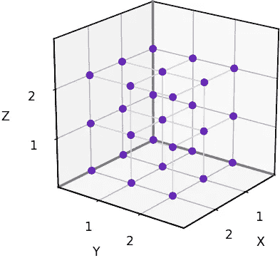
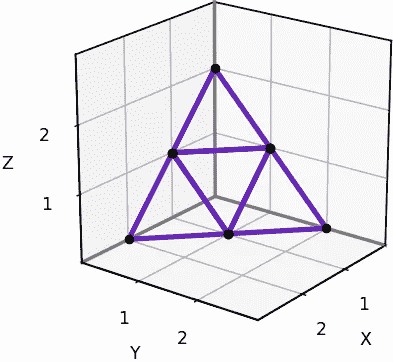
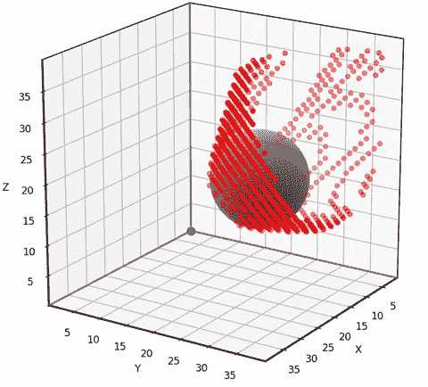

# 3D 网格邻域的清晰和扎实的轮廓

> 原文：[`towardsdatascience.com/a-sharp-and-solid-outline-of-3d-grid-neighborhoods-1b0f264e7c11?source=collection_archive---------3-----------------------#2024-03-08`](https://towardsdatascience.com/a-sharp-and-solid-outline-of-3d-grid-neighborhoods-1b0f264e7c11?source=collection_archive---------3-----------------------#2024-03-08)

## 如何将 2D 网格算法引入 3D 世界

[](https://medium.com/@rhys.goldstein?source=post_page---byline--1b0f264e7c11--------------------------------)[](https://towardsdatascience.com/?source=post_page---byline--1b0f264e7c11--------------------------------) [Rhys Goldstein](https://medium.com/@rhys.goldstein?source=post_page---byline--1b0f264e7c11--------------------------------)

·发表于 [Towards Data Science](https://towardsdatascience.com/?source=post_page---byline--1b0f264e7c11--------------------------------) ·阅读时间：20 分钟·2024 年 3 月 8 日

--


三角形 50 邻域的特写。（图片来源：作者）

在我之前的两篇文章中，《与帕斯卡三角形的简短直接漫步》 和 《基于网格的可视性的快速清晰分析》，我们看到使用基于网格的算法生成看起来不错的旅行路径并计算可视区域是多么容易。我在这些文章中分享的技巧可以应用于视频游戏、移动机器人和建筑设计，尽管我们的例子仅限于二维。在本系列的第三篇也是最后一篇中，我们将把我们对 2D 网格算法的理解扩展到第三维度。继续阅读，了解五种可以用于解决 3D 导航和可视性等 AI 问题的 3D 网格邻域。

# 3D 导航和可视性问题

由于世界是三维的，视频游戏、移动机器人挑战和建筑设计工具通常需要路径寻找和可视性算法的 3D 变种也就不足为奇了。例如，下面的图片展示了一个人在城市的 3D 模型中从某个点看到的景象。建筑师可能会使用这种 3D 可视性分析来设计一座大型建筑，同时让附近的行人尽可能多地看到天空。


[Kean Walmsley](https://through-the-interface.typepad.com/through_the_interface/about-the-author.html)在[《Through the Interface》](https://www.keanw.com/2023/10/using-vasa-with-forma-part-2.html)上的 3D 可视性示例。（经许可使用）

下一张图片为我们展示了一个人可能在大楼不同楼层之间走动的路线的 X 光视图。


[Kean Walmsley](https://through-the-interface.typepad.com/through_the_interface/about-the-author.html)在[Through the Interface](https://www.keanw.com/2021/10/streamlines-in-the-forge-viewer.html)上的 3D 路径寻找示例。（已获许可使用）

上面的例子是典型的 3D 路径寻找，路径被限制在可行走的表面上，例如楼梯和地板。另一种类型的 3D 导航问题出现在为空中机器人（如四旋翼无人机）生成飞行路径时。在这种情况下，路径可能会直接穿越空中，而不是依附于表面。

与之前的文章一样，我们的目的是使用基于网格的算法来解决导航和可视性问题**。**这意味着每次访问一个网格点时，信息只能流向相邻的网格点。被认为是“邻居”的网格点集合由**网格邻域**决定。网格邻域有很多种可能性，但下图所示的是五种最小的**标准二维网格邻域**[1]。请注意，随着邻域从 4 个到 16 个邻居的增加，它们在矩形网格和三角形网格之间交替。一般来说，使用更大邻域的算法运行时间较长，但结果更为精确。


矩形和三角形二维网格邻域。（图片由[Autodesk Research](https://www.research.autodesk.com/) [1]提供，已获许可使用）

现在我们关心的问题是：

> 这些二维邻域在 3D 中是什么样的？

4 邻域和 8 邻域的 3D 等效形式在期刊论文《[基于网格的导航路径计数](https://www.jair.org/index.php/jair/article/view/13544)》以及文献中的其他地方有描述，但我在查找其他三种邻域的 3D 版本时遇到了困难。最后我决定自己推导出来，这样就可以呈现完整的集合。在逐一讲解之前，这里先给大家看一下五种最小的**标准 3D 网格邻域**。


3D 中五种最小的标准网格邻域。（图片由作者提供）

为了展示这五种邻域，我们将使用它们来解决 3D 可视性问题，并比较五种解法的准确性。我们之所以专注于基于网格的可视性，是因为它是最简单的基于网格的算法之一——足够简单，我们可以仔细查看代码。一旦你了解了如何在 3D 中实现基于网格的可视性，你可以使用自己选择的 3D 网格邻域来解决 3D 路径寻找问题以及其他在 3D 世界中出现的 AI 挑战。

# 矩形 6 邻域

我们将从定义在**3D 矩形网格**上的邻域开始，简单来说，3D 矩形网格是由一组点[x, y, z]组成，其中 x、y 和 z 是整数。这些网格被广泛使用，可以使用标准的 3D 数组在计算机上表示。



3D 矩形网格的 3x3x3 切片。（图片由作者制作）

第一个 3D 网格邻域几乎是无处不在的，但我们还是将其展示出来以完整性考虑。当二维的矩形 4 邻域扩展到 3D 时，我们得到下图所示的**矩形 6 邻域**。要解读这张图，请想象两个垂直箭头分别指向上和下，其余箭头分别指向北、东、南和西。


用向量表示的矩形 6 邻域。（图片由作者制作）

现在我们将应用矩形 6 邻域来使用 Python 解决 3D 可视化问题。在下面的代码中，`grid_visibility`函数输入一个名为`grid0`的 3D 数组，表示环境。初始网格中值为 1 的单元表示空旷区域，值为 0 的单元表示障碍物。该函数将在另一个 3D 数组`grid`中计算可视化结果。输出网格中值为 1 的单元被认为从视点[0, 0, 0]处可见，值为 0 的单元则被认为是被遮挡的。

```py
import numpy as np

# Solve the 3D visibility problem using a simple grid-based method
def grid_visibility(grid0):
    grid = grid0.copy()
    for x in range(grid.shape[0]):
        for y in range(grid.shape[1]):
            for z in range(int(x==0 and y==0), grid.shape[2]):
                vx = grid[x-1,y,z]
                vy = grid[x,y-1,z]
                vz = grid[x,y,z-1]
                grid[x,y,z] *= (x*vx + y*vy + z*vz) / (x + y + z)
    return grid >= 0.5
```

视点固定在[0, 0, 0]的原因只是为了简化代码。如果你希望视点位于其他地方，比如网格的中心，上一篇文章通过数组索引技巧解决了这个问题，并且该技巧也适用于 3D 情况。

为了测试我们的 3D 网格可视化解算器，我们将使用下面显示的场景。输入网格为 40x40x40，具有一个球形障碍物，中心位于[10, 20, 16]，半径为 8。


测试场景。（图片由作者制作）

这个问题足够简单，可以通过解析的方法解决，从而让我们测试基于网格的解决方案的准确性。下面动画中的红点表示我们使用 6 邻域网格方法错误分类的网格点。请注意，40x40x40 网格中的绝大多数点没有红点，这意味着它们被正确分类。错误发生在障碍物“阴影”的边界附近，那里网格点要么几乎不可见，要么几乎被遮挡。我发现此类错误通常是可以容忍的，尽管这取决于具体应用。我将在文章的最后提供测试和可视化代码。


使用 6 邻域的网格可视化分类错误。（动画由作者制作）

现在，我们将重新编写基于网格的可见性算法，以适应更大的 3D 网格邻域。关键是解决在由一组向量界定的圆锥内的可见性问题。在上一篇文章中，我们定义了一个 2D 的 `visibility_within_cone` 函数，该函数需要两个向量来指定一个三角形圆锥。在 3D 中，该函数需要三个向量来定义一个四面体圆锥。

```py
# Solve the 3D visibility problem by modifying a grid within a cone
def visibility_within_cone(grid, u_vector, v_vector, w_vector):
    u = np.asarray(u_vector, dtype=int)
    v = np.asarray(v_vector, dtype=int)
    w = np.asarray(w_vector, dtype=int)
    origin = np.array([0,0,0], dtype=int)
    dims = np.asarray(grid.shape, dtype=int)
    m = 0
    k = 0
    q = 0
    pos = np.array([0,0,0], dtype=int)
    while np.all(pos < dims):
        while np.all(pos < dims):
            while np.all(pos < dims):
                if not np.all(pos == 0):
                    p = tuple(pos)
                    if grid[p] == 1:
                        pu = tuple(np.maximum(origin, pos - u))
                        pv = tuple(np.maximum(origin, pos - v))
                        pw = tuple(np.maximum(origin, pos - w))
                        grid[p] = (m*grid[pu] + 
                                   k*grid[pv] +
                                   q*grid[pw]) / (m + k + q)
                q += 1
                pos += w
            k += 1
            q = 0
            pos = m*u + k*v
        m += 1
        k = 0
        q = 0
        pos = m*u
```

以下是 6-邻域的另一种表示方式，展示了与每个圆锥相关的三角面。以这种方式表示，6-邻域看起来像一个八面体。


矩形 6-邻域，表示为三角面。（图片由作者提供）

如果我们将八面体切成两半，就可以看到矩形 6-邻域的 2D 对应物：4-邻域。


将 3D 6-邻域切成两半，揭示出 2D 4-邻域。（图片由作者提供）

让我们再次查看完整的八面体，并将其中一个三角形从原点投影出去，以帮助我们可视化一个四面体圆锥。6-邻域总共有 8 个这样的圆锥，每个圆锥对应于该区域的一个三维八分之一。请注意，每个圆锥延伸到无穷远，覆盖其整个八分之一。


6-邻域中圆锥的可视化。（图片由作者提供）

这是仅包含 6-邻域一个八分之一及其单个圆锥的图。该图使我们可以轻松读取界定向量的坐标，后续我们将需要这些坐标来重新实现基于网格的算法。在这种情况下，界定向量是 `[1,0,0]`、`[0,1,0]`、`[0,0,1]`，即三角形的三个角。


在矩形 6-邻域的一个八分之一中绘制了一个圆锥图形。（图片由作者提供）

以下是我们新的 6-邻域 3D 基于网格的可见性实现。

```py
# Solve the 3D visibility problem using the 6-neighborhood
def grid6_visibility(grid0):
    grid = grid0.copy()
    visibility_within_cone(grid, [1,0,0], [0,1,0], [0,0,1])
    return grid >= 0.5
```

新的 `grid6-visibility` 函数产生的结果与我们之前看到的 `grid-visibility` 函数完全相同，但我们的重构工作将帮助我们处理更大的三维邻域，这些邻域包含更多的圆锥。

# 矩形 26-邻域

当矩形 8-邻域在 2D 中被扩展到 3D 时，我们得到下图所示的**矩形 26-邻域**。该邻域呈现为一个 2x2x2 的立方体，每一面都被三角形镶嵌，代表圆锥。


矩形 26-邻域。（图片由作者提供）

和之前一样，我们可以将邻域切成两半，以查看其 2D 对应物：8-邻域。


将 3D 26-邻域切成两半，揭示出 2D 8-邻域。（图片由作者提供）

矩形 26-邻域是众所周知的，尽管它很少以能识别其 48 个四面体圆锥的方式展示。下面的插图突出了其中一个圆锥。


矩形 26 邻域中一个锥体的可视化。（图片来源：作者）

下图帮助我们读取一个八分体内 6 个锥体的坐标。


矩形 26 邻域中一个八分体内 6 个锥体的图。（图片来源：作者）

这是我们基于 26 邻域的 3D 网格可视性实现。请注意，我们对上图中的每个三角形调用了一次`visibility_within_cone`。

```py
# Solve the 3D visibility problem using the 26-neighborhood
def grid26_visibility(grid0):
    grid = grid0.copy()
    visibility_within_cone(grid, [1,0,0], [1,1,0], [1,1,1])
    visibility_within_cone(grid, [1,0,0], [1,0,1], [1,1,1])
    visibility_within_cone(grid, [0,1,0], [1,1,0], [1,1,1])
    visibility_within_cone(grid, [0,1,0], [0,1,1], [1,1,1])
    visibility_within_cone(grid, [0,0,1], [1,0,1], [1,1,1])
    visibility_within_cone(grid, [0,0,1], [0,1,1], [1,1,1])
    return grid >= 0.5
```

使用 26 邻域得到的可视性结果比使用 6 邻域的错误更少。你可以看到，下面红点的分布更加稀疏。


使用 6 邻域（左）和 26 邻域（右）的分类错误。（图片来源：作者）

26 邻域是常见的，尽管通常未标明 48 个四面体锥体。理论上，这些锥体对于路径寻找或可视性并非必需，但它们使得我们能够采用更快的算法。例如，计算机科学家普遍认为，可以通过在矩形网格上应用 26 个邻域的 Dijkstra 算法来找到 3D 中的最短网格路径。Dijkstra 算法不要求我们知道这些邻域如何组合成锥体。然而，如果我们已经标识出锥体，就可以采用一种更快速的路径寻找方法，称为[3D 跳点搜索](https://ojs.aaai.org/index.php/SOCS/article/view/21762) [2]。如果你正在寻找挑战，不妨尝试使用你选择的 3D 网格邻域实现跳点搜索。

# 矩形 74 邻域

前两个 3D 网格邻域已经相对成熟，但现在我们必须进入未知领域。当二维的矩形 16 邻域扩展到三维时，我们得到了**矩形 74 邻域**。我不确定该如何描述 74 邻域的形状，但它大致长这个样子。


矩形 74 邻域。（图片来源：作者）

这是它的再次展示，这次被切成两半以展示 16 邻域。


3D 的 74 邻域被切成两半，展示了 2D 的 16 邻域。（图片来源：作者）

矩形 74 邻域共有 144 个锥体。以下是表示一个八分体内 18 个锥体的图。


矩形 74 邻域中一个八分体内 18 个锥体的图。（图片来源：作者）

阅读图中每个三角形的坐标后，我们现在可以实现 74 邻域的 3D 网格可视性。

```py
# Solve the 3D visibility problem using the 74-neighborhood
def grid74_visibility(grid0):
    grid = grid0.copy()
    visibility_within_cone(grid, [1,0,0], [2,1,0], [2,1,1])
    visibility_within_cone(grid, [1,1,0], [2,1,0], [2,1,1])
    visibility_within_cone(grid, [1,1,0], [1,1,1], [2,1,1])    
    visibility_within_cone(grid, [1,0,0], [2,0,1], [2,1,1])
    visibility_within_cone(grid, [1,0,1], [2,0,1], [2,1,1])
    visibility_within_cone(grid, [1,0,1], [1,1,1], [2,1,1])
    visibility_within_cone(grid, [0,1,0], [1,2,0], [1,2,1])
    visibility_within_cone(grid, [1,1,0], [1,2,0], [1,2,1])
    visibility_within_cone(grid, [1,1,0], [1,1,1], [1,2,1])
    visibility_within_cone(grid, [0,1,0], [0,2,1], [1,2,1])
    visibility_within_cone(grid, [0,1,1], [0,2,1], [1,2,1])
    visibility_within_cone(grid, [0,1,1], [1,1,1], [1,2,1])
    visibility_within_cone(grid, [0,0,1], [1,0,2], [1,1,2])
    visibility_within_cone(grid, [1,0,1], [1,0,2], [1,1,2])
    visibility_within_cone(grid, [1,0,1], [1,1,1], [1,1,2])
    visibility_within_cone(grid, [0,0,1], [0,1,2], [1,1,2])
    visibility_within_cone(grid, [0,1,1], [0,1,2], [1,1,2])
    visibility_within_cone(grid, [0,1,1], [1,1,1], [1,1,2])
    return grid >= 0.5
```

以下是我们在测试场景中应用的三种 3D 矩形网格邻域的错误。74 邻域解决方案包含最少的分类错误点。


使用 6 邻域（左）、26 邻域（中）、和 74 邻域（右）的分类错误。（图片来源：作者）

# 三角形 18 邻域

在处理完 3D 矩形邻域后，接下来就该看看 3D 中的三角形邻域是什么样的了。它们出奇地难以可视化！一个好的开始方法是提出以下问题：

> 哪些固体物体的面是等边三角形，并且可以用于填充 3D 空间？

亚里士多德在 2000 多年前试图回答这个问题。他著名地提出，规则的四面体可以填充空间[3]。但他错了。如果你有一大堆规则四面体并尝试将它们组合起来，你必然会遇到空隙。规则八面体也是如此：它们也无法填充空间。但如下所示，你***可以***使用***四面体和八面体***填充空间。


[八面体（蓝色）和四面体（红色）填充空间](https://commons.wikimedia.org/wiki/File:HC_P1-P3.png)，由 [TED-43](https://commons.wikimedia.org/wiki/User:TED-43) 在 [维基百科](https://en.wikipedia.org/wiki/Tetrahedral-octahedral_honeycomb) 上提供

在上面的空间填充排列中，请注意四面体和八面体的顶点位于规则间隔的点上。这些点构成了一个**面心立方晶格**，我们将其称为**3D 三角网格**。如果其中一个点位于 [0, 0, 0]，我们可以缩放并定向 3D 三角网格，使得其点与 3D 矩形网格上的每个***交替***点重合。下图显示了具有此配置的 3D 三角网格。


一个 3x3x3 的 3D 三角网格切片。（图片由作者提供）

为了在计算机上表示这些网格，我们将采用与 3D 矩形网格相同的数组类型。然而，在 3D 三角网格的情况下，只有一半的数组元素会被使用。只有当 (x + y + z) 为偶数时，数组元素 [x, y, z] 才会被使用。如果 (x + y + z) 是奇数，则该元素将初始化为 0，并始终保持为 0。

我们现在知道如何排列 3D 三角网格中的点，但在 3D 中，**三角网格单元**长什么样呢？当我使用“网格单元”这个术语时，我指的是一个以网格点为中心的填充空间的形状。在 2D 中，三角网格单元不是三角形，而是六边形。[红博客游戏](https://www.redblobgames.com/)上关于[六边形网格](https://www.redblobgames.com/grids/hexagons/)的教程使这一点变得容易理解。结果证明，在 3D 中，三角网格单元被称为**菱形十二面体**。菱形十二面体填充 3D 空间。


[菱形十二面体](https://commons.wikimedia.org/wiki/File:Rhombicdodecahedron.jpg) 由 [Cyp](https://en.wikipedia.org/wiki/User:Cyp) 在 [维基百科](https://en.wikipedia.org/wiki/Rhombic_dodecahedron) 上提供

多面体的对偶是你将每个面替换为一个顶点，每个顶点替换为一个面的形状。**菱形十二面体**的对偶被称为**立方八面体**。


[立方八面体](https://commons.wikimedia.org/wiki/File:Cuboctahedron.jpg) 由 [Cyp](https://en.wikipedia.org/wiki/User:Cyp) 上传至 [维基百科](https://en.wikipedia.org/wiki/Cuboctahedron)

如果我们将一个立方八面体置于 3D 三角网格点的中心，可以对其进行缩放和定向，使其 12 个顶点与最近的邻网格点重合。换句话说，立方八面体是一个可行的 3D 网格邻域。然而，我不会认为这个 12-邻域是一个***标准的*** 3D 网格邻域，原因很简单：它的一些面是正方形而非三角形。城市设计领域有一个基于网格的可视性算法，可以调整以适应 12-邻域的正方形面[4]，但我们将坚持使用当前需要三角形面的算法。

满足我们标准的最小 3D 三角形邻域是**三角形 18-邻域**。它呈现为一个八面体，每一面都被镶嵌成三角形。


三角形 18-邻域。（图像来源：作者）

如果我们斜切 18-邻域，可以看到它扩展了 2D 三角形 6-邻域。


3D 18-邻域被切成两半，揭示出 2D 6-邻域。（图像来源：作者）

三角形 18-邻域有 32 个锥体，每个八分之一有 4 个锥体。



4 个锥体在三角形 18-邻域的一个八分之一中的图示。（图像来源：作者）

这是我们基于网格的 18-邻域可视性实现。

```py
# Solve the 3D visibility problem using the 18-neighborhood
def grid18_visibility(grid0):
    grid = grid0.copy()
    visibility_within_cone(grid, [2,0,0], [1,1,0], [1,0,1])
    visibility_within_cone(grid, [0,2,0], [1,1,0], [0,1,1])
    visibility_within_cone(grid, [0,0,2], [1,0,1], [0,1,1])
    visibility_within_cone(grid, [1,1,0], [1,0,1], [0,1,1])
    return grid >= 0.5
```

这是结果。



使用 18-邻域的分类错误。（图像来源：作者）

初看之下，18-邻域似乎比三个矩形邻域（即使它们的邻居和锥体更多）更精确。然而，红点比之前的图中更稀疏的主要原因是，对于 3D 三角网格，我们只评估每隔一个点的[x, y, z]。

# 三角形 50-邻域

我们集合中的第五个也是最后一个邻域是**三角形 50-邻域**。它的整体形状被称为星形八面体，基本上是一个在每个面上粘贴一个四面体的八面体。在 50-邻域的情况下，星形八面体的每个面都被镶嵌成 4 个三角形，如下所示。


三角形 50-邻域。（图像来源：作者）

50-邻域扩展了 2D 三角形 12-邻域。


3D 50-邻域被切成两半，揭示出 2D 12-邻域。（图像来源：作者）

它有 96 个锥体，每个八分之一区域 12 个。


在一个三角形 50 邻域的八分之一区域中绘制的 12 个锥体。（图片来源：作者）

以下是 50 邻域网格基础的可见性。

```py
# Solve the 3D visibility problem using the 50-neighborhood
def grid50_visibility(grid0):
    grid = grid0.copy()
    visibility_within_cone(grid, [2,0,0], [1,1,0], [2,1,1])
    visibility_within_cone(grid, [2,0,0], [1,0,1], [2,1,1])
    visibility_within_cone(grid, [1,1,0], [2,1,1], [2,2,2])
    visibility_within_cone(grid, [1,0,1], [2,1,1], [2,2,2])
    visibility_within_cone(grid, [0,2,0], [1,1,0], [1,2,1])
    visibility_within_cone(grid, [0,2,0], [0,1,1], [1,2,1])
    visibility_within_cone(grid, [1,1,0], [1,2,1], [2,2,2])
    visibility_within_cone(grid, [0,1,1], [1,2,1], [2,2,2])
    visibility_within_cone(grid, [0,0,2], [1,0,1], [1,1,2])
    visibility_within_cone(grid, [0,0,2], [0,1,1], [1,1,2])
    visibility_within_cone(grid, [1,0,1], [1,1,2], [2,2,2])
    visibility_within_cone(grid, [0,1,1], [1,1,2], [2,2,2])
    return grid >= 0.5
```

最后，以下是我们两个 3D 三角网格邻域的结果。可能一眼看不出区别，但 50 邻域的结果错误较少。


使用 18 邻域（左）和 50 邻域（右）的分类错误。（图片来源：作者）

# 邻域比较

下表列出了五种展示的 3D 网格邻域、它们的属性，以及将每个邻域应用于我们的测试问题时获得的准确性。准确性值是通过计算正确分类为可见或不可见的网格点数量，并除以评估的网格点总数来得出的。正如我们所预期的，准确性分数随着邻居数量的增加而提高。


3D 网格邻域、其属性和准确性结果的列表。（图片来源：作者）

该分析主要用于说明性目的。如果我们的目标是对这五种 3D 网格邻域进行严格比较，我们不会满足于单一的测试场景。相反，我们会希望将每个邻域应用于大量的测试场景，并对结果进行平均。

我还应该指出，在本文和上一篇文章中，我在实现大邻域的网格基础可见性时，字面和比喻上都采取了捷径。正确的公式，你可以在期刊论文“[基于网格的路径计数](https://www.jair.org/index.php/jair/article/view/13544)”[1]中找到，要求对每一对相邻网格点进行视距测试。为了说明这一点，请考虑以下 2D 场景。


在 2D 矩形网格上的两个标记单元格。（图片来源：作者）

如果我们使用 4 邻域或 8 邻域，那么上面示例中的单元格**A**和**B**不是邻居。但是，如果我们使用 16 邻域，那么这两个点***是***邻居，因此我们应该在它们之间执行视距测试。本文系列中的算法减轻了对远距离网格点之间视距检查的需求，尽管在邻居之间的短距离上最好预先计算这些检查。如果我们在单元格**A**和**B**的中心之间画一条线，这条线将穿过一个被阻塞的单元格。这表明，视距算法可能***不应该***直接从**A**传播信息到**B**。

我采取的字面和比喻上的快捷方式是，假设两个相邻的单元格只要它们都是空的，就可以互相可见。这个方法在二维的 4 邻域和三维的 6 邻域中效果很好，但对于更大的邻域来说并不完全正确。在上面的示例中，我的 Python 代码的 16 邻域版本会将单元格**A**和**B**视为互相可见。它会愉快地将信息从一个单元格传播到另一个单元格，实际上是通过障碍物“走捷径”。

如果我们的障碍物与网格间距相比足够宽，这种我描述的“捷径”并不那么重要。在我们的测试结果中，尽管存在这个缺陷，但较大的 3D 邻域比较小的邻域取得了更高的准确度。但如果你计划在自己的工作中使用大型的二维或三维网格邻域，我建议你仔细考虑哪些相邻的网格点应该被视为直接的信息通道，哪些不应该。

# 测试和可视化代码

如果你***不感兴趣***运行本文中展示的 Python 代码，请跳过此部分并继续阅读结论。

如果你***有兴趣***运行代码，请按照以下步骤操作：

1.  确保你已安装 Python，并且安装了 NumPy 和 Matplotlib 库。

1.  创建一个空文本文件，命名为`grid_visibility_3D.py`。从顶部开始，将本文到目前为止出现的所有代码块复制到这个文本文件中。

1.  创建另一个文本文件，命名为`test_grid_visibility_3D.py`，并将下面这些指令后的长代码块复制进去。

1.  在命令提示符下，运行`python test_grid_visibility_3D.py`。你应该看到与邻域比较表中报告的相同准确性分数。你还应该看到测试场景的 3D 可视化。

1.  关闭可视化窗口并运行命令`python test_grid_visibility_3D.py 6`。你应该看到相同的输出，但在 3D 可视化中会出现红点。你可以拖动光标旋转图形以获得更好的视角。这些红点是与 6 邻域可见性算法相关的错误。再次运行代码，将命令行参数`6`更改为`18`、`26`、`50`或`74`，查看与其他 3D 网格邻域相关的错误。

```py
from grid_visibility_3D import *

import matplotlib.pyplot as plt
import sys

# Set dimensions for the test scenario
nx = 40
ny = 40
nz = 40

# Set spherical obstacle parameters for the test scenario
x_sphere = 10
y_sphere = 20
z_sphere = 16
r_sphere = 8

# Initialize the 3D visibility problem for the test scenario 
def initial_grid():
    grid = np.ones((nx,ny,nz))
    p_sphere = np.array([x_sphere, y_sphere, z_sphere])
    for x in range(nx):
        for y in range(ny):
            for z in range(nz):
                p = np.array([x,y,z])
                r = np.sqrt(np.sum((p - p_sphere)**2))
                if r < r_sphere:
                    grid[x,y,z] = 0
    return grid

# Solve the 3D visibility problem analytically for the test scenario
def analytic_solution():
    grid = initial_grid()
    p_sphere = np.array([x_sphere, y_sphere, z_sphere])
    d_sphere = np.sqrt(np.sum(p_sphere**2))
    u = p_sphere/d_sphere
    for x in range(nx):
        for y in range(ny):
            for z in range(nz):
                if grid[x,y,z]:
                    p = np.array([x,y,z])
                    d = np.sum(p*u)
                    if d > d_sphere:
                        h = np.sqrt(np.sum((p - d*u)**2))
                        grid[x,y,z] = h*d_sphere >= d*r_sphere
    return grid

# Compare the 3D grid-based results to the analytic solution
def evaluate_grid(test_name, grid, solution, triangular=False):
    error_grid = np.abs(grid - solution)
    total_count = nx*ny*nz
    if triangular:
        for x in range(nx):
            for y in range(ny):
                for z in range(nz):
                    if (x + y + z)%2 == 1:
                        error_grid[x,y,z] = 0
                        total_count -= 1 
    error_count = int(np.sum(error_grid))
    accuracy = 100*(1 - error_count/total_count)
    print(test_name + " accuracy: %.3f" % accuracy)
    return error_grid

# Plot the 3D visibility problem with or without resulting errors
def plot_test_scenario(error_grid=None, obstacle=True, pretty=True):
    elevation = 19
    azimuth = 33
    ax = plt.figure().add_subplot(projection='3d')
    ax.view_init(elev=elevation, azim=azimuth, roll=0)
    ax.set_aspect('equal')
    ax.set_xlabel('X')
    ax.set_ylabel('Y')
    ax.set_zlabel('Z')
    ax.scatter(0, 0, 0, color='#6A22C2', s=64)  # Render viewpoint
    if pretty:
        # Choose limits that avoid padding 
        ax.set_xlim(0.9, nx - 0.9)
        ax.set_ylim(0.9, ny - 0.9)
        ax.set_zlim(0.9, nz - 0.9)
        # Ensure axes are prominently displayed 
        ax.plot([0,nx], [0,0], [0,0], color='gray', linewidth=2)
        ax.plot([0,nx], [ny,ny], [0,0], color='black', linewidth=1)
        ax.plot([0,nx], [0, 0], [nz,nz], color='black', linewidth=1)
        ax.plot([0,0], [0,ny], [0,0], color='gray', linewidth=2)
        ax.plot([nx,nx], [0,ny], [0,0], color='black', linewidth=1)
        ax.plot([0,0], [0,ny], [nz,nz], color='black', linewidth=1)
        ax.plot([0,0], [0,0], [0,nz], color='gray', linewidth=2)
        ax.plot([0,0], [ny,ny], [0,nz], color='black', linewidth=1)
        ax.plot([nx,nx], [0,0], [0,nz], color='black', linewidth=1)
    else:
        ax.set_xlim(0, nx)
        ax.set_ylim(0, ny)
        ax.set_zlim(0, nz)
    if obstacle:
        n = 100
        us = np.linspace(0, 2*np.pi, n)
        vs = np.linspace(0, np.pi, n)
        xs = r_sphere*np.outer(np.cos(us), np.sin(vs)) + x_sphere
        ys = r_sphere*np.outer(np.sin(us), np.sin(vs)) + y_sphere
        zs = r_sphere*np.outer(np.ones(n), np.cos(vs)) + z_sphere
        ax.plot_surface(xs, ys, zs, color='lightgray')
    if np.all(error_grid) != None:
        error_count = int(np.sum(error_grid))
        xs = np.zeros(error_count)
        ys = np.zeros(error_count)
        zs = np.zeros(error_count)
        i = 0
        for x in range(nx):
            for y in range(ny):
                for z in range(nz):
                    if error_grid[x,y,z]:
                        xs[i] = x
                        ys[i] = y
                        zs[i] = z
                        i += 1
        ax.scatter(xs, ys, zs, color='red')
    plt.show()

if __name__ == "__main__":
    # Compute the grid-based solutions
    grid0 = initial_grid()
    grid = grid_visibility(grid0)
    grid6 = grid6_visibility(grid0)
    grid18 = grid18_visibility(grid0)
    grid26 = grid26_visibility(grid0)
    grid50 = grid50_visibility(grid0)
    grid74 = grid74_visibility(grid0)
    # Ensure that 6-neighbor solutions are identical
    if np.any(grid != grid6):
        print("Warning: Alternative 6-neighbor solutions differ")
    # Compute the analytic solution
    solution = analytic_solution()
    # Compute the errors and report accuracy
    error_grid6 = evaluate_grid(' 6-neighbor', grid6, solution)
    error_grid18 = evaluate_grid('18-neighbor', grid18, solution, True)
    error_grid26 = evaluate_grid('26-neighbor', grid26, solution)
    error_grid50 = evaluate_grid('50-neighbor', grid50, solution, True)
    error_grid74 = evaluate_grid('74-neighbor', grid74, solution)
    # Plot the results
    error_grid = None
    if len(sys.argv) >= 2:
        if sys.argv[1] == "6":
            error_grid = error_grid6
        elif sys.argv[1] == "18":
            error_grid = error_grid18
        elif sys.argv[1] == "26":
            error_grid = error_grid26
        elif sys.argv[1] == "50":
            error_grid = error_grid50
        elif sys.argv[1] == "74":
            error_grid = error_grid74
    plot_test_scenario(error_grid)
```

# 结论

感谢您阅读我关于二维和三维路径寻找与可视性的文章。我希望这系列文章扩展了您对于使用简单网格算法能够实现的功能的视野。通过路径计数（参见第一部分）、线性插值（参见第二部分）、选择更大的网格邻域（如本文所述——第三部分）或仅仅选择更精细的网格分辨率，我们可以克服网格的感知局限，取得非常满意的结果。下次当您遇到通常通过暴力射线投射或繁琐的解析计算解决的 AI 问题时，请记住您可以通过基于网格的方法和您选择的邻域完成的工作。  

# 参考文献  

[1] R. Goldstein, K. Walmsley, J. Bibliowicz, A. Tessier, S. Breslav, A. Khan, [基于网格的导航路径计数](https://www.jair.org/index.php/jair/article/view/13544)（2022），《人工智能研究杂志》，第 74 卷，917–955 页  

[2] T. K. Nobes, D. D. Harabor, M. Wybrow, S. D. C. Walsh, [3D 中的跳跃点搜索路径寻找系统](https://ojs.aaai.org/index.php/SOCS/article/view/21762)（2022），《组合搜索国际研讨会论文集》（SoCS）  

[3] C. L. Jeffrey, C. Zong, [规律四面体堆积的奥秘](https://www.ams.org/journals/notices/201211/rtx121101540p.pdf)（2012），《美国数学学会通知》，第 59 卷，第 11 期，1540–1549 页  

[4] D. Fisher-Gewirtzman, A. Shashkov, Y. Doytsher, [基于体素的城市环境可视性分析](https://www.tandfonline.com/doi/abs/10.1179/1752270613Y.0000000059)（2013），《测量回顾》，第 45 卷，第 333 期，451–461 页
