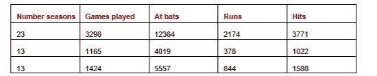
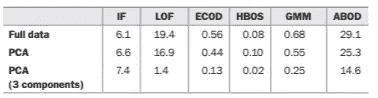
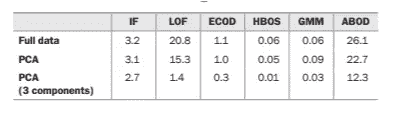
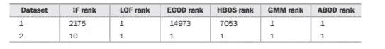
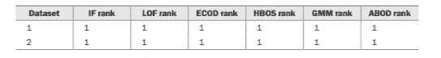
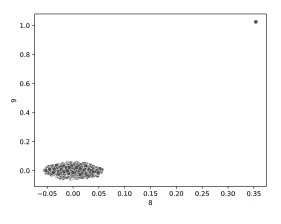

# 使用 PCA 进行异常值检测的简单示例

> 原文：[`towardsdatascience.com/a-simple-example-using-pca-for-outlier-detection-ab2773b98e4a?source=collection_archive---------0-----------------------#2024-11-02`](https://towardsdatascience.com/a-simple-example-using-pca-for-outlier-detection-ab2773b98e4a?source=collection_archive---------0-----------------------#2024-11-02)

## 通过在进行异常值检测之前进行 PCA 变换，提高准确性、速度和内存使用效率

[](https://medium.com/@wkennedy934?source=post_page---byline--ab2773b98e4a--------------------------------)[](https://towardsdatascience.com/?source=post_page---byline--ab2773b98e4a--------------------------------) [W Brett Kennedy](https://medium.com/@wkennedy934?source=post_page---byline--ab2773b98e4a--------------------------------)

·发表于[Towards Data Science](https://towardsdatascience.com/?source=post_page---byline--ab2773b98e4a--------------------------------) ·19 分钟阅读·2024 年 11 月 2 日

--

本文是 PCA（主成分分析）在异常值检测中应用系列文章的延续，紧接着是[使用 PCA 进行异常值检测的简介](https://medium.com/towards-data-science/using-pca-for-outlier-detection-afecab4d2b78)。那篇文章介绍了 PCA 本身，并介绍了我们可以使用 PCA 进行异常值检测的两种主要方式：评估重构误差，和在 PCA 转换后的空间上运行标准的异常值检测器。它还提供了使用重构误差的第一种方法的示例，该方法可以通过[PyOD](https://github.com/yzhao062/pyod)提供的 PCA 和 KPCA 检测器轻松实现。

本文介绍了第二种方法，我们首先使用 PCA 转换数据空间，然后在此空间上运行标准的异常值检测。如前一篇文章所述，这在某些情况下可能会降低可解释性，但在准确性、执行时间和内存使用方面确实有一些令人惊讶的好处。

这篇文章也是关于异常值检测的大系列的一部分，目前已经涵盖了 FPOF、计数异常值检测器、距离度量学习、共享最近邻以及掺杂。这篇文章还包括了我书中的一段摘录，[《Python 中的异常值检测》](https://www.manning.com/books/outlier-detection-in-python)。

如果你对 PCA 本身（它用于降维或可视化）已经相当熟悉，你可以跳过前一篇文章，直接阅读这篇。我会快速回顾一下主要思想。

PCA 是一种将数据（将数据记录视为高维空间中的点）从一组坐标系转换到另一组坐标系的方法。如果我们从一个数据集开始（如左侧面板所示），包含 100 条记录和两个特征，那么我们可以将数据视为二维空间中的 100 个点。对于更现实的数据，我们可能有更多的记录和更多的维度，但同样的概念适用。使用 PCA，我们将数据移动到一组新的坐标系，从而有效地创建描述每条记录的新特征集。如前一篇文章所述，这是通过识别穿过数据的正交线（在左侧面板中以蓝色和橙色线表示）来实现的，这些线很好地拟合数据。

所以，如果我们从一个数据集开始，如下左侧面板所示，我们可以应用 PCA 变换将数据转化为右侧面板所示的样子。在右侧面板中，我们展示了数据被映射到的两个 PCA 组件。组件简单地命名为 0 和 1。


左侧面板：一个包含两个特征的数据集中的 100 个数据点。蓝色和橙色的线表示可以穿过数据点并很好地捕捉到点位的正交线。这些线用于确定 PCA 变换。右侧面板：PCA 变换后的相同数据。我们有相同的 100 个数据点，但有两个新的坐标，称为组件 0 和组件 1。

关于 PCA 组件，有一点需要注意，那就是它们是完全不相关的。这是由于它们的构建方式；它们基于穿过原始数据的直线、平面或超平面，这些平面彼此之间是严格正交的。我们可以在右侧面板中看到，组件 0 和组件 1 之间没有任何关系。

这对异常值检测具有重要意义；特别是它意味着异常值往往会转化为一个或多个组件中的极端值，因此更容易被检测到。这也意味着不需要更复杂的异常值测试（测试特征之间的异常关联），可以使用更简单的测试。

# 单变量和多变量异常值检测器

在深入了解 PCA 在异常值检测中的优势之前，我会简要介绍两种类型的异常值检测器。有很多方法可以对异常值检测算法进行分类，但一种有用的方式是区分*单变量测试*和*多变量测试*。

## 单变量测试

*单变量*一词指的是只检查一个特征的测试——这些测试识别该特征中罕见或极端的值。示例包括基于 z-score 的测试、四分位距（IQR）、十分位距（IDR）、中位数绝对偏差（MAD）、直方图测试、KDE 测试等。

由[PyOD](https://github.com/yzhao062/pyod)提供的基于直方图的测试之一是 HBOS（基于直方图的异常值得分——在我关于[计数异常值检测器](https://medium.com/towards-data-science/counts-outlier-detector-interpretable-outlier-detection-ead0d469557a)的 Medium 文章中有描述，并在[《Python 中的异常值检测》](https://www.manning.com/books/outlier-detection-in-python)中有详细介绍）。

正如在[《引入 PCA 进行异常值检测》](https://medium.com/towards-data-science/using-pca-for-outlier-detection-afecab4d2b78)中所讲到的，PyOD 提供的另一种单变量测试是[ECOD](https://pyod.readthedocs.io/en/latest/pyod.models.html#module-pyod.models.ecod)。

为了描述单变量测试，我们来看一个针对特定现实世界数据集的异常值检测示例。下表是来自 OpenML 的[棒球](https://www.openml.org/search?type=data&sort=version&status=any&order=asc&exact_name=baseball&id=185)数据集的子集（该数据集具有公开许可证），这里只显示了三行五列（完整数据集还有更多特征）。每一行代表一个球员，包含该球员的统计数据，包括他们参加的赛季数、比赛场次等。



棒球数据集的子集

为了识别异常球员，我们可以查找那些具有异常单一值的记录（例如，参加了异常多赛季的球员，或者有异常多击球次数的球员，等等）。这些都可以通过单变量测试找到。

例如，使用 z-score 测试来查找异常记录时，我们实际上会对每一列进行 z-score 测试，一次一列。我们首先检查“赛季数量”列（评估该列中每个值相对于该列的异常程度），然后是“比赛场数”列，依此类推。

例如，在检查“Number seasons”列时，使用 z-score 检验，我们首先需要确定该列的均值和标准差。（其他检验可能会确定该列的中位数和四分位距，直方图的箱子数量等。）

然后，我们会计算“Number seasons”列中每个值的绝对 z-score：即每个值与均值的标准差差距。z-score 越大，值越异常。任何绝对 z-score 超过约 4.0 或 5.0 的值，通常可以认为是异常的，尽管这取决于数据的大小和分布。

然后，我们会对每一列重复这个过程。完成后，对于每一行，我们会得到一个评分，表示该行中每个值相对于其所在列的异常程度。因此，每一行会有一组分数：每个值一个分数。

然后，我们需要为每条记录确定一个整体的离群值分数。有不同的方法可以做到这一点，并且每种方法都有一些细微的差异，但两种简单的方法是取每行值的平均 z-score，或者取每行的最大 z-score。

## 多变量检验

*多变量*检验一次考虑多个特征。实际上，几乎所有的多变量离群值检测器都是同时考虑所有特征的。

大多数离群值检测器（包括 Isolation Forest、Local Outlier Factor（LOF）、KNN 等）都是基于多变量检验的。

这些检测器的优势在于，我们可以寻找值的异常组合。例如，一些球员可能有典型的跑垒次数和击球次数，但可能在跑垒次数上表现异常多（或异常少），而这些在击球次数的情况下是不常见的。这些异常可以通过多变量检验来发现。

在上面的散点图中（考虑左侧窗格中的原始数据），A 点在两个维度上都极端，因此可以通过单变量检验检测到。实际上，对特征 A 进行单变量检验可能会标记 A 点，对特征 B 进行单变量检验也可能会标记它，因此 A 点在这两个特征中都是异常的，会在单变量检验中得到较高分数。

然而，B 点在两个维度上都是典型的。只有值的组合是异常的，要检测这种异常，我们需要使用多变量检验。

通常，在对表格数据进行离群值检测时，我们关注的是异常的行，而不是单个异常值。而且，异常行不仅包括那些有异常单个值的行，还包括异常的值组合。因此，单变量和多变量检验通常都会有用。然而，多变量检验能够捕捉到单变量和多变量的离群值（在散点图中，像 Isolation Forest、LOF 或 KNN 这样的多变量检验通常会同时检测到 A 点和 B 点），因此在实际应用中，多变量检验更常被使用。

然而，在异常值检测中，我们经常将分析限制为单变量检验。单变量检验更快——通常快得多（这在实时环境或需要评估大量数据的环境中非常重要）。单变量检验还更容易解释。

而且它们不受维度灾难的影响。这个问题在计数异常值检测器、共享最近邻和[Python 中的异常值检测](https://www.manning.com/books/outlier-detection-in-python)中有所涉及，但总体思路是，多变量检验在处理过多特征时会失效。这有很多原因，但一个重要的原因是，距离计算（包括 LOF 和 KNN 在内的许多异常值检测器依赖的计算方法）在维度增多时可能变得毫无意义。通常在仅使用 20 个特征时，或者更常见的是使用 50 个以上特征时，异常值得分可能会变得不可靠。

单变量检验比多变量检验更适应高维度数据，因为它们不依赖于行之间的距离计算。

因此，使用单变量检验有一些重大优势。但也有一些重大劣势：它们无法捕捉到与异常值组合相关的异常值，因此只能检测出部分相关的异常值。

# 主成分分析（PCA）组件的单变量检验

因此，在大多数情况下，运行多变量检验是有用的（而且更常见）。但它们速度较慢，解释性差，并且更容易受到维度灾难的影响。

PCA 变换的一个有趣效果是，单变量检验变得更加实用。一旦完成 PCA 变换，特征之间就没有关联，因此也就不存在异常值组合的概念。

在上面的散点图（右侧窗格——PCA 变换后）中，我们可以看到，点 A 和点 B 都可以简单地被识别为极端值。点 A 在组件 0 中极端；点 B 在组件 1 中极端。

这意味着，我们可以使用简单的统计检验（如 z-score、IQR、IDR 或 MAD 检验），或使用简单的工具（如 HBOS 和 ECOD）来有效地进行异常值检测。

话虽如此，在通过 PCA 变换数据空间之后，仍然可以使用标准的多变量检验方法，如隔离森林（Isolation Forest）、LOF 或任何其他标准工具。如果这些是我们最常用的工具，那么继续使用它们是有便利的，并且可以在预处理步骤中先使用 PCA 变换数据。

相比于统计方法（如 z-score 等），它们的一个优势在于，它们会自动为每一条记录提供一个单一的异常值得分。如果我们对每一条记录使用 z-score 测试，且数据有 20 个特征，我们将其转换为 10 个主成分（正如下面所述，可以不使用所有主成分），那么每条记录将有 10 个异常值得分——每个得分与其在 10 个主成分中的异常程度相关。然后需要将这些得分合并成一个单一的异常值得分。如上所述，有一些简单的方法可以做到这一点（包括对每行的每个值取均值、中位数或最大 z-score），但执行此操作时存在一些复杂性（详见[Outlier Detection in Python](https://www.manning.com/books/outlier-detection-in-python)）。这虽然是可以处理的，但让检测器提供一个单一得分还是非常方便的。

# 使用 PCA 进行异常值检测的示例

现在我们来看一个使用 PCA 帮助更好地识别数据集中的异常值的示例。为了更容易看到 PCA 如何进行异常值检测，我们将在这个示例中创建两个相对简单的合成数据集。我们将两个数据集都创建为 10 万个行和 10 个特征，并添加一些已知的异常值，类似于上面散点图中的 A 点和 B 点。

为了简化起见，我们将数据集限制为十个特征，但正如上面和上一篇文章中所建议的，使用 PCA 在高维空间中可能会有很大的优势，因此（尽管在这个示例中没有覆盖），在成百上千的特征下使用 PCA 会比仅使用十个特征更有优势。然而，这里使用的数据集相对容易处理和理解。

第一个数据集 data_corr 是为了让特征之间有强关联（相关性）而创建的。我们更新了最后一行，使其包含一些较大的（但不是特别大的）值。关键是这行数据偏离了特征之间的正常模式。

我们创建了另一个测试数据集，名为 data_extreme，它的特征之间没有关联。该数据集的最后一行被修改为包含某些特征中的极端值。

这使我们可以在两个广为人知的数据分布和异常值类型上进行测试（我们在 data_corr 中有一个忽略了特征之间正常相关性的异常值；我们在 data_extreme 中有一个在某些特征上有极端值的异常值）。

本示例使用了多个 PyOD 检测器，首先需要执行以下代码：

```py
pip install pyod
```

代码从创建第一个测试数据集开始：

```py
import numpy as np
import pandas as pd
from sklearn.decomposition import PCA
from pyod.models.ecod import ECOD
from pyod.models.iforest import IForest
from pyod.models.lof import LOF
from pyod.models.hbos import HBOS
from pyod.models.gmm import GMM
from pyod.models.abod import ABOD
import time

np.random.seed(0)

num_rows = 100_000
num_cols = 10
data_corr = pd.DataFrame({0: np.random.random(num_rows)}) 

for i in range(1, num_cols):
  data_corr[i] = data_corr[i-1] + (np.random.random(num_rows) / 10.0)

copy_row = data_corr[0].argmax()
data_corr.loc[num_rows-1, 2] = data_corr.loc[copy_row, 2]
data_corr.loc[num_rows-1, 4] = data_corr.loc[copy_row, 4]
data_corr.loc[num_rows-1, 6] = data_corr.loc[copy_row, 6]
data_corr.loc[num_rows-1, 8] = data_corr.loc[copy_row, 8]

start_time = time.process_time() 
pca = PCA(n_components=num_cols)
pca.fit(data_corr)
data_corr_pca = pd.DataFrame(pca.transform(data_corr), 
 columns=[x for x in range(num_cols)])
print("Time for PCA tranformation:", (time.process_time() - start_time))
```

我们现在有了第一个测试数据集 data_corr。在创建这个数据集时，我们将每个特征设置为前面特征的总和加上一些随机性，因此所有特征之间有很好的相关性。最后一行故意设置为异常值。虽然这些值较大，但并没有超出现有数据的范围。然而，已知异常值中的值并未遵循特征之间的正常模式。

我们接着计算其 PCA 变换。

接下来我们对另一个测试数据集执行此操作：

```py
np.random.seed(0)

data_extreme = pd.DataFrame()
for i in range(num_cols):
    data_extreme[i] = np.random.random(num_rows)

copy_row = data_extreme[0].argmax()
data_extreme.loc[num_rows-1, 2] = data_extreme[2].max() * 1.5
data_extreme.loc[num_rows-1, 4] = data_extreme[4].max() * 1.5
data_extreme.loc[num_rows-1, 6] = data_extreme[6].max() * 1.5
data_extreme.loc[num_rows-1, 8] = data_extreme[8].max() * 1.5

start_time = time.process_time() 
pca = PCA(n_components=num_cols)
pca.fit(data_corr)
data_extreme_pca = pd.DataFrame(pca.transform(data_corr), 
    columns=[x for x in range(num_cols)])

print("Time for PCA tranformation:", (time.process_time() - start_time))
```

在这里，每个特征是独立创建的，因此特征之间没有关联。每个特征简单地遵循均匀分布。最后一行被设为离群值，在第 2、4、6 和 8 个特征中具有极端值，因此在十个特征中的四个特征存在离群值。

现在我们有了两个测试数据集。接下来我们定义一个函数，给定一个数据集和一个探测器，该函数会在完整数据集上训练探测器并在同一数据上进行预测（因此可以识别单一数据集中的离群值），并对两个操作进行计时。对于 ECOD（经验累积分布）探测器，我们添加了特殊处理来创建一个新的实例，以避免保持先前执行的记忆（对于其他探测器，这一点并不必要）：

```py
def evaluate_detector(df, clf, model_type):
    """
    params:
    df: data to be assessed, in a pandas dataframe
    clf: outlier detector
    model_type: string indicating the type of the outlier detector
    """

    global scores_df

    if "ECOD" in model_type:
       clf = ECOD()
    start_time = time.process_time()
    clf.fit(df)
    time_for_fit = (time.process_time() - start_time)

    start_time = time.process_time()
    pred = clf.decision_function(df)
    time_for_predict = (time.process_time() - start_time)

    scores_df[f'{model_type} Scores'] = pred
    scores_df[f'{model_type} Rank'] =\
    scores_df[f'{model_type} Scores'].rank(ascending=False)

    print(f"{model_type:<20} Fit Time: {time_for_fit:.2f}")
    print(f"{model_type:<20} Predict Time: {time_for_predict:.2f}")
```

下一个定义的函数会对每个数据集执行，调用先前的方法对每个数据集进行处理。这里我们测试了四种情况：使用原始数据、使用 PCA 变换后的数据、使用 PCA 变换后数据的前 3 个成分、以及使用最后 3 个成分。这将帮助我们了解这四种情况在时间和准确性上的比较。

```py
def evaluate_dataset_variations(df, df_pca, clf, model_name): 
    evaluate_detector(df, clf, model_name)
    evaluate_detector(df_pca, clf, f'{model_name} (PCA)')
    evaluate_detector(df_pca[[0, 1, 2]], clf, f'{model_name} (PCA - 1st 3)')
    evaluate_detector(df_pca[[7, 8, 9]], clf, f'{model_name} (PCA - last 3)')
```

如下所述，仅使用最后三个成分在准确性方面表现良好，但在其他情况下，使用早期成分（或中间成分）也可以表现得很好。这里将其作为一个示例，但本文的其余部分将专注于仅使用最后三个成分的选项。

最后定义的函数会对每个数据集调用。它会对每个测试的探测器执行先前的函数。在这个例子中，我们使用了六个来自 PyOD 的探测器（Isolation Forest、LOF、ECOD、HBOS、Gaussian Mixture Models（GMM）和 Angle-based Outlier Detector（ABOD））：

```py
def evaluate_dataset(df, df_pca): 
  clf = IForest()
  evaluate_dataset_variations(df, df_pca, clf, 'IF')

  clf = LOF(novelty=True)
  evaluate_dataset_variations(df, df_pca, clf, 'LOF')

  clf = ECOD()
  evaluate_dataset_variations(df, df_pca, clf, 'ECOD')

  clf = HBOS()
  evaluate_dataset_variations(df, df_pca, clf, 'HBOS')

  clf = GMM()
  evaluate_dataset_variations(df, df_pca, clf, 'GMM')

  clf = ABOD()
  evaluate_dataset_variations(df, df_pca, clf, 'ABOD')
```

最后，我们对两个测试数据集调用 evaluate_dataset()方法，并打印出前几个离群值（已知的离群值在两个测试数据集的最后几行中）。

```py
# Test the first dataset
# scores_df stores the outlier scores given to each record by each detector
scores_df = data_corr.copy()
evaluate_dataset(data_corr, data_corr_pca)
rank_columns = [x for x in scores_df.columns if type(x) == str and 'Rank' in x]
print(scores_df[rank_columns].tail())

# Test the second dataset
scores_df = data_extreme.copy()
evaluate_dataset(data_extreme, data_extreme_pca)
rank_columns = [x for x in scores_df.columns if type(x) == str and 'Rank' in x]
print(scores_df[rank_columns].tail())
```

有几个有趣的结果。我们首先查看 data_corr 数据集的拟合时间，见下表（其他测试集的拟合和预测时间相似，因此这里不再显示）。测试是在 Google Colab 上进行的，时间以秒为单位显示。我们可以看到，不同的探测器有着显著不同的时间表现。ABOD 比其他探测器显著慢，而 HBOS 则显著更快。这里包含的另一个单变量探测器，ECOD，也非常快。

拟合 PCA 变换数据的时间与原始数据的时间差不多，这是有道理的，因为这两种数据的大小相同：我们将 10 个特征转换为 10 个成分，处理这些成分的时间与原始数据等效。

我们还测试了仅使用最后三个 PCA 组件（第 7、8、9 组件），并且在某些情况下，拟合时间显著减少，特别是在局部异常因子（LOF）方面。与使用所有 10 个原始特征（19.4 秒）或使用所有 10 个 PCA 组件（16.9 秒）相比，使用 3 个组件仅需要 1.4 秒。在所有其他情况下，除了孤立森林外，拟合时间都有明显下降。



第一测试数据集 data_corr 的 6 个 PyOD 检测器的拟合时间。

在下表中，我们看到 data_corr 数据集的预测时间（其他测试集的时间也类似）。同样，我们看到在只使用三个组件时，预测时间显著下降，尤其是在 LOF 情况下。我们再次看到，两个单变量检测器 HBOS 和 ECOD 是最快的，尽管在预测时，GMM 的速度与它们一样快或更快（尽管在拟合时间上稍微慢一些）。

对于孤立森林（IF），由于我们无论特征数量如何都训练相同数量的树，并且将所有待评估的记录都通过相同的树集，因此时间不受特征数量的影响。然而，对于此处显示的所有其他检测器，特征数量非常相关：在使用 3 个组件时，所有其他检测器相比于使用 10 个原始特征或所有 10 个组件时，预测时间显著减少。



第一数据集 data_corr 的 6 个 PyOD 检测器的预测时间

就准确性而言，在大多数情况下，所有五个检测器在两个数据集上的表现良好，尤其是在将最高异常值分数分配给最后一行时，而在这两个测试数据集中，最后一行正是已知的异常值。结果显示在下表中。共有两行，每行对应一个数据集。对于每个数据集，我们展示了每个检测器为唯一已知异常值分配的排名。理想情况下，所有检测器应将此排名设为 1（最高异常值分数）。

在大多数情况下，最后一行实际上被分配了最高或接近最高的排名，除了在第一个数据集上，IF、ECOD 和 HBOS 例外。这是一个很好的例子，说明即使是像 IF 这样的强大检测器，有时也会在明确的异常值情况下表现不佳。



使用 6 个 PyOD 检测器在原始数据上执行时，在两个测试数据集中为唯一已知异常值分配的排名。

对于第一个数据集，ECOD 和 HBOS 完全错过了异常值，但这是可以预料的，因为它是基于多个值的组合（它忽略了特征之间的正常线性关系），而单变量测试无法检测到。第二个数据集的异常值基于极端值，通常单变量和多变量测试都能可靠地检测到，并且在这里也能做到。

当我们为这些数据集和这些检测器使用 PCA 时，我们看到了精度的显著提高，如下表所示。虽然这并非总是如此，但在这里确实适用。当检测器在 PCA 转换后的数据上执行时，所有 6 个检测器都将已知离群值在两个数据集中的排名排在首位。当数据经过 PCA 转换时，各个组件之间是相互独立的；离群值是极端值，更容易被识别。



使用 6 个 PyOD 检测器对 PCA 转换后的数据进行测试时，两个测试数据集中已知离群值的排名，使用了所有 10 个组件。

另一个有趣的地方是，仅使用最后三个组件就足以将已知离群值排在顶端，见下表。


与前一张表格类似，但只使用了 3 个 PCA 组件。

如上所述，在这些情况下，拟合和预测的时间显著缩短。这就是我们可以利用 PCA 实现显著性能提升的地方：通常只需要使用少量的组件。

仅使用少量组件还可以减少内存需求。这并不总是一个问题，但在处理大型数据集时，这通常是一个重要的考虑因素。

本实验涵盖了数据中两种主要的离群值类型：极端值和偏离线性模式的值，这两者都可以在后期的组件中被识别。在这些情况下，使用最后三个组件效果良好。

使用多少个组件以及哪些组件最合适可能会有所不同，因此需要进行一些实验（最好使用[掺假数据](https://medium.com/towards-data-science/doping-a-technique-to-test-outlier-detectors-3f6b847ab8d4)来发现最佳方案）。在某些情况下，为了执行时间、可靠地检测相关离群值和减少噪音，使用较早的组件可能更为合适；在其他情况下，使用中间的组件或后面的组件可能更合适。正如我们在本文开始时看到的散点图所示，不同的组件可能会突出不同类型的离群值。

# 随着时间的推移，改进离群值检测系统

使用主成分分析（PCA）组件的另一个有用好处是，它可以让你更容易地随着时间的推移调整离群值检测系统。通常，在进行离群值检测时，系统不仅仅是对单一数据集进行一次性运行，而是会持续进行，因此要不断评估新的数据（例如，新的金融交易、传感器读数、网站日志、网络日志等）。随着时间的推移，我们能更好地理解哪些离群值对我们最相关，以及哪些离群值被低估或高估。

由于在处理 PCA 转换后的数据时报告的所有异常值都与单一组件相关联，我们可以看到与每个组件相关的相关异常值和无关异常值的数量。这在使用简单的单变量测试（如 z-score、IQR、IDR、基于 MAD 的测试等）时特别容易做到。

随着时间的推移，我们可以学会对与某些组件相关的异常值赋予更高的权重，而对其他组件赋予较低的权重（这取决于我们对假阳性和假阴性的容忍度）。

# 可视化

降维也有一些优势，因为它有助于可视化异常值，特别是当我们将数据降至二维或三维时。尽管如此，和原始特征一样，即使有超过三维，我们仍然可以通过直方图逐一查看 PCA 组件，或通过散点图两两查看。

例如，检查第一个测试数据集的最后两个组件 data_corr（其中包含不寻常的值组合），我们可以清楚地看到已知的异常值，如下所示。然而，这种做法的有效性有些值得怀疑，因为这些组件本身很难理解。



PCA 转换后的第一个数据集的最后两个组件（组件 8 和 9）的散点图，数据集包含不寻常的值组合。在这里，我们看到空间右上方的一个点。显然，这个点是一个强异常值，尽管组件 8 和 9 表示的内容并不清晰。

# 结论

本文介绍了 PCA，但也有其他可以类似使用的降维工具，包括 t-SNE（与 PCA 一样，这是 scikit-learn 提供的）、[UMAP](https://github.com/lmcinnes/umap)和自编码器（也在[《Python 中的异常值检测》](https://www.manning.com/books/outlier-detection-in-python)一书中讨论）。

此外，使用 PCA 时，基于重建误差的方法（衡量如何仅使用组件的子集来近似记录的值）可以非常有效，并且通常值得调查，正如在本系列的[上一篇文章](https://medium.com/towards-data-science/using-pca-for-outlier-detection-afecab4d2b78)中所讨论的那样。

本文介绍了使用标准异常值检测器（尽管如示范所示，这更容易包括简单的单变量异常值检测器，而通常不太可能做到这一点）进行异常值检测，展示了先通过 PCA 转换数据的好处。

这一过程的效果如何取决于数据（例如，PCA 依赖于特征之间存在强线性关系，如果数据存在严重聚类，则可能会失效）以及你希望找到的异常值类型。通常需要使用[doping](https://medium.com/towards-data-science/doping-a-technique-to-test-outlier-detectors-3f6b847ab8d4)或其他测试方法来确定其效果，并调整过程——特别是确定使用哪些成分。不过，当执行时间或内存限制不成问题时，简单地使用所有成分并平等加权它们，通常可以作为一个良好的起点。

同样，在异常值检测中，通常没有单一的异常值检测过程能够可靠地识别你关心的所有类型的异常值（尤其是当你希望找到所有可以合理认为在某种方式上统计上不寻常的记录时），因此通常需要使用多种异常值检测方法。将基于 PCA 的异常值检测与其他方法结合，可以覆盖比仅使用基于 PCA 的方法或仅使用没有 PCA 变换的方法所能检测到的更广泛的异常值范围。

但是，在基于 PCA 的方法有效时，它们通常可以提供更准确的检测，因为异常值往往能够被更好地分离并且更容易被检测到。

基于 PCA 的方法也可以更快地执行（特别是在它们足够有效且不需要与其他方法结合时），因为：1）可以使用更简单（且更快速）的检测器，如 z-score、IQR、HBOS 和 ECOD；2）可能只需使用较少的成分。PCA 变换本身通常非常快速，与拟合或执行异常值检测相比，时间几乎可以忽略不计。

使用 PCA，至少在只需要子集成分时，也可以减少内存需求，这在处理特别大的数据集时可能是一个问题。

所有图片均由作者提供
