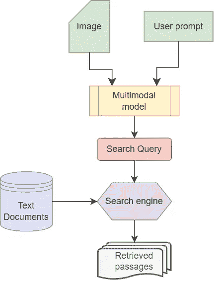
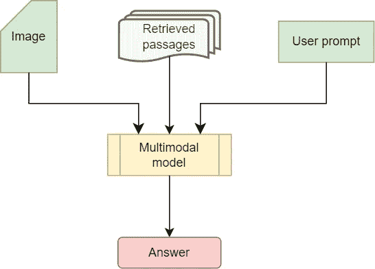
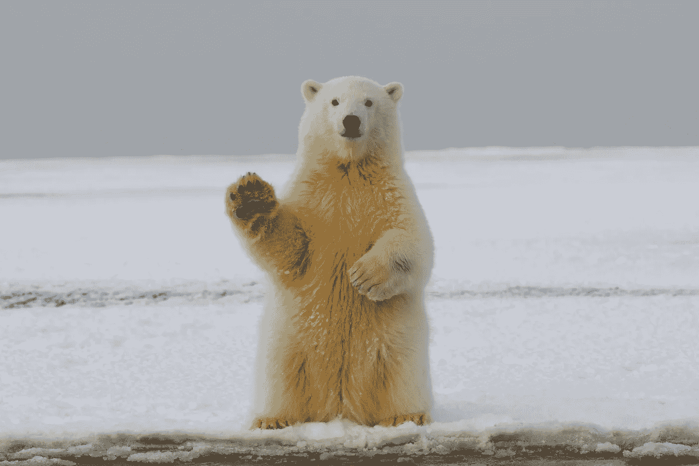
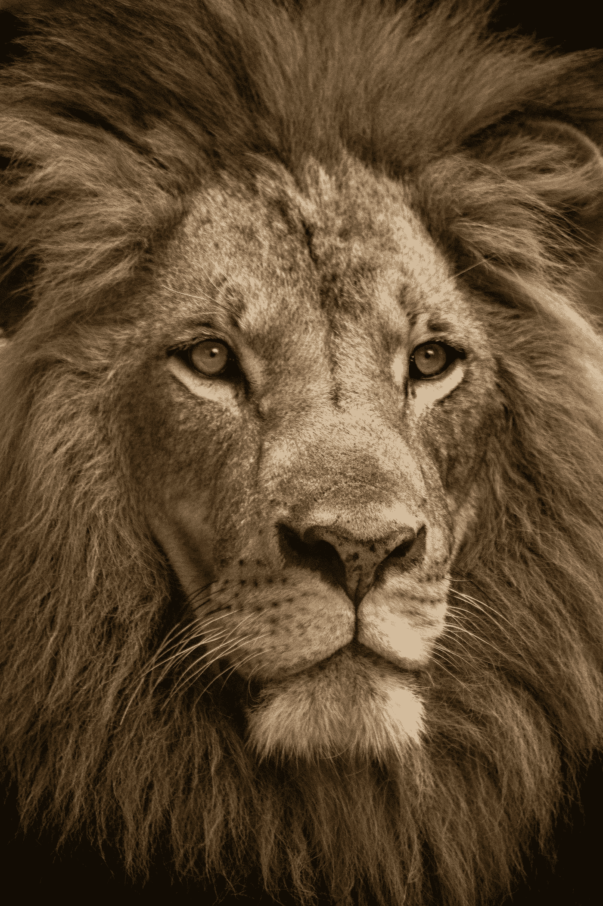

# 一个简单的 RAG 增强视觉问答框架

> 原文：[`towardsdatascience.com/a-simple-framework-for-rag-enhanced-visual-question-answering-06768094762e?source=collection_archive---------7-----------------------#2024-08-30`](https://towardsdatascience.com/a-simple-framework-for-rag-enhanced-visual-question-answering-06768094762e?source=collection_archive---------7-----------------------#2024-08-30)

## 为 Phi-3.5-vision 注入维基百科知识以增强视觉问答能力。

[](https://medium.com/@gabrielesgroi94?source=post_page---byline--06768094762e--------------------------------)[](https://towardsdatascience.com/?source=post_page---byline--06768094762e--------------------------------) [Gabriele Sgroi, PhD](https://medium.com/@gabrielesgroi94?source=post_page---byline--06768094762e--------------------------------)

·发表于[Towards Data Science](https://towardsdatascience.com/?source=post_page---byline--06768094762e--------------------------------) ·17 分钟阅读·2024 年 8 月 30 日

--


图片来源：[Christian Lue](https://unsplash.com/@christianlue?utm_source=medium&utm_medium=referral) 于[Unsplash](https://unsplash.com/?utm_source=medium&utm_medium=referral)

# 引言

检索增强生成（RAG）是一种强大的技术，可以提高大型语言模型（LLMs）生成答案的准确性和可靠性。它还提供了检查模型在特定生成过程中使用的来源的可能性，从而使人工用户更容易进行事实核查。此外，RAG 使得模型的知识保持最新，并能够在不进行微调的情况下融入特定领域的信息。总的来说，RAG 提供了许多好处且几乎没有缺点，并且其工作流程容易实现。因此，它已成为许多需要最新和/或专业知识的 LLM 使用案例的首选解决方案。

在生成式人工智能领域，一些最新的进展集中在扩展流行的 Transformer 架构，以应对多种输入和/或输出模态，尝试复制大语言模型（LLMs）的巨大成功。目前，已经有几个模型，无论是开源还是闭源，展示了处理多种模态的卓越能力。一个流行的多模态场景，且是首批被解决的场景之一，是视觉语言模型（VLMs），这一领域通过发布一些小而强大的模型，如 LLaVA、Idefics 和 Phi-vision，取得了有趣的开源贡献。如果你想入门 VLMs 并了解如何使用 LLaVA 构建一个视觉语言聊天助手，可以查看我之前的文章使用 LLaVA 创建你的视觉聊天助手。

为多模态模型设计 RAG 系统比纯文本模型更具挑战性。事实上，RAG 系统在 LLM 中的设计已经成熟，并且在一般工作流程上已有共识，因为最近的许多发展都集中在提高准确性、可靠性和可扩展性，而不是从根本上改变 RAG 架构。另一方面，多模态性开辟了多种检索相关信息的方式，因此可以做出几种不同的架构选择，每种选择都有其优缺点。例如，可以使用多模态嵌入模型为不同的模态创建一个共享的向量空间，或者选择仅在一种模态中扎根信息。

在这篇博客文章中，我将讨论一个简单的框架，如何将 RAG 扩展到视觉语言模型（VLMs），并重点介绍视觉问答任务。该方法的核心思想是利用 VLM 的能力，理解文本和图像，以生成适当的搜索查询，用于在回答用户提示之前检索外部信息。

我还将提供一个实践教程，介绍如何实现该框架，使 Phi-3.5-vision 能够访问维基百科信息，讨论实现的关键点并展示一些示例。我会把详细内容留给我在以下[Git Hub 仓库](https://github.com/GabrieleSgroi/vision_rag)中分享的完整代码。

# 视觉问答的 RAG

在本节中，我将描述介绍中提到的框架的一般工作流程。为了便于说明，我将讨论仅有一个用户提示和一张图像的情况。这种情况，例如，适用于简单的视觉问答（VQA）任务。该方法可以直接推广到多个提示和图像，但流程将变得更加复杂，并引入更多的挑战。此外，我将仅考虑外部数据仅由文本文档组成的情况。使用多模态嵌入模型进行检索，或者更一般地，使用多模态搜索引擎，也可以将图像包含在外部数据中。

至于常见的 RAG 工作流程，该框架的工作流程可以分为两部分：检索相关的外部信息和基于提供的外部数据进行生成。

在检索阶段，目标是从外部文本文档中检索一些段落，这些段落可以提供有用的信息来回答用户的提示。为了有效地做到这一点，我们必须确保检索到的段落与提供的图像、提示以及更重要的两者之间的关系相关。实际上，即使检索到的文档包含有关图像的信息，它们也可能没有包含提供答案所需的特定信息。另一方面，提示只有在与它所指的图像配对时才可能被正确理解。为了解决这些挑战，本文讨论的框架利用多模态模型生成一个适当的搜索查询，旨在捕捉在提供的图像背景下回答用户提示所需的信息。搜索引擎将使用生成的查询从外部数据中检索相关信息。

更详细地说，多模态模型将用户的提示和图像作为输入，并负责创建一个与两者整体相关的搜索查询。这个过程可以看作是查询转换的一种特例，旨在考虑问题的多模态性质。事实上，模型将用户的提示转化为一个搜索查询，同时考虑到它所指的图像。

相较于将每种输入模态单独处理的其他方法，例如使用多模态嵌入模型进行检索或使用生成的图像标题/描述来进行语义相似性分析，这种方法的优势在于，它能够更有效地捕捉提示与图像之间的关系。

检索阶段的流程图如下所示。



在检索过程中，模型的任务是创建一个查询，该查询将被搜索引擎用来检索相关的段落。图片由作者提供。

生成阶段与标准的文本-only RAG 工作流程非常相似，唯一的区别是模型在推理时除了接收提示和检索到的段落外，还接收到图像。这一过程如下所示。



在生成过程中，模型将检索到的段落、提示和图像作为输入。图像由作者提供。

# 为 Phi-3.5-vision 赋能，加入维基百科

在本节中，我将提供一份实用指南，讲解如何应用讨论过的框架，通过让多模态模型访问维基百科来增强其能力。我选择了模型[Phi-3.5-vision](https://huggingface.co/microsoft/Phi-3.5-vision-instruct)，因为它是一个非常强大且轻量的开源视觉语言模型。

在本节中，我将仅讨论实现的总体方面，具体细节请参考提供的[GitHub 仓库](https://github.com/GabrieleSgroi/vision_rag)中的代码。

## 检索

检索阶段的目标是从维基百科收集一些段落，这些段落可以为回答用户关于图像的问题提供有用的信息。在代码实现中，我使用了 Python 包[wikipedia](https://pypi.org/project/wikipedia/)来搜索和检索维基百科的内容。

下面是实现检索相关段落的步骤：

1.  使用多模态模型生成捕捉问题与图像含义的关键词。

1.  使用生成的关键词在维基百科上搜索相关页面。

1.  将每个检索到的页面的内容分割成若干块。

1.  选择与问题和关键词在语义文本相似度上最相关的内容块。

第一步利用 Phi-3.5-vision 生成一个适当的搜索查询，用于检索相关的维基百科页面。为此，我要求 Phi-3.5-vision 生成与用户问题和图像相关的关键词。然后，我使用维基百科包的内置搜索功能来检索与生成的关键词相关的页面。

Phi-vision-3.5 的通用单轮单图聊天模板具有以下结构：

```py
<|user|>\n
<|image_1|>\n
{prompt}<|end|>\n
<|assistant|>\n
```

为了生成关键词，我使用了以下提示：

```py
Your task is to write a few search keywords to find Wikipedia pages containing
the relevant information to answer the question about the provided image. The 
keywords must be as specific as possible and must represent the information 
that is needed to answer the question in relation to the provided image. Don't 
write more than 3 search keywords.
Question: {question}
```

标签{question}在推理前会被用户的问题替代。

在生成关键词后，使用 Wikipedia 包的内置搜索功能来检索与生成的关键词相关的页面。最后，将选定的页面拆分为段落，然后使用嵌入模型和 LangChain 实现的 FAISS 向量存储来选择最相关的段落。我使用了嵌入模型[*snowflake-arctic-embed-l*](https://huggingface.co/Snowflake/snowflake-arctic-embed-l)来嵌入问题和关键词的拼接，以及检索到的页面的片段。实际上，检索阶段本质上是一种“混合搜索”形式，包含两个顺序步骤：使用 Wikipedia 包的内置搜索功能进行关键词搜索，以及使用嵌入模型进行相似度检索。通过这种方式，检索在通过关键词搜索选定的最相关页面的较小段落空间上进行，避免了需要建立一个包含整个 Wikipedia 内容的庞大向量存储。在不同的设置中，检索阶段可以重新设计为在整个外部语料库上进行相似度检索，或使用不同的检索方法组合。

从多个页面检索段落有助于减少选择错误页面的概率，并且当需要从多个页面获取信息来生成答案时也很有用。

## 生成

在生成阶段，用户的问题、检索到的段落和原始图像作为输入传递给 Phi-3.5-vision 来生成答案。

我在 Phi-3.5-vision 的通用聊天模板中使用了以下提示：

```py
You are a helpful assistant tasked with answering questions about the provided 
image.
Answer the following question: {question}
You can use the following passages retrieved from Wikipedia to provide your 
answer:
{passages}
```

在生成时，标签 {question} 会像之前一样被用户问题替代，而标签 {passages} 会被检索到的段落和相应页面名称替代，格式如下：

```py
From Wikipedia page {page_name} : "{passage1}"\n\n
From Wikipedia page {page_name} : "{passage2}"\n\n
From Wikipedia page {page_name} : "{passage3}"\n\n
                      ...
```

提供提取段落的页面名称有助于解决歧义，特别是当段落内容不足以唯一确定其所指的主题或话题时。

# 示例

在本节中，我将展示上一节中讨论的实现获得的一些答案示例，比较带有 RAG 功能的视觉语言模型和基础版本的输出。

对于下面的每个示例，我将展示提供给模型的图像、包含问题及 RAG 增强和基础 VLM 答案的块、模型生成的搜索查询块，以及从 Wikipedia 检索到的段落块。

## 示例 1


图片来自[engin akyurt](https://unsplash.com/@enginakyurt?utm_source=medium&utm_medium=referral)于[Unsplash](https://unsplash.com/?utm_source=medium&utm_medium=referral)

```py
Question: How tall are the plants that produce this fruit?

Base VLM: Tomatoes are typically grown on plants that can reach heights of 2 to
4 feet, depending on the variety and growing conditions.

RAG VLM: The tomato plants that produce this fruit typically grow to 1-3 meters
(3-10 feet) in height.
```

VLM 生成了以下搜索关键词：

```py
Search keywords: tomato plant, tomato plant height
```

并检索到以下段落：

```py
From page Tomato (https://en.wikipedia.org/wiki/Tomato): 
 "throughout all seasons of the year. Tomato plants typically grow to 1–3 
meters (3–10 ft) in height. They are vines that have a weak stem that sprawls 
and typically needs support. Indeterminate tomato plants are perennials in 
their native habitat, but are cultivated as annuals. (Determinate, or".

From page Tomato (https://en.wikipedia.org/wiki/Tomato): 
 "Numerous varieties of the tomato plant are widely grown in temperate climates
 across the world, with greenhouses allowing for the production of tomatoes 
throughout all seasons of the year. Tomato plants typically grow to 1–3 meters
(3–10 ft) in height. They are vines that have a weak stem that".

From page Early Girl (https://en.wikipedia.org/wiki/Early_Girl): 
 "== See also ==
List of tomato cultivars

== References ==".

From page Black Krim (https://en.wikipedia.org/wiki/Black_Krim): 
 "== References ==

== See also ==
List of tomato cultivars
Heirloom tomato".

From page Celebrity tomato (https://en.wikipedia.org/wiki/Celebrity_tomato): 
 "== See also ==
List of tomato cultivars
Tomato production in Florida

== References ==".

From page Fourth of July tomato 
(https://en.wikipedia.org/wiki/Fourth_of_July_tomato): 
 "== See also ==
List of tomato cultivars

== References ==

== External links ==
Picture Gallery from Google Images".

From page Mortgage Lifter (https://en.wikipedia.org/wiki/Mortgage_Lifter): 
 "== See also ==
List of tomato cultivars

== References ==

== External links ==
Picture Gallery from Google Images".
```

增强了 RAG 的模型正确报告了 Wikipedia 页面‘番茄’上列出的高度范围，而基础模型的回答则是一个较低的范围。

## 示例 2



图片来源：[Hans-Jurgen Mager](https://unsplash.com/@hansjurgen007?utm_source=medium&utm_medium=referral) via [Unsplash](https://unsplash.com/?utm_source=medium&utm_medium=referral)

```py
Query: How much does this species weight?

Base VLM: Polar bears can weigh between 900 to 1,600 pounds 
(408 to 727 kilograms).

RAG VLM:  The weight of this species, the polar bear, ranges from 300-800 kg 
(660-1,760 lb) for males and 150-300 kg (330-660 lb) for females.
```

```py
Search keywords: polar bear, weight
```

```py
From page Polar bear (https://en.wikipedia.org/wiki/Polar_bear): 
"Males are generally 200–250 cm (6.6–8.2 ft) long with a weight of 300–800 kg
(660–1,760 lb). Females are smaller at 180–200 cm (5.9–6.6 ft) with a weight 
of 150–300 kg (330–660 lb). Sexual dimorphism in the species is particularly 
high compared with most other mammals. Male polar bears also have".

From page Polar bear (https://en.wikipedia.org/wiki/Polar_bear): 
 "== Notes ==

== References ==

== Bibliography ==

== External links ==
Polar Bears International website
ARKive—images and movies of the polar bear (Ursus maritimus)".

From page Polar bear (https://en.wikipedia.org/wiki/Polar_bear): 
 "weight of 150–300 kg (330–660 lb). Sexual dimorphism in the species is 
particularly high compared with most other mammals. Male polar bears also have 
proportionally larger heads than females. The weight of polar bears fluctuates 
during the year, as they can bulk up on fat and increase their mass by".

From page List of ursids (https://en.wikipedia.org/wiki/List_of_ursids): 
 "long, plus a 3–20 cm (1–8 in) tail, though the polar bear is 2.2–2.44 m 
(7–8 ft) long, and some subspecies of brown bear can be up to 2.8 m (9 ft). 
Weights range greatly from the sun bear, which can be as low as 35 kg (77 lb), 
to the polar bear, which can be as high as 726 kg (1,600 lb). Population".

From page Knut (polar bear) (https://en.wikipedia.org/wiki/Knut_(polar_bear)): 
 "== See also ==
Binky (polar bear)
List of individual bears

== References ==

== External links ==".

From page Polar bear (https://en.wikipedia.org/wiki/Polar_bear): 
 "The polar bear is the largest living species of bear and land carnivore, 
though some brown bear subspecies like the Kodiak bear can rival it in size. 
Males are generally 200–250 cm (6.6–8.2 ft) long with a weight of 300–800 kg 
(660–1,760 lb). Females are smaller at 180–200 cm (5.9–6.6 ft) with a".

From page Subspecies of brown bear 
(https://en.wikipedia.org/wiki/Subspecies_of_brown_bear): 
 "males, potentially tripling their average weight within three years' time, 
and can expect to average between 360 and 545 kg (794 and 1,202 lb). 
The reported mean adult body masses for both sexes of the polar bear are very 
similar to the peninsular giant and Kodiak bears. Due to their roughly". 
```

再次，RAG 模型使用 Wikipedia 页面‘北极熊’中报告的权重正确回答，而基础模型则使用稍有不同范围的权重作答。

## 示例 3

在我之前的博客文章 使用 LLaVA 创建视觉聊天助手，我展示了当用户的提示询问图像相关的误导性问题时，LLaVA-1.5 模型如何被诱导产生幻觉。让我们看看使用 Phi-3.5-vision 模型在有无 RAG 增强情况下会发生什么。在这个例子中，特别是当检索到任何误导性段落时，模型现在可能更容易产生幻觉。


图片来源：[Wolfgang Hasselmann](https://unsplash.com/@wolfgang_hasselmann?utm_source=medium&utm_medium=referral) via [Unsplash](https://unsplash.com/?utm_source=medium&utm_medium=referral)

```py
Question: Tell me the species of the fish in this image

Base VLM: The image does not contain any fish or aquatic environments, so 
I cannot provide a species of fish.

RAG VLM:  The image does not contain any fish or aquatic environments. It is
a photograph of a desert landscape with sand dunes. 
Therefore, I cannot provide the species of fish based on this image.
```

基础模型和 RAG 模型都没有被误导性提示诱导产生幻觉，表明 Phi-3.5-vision 相比 LLaVA-1.5 可能具有更好的鲁棒性。特别是，RAG VLM 没有从 Wikipedia 检索到任何页面。事实上，当被要求生成关键词时，模型回答了

```py
There are no fish visible in the image provided. The image shows a desert 
landscape with sand dunes. Therefore, the search keywords related to the image 
content would be more appropriate for a desert or dune-related topic.
```

该搜索查询未通过 Wikipedia 包的搜索功能生成任何结果。

*注意：在后面的例子中，在与 Idefics 2 进行的早期实验中，基础 VLM 模型和 RAG VLM 模型都受到了幻觉的影响，回答了图像中不存在的鱼类种类名称。特别是，RAG 模型检索到了与各种鱼类相关的误导性段落。幻觉现象是模型依赖的，RAG 框架可能无法在所有情况下完全消除它。*

# 限制

该框架的主要限制是它要求模型至少具备图像和提供问题的基本知识（具体细节将通过 RAG 检索），以生成有效的搜索查询。在某些特定领域的设置中，可能需要对模型进行微调，以生成搜索查询。

本文中讨论的框架也存在传统文本-only RAG 系统常见的局限性。生成中的一个常见错误来源是外部信息检索不正确。在某些情况下，模型无法正确识别检索阶段的失败，从而生成基于错误、不相关或误导性信息的答案。特别是，不相关段落的存在有时会引发模型本不会出现的幻觉。

另一个常见的错误来源是忽视检索到的段落或错误引用它们。这有时会导致检索到的段落和生成的答案之间存在微妙的差异，可能一开始不容易察觉。

## 示例

在这个示例中，我将展示一个模型错误引用检索到的段落的实例。



搜索关键词：雄狮，体重，平均体重  图片由[Luke Tanis](https://unsplash.com/@saluken?utm_source=medium&utm_medium=referral)提供，来自[Unsplash](https://unsplash.com/?utm_source=medium&utm_medium=referral)

```py
Query: What's the average weight of this animal?

Base VLM: The average male lion can weigh between 160 to 310 kilograms, while 
females typically weigh between 120 to 180 kilograms.

RAG VLM:  Based on the information provided in the passages, the average weight
of a male lion is 187.5 kg (386 lb) in Southern Africa and 174.9 kg (386 lb) in
East Africa.
```

```py
Search keywords: lion, weight, average weight
```

```py
From page American lion (https://en.wikipedia.org/wiki/American_lion): 
 "(518lbs-1153lbs) in males and 175kg to 365 kg (385lbs-805lbs) for females. 
In 2008, the American lion was estimated to weigh up to 420 kg (930 lb). A 
study in 2009 showed an average weight of 256 kg (564 lb) for males and 351 kg
(774 lb) for the largest specimen analyzed.".

From page Lion (https://en.wikipedia.org/wiki/Lion): 
 "=== Size ===
Among felids, the lion is second only to the tiger in size. The size and weight
of adult lions vary across its range and habitats. Accounts of a few 
individuals that were larger than average exist from Africa and India.

=== Mane ===".

From page Panthera leo leo (https://en.wikipedia.org/wiki/Panthera_leo_leo): 
 "The lion's fur varies in colour from light buff to dark brown. It has rounded
ears and a black tail tuft. Average head-to-body length of male lions is 
2.47–2.84 m (8 ft 1 in – 9 ft 4 in) with a weight of 148.2–190.9 kg 
(327–421 lb). Females are smaller and less heavy. Zoological lion specimens".

From page Panthera leo melanochaita 
(https://en.wikipedia.org/wiki/Panthera_leo_melanochaita): 
 "Average head-to-body length of male lions is 2.47–2.84 m (8 ft 1 in – 9 ft 
4 in) with a weight ranging from 150–225 kg (331–496 lb) averaging 187.5 kg 
(413 lb) in Southern Africa and 145.4–204.7 kg (321–451 lb) averaging 174.9 kg
 (386 lb) in East Africa. Females average 83–165 kg (183–364 lb) in".

From page Asiatic lion (https://en.wikipedia.org/wiki/Asiatic_lion): 
 "An adult male Asiatic lion weighs 160.1 kg (353 lb) on average with the 
limit being 190 kg (420 lb); a wild female weighs 100 to 130 kg (220 to 285 lb)
.[1]".

From page List of largest mammals 
(https://en.wikipedia.org/wiki/List_of_largest_mammals): 
 "== See also ==
List of largest land carnivorans
Largest organisms
Largest prehistoric animals
List of largest birds
List of largest cats
List of largest fish
List of largest plants
List of largest reptiles
List of largest insects
List of heaviest land mammals
Smallest organisms

== Notes ==".

From page Ancient Mesopotamian units of measurement 
(https://en.wikipedia.org/wiki/Ancient_Mesopotamian_units_of_measurement): 
 "== See also ==
Assyrian lion weights
Babylonian mathematics
Historical weights and measures
Weights and measures

== References ==

=== Citations ===".
```

尽管答案中以千克为单位的体重是正确的，但模型在转换为南非雄狮的平均体重时给出了错误的磅数，尽管从维基百科提取的相关段落报告了正确的数值。

# 结论

在这篇文章中，我展示了一个可以用来增强视觉问答系统（Visual Question Answering，VQA）并具备检索增强生成（RAG）能力的简单框架。该方法的核心思想是利用视觉语言模型生成查询，然后通过标准的 RAG 管道来检索外部语料库中的信息。我还展示了该框架的实现，它使 Phi-3.5-vision 能够访问维基百科。该实现的完整代码可以在[GitHub 仓库](https://github.com/GabrieleSgroi/vision_rag)中找到。

尽管所讨论的方法简单且有效，但它仍然无法避免所有 RAG 系统常见的局限性，也无法应对多模态设置所带来的新挑战。一方面，检索某些特定问题的相关信息可能会很困难。由于搜索查询是通过视觉语言模型（Vision Language Model，VLM）创建的，因此检索准确性进一步受限于 VLM 识别图像和理解问题所指的细节的能力。另一方面，即使正确的信息已被检索出来，也不能保证模型在生成答案时不会出现幻觉。在多模态设置中，这个问题可能因模型需要同时关联文本和图像的正确含义，并且还需要理解它们之间的互动而变得更加严重。

我在这篇文章中讨论的框架是对基础 RAG 流水线的直接扩展，适用于视觉问答任务。可以轻松加入标准的高级 RAG 技术，如查询转换、重新排序检索到的段落，以及[假设文档嵌入（HyDE）](https://arxiv.org/abs/2212.10496)来提高性能。此外，使用多模态嵌入模型（如 CLIP）可以带来新的机会：在进行相似性搜索时，可以利用图像嵌入来查找相关的文本文档，同时也可以检索与原始图像和问题相似和/或相关的图像。后者在某些情况下可能会很有用，比如当需要从不同角度查看图像以回答提示时。另一个改进方向是进行微调，以获得更专业和更有效的模型。考虑到多模态模型在检索和生成过程中的作用，可以执行两种不同的微调过程：一种是专门针对生成搜索查询的模型，另一种是提高模型在基于事实生成任务中的表现。最后，框架可以集成到一个专门的代理系统中，进一步提升其性能和鲁棒性。比如，一个代理系统可以通过对检索到的段落提供反馈、提出后续问题，或仅在必要时专注于搜索图像中特定细节的信息，来迭代地完善生成的查询。它还可以处理更复杂问题的多跳问答任务，并决定何时需要检索更多外部信息来回答用户的查询。

我很乐意在评论区讨论更多改进和/或多模态 RAG 的不同方法！
