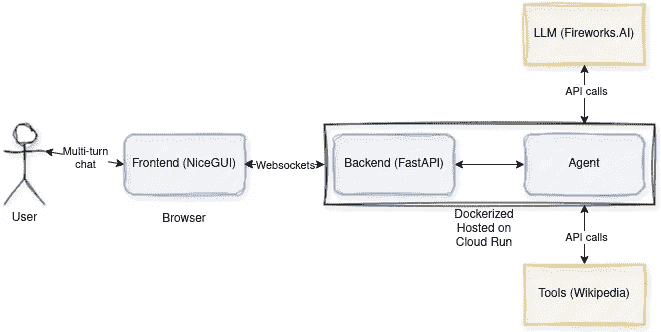

# 简单的 LLM 代理部署教程

> 原文：[`towardsdatascience.com/a-simple-llm-agent-deployment-tutorial-b468d0a98bc5?source=collection_archive---------5-----------------------#2024-11-05`](https://towardsdatascience.com/a-simple-llm-agent-deployment-tutorial-b468d0a98bc5?source=collection_archive---------5-----------------------#2024-11-05)

## 简单、可扩展且快速的 LLM 代理部署模板

 [Youness Mansar](https://medium.com/@CVxTz?source=post_page---byline--b468d0a98bc5--------------------------------)

·发布在[Towards Data Science](https://towardsdatascience.com/?source=post_page---byline--b468d0a98bc5--------------------------------) ·阅读时间：8 分钟·2024 年 11 月 5 日

--

图片由[Jeremy Bishop](https://unsplash.com/@jeremybishop?utm_source=medium&utm_medium=referral)提供，来自[Unsplash](https://unsplash.com/?utm_source=medium&utm_medium=referral)

许多教程展示了如何实现 LLM 代理。然而，关于将这些代理部署到 API 或用户友好的 UI 后面的资源非常有限。本文通过一步步的指南来填补这一空白，介绍如何实现和部署一个简单但功能齐全的 LLM 代理。这为您的 LLM 代理概念验证提供了一个起点，无论是用于个人使用还是与他人共享。

我们的实现分为几个部分：

1.  **代理实现：** 使用 LangGraph 作为代理框架，Fireworks AI 作为 LLM 服务。

1.  **用户界面：** 通过使用 FastAPI 和 NiceGUI 构建的 UI 来暴露代理。

1.  **容器化：** 将应用打包为 Docker 镜像。

1.  **部署：** 将 Docker 镜像部署到 Google Cloud Run。

完整的代码和演示应用将在文章末尾提供链接。

组件列表 — 图片来自作者

# 构建代理

该代理需要两个核心组件：

+   **LLM 服务：** 我们将使用[Fireworks AI](https://fireworks.ai/)。
