# 一个简单的 GAN 正则化方法

> 原文：[`towardsdatascience.com/a-simple-regularization-for-your-gans-12ea2cd168e?source=collection_archive---------15-----------------------#2024-07-29`](https://towardsdatascience.com/a-simple-regularization-for-your-gans-12ea2cd168e?source=collection_archive---------15-----------------------#2024-07-29)

## 如何使用 GANs 有效捕捉数据分布

[](https://medium.com/@shashank879?source=post_page---byline--12ea2cd168e--------------------------------)[](https://towardsdatascience.com/?source=post_page---byline--12ea2cd168e--------------------------------) [Shashank Sharma](https://medium.com/@shashank879?source=post_page---byline--12ea2cd168e--------------------------------)

·发布于 [Towards Data Science](https://towardsdatascience.com/?source=post_page---byline--12ea2cd168e--------------------------------) ·14 分钟阅读·2024 年 7 月 29 日

--

2018 年，我有幸在 AAAI 会议上做口头报告。一个常见的反馈是，报告中的见解比论文中更加清晰。尽管从那时起已经过去了一段时间，我认为分享这些核心见解和直觉仍然很有价值。

这篇论文解决了使用生成对抗网络（GANs）可靠捕捉数据集中的模式的一个重要问题。本文是围绕我对 GANs 的直觉进行阐述的，并从这些直觉中推导出提出的方法。最后，我为那些想尝试的人提供了一个现成的解决方案。如果你已经熟悉 GANs，可以直接跳到下一节。

> 论文：Sharma, S. 和 Namboodiri, V., 2018 年 4 月. 不遗漏任何模式：使用 GANs 有效捕捉数据分布。在*人工智能学会会议论文集*, [github](https://github.com/shashank879/logan))

***生成对抗网络简介***

GANs 用于学习给定分布的生成器。这意味着，如果我们得到一组鸟类图像的数据集，我们需要学习一个函数来生成看起来像鸟的图像。生成器函数通常是确定性的，因此它依赖于一个随机数作为输入，通过随机性生成各种图像。因此，该函数接受一个*n*维的数字作为输入，并输出一张图像。输入数字*z*通常是低维的，并从均匀分布或正态分布中随机抽取。这个分布被称为潜在分布*Pz*。

我们将“所有可能”图像的空间称为数据空间 *X*，将鸟类图像的集合称为真实 *R*，其分布为 *Pr*。在最优状态下，生成器将每个 *z* 的值映射到某个高概率属于 *R* 的图像。

GAN 通过两个学习的函数来解决这个问题：生成器（*G*）和鉴别器（*D*）。*G* 以数字 *z* 为输入，从数据空间中生成一个样本，*x = G(z)*。在任何时候，我们将 *G* 生成的所有图像集合称为假样本 *F*，它们的分布为 *Pg*。鉴别器从数据空间中取样一个样本 *x*，并输出一个标量 *D(x)*，预测它属于真实分布还是假分布的概率。

最初，*G* 和 *D* 都没有经过充分的训练。在每个训练步骤中，我们随机抽取一些数字并将其传递给 *G*，以获得一些假样本。同样，我们从真实子集里取出相等数量的随机样本。*D* 被训练通过交叉熵损失输出 0 表示假样本，输出 1 表示真实样本。*G* 被训练来欺骗 *D*，使得 *D(G(z))* 的输出变为 1。换句话说，增加生成高评分样本的概率（生成更多样本），减少低评分样本的概率。梯度从损失函数流经 *D*，然后流经 *G*。有关损失方程，请参阅原始的 GAN 论文。

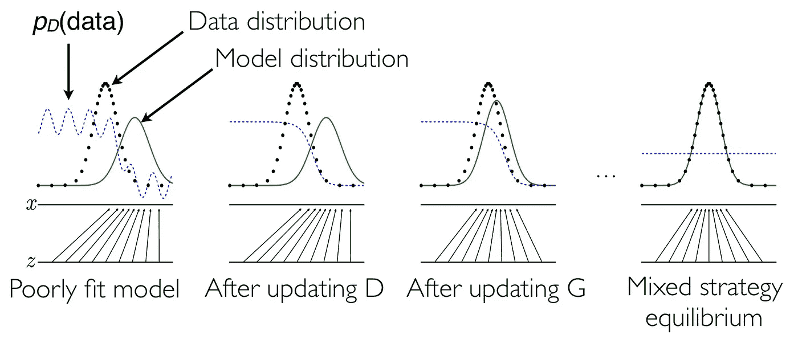

[图 1.] *图片取自 2014 年蒙特利尔 NIPS 研讨会《生成对抗网络》上的演示文稿《Generative Adversarial Networks》。[注：在本文中，我们将 Pd 称为 Pr]*

上图展示了 GAN 如何在一维空间 *X* 中进行学习。黑色虚线代表真实分布，我们称之为 *Pr*。绿色线条代表假样本的分布 *Pg*。蓝色虚线代表鉴别器输出 *D(x)* 对数据样本的判断。开始时，*D* 和 *G* 都没有正确地执行任务。首先，*D* 被更新，以正确分类真实样本和假样本。接着，*G* 被更新，以跟随鉴别器值对生成样本 *D(G(z))* 的局部梯度，使得 *Pg* 更接近 *Pr*。换句话说，*G* 根据 *D* 的反馈轻微改善每一个样本。最后的插图展示了最终的平衡状态。

这可以被看作是一种频率主义的方法。如果 *G* 从一个模式生成的样本超过了 *Pr* 中该模式的出现频率，尽管这些样本可能看起来无瑕疵，*D* 会开始将它们分类为假样本，从而阻止 *G* 生成这样的样本。相反，当 *G* 生成的样本较少时，*D* 开始将它们分类为真实样本，鼓励 *G* 生成更多此类样本。这个过程一直持续，直到某个元素的生成频率与其在 *Pr* 中的出现频率匹配。或者，该元素在 *Pg* 和 *Pr* 中的出现概率相等。当分布完全匹配时，*D* 在所有点的输出为 0.5，表示它无法区分真实和假样本。此时损失达到最小值，*G* 和 *D* 都无法进一步改进；这种状态被称为纳什均衡。

后来的 Wasserstein GAN 对这个目标进行了一些修改。*D* 被训练为对真实样本增加值，对假样本则无限减少。它们称之为 Critic。与其计算基于频率的损失，它们将 *G* 的目标修改为直接调整 *Pg* 的方向，以提升 *D(G(z))* 的值。有关平衡保证和该方法其他细节，请参阅原始论文。

根据我在 GAN 方面的经验，我发现将 GAN 看作是 *G* 和 *D* 之间的合作互动，而非竞争，能带来更好的效果。鉴别器的目标是建立 *Pg* 和 *Pr* 之间的“真实性”梯度，就像一个软边界。然后，*G* 使用这个反馈将 *Pg* 移向 *Pr*。这个边界越平滑，*G* 改进的难度就越小。将 GAN 设定为竞争模式是不利的，因为无论是 *D* 还是 *G* 网络的损失，都意味着最终目标的失败。然而，联合目标的视角直接与所期望的行为对齐。

***模式丢失问题***

在 GAN 中，一个常见的问题是生成器丢失了次要模式。*G* 只能通过 *D* 对其生成的样本获得反馈。如果 *G* 因为最初专注于较大的模式而错过了一个模式，它就无法对此进行改进。*G* 只有在生成接近该模式的样本时，才会在该模式上进行改进。技术上讲，生成器跟随鉴别器的局部梯度，将 *Pg* 的模式移向与 *Pr* 相匹配的方向。一旦 *G* 失去了次要模式的局部梯度，它就永远不会因没有从该模式生成样本而受到惩罚。这个问题在现实世界的数据集中尤为突出，因为这些数据集通常是稀疏的，并且包含许多次要模式。

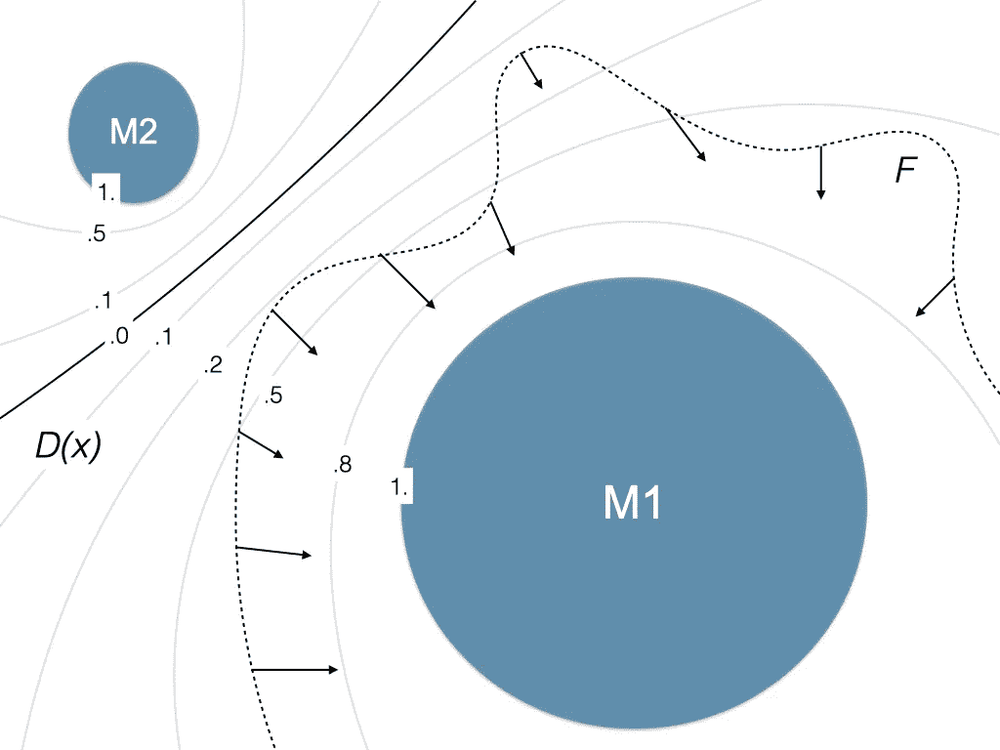

[图 2.] 在插图中，数字表示 D(x) 等高线的值，虚线边界表示假分布 F。箭头表示 *G* 所经历的梯度（与等高线垂直）。有两个模式，主模式 M1 和次要模式 M2。尽管鉴别器已将 M2 标记为真实，但由于生成器分布没有接收到导致 M2 的梯度，因此它错过了该模式。

这可以从用于计算梯度的微分方程中看出。给定损失函数，学习*G*的梯度计算如下：

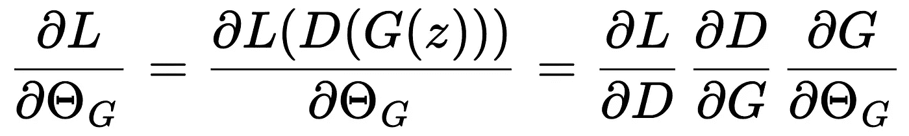

中间项依赖于在生成样本的数据样本 *G(z)* 上，*D(G(z))* 相对于数据样本 *G(z)* 的改进。

***我们的方法***

在我们的论文中，我们提出了解决这个问题的可靠方法。我们通过生成的玩具数据集和一个具有大单峰的真实世界图像数据集进行测试。我们还通过评估 CIFAR 分数和使用 CelebA 面部数据集的定性分析来测试学习表示的质量。

以下部分解释了我们方法背后的基本直觉。

***反向生成器或编码器***

让我们探讨相反的问题；给定一个图像数据集，我们需要学习从图像到潜在分布的映射。假设潜在分布是一个 10 维的均匀分布 [0, 1]。因此，我们构建一个 GAN，其中 G 是一个将图像作为输入并输出一个 10 维的数值，数值范围在 [0, 1] 之间的函数。*D* 从这个空间中取数值并输出它们的“真实度”，表示它来自均匀分布的可能性。

在这种情况下，生成器被称为编码器 *(E)*。这是因为它学习压缩信息。但这有用吗？

我们可以将编码器的任务视为为每个图像分配 10 个浮动数字，范围在 [0, 1] 之间。这实际上将所有给定的图像沿着长度为 1 的直线排布，并为 10 条不同的直线重复此过程。由于我们将真实分布指定为均匀分布，因此在平衡时，编码器将与该分布匹配。或者，所有图像将均匀分布在这 10 条直线之上。

假设*E*具有有限的容量，这意味着它无法记住特征中的所有模式，并且它被正则化，以确保输入输出之间的连续性。也就是说，权重是有限的，并且对于输入的微小变化，输出不能突然改变。这将导致*E*将具有相似特征的图像归为有意义的组，这将帮助它在这些约束下完成任务。因此，将语义上更接近的图像放在特征空间中一起。尽管这些特征可能是交织在一起的，但它们仍然能够产生有意义的表示。

现在从这个角度来看模式丢失问题。我们选择均匀分布作为*Pr*。由于它是单峰分布，因此没有更弱的模式可供丢失。如果*E*遗漏了模式中的某个区域，它会在*Pg*的边缘体验到指向该区域的梯度。如果判别器被正则化，它的输出将在遗漏区域的边界逐渐发生变化。从技术上讲，*D* 在该区域的边界对*X*是可微的。然后，*E* 将跟随增加的 *D* 值进行改进。*E*遗漏的任何区域最终都会被捕捉到。因此，在这种情况下不会出现模式丢失问题！

由于整个区域是连通的，编码器将在*Pg*和*Pr*之间的任何差异中体验到修正梯度。只有全局最优解，网络不会陷入局部最优解。因此，给定足够的容量，编码器可以完美地将任何数据分布编码为单峰分布。我们通过插图展示了这一点，以均匀分布为例。

从这里开始，我们将图像的分布称为*Pr*，潜在分布称为*Pz*。图像样本将表示为*x*，潜在样本表示为*z*。生成器以*z*为输入生成图像*G(z)*，编码器以*x*为输入生成潜在表示*E(x)*。

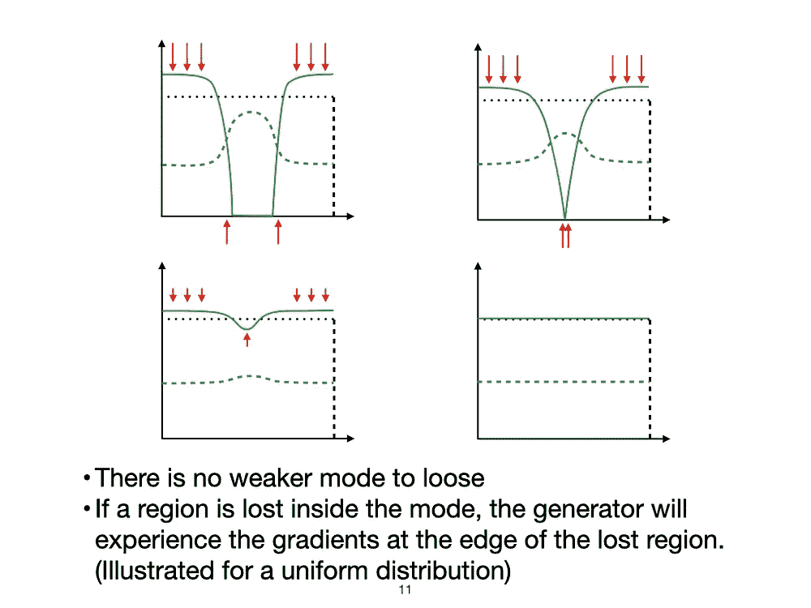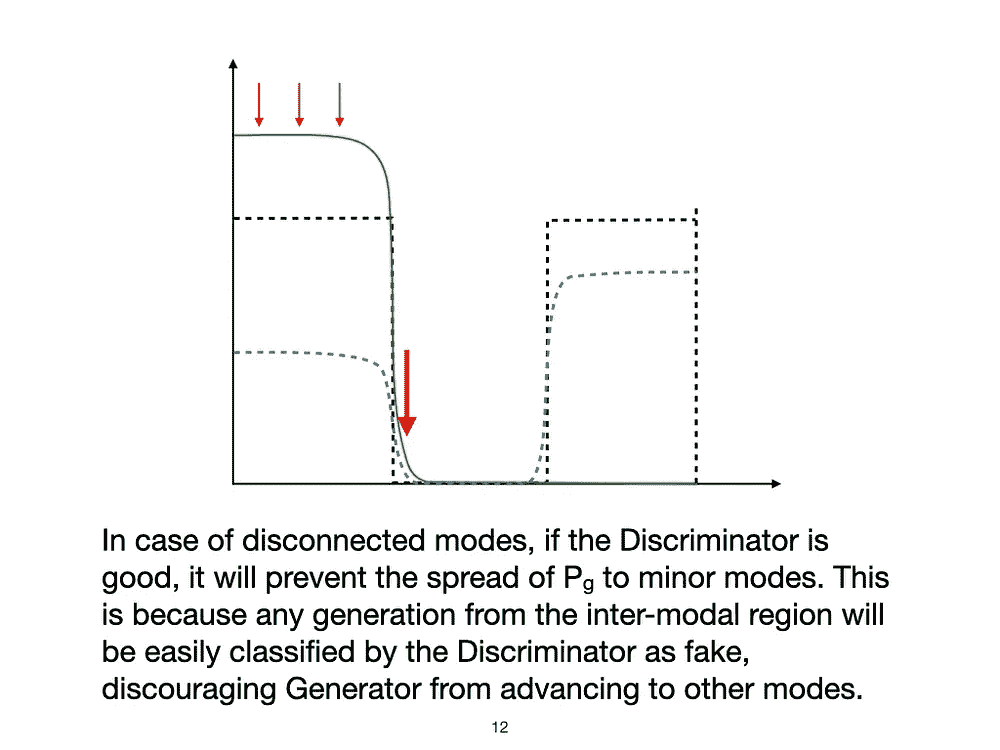

[图 3.] 编码器在均匀潜在分布与具有不连通模态的分布中的模式损失。

***BIGAN（编码器与生成器联合训练）***

BIGAN 由 Donahue 等人于 2017 年提出。它同时训练一个生成器（*G*）和一个编码器（*E*），并共享一个判别器（*D*）。虽然编码器和生成器的操作与之前相同，但判别器将*x*和*z*作为输入并产生一个标量输出。

*D*的目标是将元组*(x, E(x))*标记为 1，将*(G(z), z)*标记为 0。因此，它试图在*(x, E(x))*和*(G(z), z)*的分布之间建立一个边界。生成器沿着这个边界梯度向上移动，生成更多被判别器标记为 1 的样本，编码器则类似地沿着这个边界向下传播。这里的*D*的目标是帮助*(x, E(x))*和*(G(z), z)*的分布融合。

那么，这些分布融合的意义何在？只有当*G(z)*的分布与数据分布*Pr*匹配，且*E(x)*的分布与潜在分布*Pz*匹配时，这种情况才会发生。因此，每个潜在变量都映射到一张图像，每张图像也都映射到一个潜在变量。另一个固有的重要特性是，这种映射是可逆的，即*G(E(x))=x*且*E(G(z))=z*。更多细节请参考原论文。

让我们来可视化一下它是什么样子——判别器在*x*和*z*的联合空间中工作。下面的插图展示了*G*和*E*的起始状态和均衡状态，对于*1*维的*X*和*1*维的*Z*。*Pz*是均匀分布，*Pr*是一个具有 5 个点模式的稀疏分布。因此，*Pr*的模式（*{x1, x2, x3, x4, x5}*）表现为“点”，而潜在变量的分布表现为连续分布。绿色点表示*(G(z), z)*元组，黄色点表示*(x, E(x))*元组。修改*E*会沿着*Z 轴*移动黄色点，而修改*G*会沿着*X 轴*移动绿色点。因此，为了使分布匹配，*E*必须沿着*Z 轴*扩展黄色点，以逼近均匀分布。而*G*必须水平地移动绿色点，以使其类似于给定数据的分布*Pr*。

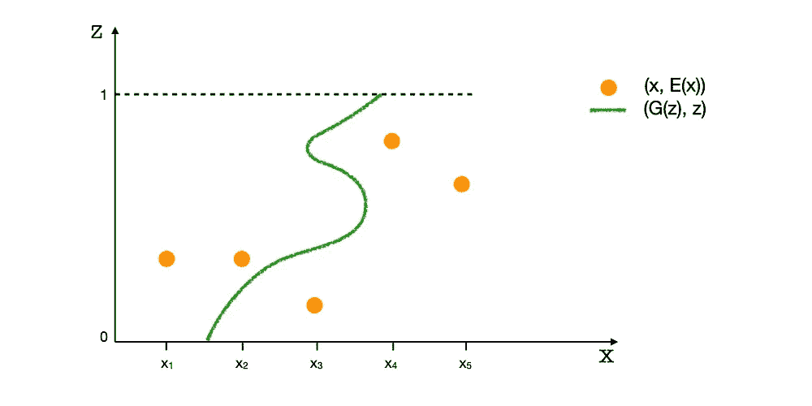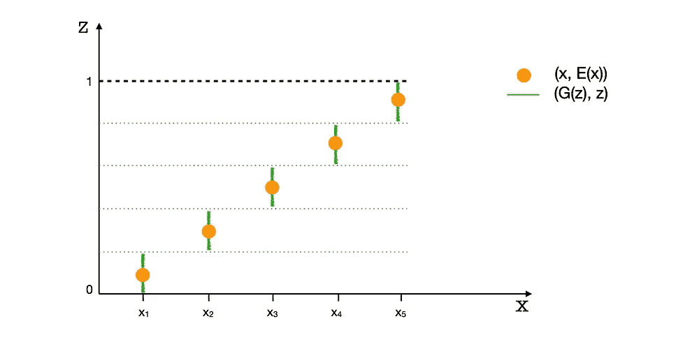

[图 4.] 一开始，G 将所有的 z 值映射到一个随机的 x，而 E 将所有的 x 值{ x1,x2,x3,x4,x5 }映射到一个随机的 z。在均衡状态下，黄色点沿着 Z 轴均匀分布。绿色点则对齐到*Pr*中的可能模式。真实样本*(x, E(x))*显示为“集中”状态，因为编码器的有限容量无法扩展点模式。生成的样本*(G(z), z)*显示为“线状”，因为 z 是从连续分布中采样的。

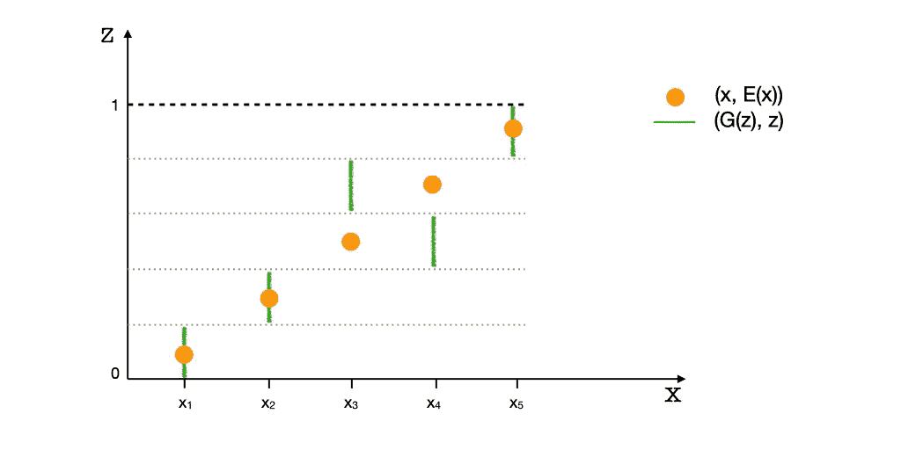

[图 5.] 请注意，如果生成器和编码器分别使用不同的判别器单独训练，这也是一个有效的配置。这符合匹配分布的标准，但不允许 G 和 E 的可逆性。这不是 BIGAN 的目标。

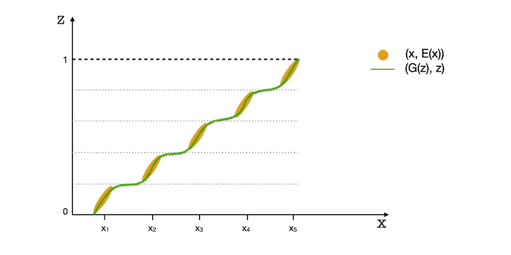

[图 6.] 如果数据模式不是点而是略微分散的，编码器可以在有限容量下将其扩展为均匀分布。具有有限容量的生成器是连续的；因此，对于某些 z 值，G 可以输出数据的跨模式值。

需要注意的是，*G*和*E*并不直接相互作用，而是通过*D*进行交互。因此，它们的目标或损失函数是相互独立的。例如，编码器的目标是使*E(x)*的分布匹配*Pz*，而不考虑*G*的表现如何。这是因为在将元组*(x, E(x))*与*(G(z), z)*匹配时，编码器只能控制*E(x)*，而*E(x)*必须与*Pz*匹配，无论*G(z)*是否匹配*Pr*。对生成器来说也是同样的道理。因此，编码器对于单峰分布仍然能够完美地执行。

***在 BIGAN 中，模式丧失的问题是什么样的？***

如果生成器失去对较弱模式的梯度，它们仍然可能会丢失，即使这些梯度已经被很好地编码。

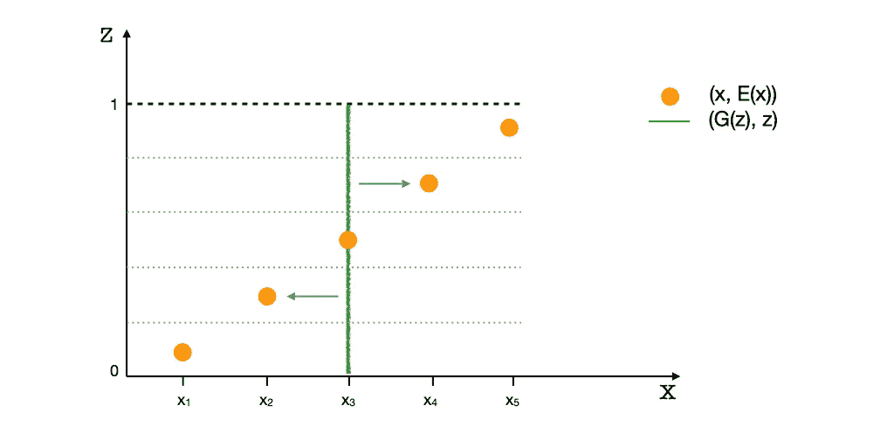

[图 7.] 一个塌陷的生成器，对于所有 z 的值输出 x3。

在上面的插图中，*G*已经塌陷到模式*x3*。*G*经历了沿*X 轴*指向邻近模式*x2*和*x4*的梯度，蓝色箭头表示。但远离的模式*x1*和*x5*可能会被忽视并被落下。

***最后，我们的解决方案！***

Gulrajani 等人在论文《改进的 Wasserstein GAN 训练》中提出了通过一种方法来稳定 Wasserstein GAN。由于 WGAN 中的鉴别器是无界的，如果没有正则化，损失可能会突然增加。这可以通过链式法则扩展后的损失方程中看到。

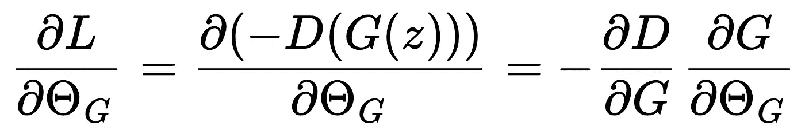

这里，术语*∂D/∂G*应始终是有限的，或者说*D(x)*应在相对于*x*的每个位置都是可微的。原始方法通过对权重施加边界来实现这一点。然而，Gulrajani 等人建议通过额外的损失直接对梯度施加惩罚。为此，在当前批次中，点被随机采样于真实样本和生成样本之间。并且，在这些点处，梯度*∂D/∂x*的幅度被强制为 1，通过均方误差来实现。

要传达的信息是，直接建模鉴别器的景观也是一种可行的解决方案。受到直接建模鉴别器景观技术的启发，我们可以使用类似的方法。让我们再看一眼*图 7*。

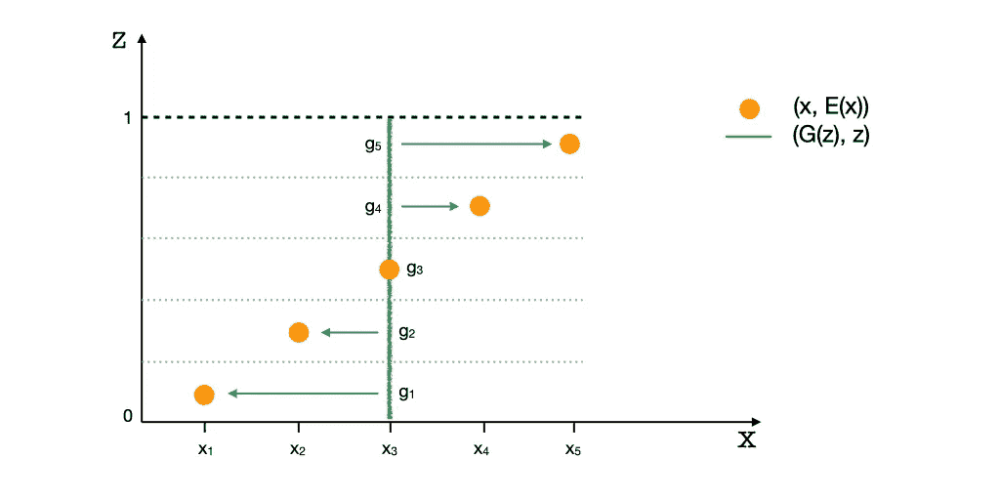

[图 8.] 在这里，生成的点 {g1, g2, g3, g4, g5} 应该到达标记的模式，但由于缺少梯度，它们未能成功到达。

点*{g1, g2, g3, g4, g5}*是数据点*{x1, x2, x3, x4, x5}*的编码*E(x)*的生成*G(z)*，或者*gi = G(E(xi))*。这些是点*xi*的重建。我们需要建模梯度*∂D/∂x*，使得点*gi*开始向它们各自的目标点*xi*移动。

为了实现这一点，我们沿着连接*xi*与其重建*gi*的线段均匀地采样一些点。然后我们强制所有这些点的梯度*∂D/∂x*为单位值，并且指向*xi*，通过均方误差来实现。我们称之为成对梯度惩罚，并将其作为额外的损失加到鉴别器中。

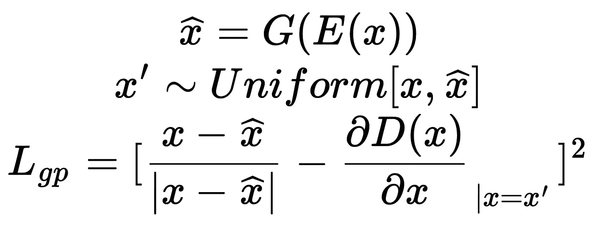

损失中的第一项是指向正确方向的单位向量，第二项是鉴别器在采样点处相对于 x 的梯度。[注：此处 gi 被称为 x-hat。]

可能有人会考虑将*xi*与其重建*gi*之间的均方误差作为生成器的附加损失项，以期达到类似的效果。然而，我们发现很难平衡生成器的重建损失和对抗损失。这是因为对抗损失和重建损失在行为和规模上完全不同，难以找到一个常数权重来有效地平衡它们，适用于玩具数据集和真实数据集。相比之下，梯度惩罚并不直接约束*D(x)*，而是约束*∂D/∂x*；因此，它不是对抗损失的直接竞争目标，而仅起到正则化作用。我们发现一个常数（**λ**=1）在所有情况下都有效。

***它有效吗？***

我们使用不同的损失函数训练简单的网络，如 DCGAN 和 MLP。我们使用玩具数据集来更好地可视化解决方案，并使用具有重中心模式的图像数据集来检查模式丢失。

**A. 玩具数据集** 我们使用正态分布的混合生成具有多个稀疏模式的（二维*X*和一维*Z*）数据集。这些模式排列成圆形和网格状。可以看出，默认的 BIGAN 很容易错过模式，但我们的方法在所有情况下都能捕捉到所有模式。

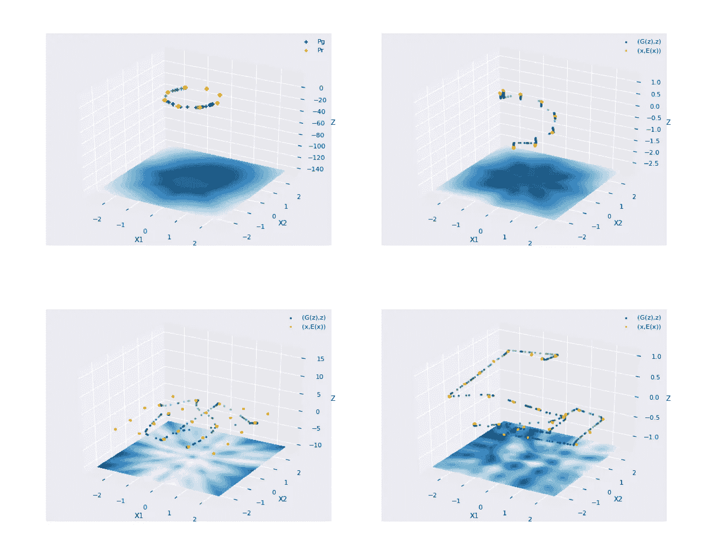

[图 9.] 使用原始方法和我们提出的方法在一个具有稀疏模式的玩具数据集上训练 BIGAN 网络的结果。第一列展示了原始 GAN 的结果，第二列展示了我们提议方法的结果。

**B. 重中心模式** 我们从交通交叉口的视频中定期提取快照（参考文献 [5]）。背景保持静止，在某些时间和某些位置，画面中的活动非常少。该数据集具有一个巨大的模式，仅包含背景，没有车辆。虽然原始的 GAN 和 WGAN 在这个任务上始终失败，但我们的方法展示了显著的学习效果。

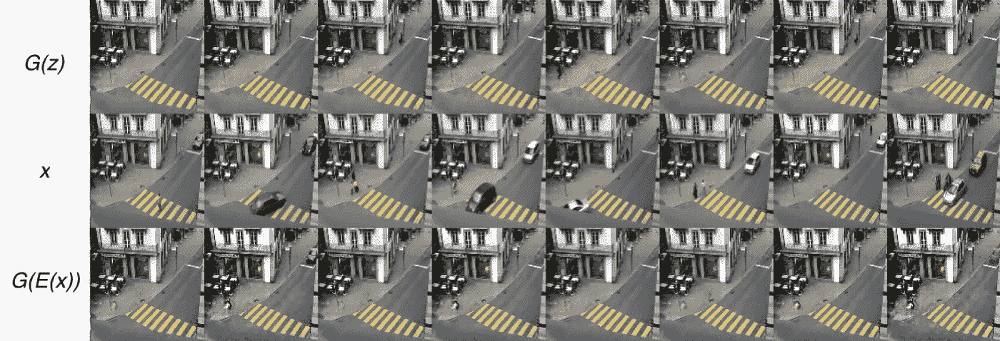

[图 10.] 来自原始 GAN 的生成和重建。注意它会收敛到最频繁的样本。

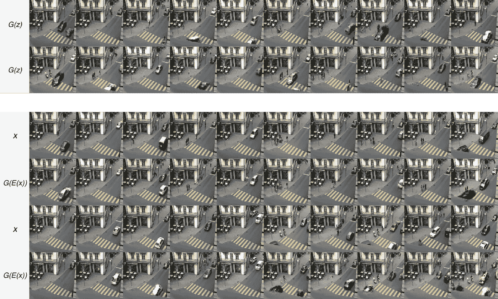

[图 11.] 我们方法的生成和重建。生成器能够捕捉到较小的模式。

**C. 潜在插值** 我们还使用 CelebA 人脸数据集测试了我们的方法，发现模型学习到了一些只在部分帧中出现的细节特征，如帽子、眼镜、极端的面部角度等。完整结果请参见论文。

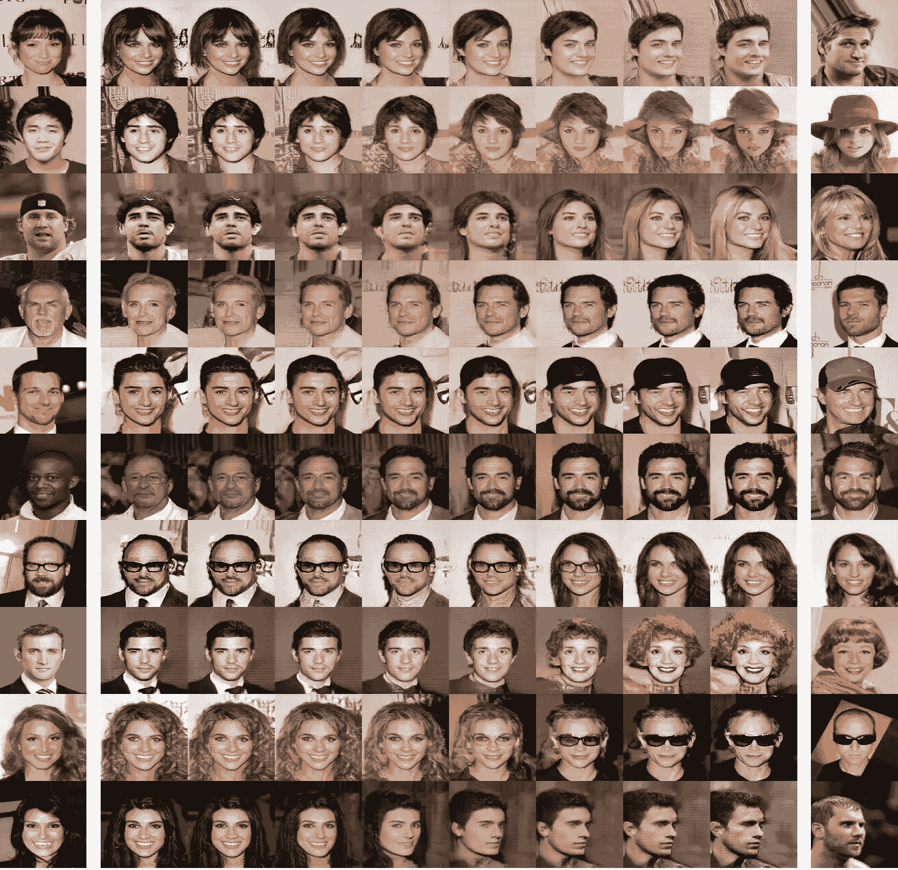

[图 12.] 潜在空间插值的生成结果。

***试试吧***

对于使用 BIGAN 或其他任何方法，其中*E*和*G*是可逆的，尽管尝试。只需将以下函数的输出添加到鉴别器损失中。该方法应该适用于所有网络架构。至于其他使用传统 GAN 的用户，BIGAN 可能是一个有价值的考虑。

```py
def gradient_penalty(x, z, x_hat, discriminator):
    """
    Computes the pair-wise gradient penalty loss for a BIGAN.

    Args:
        x: Samples from the real data.
        z: Samples from encoded latent distribution (= Enc(x)).
        x_hat: The reconstruction of the real samples (= G(E(x)))
        discriminator: The discriminator model with signature (x,z).
    Returns:
        gp_loss: Computed per example loss.
    """
    # Assuming only 1st dimension is the batch dimension.
    num_batch_dims = 1
    epsilon = tf.reshape(tf.random.uniform(shape=x.shape[:num_batch_dims]), x.shape[:num_batch_dims] + [1] * (len(x.shape) - num_batch_dims))
    # Compute interpolations.
    x_inter = (epsilon * x) + ((1\. - epsilon) * x_hat)
    x_inter = tf.stop_gradient(x_inter)
    z = tf.stop_gradient(z)
    with tf.GradientTape(watch_accessed_variables=False) as tape:
        tape.watch(x_inter)
        # Compute discriminator values for the interpolations.
        d_inter = discriminator(x_inter, z)
    # Compute gradients at the interpolations.
    d_inter_grads = tape.gradient(d_inter, x_inter)
    # Compute the unit vector in the direction (x - x_hat).
    delta = x - x_hat
    unit_delta = delta / tf.norm(delta, axis=-1, keepdims=True)
    # Compute loss as the mse between gradients and the unit vector.
    return tf.reduce_mean((d_inter_grads - unit_delta)**2, -1)
```

***结论***

如果编码器和鉴别器具有足够的容量，编码器可以准确地将任何分布映射到单峰潜在分布。当实现这一点时（生成器和编码器是可逆的），生成器也可以通过成对梯度惩罚完美地学习真实分布。惩罚有效地对鉴别器进行正则化，消除了平衡三个网络的需要。该方法通过独立增加任何一个网络的容量而受益。

希望这能帮助人们深入了解 GAN，并可能有助于模式损失 :)

***参考文献***

*[注：除非另有说明，所有图片均为作者所拍摄]*

[1] Goodfellow, I., Pouget-Abadie, J., Mirza, M., Xu, B., Warde-Farley, D., Ozair, S., Courville, A. and Bengio, Y., 2014\. 生成对抗网络。*神经信息处理系统进展*, *27*。

[2] Arjovsky, M., Chintala, S. and Bottou, L., 2017 年 7 月。Wasserstein 生成对抗网络。在机器学习国际会议上（第 214-223 页）。PMLR。

[3] Gulrajani, I., Ahmed, F., Arjovsky, M., Dumoulin, V. and Courville, A.C., 2017\. 改进的 Wasserstein GAN 训练。*神经信息处理系统进展*, *30*。

[4] Donahue, J., Krähenbühl, P. and Darrell, T., 2017\. 对抗特征学习。在：第 5 届国际学习表示会议（ICLR），法国图伦，2017 年 4 月 24-26 日。

[5]（*交通数据集*）：Varadarajan, J. and Odobez, J.M., 2009 年 9 月。用于场景分析和异常检测的主题模型。在*2009 年 IEEE 第 12 届国际计算机视觉研讨会，ICCV 研讨会*（第 1338-1345 页）。IEEE。
