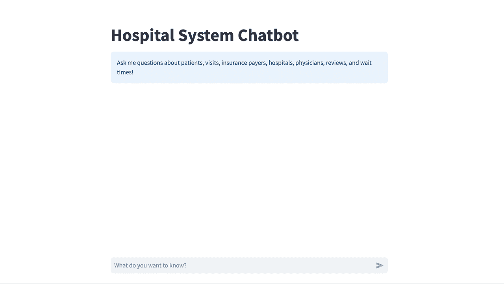

# 提高 LLM 查询生成的简单策略

> 原文：[`towardsdatascience.com/a-simple-strategy-to-improve-llm-query-generation-3178a7426c6f?source=collection_archive---------3-----------------------#2024-08-06`](https://towardsdatascience.com/a-simple-strategy-to-improve-llm-query-generation-3178a7426c6f?source=collection_archive---------3-----------------------#2024-08-06)

## 动态少量提示（Dynamic Few-Shot Prompting）

 [哈里森·霍夫曼](https://harrisonfhoffman.medium.com/?source=post_page---byline--3178a7426c6f--------------------------------)

·发布于[Towards Data Science](https://towardsdatascience.com/?source=post_page---byline--3178a7426c6f--------------------------------) ·22 分钟阅读·2024 年 8 月 6 日

--

在 2024 年 3 月，我在[Real Python](https://realpython.com/build-llm-rag-chatbot-with-langchain/)上写了一篇[教程](https://realpython.com/build-llm-rag-chatbot-with-langchain/)，详细介绍了使用[LangChain](https://www.langchain.com/)构建一个检索增强生成（RAG）聊天机器人的步骤。这个聊天机器人正式命名为医院系统聊天机器人，使用[Neo4j](https://neo4j.com/)从一个合成的医院系统数据集中检索数据，数据中包括有关患者、患者评论、医院位置、就诊记录、保险支付者和医生的信息。

医院系统聊天机器人[代理](https://python.langchain.com/v0.1/docs/modules/agents/)通过 FastAPI 托管，并可以通过[Streamlit](https://streamlit.io/)应用程序访问 — 所有内容都通过 Docker Compose 打包：

医院系统聊天机器人的演示。图片由作者提供。

所有代码都可以在[GitHub](https://github.com/hfhoffman1144/langchain_neo4j_rag_app)上找到，任何人都可以在[Real Python](https://realpython.com/build-llm-rag-chatbot-with-langchain/)上详细了解这个项目。

 [## GitHub - hfhoffman1144/langchain_neo4j_rag_app: 使用 LangChain 和 Neo4j 构建的知识图谱 RAG 应用程序…

### 使用 LangChain 和 Neo4j 构建的知识图谱 RAG 应用程序 - hfhoffman1144/langchain_neo4j_rag_app

github.com](https://github.com/hfhoffman1144/langchain_neo4j_rag_app?source=post_page-----3178a7426c6f--------------------------------)

自从编写教程以来，我一直在 GitHub 上维护该项目，以提高医院系统聊天机器人的功能，使其更加适合生产环境。例如，我添加了单元测试，重构了代码以修复已废弃的特性，利用 GitHub Actions 创建了部署流程，最近还集成了动态少量示例提示，以改进 Cypher 查询生成。
