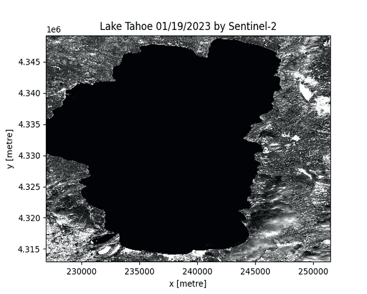

# 一种下载数百张剪裁卫星图像的简单方法，无需检索整个场景（Python）

> 原文：[`towardsdatascience.com/a-simple-way-for-downloading-hundreds-of-clipped-satellite-images-without-retrieving-the-entire-f22d97501fd3?source=collection_archive---------3-----------------------#2024-04-26`](https://towardsdatascience.com/a-simple-way-for-downloading-hundreds-of-clipped-satellite-images-without-retrieving-the-entire-f22d97501fd3?source=collection_archive---------3-----------------------#2024-04-26)

## 学习如何仅用 12 行脚本下载任何兴趣区域（AOI）的剪裁 Sentinel-2 图像，这里以湖 Tahoe 为例。

 [Mahyar Aboutalebi, Ph.D. 🎓](https://medium.com/@mahyar.aboutalebi?source=post_page---byline--f22d97501fd3--------------------------------)

·发布于 [Towards Data Science](https://towardsdatascience.com/?source=post_page---byline--f22d97501fd3--------------------------------) ·阅读时长 9 分钟·2024 年 4 月 26 日

--

基于 2023 年所有清晰的 Sentinel-2 图像，湖 Tahoe 的时间推移，由作者可视化

# 目录

1.  **🌟 介绍**

1.  ⚙️ **STAC（时空资产目录）**

1.  💾 **下载 Sentinel-2 图像（模板）**

1.  💾 **下载 Sentinel-2 图像（湖 Tahoe）**

1.  🌍 **湖 Tahoe 地图可视化**

1.  **🎥 湖 Tahoe 2023 年地图时间推移**

1.  ⌛ **2023 年湖面面积和雪覆盖的时间序列**

1.  **📄 结论**

1.  **📚 参考文献**

## **🌟 介绍**

我已经发布了几篇关于下载卫星图像的教程，您可以在下面找到：

 [## 使用 Google Colab 下载 Sentinel-2 图像（更新版，2023 年 11 月）

### 正如您所知道的，访问 Sentinel 图像的主要平台 https://scihub.copernicus.eu/ 已经停止…

medium.com](https://medium.com/@mahyar.aboutalebi/downloading-sentinel-2-imagery-in-python-with-google-colab-updated-nov-2023-f21d75a92407?source=post_page-----f22d97501fd3--------------------------------)
