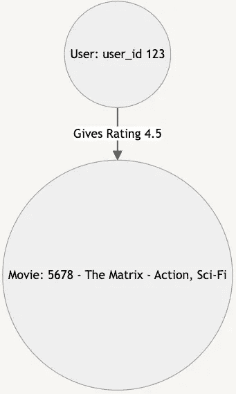

# 构建电影推荐系统图学习系统的逐步指南

> 原文：[`towardsdatascience.com/a-step-by-step-guide-to-build-a-graph-learning-system-for-a-movie-recommender-d647d0130e95?source=collection_archive---------4-----------------------#2024-09-11`](https://towardsdatascience.com/a-step-by-step-guide-to-build-a-graph-learning-system-for-a-movie-recommender-d647d0130e95?source=collection_archive---------4-----------------------#2024-09-11)

## 使用 PyTorch Geometric 和 MovieLens 数据集构建

 [Yu-Cheng Tsai](https://medium.com/@yuchengtsai84?source=post_page---byline--d647d0130e95--------------------------------)

·发表于[Towards Data Science](https://towardsdatascience.com/?source=post_page---byline--d647d0130e95--------------------------------) ·13 分钟阅读·2024 年 9 月 11 日

--

图片来自[michael podger](https://unsplash.com/@jammypodger7470?utm_source=medium&utm_medium=referral)的[Unsplash](https://unsplash.com/?utm_source=medium&utm_medium=referral)

免费[链接](https://medium.com/towards-data-science/a-step-by-step-guide-to-build-a-graph-learning-system-for-a-movie-recommender-d647d0130e95?sk=4c39bc15314a8b0c1130e2c47b6a9d30)! 请享受阅读。 :)

# 图形建模

[图形](https://en.wikipedia.org/wiki/Graph_(discrete_mathematics))是一种表示实体之间关系的方式，使用节点来表示实体，边来表示它们之间的连接。这种结构非常灵活，可以应用于各种[现实世界](https://www.linkedin.com/pulse/graph-theory-unraveling-real-life-problems-connecting-nelson-vega/)的问题。例如，我可以创建一个简单的图，其中有两个节点：用户和电影，节点“用户”给（即边关系）节点“电影”一个 4.5 的评分。

一个简单的电影评分图（图片来自作者）

通过将数据及其之间的关系建模为图形，可以捕捉到丰富而复杂的模式，这使得图形建模成为许多建模应用的合理方法。

# 推荐系统

推荐系统已成为我们数字体验的核心部分。无论是推荐“你可能喜欢的电影”，“符合你兴趣的新闻”还是“你可能认识的人”，这些系统都为许多面向客户的软件产品提供支持。
